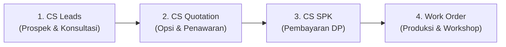
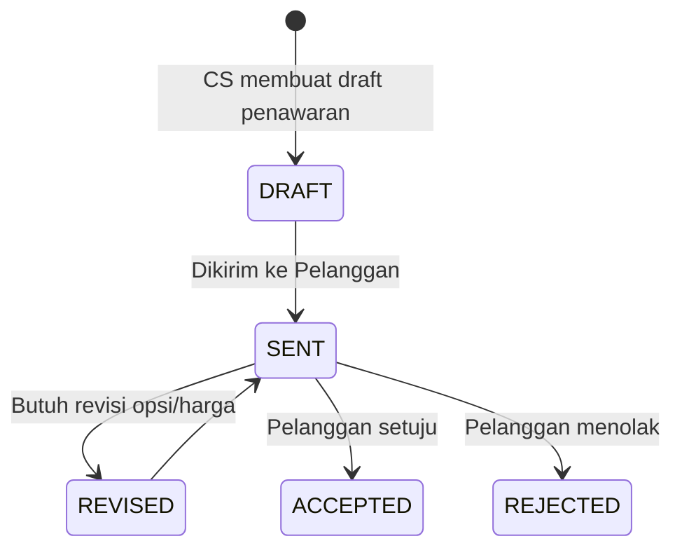
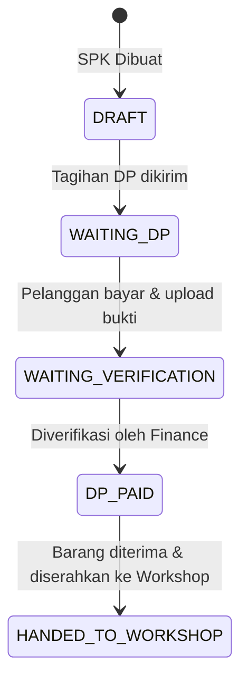
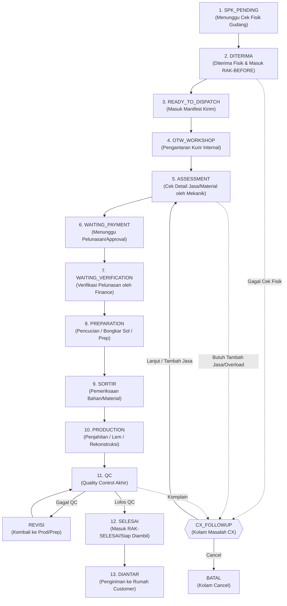

# Peta Lifecycle Status - Sistem Workshop

Dokumen ini menjelaskan alur siklus hidup (*lifecycle status*) data secara menyeluruh dan rinci dari tahap awal prospek di Customer Service (CS) hingga proses produksi di Workshop dan pengiriman barang kembali ke pelanggan.

---

## 1. Alur Utama (High-Level Overview)

Secara garis besar, siklus data mengalir melewati 4 fase utama:

---

## 2. Fase 1: CS Prospek & Konsultasi (`CsLead`)

Merupakan tahap awal di mana CS merekam interaksi pertama dengan pelanggan.

| Nama Status (`status`) | Label UI | Deskripsi |
| :--- | :--- | :--- |
| `GREETING` | Pending (CS) | Kontak pertama kali masuk dari WhatsApp/Instagram. CS melakukan sapaan awal. |
| `KONSULTASI` | Konsultasi | Pelanggan berkonsultasi mengenai kondisi sepatu dan masalah yang ingin diperbaiki. |
| `FOLLOW_UP` | Follow Up | CS melakukan tindak lanjut penawaran/konsultasi agar terjadi kesepakatan (*closing*). |
| `CLOSING` | Closing | Pelanggan menyetujui opsi perbaikan dan siap melakukan transaksi. |
| `CONVERTED` | Converted | Prospek berhasil dikonversi dan statusnya naik menjadi SPK fisik. |
| `LOST` | Lost | Prospek gagal dikonversi (misal: harga terlalu mahal, salah alamat, tidak merespon). |

---

## 3. Fase 2: Penawaran Layanan (`CsQuotation`)

Pada tahap **KONSULTASI** atau **CLOSING**, CS dapat membuat satu atau beberapa versi penawaran harga (*Quotation*).

| Nama Status (`status`) | Deskripsi |
| :--- | :--- |
| `DRAFT` | Draft penawaran awal yang sedang disusun oleh CS. |
| `SENT` | Penawaran telah dikirim secara resmi kepada pelanggan (melalui WA/PDF). |
| `ACCEPTED` | Pelanggan menyetujui opsi jasa dan nominal penawaran. Ini menjadi dasar pembuatan SPK. |
| `REJECTED` | Pelanggan menolak penawaran. |
| `REVISED` | Penawaran direvisi dengan versi baru karena ada perubahan permintaan pelanggan. |

---

## 4. Fase 3: Surat Perintah Kerja CS (`CsSpk`)

Setelah quotation disetujui (`ACCEPTED`), CS membuat dokumen transaksi resmi berupa **SPK** untuk menagih pembayaran uang muka (Down Payment).

| Nama Status (`status`) | Label UI | Deskripsi |
| :--- | :--- | :--- |
| `DRAFT` | Draft | Draft data SPK awal. |
| `WAITING_DP` | Menunggu DP | Menunggu pelanggan melakukan transfer Down Payment (DP). |
| `WAITING_VERIFICATION` | Verifikasi Finance | Bukti transfer DP telah diunggah, menunggu persetujuan tim Finance. |
| `DP_PAID` | DP Lunas | DP dinyatakan valid oleh Finance. SPK siap diproses ketika sepatu fisik sampai di gudang. |
| `HANDED_TO_WORKSHOP` | Workshop | Barang fisik telah diterima, dikonfirmasi di gudang penerimaan, dan status SPK dikonversi ke **Work Order (WO)**. |

---

## 5. Fase 4: Produksi & Operasional (`WorkOrder`)

Begitu SPK diserahkan ke gudang dan diverifikasi secara fisik, siklus beralih sepenuhnya ke alur **Work Order (WO)** yang dikelola oleh divisi Gudang, Finance, dan Workshop.

### Rincian Tahapan Status Work Order:

#### **A. Logistik & Gudang Penerimaan**
* **`SPK_PENDING` (Pending CS)**: SPK digital telah dikirim oleh CS, namun sepatu fisik belum sampai atau belum diverifikasi oleh tim Gudang Penerimaan.
* **`DITERIMA` (Diterima Gudang)**: Sepatu fisik telah sampai di gudang, lolos pengecekan awal, dan ditempatkan sementara di rak penyimpanan gudang transit (`RAK-BEFORE`).
* **`READY_TO_DISPATCH` (Siap Kirim ke Workshop)**: Barang telah dikelompokkan ke dalam manifes pengiriman dan siap diantar ke Workshop utama (Rumah Hijau/Abu).
* **`OTW_WORKSHOP` (Sedang Dikirim)**: Barang sedang dalam perjalanan fisik (in-transit) dibawa oleh kurir internal menuju Workshop.

#### **B. Produksi & Operasional Workshop**
* **`ASSESSMENT` (Assessment Workshop)**: Sepatu sampai di workshop dan diperiksa detail oleh kepala mekanik untuk mendefinisikan/memvalidasi jenis jasa perbaikan dan ketersediaan material.
* **`WAITING_PAYMENT` (Menunggu Pembayaran)**: Tahap assessment selesai. Jika ada tambahan biaya atau pelunasan belum diselesaikan, SPK masuk ke masa penantian pembayaran.
* **`WAITING_VERIFICATION` (Menunggu Verifikasi Finance)**: Pelanggan melakukan pembayaran sisa tagihan/tambahan, menunggu validasi dari divisi Finance.
* **`PREPARATION` (Preparation)**: Tahap awal pengerjaan sepatu fisik (pencucian menyeluruh, pembongkaran sol lama, pembersihan upper).
* **`SORTIR` (Sortir & Material)**: Tahap pengecekan dan alokasi material khusus (seperti jenis sol baru, cat, atau kulit imitasi). Jika bahan belum ready, status tertahan di sini.
* **`PRODUCTION` (Production)**: Pengerjaan inti perbaikan (jahit sol, gluing/lem, coloring/pengecatan, perakitan upper).
* **`QC` (Quality Control)**: Pemeriksaan standar kualitas oleh tim QC khusus.
* **`REVISI` (Sedang Direvisi)**: Jika pengerjaan dinyatakan tidak lolos QC, sepatu dikembalikan ke divisi produksi/preparation untuk diperbaiki ulang.
* **`SELESAI` (Selesai)**: Sepatu selesai diperbaiki dengan sempurna dan diletakkan di rak area pengambilan (`RAK-AFTER`).

#### **C. Pengiriman & Status Akhir**
* **`DIANTAR` (Sedang Diantar)**: Barang sedang dikirim ke alamat rumah pelanggan (jika memilih opsi delivery).
* **`BATAL` (Batal)**: SPK/WO dibatalkan atas persetujuan bersama (masuk Kolam Cancel).
* **`DONASI` (Donasi / Hangus)**: Sepatu yang sudah selesai namun tidak diambil/dilunasi oleh pelanggan dalam jangka waktu sangat lama (misal: > 6 bulan) akan dihibahkan/didonasikan.

---

## 6. Loop Pengecualian: Penanganan Masalah (`CX_FOLLOWUP`)

Jika dalam perjalanan produksi ditemukan kendala (seperti *Gagal QC Awal*, *Tambahan Jasa*, *Overload Antrean*, atau *Komplain Post-Selesai*), status WO dialihkan secara global ke **`CX_FOLLOWUP`** (Kolam CX). 

Melalui kolam ini, tim CX akan bernegosiasi dengan pelanggan untuk memilih 4 arah resolusi:
1. **Lanjut (Resume)** $\rightarrow$ Kembali melanjutkan tahapan workshop sebelumnya.
2. **Tambah Jasa (Upselling)** $\rightarrow$ Memasukkan jasa tambahan baru dan mengembalikan WO ke tahap Assessment/Sortir.
3. **Komplain** $\rightarrow$ Membuat tiket komplain resmi.
4. **Cancel Order** $\rightarrow$ Menghentikan pengerjaan dan memindahkan SPK ke status **`BATAL`**.
