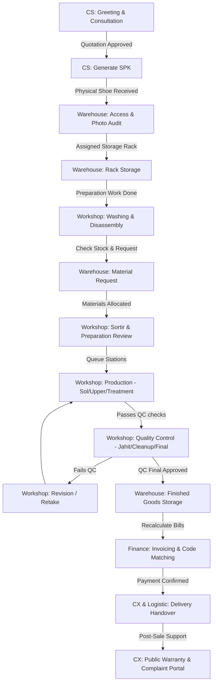

# 📋 PRD (Product Requirement Document) & System Architecture
## Sistem Workshop Sepatu (Reparasi & Care) - Enterprise Grade
**Author:** Antigravity (Senior Principal System Analyst & Backend Architect)
**Status:** Approved for Implementation
**Version:** 2.0.0
**Target System:** Laravel 10+ / Livewire 3 / MySQL

---

## 🛠️ Daftar Isi
1. [Pendahuluan & High-Level System Architecture](#-pendahuluan--high-level-system-architecture)
2. [Divisi 1: Customer Service (CS) & Lead Management (Mini CRM)](#-divisi-1-customer-service-cs--lead-management-mini-crm)
3. [Divisi 2: Gudang (Warehouse) & Inventory / Storage Management](#-divisi-2-gudang-warehouse--inventory--storage-management)
4. [Divisi 3: Workshop (Production, QC, Revision, & Logistics)](#-divisi-3-workshop-production-qc-revision--logistics)
5. [Divisi 4: Finance (Invoicing, Payments, & Bank Mutations)](#-divisi-4-finance-invoicing-payments--bank-mutations)
6. [Divisi 5: Customer Experience (CX) & Post-Sale Retention](#-divisi-5-customer-experience-cx--post-sale-retention)
7. [Global Technical Specifications & Security Architectures](#-global-technical-specifications--security-architectures)

---

## 🚀 Pendahuluan & High-Level System Architecture

SistemWorkshop adalah platform ERP (Enterprise Resource Planning) & CRM terintegrasi khusus untuk bisnis perawatan, pembersihan, reparasi sol, reparasi upper, dan restorasi sepatu premium skala menengah-besar. Sistem ini dirancang untuk mengatasi kompleksitas pelacakan aset pelanggan, proses produksi bertahap (multi-station), manajemen inventaris bahan baku, integrasi pembayaran mutasi bank otomatis, serta retensi pelanggan pasca-bayar (warranty & complaint).

### 🔄 Alur Kerja Lintas Divisi (Cross-Divisional End-to-End Flow)
Berikut adalah visualisasi siklus hidup (lifecycle) pengerjaan sepatu dari pertama kali pelanggan menghubungi hingga garansi selesai:



### 🗄️ Unified Data Model Core
Seluruh divisi beroperasi menggunakan model data terpusat dengan **WorkOrder** dan **Invoice** sebagai *single source of truth*.

*   **CsLead**: Mengelola prospek dari hulu (Marketing/Greeting) hingga terkonversi menjadi WorkOrder.
*   **WorkOrder**: Mewakili fisik 1 pasang sepatu. Berisi status produksi (`status`), status lokasi fisik (`current_location`), PIC stasiun, riwayat foto pengerjaan, dan spesifikasi teknis pengerjaan.
*   **Invoice**: Wadah keuangan untuk satu atau beberapa `WorkOrder` milik pelanggan yang sama. Menangani pelacakan nilai transaksi, potongan harga (diskon), biaya tambahan (OTO), dan riwayat pembayaran (`payments`).

---

## 📞 Divisi 1: Customer Service (CS) & Lead Management (Mini CRM)

Divisi CS bertindak sebagai pintu masuk utama data pelanggan. Fitur ini dirancang sebagai *Mini CRM* berbasis pipa (Pipeline) untuk meminimalkan *lead leakage* (prospek hilang) dan mempercepat respon pertama CS.

### 📋 Spesifikasi Fungsional

#### 1. Lead Pipeline (Kanban Board)
Setiap prospek baru masuk sebagai `CsLead` dengan status tahapan terstruktur:
*   **GREETING**: Kontak pertama pelanggan masuk melalui kanal komunikasi (WhatsApp, Instagram, Website, dll).
*   **KONSULTASI**: CS melakukan asesmen masalah sepatu, meminta foto kondisi awal, dan mendiskusikan opsi solusi perawatan/reparasi.
*   **FOLLOW UP**: Pelanggan dikirimi estimasi biaya awal dan dihubungi berkala jika belum memberikan keputusan.
*   **CLOSING**: Pelanggan menyetujui penawaran harga. Sepatu siap dikirim/diantar ke workshop.
*   **CONVERTED**: Fisik sepatu telah sampai, divalidasi, dan lead dikonversi menjadi `WorkOrder` resmi.
*   **LOST**: Pelanggan menolak penawaran. CS wajib mengisi `lost_reason` untuk bahan evaluasi tim marketing.

#### 2. Pembuatan Quotation (Penawaran)
*   Sistem mendukung pembuatan penawaran harga dengan versi bertingkat (`versioning`). Hal ini dikarenakan pelanggan sering mengubah jenis layanan selama fase diskusi konsultasi.
*   Quotation mencakup detail item sepatu, deskripsi kerusakan, layanan yang direkomendasikan (`services` master), dan nominal harga asli beserta opsi diskon.
*   Status penawaran: `DRAFT` -> `SENT` -> `ACCEPTED` / `REJECTED`.

#### 3. Pembuatan SPK (Surat Perintah Kerja) & Handover
*   Ketika Quotation berada dalam status `ACCEPTED`, tombol **Generate SPK** diaktifkan.
*   CS memetakan item quotation ke dalam template SPK digital yang berisi data pengerjaan per sepatu.
*   Sistem otomatis menerbitkan **Nomor SPK unik** (Format: `SPK/YYYYMMDD/[CS-CODE]/[SEQUENTIAL]`).
*   Saat fisik sepatu tiba, CS mengonversi status Lead menjadi `CONVERTED` dan otomatis menembakkan data SPK tersebut ke modul **Reception** milik Warehouse.

---

### 🏛️ Skema Data & Relasi (Database Schema)

#### `cs_leads`
| Nama Kolom | Tipe Data | Keterangan |
| :--- | :--- | :--- |
| `id` | BigInt (PK) | Auto increment |
| `customer_name` | Varchar(255) | Nama lengkap prospek |
| `customer_phone`| Varchar(50) | Nomor telepon (wajib dinormalisasi dengan format negara, misal: `628...`) |
| `customer_email`| Varchar(255) | Surel opsional |
| `status` | Varchar(50) | ENUM: `GREETING`, `KONSULTASI`, `FOLLOW_UP`, `CLOSING`, `CONVERTED`, `LOST` |
| `priority` | Varchar(20) | ENUM: `HOT` (tindak lanjuti dalam 15 menit), `WARM`, `COLD` |
| `source` | Varchar(50) | Saluran masuk: `WhatsApp`, `Instagram`, `Website`, `Walk-in` |
| `cs_id` | BigInt (FK) | Relasi ke `users.id` (PIC CS yang memegang lead) |
| `expected_value`| Decimal(12,2) | Nilai proyeksi pendapatan |
| `lost_reason` | Text | Alasan penolakan jika status `LOST` |
| `response_time_minutes` | Integer | Waktu respon pertama (selisih `first_contact_at` dan `first_response_at`) |
| `next_follow_up_at` | Datetime | Pengingat jadwal follow up berikutnya |

#### `cs_quotations`
| Nama Kolom | Tipe Data | Keterangan |
| :--- | :--- | :--- |
| `id` | BigInt (PK) | Auto increment |
| `cs_lead_id` | BigInt (FK) | Relasi ke `cs_leads.id` |
| `version` | Integer | Versi penawaran (mulai dari 1) |
| `status` | Varchar(50) | ENUM: `DRAFT`, `SENT`, `ACCEPTED`, `REJECTED` |
| `discount` | Decimal(12,2) | Potongan nominal |
| `total_price` | Decimal(12,2) | Total harga setelah diskon |

---

### 🛡️ Otorisasi & Aturan Bisnis Keamanan (Security Rules)

> [!CAUTION]
> **Proteksi Insecure Direct Object Reference (IDOR) pada Fitur CRM**
> Pengguna dengan hak akses `CS` hanya diperbolehkan melihat, mengubah status, mengirim pesan, atau memproses lead yang terdaftar atas nama dirinya (`cs_id === Auth::id()`).
> Controller backend **Wajib** memvalidasi kepemilikan data pada setiap action method (seperti `updateStatus`, `moveToKonsultasi`, `generateSpk`). Hanya pengguna ber-role `Admin` atau `CS Manager` yang diperbolehkan melintasi data antar-CS.

*   **Aturan Validasi Input**: 
    *   Nomor telepon yang diinput wajib divalidasi ke format internasional menggunakan `PhoneHelper` sebelum disimpan.
    *   Pengisian `lost_reason` wajib ada jika status diubah ke `LOST`.

---

## 📦 Divisi 2: Gudang (Warehouse) & Inventory / Storage Management

Divisi Gudang bertanggung jawab penuh atas penyimpanan barang pelanggan (sepatu), audit fisik aksesoris bawaan, serta pengelolaan stok bahan baku reparasi (sol, cat, benang, sabun).

### 📋 Spesifikasi Fungsional

#### 1. Penerimaan & Audit Fisik (Reception Stage)
*   Ketika status WorkOrder dikirim dari CS ke stasiun `RECEPTION` di Gudang:
    *   Staf gudang melakukan unboxing dan melakukan audit fisik mendalam.
    *   Mencatat kelengkapan aksesoris bawaan menggunakan kolom JSON `accessories_data` (Tali bawaan, Insole tambahan, Box asli, Shoe tree, dll).
    *   Mengambil foto bukti fisik 360 derajat (Depan, Belakang, Sol bawah, Kiri, Kanan) menggunakan modul `WorkOrderPhoto` bertipe `RECEPTION`.
*   Jika sepatu tidak layak dikerjakan (contoh: bahan rapuh/hydrolysis parah), staf gudang dapat melakukan reject dengan mengisi `reception_rejection_reason` dan mengembalikan status ke CS untuk dinegosiasikan ulang.

#### 2. Sistem Penyimpanan Berbasis Rak & Kode Unik (Storage Rack & Automated Assignment)
*   Setiap sepatu yang disetujui masuk wajib langsung dialokasikan ke rak fisik untuk menghindari kehilangan.
*   **Alokasi Rak Otomatis (Smart Allocation)**: Sistem mencari slot rak yang kosong/memiliki sisa kapasitas berdasarkan filter zona (`storage_racks`).
*   Setiap rak memiliki properti `rack_code`, `max_capacity`, dan `current_count`.
*   Staf gudang dapat melakukan *manual override* jika ukuran sepatu terlalu besar (boot tinggi) sehingga membutuhkan rak khusus.
*   Setelah dialokasikan, sistem membuat record pada tabel `storage_assignments` dan menandai status `stored_at`.
*   Ketika sepatu diambil untuk diproduksi atau diambil pelanggan, sistem melakukan pencatatan `retrieved_at` dan otomatis mengurangi `current_count` pada rak terkait via database triggers / model observers.

#### 3. Permintaan & Reservasi Bahan Baku (Material Request Flow)
*   Teknisi di workshop membutuhkan bahan (seperti sol karet Vibram, warna cat tertentu, atau lem khusus). Teknisi mengajukan permintaan material melalui modul **Material Request**.
*   Staf gudang menerima notifikasi permintaan bahan baku.
*   Gudang dapat menyetujui (`status: ALLOCATED`) jika stok tersedia, atau mengajukan pembelian ke supplier (`status: PURCHASE_ORDER`) jika stok kritis atau kosong.
*   Setiap transaksi keluar-masuk barang di gudang wajib tercatat di jurnal `material_transactions` demi integritas audit stok tahunan (*Stock Opname*).

---

### 🏛️ Skema Data & Relasi (Database Schema)

#### `storage_racks`
| Nama Kolom | Tipe Data | Keterangan |
| :--- | :--- | :--- |
| `id` | BigInt (PK) | Auto increment |
| `rack_code` | Varchar(50) | Kode unik rak fisik (contoh: `RK-A-01`) |
| `zone` | Varchar(50) | Area penempatan: `WASHING`, `PRODUCTION`, `FINISHED_GOODS` |
| `max_capacity` | Integer | Batas maksimal pasang sepatu di rak ini |
| `current_count` | Integer | Jumlah sepatu yang saat ini berada di rak |

#### `storage_assignments`
| Nama Kolom | Tipe Data | Keterangan |
| :--- | :--- | :--- |
| `id` | BigInt (PK) | Auto increment |
| `work_order_id`| BigInt (FK) | Relasi ke `work_orders.id` |
| `rack_code` | Varchar(50) | Relasi ke `storage_racks.rack_code` |
| `assigned_by` | BigInt (FK) | Staf gudang yang menaruh barang |
| `stored_at` | Datetime | Waktu penyimpanan awal |
| `retrieved_at` | Datetime | Waktu pengambilan (null jika masih di rak) |

#### `materials` (Master Bahan Baku)
| Nama Kolom | Tipe Data | Keterangan |
| :--- | :--- | :--- |
| `id` | BigInt (PK) | Auto increment |
| `material_code`| Varchar(50) | Kode unik SKU bahan baku |
| `name` | Varchar(255) | Nama bahan baku (misal: *Angelus Leather Paint Flat White 1oz*) |
| `stock` | Integer | Jumlah stok fisik aktual |
| `min_stock` | Integer | Batas minimal peringatan reorder |

---

### 🛡️ Otorisasi & Aturan Bisnis Keamanan (Security Rules)

> [!IMPORTANT]
> **Aturan Keamanan Gudang & Integritas Stok**
> 1. Pengurangan stok fisik `materials` tidak diperkenankan langsung melalui edit input angka bebas. Perubahan wajib melalui dokumen pemotong resmi, yakni `material_transactions` atau melalui pemenuhan `MaterialRequest` yang sah.
> 2. Pintu otorisasi: Metode `ManualRackController` hanya boleh diakses oleh user dengan permission `warehouse_access` atau role `Warehouse Staff`.
> 3. Transaksi peletakan dan pengambilan rak wajib berada di dalam satu transaksi database (`DB::transaction`) untuk menghindari race condition (dua sepatu dialokasikan ke satu sisa kapasitas slot rak secara bersamaan).

---

## 🎨 Divisi 3: Workshop (Production, QC, Revision, & Logistics)

Workshop adalah jantung operasional tempat pengerjaan fisik sepatu dilakukan. Divisi ini menuntut efisiensi tinggi, pembagian kerja yang presisi, dan mekanisme kontrol kualitas (QC) berlapis.

### 📋 Spesifikasi Fungsional

#### 1. Pembagian Kerja Berbasis Stasiun (Station-Specific Tracking)
WorkOrder diproses melalui tahapan-tahapan berurutan (*workflow pipeline*):
1.  **PREPARATION**: Pembersihan awal (washing) dan pembongkaran bagian sol/upper yang rusak oleh teknisi khusus prep.
2.  **SORTIR**: Pengalokasian teknisi ahli berdasarkan jenis kesulitan reparasi dan pengecekan kelayakan material.
3.  **PRODUCTION**: Fase eksekusi utama. Terbagi lagi menjadi tiga antrean (Queue) spesifik berdasarkan pengerjaan:
    *   *Sol Queue*: Menangani sol lepas, jahit sol, ganti sol total (*resoling*).
    *   *Upper Queue*: Menangani jahitan sobek, rekonstruksi kulit, ganti kain dalam.
    *   *Treatment/Cleaning Queue*: Menangani painting ulang, recoloring, deep clean, bleaching.
4.  **QUALITY CONTROL (QC)**: Tahap pembuktian kualitas. Setiap sepatu di-review oleh PIC QC tersertifikasi pada 3 pos pemeriksaan:
    *   *QC Jahit*: Memastikan kerapian dan kekuatan benang sol/upper.
    *   *QC Cleanup*: Memastikan sisa lem, debu, atau coretan cat bersih total.
    *   *QC Final*: Memastikan hasil akhir sesuai foto awal dari SPK dan siap dikirim.
5.  **SELESAI / FINISHED GOODS**: Sepatu selesai pengerjaan fisik, diserahkan kembali ke Gudang stasiun Finished Goods.

#### 2. Manajemen Beban Kerja Teknisi (Technician Workload Metrics)
Sistem memiliki dashboard khusus supervisor workshop untuk melihat beban kerja aktif (`active_jobs_count`) dari setiap teknisi secara real-time. Hal ini bertujuan untuk meratakan alokasi pengerjaan agar tidak menumpuk pada satu orang teknisi saja (*bottleneck*).

#### 3. Skema Retake & Revisi Berjenjang (Quality Gate & WorkOrder Revision)
*   Jika salah satu pos QC menemukan ketidaksesuaian (gagal uji coba), PIC QC menolak pengerjaan tersebut dengan memicu status **Revisi**.
*   Sistem membuat record baru di tabel `work_order_revisions`.
*   Sistem menuntut pengisian `issue_description` dan unggah foto area cacat produksi.
*   Status WorkOrder ditandai dengan flag `is_revising = true`.
*   Sepatu dikembalikan ke antrean teknisi terkait untuk dikerjakan ulang (*retake*). Status revisi baru dinyatakan selesai setelah disetujui kembali oleh pos QC yang menolaknya.

---

### 🏛️ Skema Data & Relasi (Database Schema)

#### `work_order_revisions`
| Nama Kolom | Tipe Data | Keterangan |
| :--- | :--- | :--- |
| `id` | BigInt (PK) | Auto increment |
| `work_order_id` | BigInt (FK) | Relasi ke `work_orders.id` |
| `rejected_by` | BigInt (FK) | Relasi ke `users.id` (PIC QC yang me-reject) |
| `technician_id` | BigInt (FK) | Relasi ke `users.id` (Teknisi yang mengerjakan) |
| `issue_description`| Text | Alasan penolakan QC / letak cacat produksi |
| `photo_path` | Varchar(255) | File path foto penolakan detail |
| `status` | Varchar(50) | ENUM: `PENDING_REVISION`, `RESOLVED` |
| `created_at` | Datetime | Tanggal penolakan |
| `resolved_at` | Datetime | Tanggal pengerjaan ulang disetujui kembali |

---

### 🛡️ Otorisasi & Aturan Bisnis Keamanan (Security Rules)

> [!WARNING]
> **Pencegahan Bug Kritis pada Pagination & Filter Antrean Produksi**
> Antrean pengerjaan (Sol, Upper, Treatment) **Wajib difilter pada level Query database (Eloquent Scope)** sebelum pagination dijalankan, bukan melalui pemotongan Collection memory PHP (`filter()`).
> *Kesalahan penyaringan di level memory akan menyebabkan inkonsistensi pagination (jumlah data per baris tidak konsisten, bahkan halaman bisa kosong padahal total antrean masih banyak).*

*   **Aturan Validasi Alur Kerja (Workflow Gate)**:
    *   Teknisi tidak dapat menandai pengerjaan selesai jika stasiun preparation belum di-approve oleh PIC Prep.
    *   Sistem tidak mengizinkan status pengerjaan lompat langsung dari `PREPARATION` ke `QC` tanpa melewati stasiun `PRODUCTION`.
    *   Setiap pergantian status stasiun wajib melampirkan foto perkembangan terbaru (`WorkOrderPhoto` bertipe `PROGRESS`) sebagai transparansi digital bagi pelanggan.

---

## 💸 Divisi 4: Finance (Invoicing, Payments, & Bank Mutations)

Divisi Finance mengelola arus masuk kas (cash-in), pencatatan invoice pelunasan atau DP (Down Payment), pencocokan mutasi rekening bank, dan otorisasi verifikasi pembayaran.

### 📋 Spesifikasi Fungsional

#### 1. Formula Kode Billing Unik Transaksi (Unique Payment Code System)
Untuk mempermudah verifikasi transfer manual tanpa membutuhkan API payment gateway pihak ketiga berbayar:
*   Setiap invoice yang diterbitkan untuk metode transfer bank manual mendapatkan kode unik penambah nominal acak 3-digit terakhir (contoh: tagihan `Rp 150.000` ditambahkan kode unik `123`, menjadi nominal bayar `Rp 150.123`).
*   Kode unik dihitung dengan cara memotong sisa pembulatan ribuan, lalu menindih 3 digit terakhir dengan `unique_code` dari database.
*   **Formula Penulisan Nilai Akhir**:
    $$\text{Total Transaksi} = \left( \lfloor \frac{\text{Base Total}}{1000} \rfloor \times 1000 \right) + \text{Unique Code}$$
*   Setelah tagihan berstatus **Lunas (L)**, sistem otomatis menghapus / me-release `unique_code` tersebut kembali ke kolam kode unik agar dapat digunakan oleh transaksi baru lainnya di hari berikutnya.

#### 2. Auto-Recalculation Engine
*   Setiap kali ada penambahan/pengurangan item layanan, penambahan diskon, perubahan biaya ekspedisi (`shipping_cost`), atau biaya upselling program retensi (biaya OTO), sistem memanggil rutin method `recalculateTotalPrice()`.
*   Rutin ini menghitung ulang total tagihan dasar, menerapkan kode unik, membandingkan dengan total pembayaran tervalidasi pada tabel `order_payments` (`is_verified = true`), menetapkan sisa tagihan, dan mengubah status pembayaran:
    *   `Belum Bayar`: Belum ada pembayaran tervalidasi masuk.
    *   `DP/Cicil`: Total tervalidasi lebih kecil dari Total Transaksi tapi lebih besar dari 0.
    *   `L` (Lunas): Total tervalidasi sama dengan atau melebihi Total Transaksi.

#### 3. Import Mutasi Bank & Pencocokan Otomatis (Bank Mutation Reconciler)
*   Sistem menyediakan fitur import file CSV/Excel mutasi rekening dari bank-bank besar (BCA, Mandiri, BNI, BRI).
*   Data mutasi dibaca dan disimpan dalam tabel `bank_mutations`.
*   **Mesin Pencocok Mutasi (Auto-Matching Engine)**:
    *   Sistem berjalan mencari mutasi kredit dengan nominal persis yang cocok dengan tagihan `total_transaksi` berstatus `Belum Bayar` atau `DP/Cicil`.
    *   Jika ditemukan kecocokan nominal dalam rentang tanggal $\pm 3$ hari, sistem otomatis memasangkan mutasi tersebut dengan invoice.
    *   Pembayaran otomatis tervalidasi (`is_verified = true`), status invoice ter-update menjadi `Lunas` atau `DP`, dan memicu notifikasi WhatsApp otomatis ke pelanggan berisi kuitansi pelunasan digital (`invoice_akhir`).

---

### 🏛️ Skema Data & Relasi (Database Schema)

#### `invoices`
| Nama Kolom | Tipe Data | Keterangan |
| :--- | :--- | :--- |
| `id` | BigInt (PK) | Auto increment |
| `invoice_number`| Varchar(100) | Nomor invoice resmi (contoh: `INV/2026/05/0091`) |
| `customer_name` | Varchar(255) | Duplikasi nama pelanggan demi performa query |
| `invoice_token` | Varchar(64) | Token enkripsi url publik pembagian tagihan |
| `total_transaksi`| Decimal(12,2)| Total nominal wajib bayar (sudah termasuk kode unik) |
| `total_paid` | Decimal(12,2)| Total pembayaran tervalidasi dari tabel transaksi |
| `sisa_tagihan` | Decimal(12,2)| Selisih tagihan wajib bayar dengan total bayar |
| `status_pembayaran`| Varchar(50)| ENUM: `Belum Bayar`, `DP/Cicil`, `L` |
| `unique_code` | Integer | Kode unik 3 digit (contoh: `123`) |

#### `order_payments`
| Nama Kolom | Tipe Data | Keterangan |
| :--- | :--- | :--- |
| `id` | BigInt (PK) | Auto increment |
| `work_order_id`| BigInt (FK) | Relasi ke `work_orders.id` (opsional jika per WO) |
| `invoice_id` | BigInt (FK) | Relasi ke `invoices.id` |
| `amount_total` | Decimal(12,2)| Nominal transfer aktual |
| `payment_method`| Varchar(50) | Metode: `TRANSFER_BCA`, `CASH`, `QRIS` |
| `payment_proof`| Varchar(255) | File path bukti bayar yang diunggah pelanggan |
| `is_verified` | Boolean | Flag persetujuan dari tim Finance |
| `verified_by` | BigInt (FK) | Relasi ke `users.id` (Staf finance verifikator) |
| `verified_at` | Datetime | Tanggal dan waktu disetujui |

#### `bank_mutations` (Riwayat Rekening Koran Bank)
| Nama Kolom | Tipe Data | Keterangan |
| :--- | :--- | :--- |
| `id` | BigInt (PK) | Auto increment |
| `transaction_date`| Date | Tanggal pembukuan bank |
| `description` | Text | Keterangan transfer dari mutasi bank |
| `type` | Varchar(5) | ENUM: `DB` (Debet), `CR` (Kredit) |
| `amount` | Decimal(12,2)| Nominal mutasi rupiah |
| `matched_invoice_id`| BigInt (FK)| Link ke `invoices.id` jika sudah ter-match otomatis |

---

### 🛡️ Otorisasi & Aturan Bisnis Keamanan (Security Rules)

> [!IMPORTANT]
> **Integritas Pembukuan & Keuangan**
> 1. Segala bentuk perubahan status `is_verified = true` pada pembayaran wajib melampirkan log audit user ID verifikator (`verified_by`).
> 2. Ketika invoice telah mencapai status **Lunas (L)**, data item transaksi dalam invoice tersebut dikunci (`readonly`) dari perubahan layanan untuk menghindari fraud / manipulasi laporan omzet bulanan.
> 3. Seluruh proses matching mutasi dan kalkulasi wajib dibungkus dalam Database Transaction Isolation Level: **REPEATABLE READ** untuk mencegah double verification jika ada klik berulang dari user interface.

---

## 🤝 Divisi 5: Customer Experience (CX) & Post-Sale Retention

Divisi CX fokus pada kepuasan pelanggan setelah barang selesai dikerjakan. Tugasnya meliputi manajemen komplain, klaim garansi produk, serta aktivasi promosi penawaran berulang (OTO).

### 📋 Spesifikasi Fungsional

#### 1. Klaim Garansi & Portal Publik (Warranty Portal)
Setiap pengerjaan sepatu premium memiliki benefit garansi pengerjaan selama $\text{N}$ bulan (`warranty_duration_months`), terhitung sejak status diubah menjadi `TAKEN` (diambil pelanggan).
*   Sistem otomatis menerbitkan masa berlaku garansi di database (`warranty_expires_at`).
*   **Public Portal Warranty**: Pelanggan dapat melakukan scan QR Code pada nota fisik atau mengunjungi web portal publik untuk mengecek sisa masa berlaku garansi sepatunya tanpa perlu login ke sistem utama.
*   Jika pelanggan mengajukan klaim kerusakan dalam masa garansi:
    *   CX membuat registrasi klaim baru di tabel `warranty_claims`.
    *   Jika klaim disetujui (`status: APPROVED`), sistem menerbitkan SPK Garansi baru berkode khusus (`is_warranty = true`) yang memiliki keterkaitan dengan WorkOrder induk (`parent_id`) secara gratis.

#### 2. Pipa Keluhan Pelanggan (Complaint Management & Ticket Escalation)
*   Komplain pelanggan masuk dicatat sebagai tiket pengaduan (`complaints`).
*   Setiap tiket komplain dipetakan ke data master penyebab (`MasterIssue`) dan opsi penanganan solusi standar perusahaan (`MasterSolution`). Hal ini berguna untuk standardisasi respons dan audit kegagalan produk di tingkat workshop.
*   Tahapan Tiket: `OPEN` -> `UNDER_INVESTIGATION` -> `SOLVED` -> `REJECTED`.

#### 3. Program Penawaran Tambahan (One-Time Offer / OTO)
*   Untuk meningkatkan nilai transaksi per pelanggan (*Average Order Value*), sistem mengintegrasikan penawaran eksklusif OTO yang dikirimkan melalui WhatsApp beberapa saat setelah sepatu selesai diproduksi.
*   Penawaran dapat berupa: Pembersihan tali gratis untuk order berikutnya, pelindung anti air (*waterproofing spray*) setengah harga, atau diskon paket perawatan tas.
*   Jika pelanggan mengambil OTO ini, tagihan otomatis ditambahkan di kolom `cost_oto` dan memicu recalculation invoice di modul Finance.

---

### 🏛️ Skema Data & Relasi (Database Schema)

#### `warranty_claims`
| Nama Kolom | Tipe Data | Keterangan |
| :--- | :--- | :--- |
| `id` | BigInt (PK) | Auto increment |
| `work_order_id`| BigInt (FK) | Relasi ke `work_orders.id` |
| `claim_code` | Varchar(50) | Nomor registrasi klaim unik |
| `issue_details`| Text | Deskripsi kerusakan sepatu yang diklaim |
| `customer_photo_proof`| Varchar(255)| Bukti foto kerusakan dari pelanggan |
| `status` | Varchar(50) | ENUM: `PENDING_REVIEW`, `APPROVED`, `REJECTED` |
| `expires_at` | Datetime | Duplikasi tanggal kadaluarsa garansi untuk verifikasi cepat |

#### `complaints` (Tiket Keluhan Pelanggan)
| Nama Kolom | Tipe Data | Keterangan |
| :--- | :--- | :--- |
| `id` | BigInt (PK) | Auto increment |
| `work_order_id`| BigInt (FK) | Relasi ke `work_orders.id` |
| `master_issue_id`| BigInt (FK)| Relasi ke penyebab master (`master_issues.id`) |
| `master_solution_id`| BigInt (FK)| Relasi ke solusi master (`master_solutions.id`) |
| `cx_handler_id`| BigInt (FK) | Relasi ke `users.id` (PIC CX penanggung jawab) |
| `status` | Varchar(50) | ENUM: `OPEN`, `INVESTIGATION`, `RESOLVED`, `REJECTED` |

---

### 🛡️ Otorisasi & Aturan Bisnis Keamanan (Security Rules)

> [!TIP]
> **Aturan Bisnis Garansi & Asesmen CX**
> 1. Sistem wajib menolak klaim garansi secara otomatis pada level backend jika tanggal pengajuan klaim melewati batas waktu `warranty_expires_at` di tabel WorkOrder.
> 2. Pengerjaan sepatu klaim garansi yang disetujui wajib memiliki referensi `parent_id` ke WorkOrder lama untuk kebutuhan pelacakan riwayat kinerja teknisi yang mengerjakan order tersebut sebelumnya.

---

## 🔒 Global Technical Specifications & Security Architectures

Sebagai platform ERP kelas enterprise, sistem ini menerapkan standar pengembangan ketat untuk menjaga keamanan data, konsistensi status transaksi, dan performa tinggi saat menangani ribuan order aktif.

### 🛡️ 1. Pencegahan Kerentanan Keamanan (Security Vulnerability Prevention)
1.  **Strict IDOR Protection (Insecure Direct Object Reference)**:
    *   Seluruh endpoint manipulasi data (`POST`, `PUT`, `PATCH`, `DELETE`) wajib divalidasi menggunakan Policy Laravel.
    *   Contoh implementasi pengamanan Lead & WorkOrder:
    ```php
    public function update(User $user, CsLead $lead)
    {
        return $user->hasRole('admin') || $lead->cs_id === $user->id;
    }
    ```
2.  **SQL Injection Prevention**:
    *   Seluruh query pembangunan data menggunakan Query Builder / Eloquent ORM wajib mematuhi kaidah parameterized bindings.
    *   Penggunaan raw query (`DB::raw`) sangat dibatasi dan dilarang menyertakan variabel masukan pengguna tanpa sanitasi ketat.

### 💾 2. Pengelolaan Database & Konsistensi Transaksi
1.  **Database Transactions**:
    *   Semua operasi write yang melibatkan lebih dari satu tabel (contoh: pembuatan invoice, konversi SPK ke WorkOrder, atau approval pengeluaran material gudang) **Wajib dibungkus** dengan `DB::transaction()` untuk memastikan integritas data (Atomicity).
    *   Jika salah satu langkah gagal, seluruh perubahan wajib di-*rollback* total.
2.  **Optimistic Locking / Race Condition Protection**:
    *   Ketika teknisi mengambil material di gudang atau menaruh sepatu ke rak, gunakan transaksi terisolasi atau *Pessimistic Locking* (`sharedLock()` atau `lockForUpdate()`) agar tidak terjadi penumpukan alokasi berlebih pada resource yang terbatas.

### ⚡ 3. Strategi Performa (High Performance & Scalability)
1.  **Database Indexing**:
    *   Tambahkan index pada kolom-kolom pencarian dan filter utama:
        *   `work_orders`: `status`, `current_location`, `customer_phone`, `invoice_id`, `created_at`.
        *   `cs_leads`: `status`, `cs_id`, `priority`, `customer_phone`.
        *   `invoices`: `status_pembayaran`, `unique_code`, `invoice_token`.
2.  **Optimasi Pagination & Queue Loading**:
    *   Dilarang keras melakukan filtering antrean produksi menggunakan koleksi memori PHP (`Collection::filter()`). 
    *   Semua filtering wajib diselesaikan di tingkat DBMS melalui Eloquent Query Scope untuk menjaga performa response time aplikasi di bawah **200ms**.
3.  **Caching Strategy**:
    *   Metrik performa dashboard workshop, data visual laporan bulanan, dan load statistik teknisi wajib di-cache menggunakan Redis / Memcached dengan masa kadaluarsa (TTL) 15-30 menit untuk meringankan beban query database relasional MySQL.

---

### 🏁 Kesimpulan Rekomendasi Arsitektur
Sistem Workshop Sepatu ini dibangun dengan rancangan arsitektur terdesentralisasi per divisi, namun saling terikat erat melalui model data inti `WorkOrder` dan `Invoice`. Dengan menerapkan standar penulisan backend kelas dunia seperti di atas (penutupan IDOR, enkapsulasi logic ke dalam Service Class, optimasi query antrean, dan otomatisasi verifikasi mutasi bank), aplikasi ini siap mendukung ekspansi bisnis workshop secara aman, cepat, dan terukur.
