

# 📖 BUKU PANDUAN PENGGUNA (USER MANUAL BOOK)
## SISTEM WORKSHOP & MANAJEMEN PRODUKSI (PWA)
**Edisi:** September 2026  
**Versi Sistem:** 2.4 - UI/UX Pro Max Edition  
**Sasaran Pengguna:** Admin Workshop, Kepala Produksi, Teknisi, QC Inspector, dan Admin Logistik Gudang  

---

## 📑 DAFTAR ISI
1. [BAB 1: Pendahuluan & Peran Pengguna](#bab-1-pendahuluan--peran-pengguna)
2. [BAB 2: Modul Fast Track SPK Prioritas](#bab-2-modul-fast-track-spk-prioritas)
3. [BAB 3: Modul Inbound (Penerimaan Barang Masuk)](#bab-3-modul-inbound-penerimaan-barang-masuk)
4. [BAB 4: Modul Preparation (Pencucian & Pembongkaran)](#bab-4-modul-preparation-pencucian--pembongkaran)
5. [BAB 5: Modul Sortir & Penilaian Bahan Baku](#bab-5-modul-sortir--penilaian-bahan-baku)
6. [BAB 6: Modul Surat Jalan Sortir ke Produksi](#bab-6-modul-surat-jalan-sortir-ke-produksi)
7. [BAB 7: Modul Production (Lini Produksi Reparasi)](#bab-7-modul-production-lini-produksi-reparasi)
8. [BAB 8: Modul Surat Jalan Production ke QC](#bab-8-modul-surat-jalan-production-ke-qc)
9. [BAB 9: Modul Quality Control (QC) & Penyelesaian](#bab-9-modul-quality-control-qc--penyelesaian)
10. [BAB 10: Modul Outbound & Manifest Pengiriman Toko](#bab-10-modul-outbound--manifest-pengiriman-toko)
11. [BAB 11: Modul Asisten Data Teknisi](#bab-11-modul-asisten-data-teknisi)
12. [BAB 12: Modul Manajemen Data Teknisi](#bab-12-modul-manajemen-data-teknisi)
13. [BAB 13: Modul Manajemen Skill & Matrix Jasa Teknisi](#bab-13-modul-manajemen-skill--matrix-jasa-teknisi)

---

## BAB 1: PENDAHULUAN & PERAN PENGGUNA

### 1.1 Mengenai Sistem Workshop PWA
Sistem Workshop PWA adalah platform manajemen operasional terintegrasi yang dirancang khusus untuk memonitor siklus reparasi sepatu mulai dari penerimaan barang dari toko/gudang, proses pencucian (*Preparation*), penyortiran bahan (*Sortir*), pengerjaan teknis (*Production*), pengawasan mutu (*Quality Control*), hingga serah terima keluar (*Staging Outbound*).

### 1.2 Alur Besar Siklus Kerja (Standard Operating Procedure)
$$\text{Gudang Inbound} \longrightarrow \text{Preparation (Cuci)} \longrightarrow \text{Sortir} \overset{\text{Surat Jalan}}{\longrightarrow} \text{Produksi} \overset{\text{Surat Jalan}}{\longrightarrow} \text{QC} \longrightarrow \text{Outbound} \longrightarrow \text{Toko/Customer}$$

### 1.3 Peran Pengguna (User Roles)
*   **Admin Gudang / Logistik:** Bertanggung jawab menerbitkan Manifest Pengiriman Inbound dari toko ke workshop dan menerima barang Outbound yang telah selesai diperbaiki.
*   **Admin Workshop:** Bertanggung jawab mengonfirmasi penerimaan Inbound, mengelola antrean sortir, membuat pengajuan belanja bahan ke Finlog, serta menerbitkan Surat Jalan internal antar stasiun.
*   **Teknisi (Preparation / Production):** Bertanggung jawab mengeksekusi tindakan fisik reparasi (Cuci, Soling, Upper, Treatment) sesuai penugasan stasiun masing-masing.
*   **QC Inspector:** Bertanggung jawab memeriksa kualitas hasil akhir reparasi sepatu, melakukan pembersihan final (*Cleanup*), dan menyetujui sepatu masuk ke *Staging Outbound*.

---

## BAB 2: MODUL FAST TRACK SPK PRIORITAS

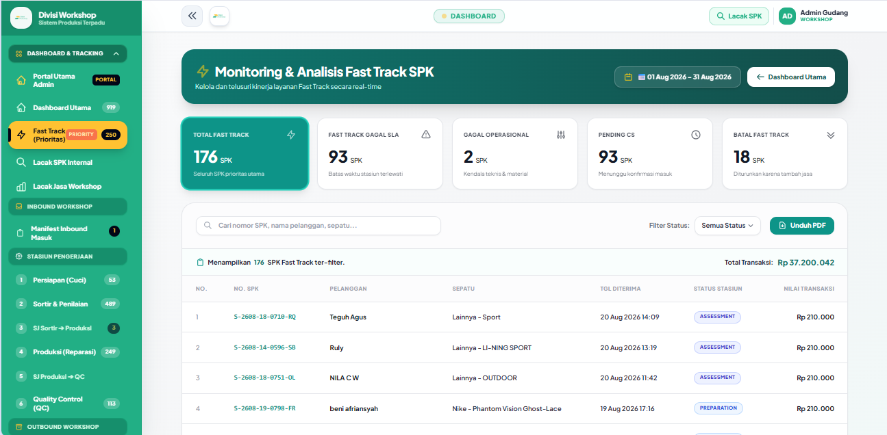

### 2.1 Tujuan Fitur
Modul **Monitoring & Analisis Fast Track SPK** berfungsi sebagai command center analitik dan pemantauan real-time terhadap seluruh Work Order (SPK) yang masuk dalam kategori layanan prioritas ekspres (*Fast Track*). Fitur ini mengawasi kepatuhan batas waktu pengerjaan (*Service Level Agreement / SLA*), mendeteksi kendala operasional, dan mencegah keterlambatan penyerahan sepatu kepada pelanggan.

---

### 2.2 Penjelasan 5 Kartu Metrik Analisis (Interactive KPI Cards)
Di bagian atas halaman, terdapat **5 Kartu Metrik Interaktif** yang sekaligus berfungsi sebagai tombol filter cepat (*Quick Filter*). Mengeklik salah satu kartu akan langsung menyaring daftar tabel di bawahnya:

1. **🟩 KARTU 1: TOTAL FAST TRACK (Teal Card)**
   *   **Definisi:** Menampilkan total seluruh SPK prioritas utama (*Fast Track*) yang terdaftar dalam rentang tanggal filter yang dipilih.
   *   **Makna Operasional:** Menjadi tolok ukur volume beban kerja prioritas yang sedang ditangani oleh workshop.
   *   **Aksi:** Klik kartu ini untuk melihat seluruh daftar SPK Fast Track tanpa filter kendala.

2. **🟥 KARTU 2: FAST TRACK GAGAL SLA (Red Card)**
   *   **Definisi:** Menampilkan jumlah SPK Fast Track yang durasi pengerjaannya telah melewati batas waktu SLA yang dijanjikan (*Overdue / Batas Waktu Terlewati*).
   *   **Penyebab Sistem:** Terjadi penumpukan antrean di stasiun tertentu sehingga estimasi tanggal selesai (*estimation_date*) terlampaui sebelum sepatu lolos QC.
   *   **Aksi:** Prioritas penanganan darurat bagi Kepala Produksi untuk segera mendorong SPK ini ke stasiun berikutnya.

3. **🟧 KARTU 3: GAGAL OPERASIONAL (Orange Card)**
   *   **Definisi:** Menampilkan SPK Fast Track yang terhambat akibat kendala teknis internal workshop.
   *   **Penyebab Sistem:** Menunggu pengadaan bahan baku khusus dari Finlog (*Material Waiting*), proses revisi teknis berulang (*Rework/Reject*), atau kendala pembongkaran yang kompleks.
   *   **Aksi:** Memeriksa ketersediaan material di stasiun Sortir atau mengalokasikan teknisi senior untuk membantu penyelesaian.

4. **🟪 KARTU 4: PENDING CS (Purple Card)**
   *   **Definisi:** Menampilkan pesanan Fast Track yang masih tertahan di sisi Customer Service / sistem intake awal.
   *   **Penyebab Sistem:** Menunggu persetujuan penawaran tambahan jasa (*One-Time Offer / OTO*), menunggu konfirmasi pembayaran/DP kustomer, atau belum diterbitkan surat jalan dari toko ke workshop.
   *   **Aksi:** Tim CS mem-follow up kustomer agar pesanan dapat segera diberangkatkan ke workshop.

5. **⬛ KARTU 5: BATAL FAST TRACK / DOWNGRADE (Slate Dark Card)**
   *   **Definisi:** Menampilkan SPK yang awalnya dipesan sebagai Fast Track, namun diturunkan (*Downgraded*) statusnya menjadi pengerjaan reguler normal.
   *   **Penyebab Sistem:** Pelanggan menambah jenis layanan jasa berat (misal: tambah ganti sol tengah pengerjaan yang membutuhkan waktu pengeleman 3 hari), perubahan kesepakatan waktu, atau pembatalan biaya layanan ekspres.
   *   **Aksi:** Sistem menghapus label penanda Fast Track agar antrean produksi dialihkan ke jadwal standar tanpa penalti SLA.

---

### 2.3 Langkah-Langkah Penggunaan
1. Klik menu **DASHBOARD & TRACKING ➔ ⚡ Fast Track SPK** pada sidebar PWA.
2. **Pilih Rentang Tanggal:** Klik tombol **📅 Tanggal Filter (Flatpickr)** di pojok kanan atas header untuk memilih periode tanggal intake atau pengerjaan yang ingin dianalisis.
3. **Pilih Filter Metrik:** Klik salah satu dari **5 Kartu Metrik** (Total, Gagal SLA, Gagal Operasional, Pending CS, atau Batal Fast Track) sesuai kategori yang ingin ditelusuri.
4. **Pencarian Spesifik:** Gunakan kolom **Pencarian Cepat** untuk menemukan SPK berdasarkan nomor SPK, nama kustomer, atau merk sepatu.
5. **Filter Status Stasiun:** Gunakan dropdown status untuk menyaring SPK berdasarkan posisi stasiun (*Preparation, Sortir, Produksi, QC, Staging Outbound*).
6. **Ekspor Laporan Resmi:** Klik tombol **📥 Unduh PDF Laporan** untuk mengunduh rekapitulasi data Fast Track dalam format PDF siap cetak.
7. **Buka Detail SPK:** Klik tombol **Detail / Aksi** pada baris SPK untuk melihat riwayat log pengerjaan teknisi dan estimasi lead time.

---

### 2.4 Istilah Penting & Logika Sistem
*   **SLA (Service Level Agreement):** Batas waktu maksimal penyelesaian layanan Fast Track (misal: 24 jam untuk Deep Clean Express, 48 jam untuk Repaint Express).
*   **Fast Track Pinning:** Algoritma sistem yang secara otomatis menempatkan SPK `fast_track_status = yes` di posisi paling atas pada setiap antrean stasiun kerja.
*   **Auto-Detection Overdue:** Sistem secara otomatis menghitung selisih waktu `DATEDIFF(estimation_date, NOW())` dan menandai SPK dengan badge merah berkedip jika pengerjaan terlambat.

---

## BAB 3: MODUL INBOUND (PENERIMAAN BARANG MASUK)

### 3.1 Daftar Manifest Inbound Masuk

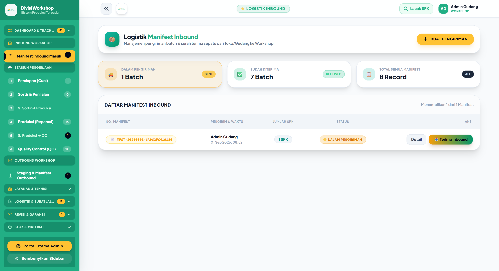

#### Tujuan Fitur:
Memantau seluruh pengiriman batch fisik sepatu dari Toko/Gudang Utama menuju bengkel kerja (Workshop).

#### Langkah-Langkah Penggunaan:
1. Klik menu **ANTREAN INBOUND ➔ 📄 Logistik Manifest Inbound**.
2. Tinjau 3 kartu status KPI di bagian atas:
   *   **🚚 DALAM PENGIRIMAN (SENT):** Menampilkan jumlah batch yang sedang dibawa kurir/driver menuju workshop.
   *   **✅ SUDAH DITERIMA (RECEIVED):** Menampilkan arsip batch yang telah sukses diverifikasi fisik di workshop.
   *   **📋 TOTAL SEMUA MANIFEST (ALL):** Menampilkan seluruh rekapitulasi riwayat pengiriman.
3. Untuk melihat rincian isi manifest tanpa menerima, klik tombol **Detail**.
4. Untuk memulai proses serah terima fisik barang dan pembagian teknisi, klik tombol kuning **📥 Terima Inbound**.

---

### 3.2 Detail Dokumen Manifest Inbound

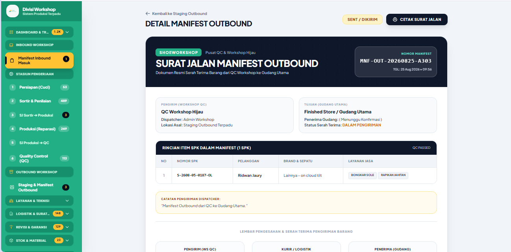

#### Tujuan Fitur:
Melihat lembar manifest resmi berisi daftar SPK, nomor resi pengiriman, dispatcher (pengirim), dan instruksi khusus sebelum fisik sepatu dibongkar.

#### Langkah-Langkah Penggunaan:
1. Pada daftar manifest, klik tombol **Detail**.
2. Periksa nomor manifest (format: `MFST-YYYYMMDD-XXXXXX`), tanggal pengiriman, dan nama pengirim.
3. Tinjau tabel daftar sepatu untuk memastikan kuantitas fisik yang tiba di bengkel sesuai dengan jumlah yang tercatat di sistem.
4. Klik tombol **🖨️ Cetak Manifest** jika memerlukan salinan fisik kertas untuk arsip penerimaan.

---

### 3.3 Serah Terima Fisik & Distribusi Teknisi Preparation

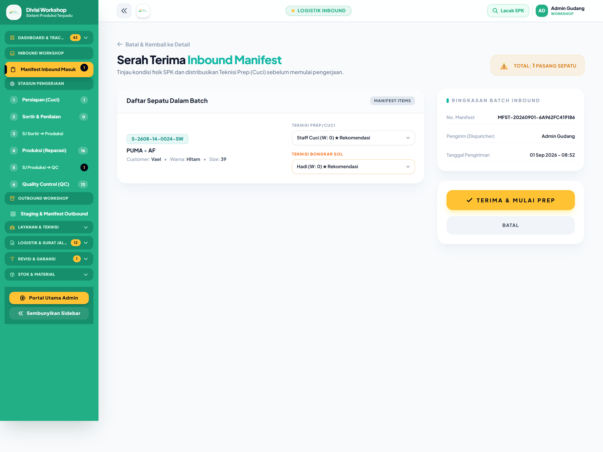

#### Tujuan Fitur:
Menerima fisik batch sepatu secara resmi ke sistem workshop sekaligus mendistribusikan penugasan teknisi cuci (*Prep Washing*) dan teknisi bongkar (*Prep Sol/Upper*).

#### Langkah-Langkah Penggunaan:
1. Klik tombol **📥 Terima Inbound** pada manifest yang berstatus `SENT`.
2. Pada baris masing-masing sepatu:
   *   **Teknisi Prep/Cuci:** Pilih teknisi cuci dari dropdown. Sistem secara otomatis memberikan tanda `★ Rekomendasi` pada teknisi dengan beban kerja terendah (*Workload Balancing*).
   *   **Teknisi Bongkar Sol / Upper (Opsional):** Jika sepatu memerlukan jasa sol/upper, dropdown pembongkaran akan aktif untuk ditugaskan.
3. Klik tombol biru **✓ Konfirmasi Serah Terima Fisik**.
4. Status manifest otomatis berubah menjadi `RECEIVED`, dan seluruh SPK di dalamnya langsung dialirkan ke stasiun **Preparation**.

---

## BAB 4: MODUL PREPARATION (PENCUCIAN & PEMBONGKARAN)

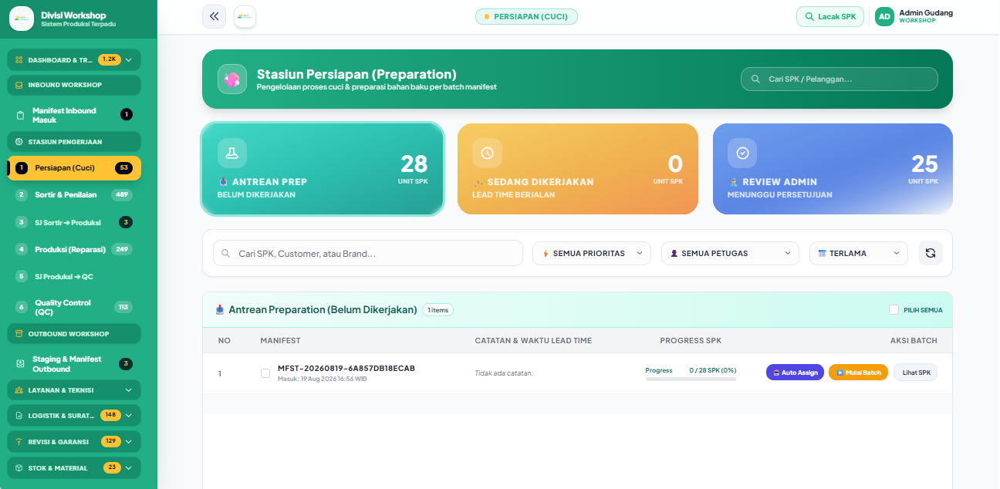

### 4.1 Tujuan Fitur
Mengelola proses pembersihan awal (Deep Clean / Washing) serta pembongkaran bagian sepatu yang rusak (Bongkar Sol / Bongkar Upper) sebelum dievaluasi kebutuhan bahannya di stasiun Sortir.

### 4.2 Langkah-Langkah Penggunaan
1. Klik menu **ALUR PROSES PENGERJAAN ➔ 1. Stasiun Preparation**.
2. Stasiun terbagi menjadi 3 sub-tab utama:
   *   **Antrean Masuk (WIP Prep):** Sepatu yang baru tiba dan belum mulai dikerjakan.
   *   **Sedang Dikerjakan:** Sepatu yang sedang dalam proses pencucian/pembongkaran oleh teknisi.
   *   **Selesai Prep:** Sepatu yang telah selesai dicuci dan siap dialirkan ke Sortir.
3. **Penugasan Cepat:** Ubah nama teknisi langsung melalui dropdown pada kolom *Teknisi Cuci* atau *Teknisi Bongkar*.
4. **Eksekusi Pengerjaan:**
   *   Klik tombol **Mulai Cuci** saat teknisi mulai mencuci sepatu.
   *   Klik tombol **Selesai Cuci** saat proses pencucian tuntas.
5. **Aksi Massal (Bulk Action):** Centang beberapa kotak SPK di sisi kiri, lalu gunakan toolbar melayang hitam (*Mac OS Floating Bar*) di bagian bawah untuk menugaskan teknisi atau menyelesaikan cuci secara serentak.
6. Sepatu yang telah tuntas tahap Preparation otomatis berpindah ke stasiun **Sortir & Penilaian**.

---

## BAB 5: MODUL SORTIR & PENILAIAN BAHAN BAKU

### 5.1 Antrean Stasiun Sortir

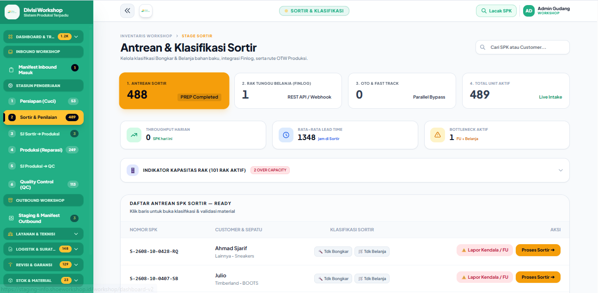

#### Tujuan Fitur:
Mengevaluasi kebutuhan bahan baku, menentukan apakah material tersedia di stok gudang workshop atau harus dibelanjakan ke Finlog, serta menentukan kebutuhan tindakan bongkar lanjutan.

#### Langkah-Langkah Penggunaan:
1. Klik menu **ALUR PROSES PENGERJAAN ➔ 2. Sortir & Penilaian**.
2. Tinjau 4 sub-tab antrean:
   *   **Semua Antrean:** Menampilkan seluruh SPK yang berada di stasiun Sortir.
   *   **Siap Sortir (Ready):** SPK yang stok materialnya telah tersedia dan siap diselesaikan klasifikasinya.
   *   **Waiting Belanja:** SPK yang membutuhkan pengadaan bahan baku ke Finlog.
   *   **Prioritas & Fast Track:** SPK kilat yang wajib didahulukan penyortirannya.
3. Klik tombol **Sortir & Nilai (Icon Pensil)** pada baris SPK untuk membuka formulir penilaian detail.

---

### 5.2 Formulir Klasifikasi Detail Sortir

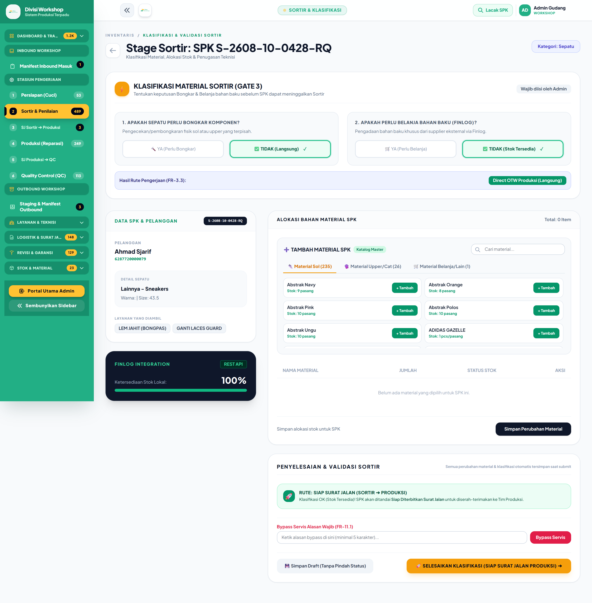

#### Tujuan Fitur:
Menetapkan keputusan teknis terkait pembongkaran, pemilihan bahan baku dari katalog master, dan penentuan rute belanja.

#### Langkah-Langkah Penggunaan:
1. **Keputusan Perlu Bongkar:**
   *   Pilih `✅ TIDAK (Langsung Produksi)` jika sepatu tidak perlu dibongkar lagi.
   *   Pilih `🔨 YA (Perlu Bongkar)` jika sol/upper harus dibongkar terlebih dahulu oleh teknisi bongkar.
2. **Keputusan Perlu Belanja & Alokasi Material:**
   *   Sistem secara cerdas melakukan **Auto-Detect Stok**.
   *   Jika stok bahan tersedia di gudang workshop: Sistem memilih `✅ TIDAK (Stok Tersedia)` dan badge material bertuliskan **`✅ TERSEDIA (ALLOCATED)`**.
   *   Jika stok bahan habis/kurang: Sistem memilih `🛒 YA (Perlu Belanja)` dan badge material bertuliskan **`🛒 PERLU BELANJA (REQUESTED)`**.
3. **Menambah Bahan Baku:** Gunakan kolom pencarian katalog master (*Material Sol, Material Upper, atau Belanja/Lain*), lalu klik **+ Tambah**.
4. **Menyelesaikan Sortir:**
   *   Jika `Perlu Belanja = YA`: Klik **Simpan Klasifikasi Belanja**. SPK ditahan di *Rak Tunggu Belanja* untuk diajukan ke Finlog.
   *   Jika `Perlu Belanja = TIDAK`: Klik **Selesaikan Klasifikasi & Siap Handover**. SPK bertransisi ke lokasi *Sortir (Siap Handover)* untuk diterbitkan Surat Jalan ke Produksi.

---

## BAB 6: MODUL SURAT JALAN SORTIR TO PRODUCTION

### 6.1 Daftar Surat Jalan Sortir ke Produksi

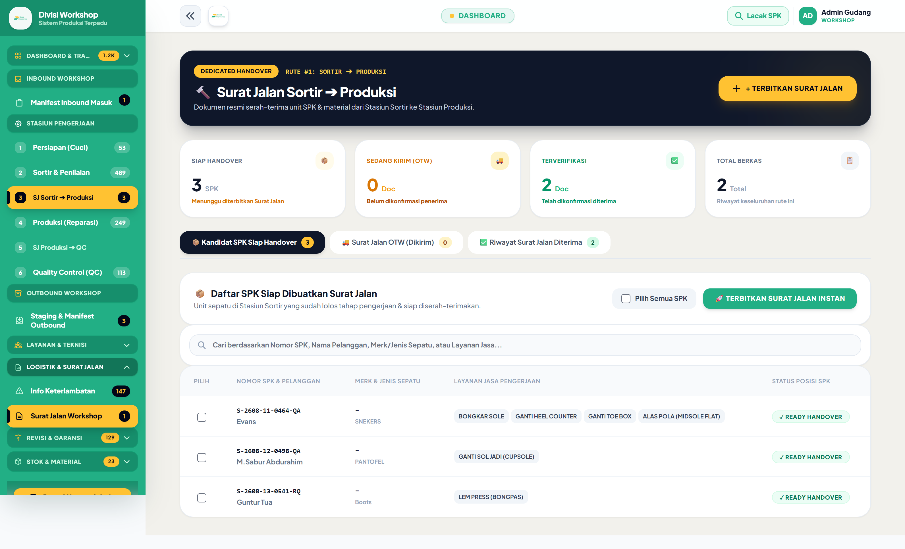

#### Tujuan Fitur:
Mengontrol serah terima fisik batch sepatu dan bahan baku dari admin Sortir kepada penanggung jawab stasiun Produksi secara formal.

#### Langkah-Langkah Penggunaan:
1. Klik menu **ALUR PROSES PENGERJAAN ➔ 3. SJ Sortir ➔ Prod**.
2. Tinjau daftar Surat Jalan yang berstatus `DRAFT`, `DIKIRIM`, atau `DITERIMA`.
3. Klik tombol **Detail** untuk melihat rincian SPK dan bahan baku yang tercakup di dalamnya.
4. Klik tombol **🖨️ Cetak** untuk mencetak fisik Surat Jalan berstandar korporat (lengkap dengan 3 kolom tanda tangan: Pengirim, Pembawa/Kurir, dan Penerima).

---

### 6.2 Pembuatan Dokumen Surat Jalan Sortir ➔ Produksi Baru

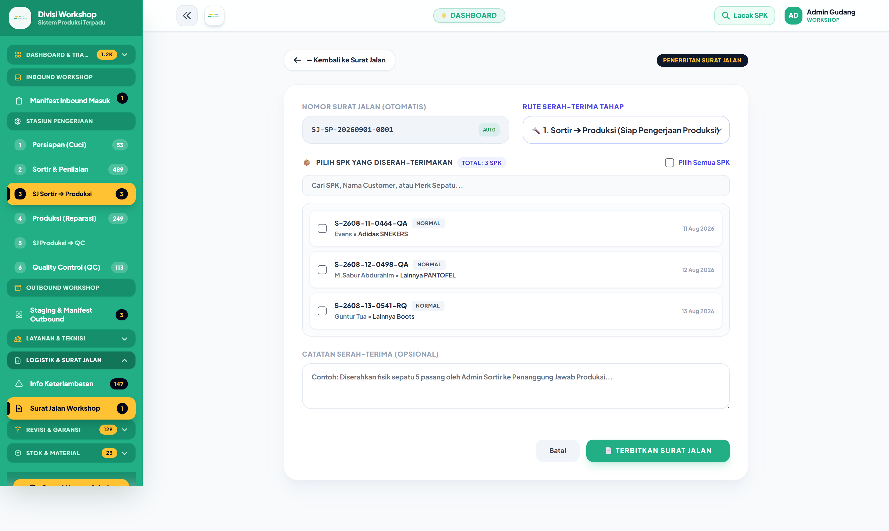

#### Tujuan Fitur:
Memilih SPK yang telah selesai disortir (*Siap Handover*) dan menerbitkan nomor dokumen Surat Jalan baru (`SJ-SP-YYYYMMDD-XXXX`).

#### Langkah-Langkah Penggunaan:
1. Pada halaman daftar Surat Jalan Sortir, klik tombol kuning **`+ Buat Surat Jalan Baru`**.
2. Gunakan *Live Search Bar* untuk memfilter SPK berdasarkan nomor SPK, nama kustomer, atau merk sepatu.
3. Centang kotak pilihan pada SPK yang fisiknya akan diserahkan ke bagian Produksi.
4. Masukkan **Nama Pembawa/Kurir Internal** dan **Catatan Pengiriman** jika ada.
5. Klik tombol hijau **🚀 Terbitkan Surat Jalan Ini**.
6. Dokumen resmi diterbitkan; ketika pihak Produksi mengonfirmasi penerimaan Surat Jalan ini, **seluruh stok bahan baku fisik otomatis dipotong (`KELUAR -1`)** dan SPK resmi memasuki stasiun Produksi.

---

## BAB 7: MODUL PRODUCTION (LINI PRODUKSI REPARASI)

### 7.1 Antrean Masuk Lini Produksi

#### Tujuan Fitur:
Memantau seluruh SPK yang telah diterima dari Sortir dan siap dikerjakan oleh teknisi reparasi.

#### Perbedaan Mendasar Antara Antrean Masuk vs Sedang Dikerjakan:

  <strong>⚠️ PERHATIAN PENTING BAGI KEPALA PRODUKSI:</strong> 
  <ul>
    <li><strong>Antrean Masuk (Belum Mulai):</strong> SPK fisik sudah berada di area workshop Produksi, namun teknisi <em>belum menekan tombol "Mulai"</em> atau pengerjaan stasiun aktif belum berjalan. SPK pada status ini masih berada dalam antrean tunggu.</li>
    <li><strong>Sedang Dikerjakan (In-Progress):</strong> Teknisi <em>telah menekan tombol "Mulai"</em>. Timer waktu pengerjaan sedang berjalan aktif dan sepatu sedang diperbaiki secara fisik di meja kerja teknisi.</li>
  </ul>

#### Langkah-Langkah Penggunaan:
1. Klik menu **ALUR PROSES PENGERJAAN ➔ 4. Stasiun Produksi**.
2. Buka tab **Reparasi (WIP)**.
3. Periksa status stasiun pengerjaan bertahap (*Sequencing*):
   *   **Soling (Reparasi Sol)** ➔ **Upper (Reparasi Jahit/Upper)** ➔ **Treatment (Cuci/Cat Ulang)**.
4. Sistem mengunci stasiun berikutnya sebelum stasiun sebelumnya dinyatakan selesai (misal: Upper tidak bisa dimulai sebelum Soling selesai).
5. Tinjau nama teknisi penanggung jawab pada setiap baris stasiun.

---

### 7.2 Eksekusi Pengerjaan Teknisi (Sedang Dikerjakan)

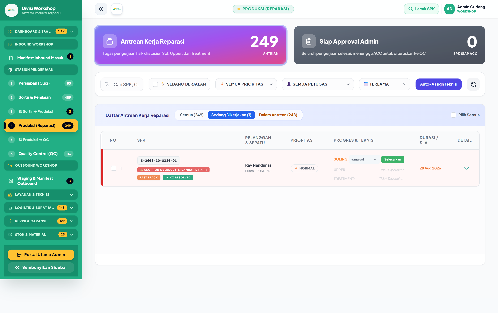

#### Tujuan Fitur:
Memulai, memantau durasi pengerjaan, dan menyelesaikan tindakan reparasi fisik per kategori layanan.

#### Langkah-Langkah Penggunaan:
1. Pada kartu SPK yang ingin dikerjakan, klik tombol **Mulai Pengerjaan** pada stasiun aktif (Soling/Upper/Treatment).
2. Status pengerjaan berubah menjadi warna kuning/biru dengan badge **`SEDANG DIKERJAKAN`**.
3. Jika pengerjaan fisik telah tuntas:
   *   Klik tombol hijau **✓ Selesaikan Stasiun**.
   *   Atau klik tombol cepat **⚡ Selesaikan Stasiun Aktif** untuk menyelesaikan seluruh item pengerjaan stasiun tersebut.
4. Jika seluruh rangkaian stasiun (Sol, Upper, Treatment) telah selesai 100%, SPK otomatis berpindah ke tab **Siap Approval Produksi** dan siap diterbitkan Surat Jalan menuju stasiun Quality Control (QC).

---

## BAB 8: MODUL SURAT JALAN PRODUCTION TO QC

### 8.1 Daftar Surat Jalan Produksi ke QC

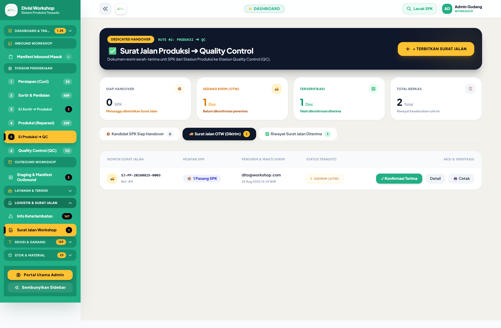

#### Tujuan Fitur:
Mendokumentasikan serah terima batch sepatu yang telah selesai diperbaiki dari Kepala Produksi ke tim QC Inspector.

#### Langkah-Langkah Penggunaan:
1. Klik menu **ALUR PROSES PENGERJAAN ➔ 5. SJ Prod ➔ QC**.
2. Tinjau riwayat Surat Jalan Produksi ke QC (`SJ-PQ-YYYYMMDD-XXXX`).
3. Periksa status pengiriman: `DIKIRIM` (dalam perjalanan ke meja QC) atau `DITERIMA` (sudah diverifikasi oleh staf QC).
4. Klik **Detail** untuk melihat riwayat teknisi yang mengerjakan tiap pasang sepatu.

---

### 8.2 Penerbitan Surat Jalan Produksi ke QC Baru

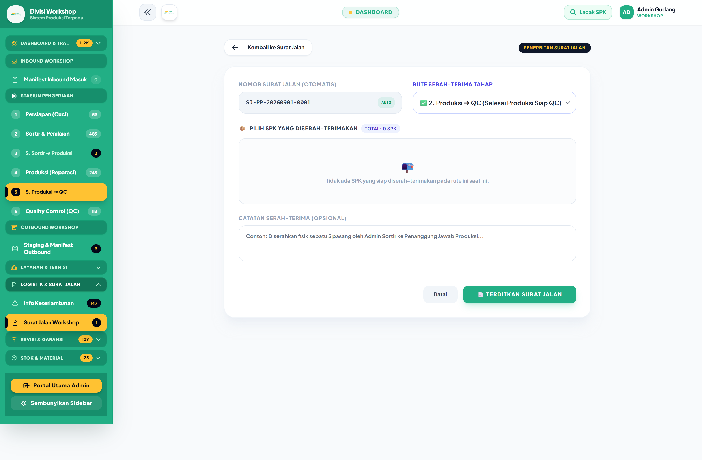

#### Tujuan Fitur:
Mengelompokkan SPK yang telah selesai di tahap Produksi (*Siap Handover ke QC*) menjadi satu dokumen Surat Jalan serah terima.

#### Langkah-Langkah Penggunaan:
1. Klik tombol kuning **`+ Buat Surat Jalan Baru`** pada halaman Surat Jalan Produksi ke QC.
2. Pilih dan centang SPK yang telah tuntas pengerjaan teknisnya.
3. Masukkan nama petugas pembawa dan catatan jika ada perlakuan khusus.
4. Klik tombol **🚀 Terbitkan Surat Jalan Ini**.
5. SPK resmi dialirkan ke gerbang pengawasan mutu stasiun **Quality Control (QC)**.

---

## BAB 9: MODUL QUALITY CONTROL (QC) & PENYELESAIAN

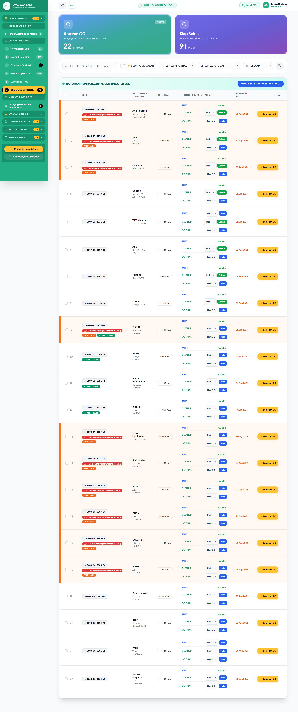

### 9.1 Tujuan Fitur
Memeriksa standar kualitas hasil pengerjaan akhir, melakukan pembersihan sisa lem/benang (*QC Cleanup*), serta menentukan apakah sepatu **Lolos (Pass)** atau harus **Direvisi (Reject/Rework)**.

### 9.2 Langkah-Langkah Penggunaan
1. Klik menu **ALUR PROSES PENGERJAAN ➔ 6. Quality Control (QC)**.
2. Tinjau 3 tahap pemeriksaan QC pada kartu SPK:
   *   **QC Jahit:** Memeriksa kerapian jahitan sol dan upper.
   *   **QC Cleanup:** Membersihkan noda lem, debu, dan sisa pengerjaan.
   *   **QC Final:** Penilaian akhir kelayakan visual dan fungsi sepatu.
3. **Opsi 1 — Master Express Pass (1-Klik Lolos):**
   *   Jika kondisi sepatu sudah sempurna, klik tombol ungu **`⚡ Loloskan QC`**.
   *   Sistem secara otomatis menyelesaikan seluruh sub-tugas QC dan langsung memindahkan SPK ke area **Staging Outbound**.
4. **Opsi 2 — Penugasan Bertahap:**
   *   Pilih nama teknisi/inspektur pada masing-masing dropdown sub-tugas QC.
   *   Klik tombol centang hijau pada masing-masing tahapan setelah diperiksa.
5. **Penanganan Jika Reject (Revisi):**
   *   Jika ditemukan cacat pengerjaan, klik tombol merah **Ajukan Revisi**. Masukkan kendala dan tunjuk stasiun yang bertanggung jawab untuk memperbaiki ulang.

---

## BAB 10: MODUL OUTBOUND & MANIFEST PENGIRIMAN TOKO

### 10.1 Manajemen Staging & Manifest Outbound

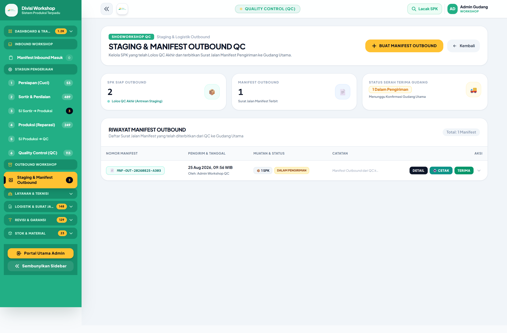

#### Tujuan Fitur:
Mengumpulkan seluruh sepatu yang telah lolos QC Akhir di area staging, dan menerbitkan Surat Jalan Manifest Outbound (`MNF-OUT-YYYYMMDD-XXXX`) untuk dikirim kembali ke Gudang/Toko Utama.

#### Langkah-Langkah Penggunaan:
1. Klik menu **ANTREAN OUTBOUND ➔ 📦 Manifest Outbound (QC)**.
2. Tinjau ringkasan metrik:
   *   **Total SPK Siap Kirim (Staging):** Jumlah sepatu yang menunggu dibuatkan surat jalan.
   *   **Total Manifest Terbit:** Riwayat dokumen pengiriman keluar yang telah dibuat.
3. Klik tombol **Detail** pada riwayat manifest untuk melihat berkas atau mencetak lembar Surat Jalan Outbound format A4 resmi.

---

### 10.2 Pembuatan Manifest Outbound Baru

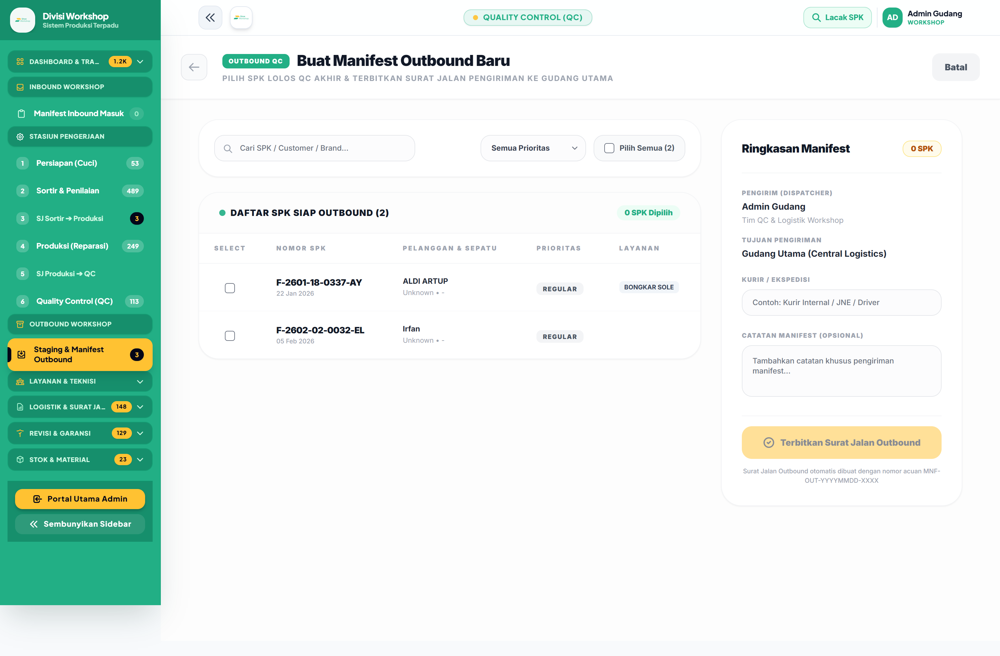

#### Tujuan Fitur:
Memilih sepatu yang siap dikirim pulang, menunjuk kurir logistik pengantar, dan menerbitkan dokumen pengiriman.

#### Langkah-Langkah Penggunaan:
1. Klik tombol kuning **`+ Buat Manifest Outbound`**.
2. Centang seluruh sepatu yang akan dimuat ke kendaraan pengiriman.
3. Pilih **Jenis Ekspedisi / Kurir** (misal: *Driver Internal, Lalamove, JNE, dll*).
4. Masukkan **Nama Driver / Nomor Kendaraan** dan **Catatan Pengiriman**.
5. Klik tombol hijau **🚀 Terbitkan Surat Jalan Outbound**.
6. Fisik sepatu diberangkatkan; Admin Gudang Utama akan menerima notifikasi pada menu *Penerimaan Outbound* untuk mengonfirmasi penerimaan fisik dan menyelesaikan pesanan menjadi **SELESAI**.

---

## BAB 11: MODUL ASISTEN DATA TEKNISI

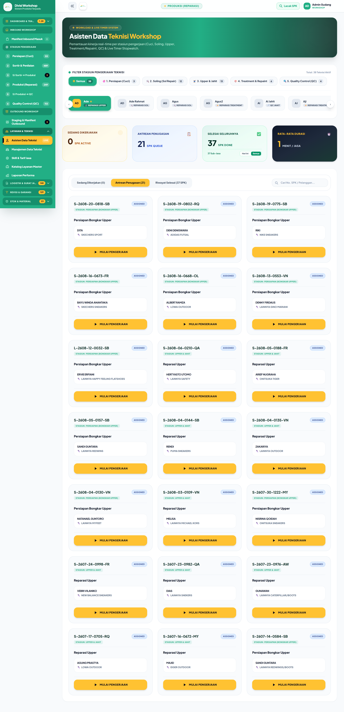

### 11.1 Tujuan Fitur
Menyajikan dashboard analitik beban kerja harian dan performa produktivitas per teknisi secara transparan dan real-time.

### 11.2 Langkah-Langkah Penggunaan
1. Klik menu **LAYANAN & TEKNISI ➔ 📊 Asisten Data Teknisi**.
2. Pilih nama teknisi yang ingin dipantau dari daftar atau gunakan filter tanggal pengerjaan.
3. Tinjau 4 kartu metrik utama:
   *   **Tugas Aktif (Sedang Dikerjakan):** Jumlah sepatu yang saat ini sedang dipegang oleh teknisi.
   *   **Antrean Menunggu:** Jumlah tugas yang telah dialokasikan tetapi belum dimulai.
   *   **SPK Selesai Hari Ini:** Jumlah fisik pasang sepatu unik yang berhasil diselesaikan hari ini.
   *   **Total Sub-Jasa Selesai:** Akumulasi tindakan layanan yang tuntas dikerjakan.
4. Periksa tabel rincian penugasan di bagian bawah untuk melihat detail nomor SPK, jenis tindakan layanan, dan durasi pengerjaan (*Lead Time*).

---

## BAB 12: MODUL MANAJEMEN DATA TEKNISI

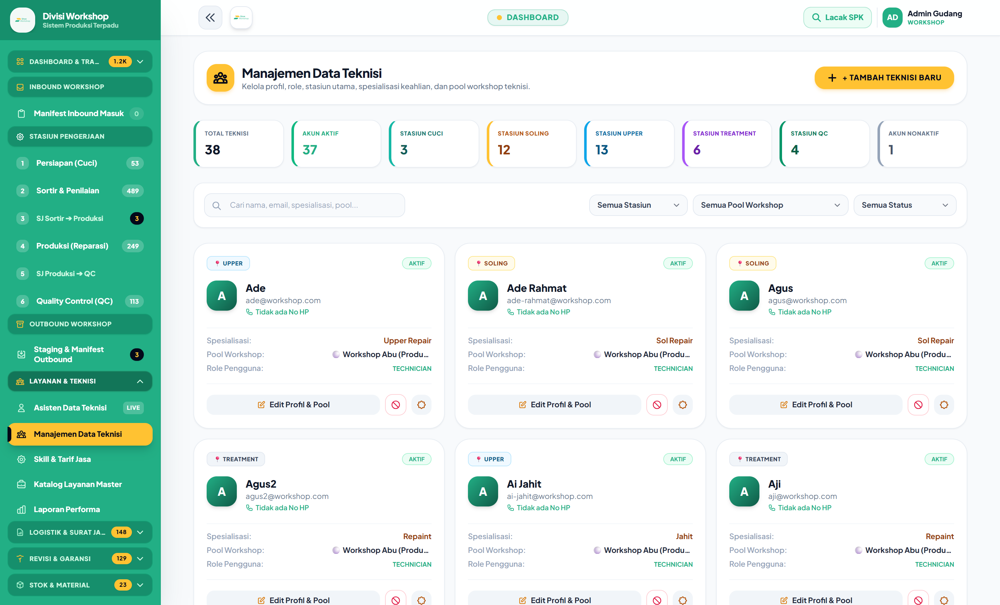

### 12.1 Tujuan Fitur
Mengelola master data akun staf teknisi, menetapkan stasiun penugasan utama, mengatur spesialisasi keahlian, dan menentukan unit pool pengerjaan (*Workshop Hijau* vs *Workshop Abu*).

### 12.2 Langkah-Langkah Penggunaan
1. Klik menu **MASTER DATA ➔ 👥 Manajemen Teknisi** (`/admin/technicians`).
2. Perhatikan 8 kartu statistik distribusi teknisi di bagian atas (Total Teknisi, Teknisi Aktif, Cuci, Soling, Upper, Treatment, QC, dan Nonaktif).
3. **Menambah Teknisi Baru:**
   *   Klik tombol hijau **`+ Tambah Teknisi Baru`**.
   *   Isi Nama Lengkap, Email, Nomor Telepon, dan Password.
   *   Pilih **Stasiun Utama** (`PREPARATION`, `SOLING`, `UPPER`, `TREATMENT`, atau `QC`).
   *   Pilih **Spesialisasi Keahlian** (misal: *Washing, Reparasi Sol, QC Final, dll*).
   *   Pilih **Pool Unit Workshop** (*Workshop Hijau* atau *Workshop Abu*).
   *   Klik **Simpan Data**.
4. **Mengedit / Menonaktifkan Teknisi:**
   *   Klik tombol **Edit (Icon Pensil)** pada baris nama teknisi untuk memperbarui data.
   *   Ubah status menjadi *Nonaktif* jika teknisi cuti/berhenti agar namanya otomatis tidak muncul di dropdown penugasan SPK.

---

## BAB 13: MODUL MANAJEMEN SKILL & MATRIX JASA TEKNISI

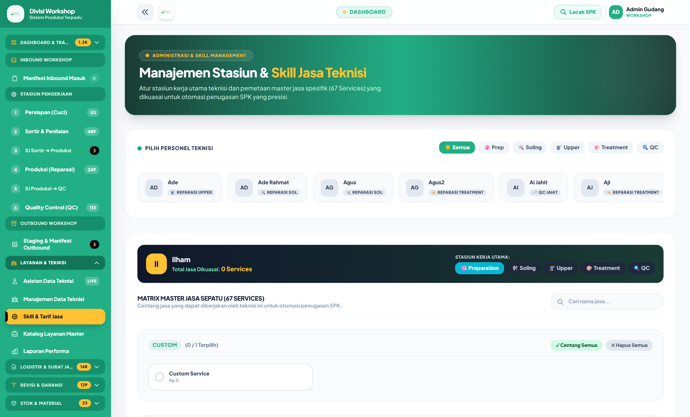

### 13.1 Tujuan Fitur
Mengatur matriks kecocokan (*Skill Matrix*) antara keahlian individu teknisi dengan jenis layanan jasa tertentu dari katalog master. Matriks ini menjadi acuan utama bagi sistem cerdas *Auto-Assign* saat mendistribusikan tugas secara otomatis.

### 13.2 Langkah-Langkah Penggunaan
1. Klik menu **LAYANAN & TEKNISI ➔ 🎯 Matrix Skill Teknisi** (`/admin/technician-skills`).
2. Tabel menyajikan daftar seluruh layanan jasa di kolom kiri dan daftar nama-nama teknisi di kolom baris kanan.
3. **Mengaktifkan Keahlian:**
   *   Centang kotak (*checkbox*) pada pertemuan antara baris Jasa dan kolom Nama Teknisi jika teknisi tersebut kompeten mengerjakan jasa tersebut.
   *   Hilangkan centang jika teknisi tidak diperbolehkan menerima pesanan jasa tersebut.
4. **Penerapan Otomatis:** Perubahan tersimpan secara instan. Ketika ada SPK baru yang memuat jasa tersebut, sistem hanya akan merekomendasikan teknisi yang memiliki tanda centang aktif pada matriks ini.

---

## 🏁 KESIMPULAN & TIPS OPERASIONAL

1. **Disiplin Surat Jalan:** Pastikan setiap perpindahan fisik sepatu antar stasiun selalu disertai dengan penerbitan dan konfirmasi penerimaan Surat Jalan resmi di sistem agar pelacakan lokasi selalu akurat.
2. **Pengecekan Stok Real-Time:** Manfaatkan fitur *Auto-Detect Stok* di stasiun Sortir untuk meminimalkan pengajuan belanja yang tidak perlu jika bahan baku sebenarnya masih tersedia di gudang workshop.
3. **Penyelesaian QC 1-Klik:** Gunakan fitur `⚡ Loloskan QC` untuk mempercepat proses pelepasan sepatu ke area staging outbound jika standar kualitas pengerjaan telah terpenuhi 100%.

*Buku panduan ini disusun sebagai pedoman resmi operasional Sistem Workshop ShoeWorkshop.* 🙏
