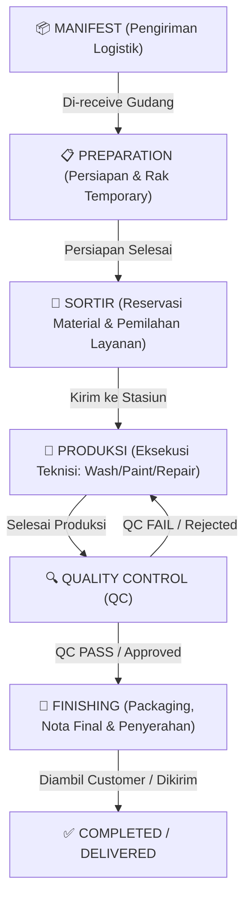

# 🛠️ DOKUMENTASI ARSITEKTUR & ALUR SISTEM WORKSHOP
**Sistem Operational Workshop (Divisi Workshop & Gudang)**  
*Dokumentasi Teknis Komprehensif Arsitektur MVC, Livewire, Model Data, Controller, View, dan Transisi Status WorkOrder.*

---

## 📐 1. DIAGRAM ALUR KERJA UTAMA (END-TO-END WORKFLOW)

---

## 🚛 2. TAHAP 1: MANIFEST (Pengiriman & Logistik Inter-Branch)

### 📌 Fungsi Utama & Tujuan
Tahap **Manifest** bertugas mengelola pengiriman kolektif sepatu antar cabang, outlet penerimaan, dan gudang pusat/workshop utama. Manifes ini memastikan pelacakan fisik barang (*chain of custody*) tercatat secara akurat dari titik pengiriman hingga titik penerimaan.

### 🗄️ Model (Database Entities & Relasi)
- **`App\Models\WorkshopManifest`**: Menyimpan header manifes (`manifest_code`, `origin_branch_id`, `destination_branch_id`, `driver_name`, `status`, `shipped_at`, `received_at`).
- **`App\Models\Shipping`**: Menyimpan informasi ekspedisi pengiriman/kurir.
- **`App\Models\WorkOrder`**: Terhubung via `manifest_id` untuk mendata daftar pasang sepatu yang berada di dalam paket manifes tersebut.

### 🎮 Controller & Routes
- **Controller**: `App\Http\Controllers\WorkshopManifestController.php`, `App\Http\Controllers\ShippingController.php`
- **Routes Prefix**: `/manifest` & `/shipping`
  - `GET /manifest` -> `WorkshopManifestController@index` (Menampilkan daftar manifes aktif)
  - `GET /manifest/create` -> `WorkshopManifestController@create` (Form pembutan manifes baru)
  - `POST /manifest` -> `WorkshopManifestController@store` (Menyimpan data manifes & mendaftarkan WO)
  - `GET /manifest/{id}` -> `WorkshopManifestController@show` (Detail manifes & tombol Cetak Surat Jalan)
  - `POST /manifest/{id}/receive` -> `WorkshopManifestController@receive` (Penerimaan manifes di lokasi tujuan)

### 🖥️ Views & Komponen UI
- `resources/views/manifest/index.blade.php`: Tabel manifes aktif dengan status pengiriman.
- `resources/views/manifest/create.blade.php`: Form pencarian & penambahan Work Order ke manifes.
- `resources/views/manifest/show.blade.php`: Tampilan cetak Surat Jalan Manifes kontras tinggi monokrom `#000000` dengan kotak TTD sejajar Kiri-Kanan.

---

## 📋 3. TAHAP 2: PREPARATION (Persiapan & Alokasi Rak Storage)

### 📌 Fungsi Utama & Tujuan
Tahap **Preparation** berfungsi sebagai stasiun penerimaan awal di area workshop. Tim Preparation melakukan verifikasi kondisi fisik sepatu yang masuk dari manifes, pembersihan dasar awal (*pre-wash* jika diperlukan), dan penempatan sepatu pada **Rak Penyimpanan Temporary** (`StorageRack`) sebelum dipilah oleh tim Sortir.

### 🗄️ Model (Database Entities & Relasi)
- **`App\Models\WorkOrder`**: Status berubah menjadi `PREPARATION`.
- **`App\Models\StorageRack`**: Data master rak & kompartemen penyimpanan.
- **`App\Models\StorageAssignment`**: Relasi historis alokasi unit sepatu pada rak tertentu (`work_order_id`, `storage_rack_id`, `assigned_at`, `removed_at`).
- **`App\Models\ManualStorageItem`**: Rak khusus penyimpanan manual.

### 🎮 Controller, Livewire & Routes
- **Controller & Livewire**: `App\Livewire\Preparation\PrepIndex`, `App\Http\Controllers\PreparationController.php`
- **Routes Prefix**: `/preparation`
  - `GET /preparation` -> `PrepIndex` (Dashboard stasiun preparation dengan filter rak & status)
  - `GET /preparation/{id}` -> `PreparationController@show` (Detail inspeksi persiapan)
  - `POST /preparation/{id}/update-station` -> `PreparationController@updateStation` (Ubah sub-stasiun preparation)
  - `POST /preparation/{id}/finish` -> `PreparationController@finish` (Selesaikan tahap preparation -> pindah ke Sortir)

### 🖥️ Views & Komponen UI
- `resources/views/livewire/preparation/prep-index.blade.php`: Tampilan grid kartu unit yang sedang diproses di stasiun Preparation.
- `resources/views/preparation/show.blade.php`: Detail checklist fisik awal dan alokasi kode rak.

---

## 🎨 4. TAHAP 3: SORTIR (Material Reservation & Alokasi Layanan Teknisi)

### 📌 Fungsi Utama & Tujuan
Tahap **Sortir** adalah titik krusial dalam pemilahan teknis. Di tahap ini, supervisor workshop atau tim sortir memeriksa rincian SPK, menentukan spesifikasi bahan kimia/material yang akan digunakan (`MaterialReservation`), menambahkan layanan penyesuaian jika ditemukan kondisi khusus pada sepatu, serta menunjuk teknisi penanggung jawab (Spesialis Washing, Repaint, Sol, Sewing).

### 🗄️ Model (Database Entities & Relasi)
- **`App\Models\WorkOrder`**: Status berubah menjadi `SORTIR`.
- **`App\Models\Material`**: Master stok bahan kimia, cat, lem, dan sparepart workshop.
- **`App\Models\MaterialReservation`**: Data alokasi kebutuhan bahan per unit sepatu (`work_order_id`, `material_id`, `quantity`, `reserved_at`).
- **`App\Models\Service`**: Master jenis layanan workshop (Deep Clean, Unglue/Reglue, Repaint Upper, Soling, Midsole Touchup).

### 🎮 Controller, Livewire & Routes
- **Controller & Livewire**: `App\Livewire\Sortir\Index`, `App\Livewire\Sortir\Detail`, `App\Http\Controllers\SortirController.php`
- **Routes Prefix**: `/sortir`
  - `GET /sortir` -> `Sortir\Index` (List antrean unit yang membutuhkan sortir)
  - `GET /sortir/{id}` -> `Sortir\Detail` (Form interaktif alokasi teknisi & reservasi material)
  - `POST /sortir/{id}/add-material` -> `SortirController@addMaterial` (Reservasi bahan baku)
  - `POST /sortir/{id}/finish` -> `SortirController@finish` (Selesai sortir -> Pindah ke Produksi)

### 🖥️ Views & Komponen UI
- `resources/views/livewire/sortir/index.blade.php`: Daftar antrean unit dengan status prioritas (Fast Track / Reguler).
- `resources/views/livewire/sortir/detail.blade.php`: Modal pencarian material, alokasi teknisi, dan preview instruksi khusus SPK.

---

## 🔧 5. TAHAP 4: PRODUKSI (Eksekusi Stasiun Pengerjaan Teknisi)

### 📌 Fungsi Utama & Tujuan
Tahap **Produksi** adalah area eksekusi fisik perbaikan dan perawatan oleh para teknisi spesialis. Pengerjaan dibagi berdasarkan stasiun keahlian:
1. **Washing Station**: Pencucian khusus (Deep Clean, Unyellowing, Material Care).
2. **Repaint Station**: Repaint, Recoloring, dan Leather Dyeing.
3. **Repair & Soling Station**: Reglue, Stitching, Replacement Sol, Repair Leather/Mesh.

Teknisi wajib mengunggah foto *Before & Progress*, serta dapat mengajukan pengeluaran stok material tambahan (`MaterialRequest`) jika bahan yang direservasi kurang.

### 🗄️ Model (Database Entities & Relasi)
- **`App\Models\WorkOrder`**: Status `PRODUCTION`.
- **`App\Models\WorkOrderService`**: Status progres pengerjaan per item layanan pada sepatu.
- **`App\Models\WorkOrderPhoto`**: Menyimpan foto resolusi tinggi (`BEFORE`, `PROGRESS`, `AFTER`) yang diunggah teknisi.
- **`App\Models\MaterialRequest`**: Pengajuan bahan tambahan ke gudang saat proses produksi berlangsung.

### 🎮 Controller, Livewire & Routes
- **Controller & Livewire**: `App\Livewire\Production\StationIndex`, `App\Http\Controllers\ProductionController.php`, `App\Http\Controllers\ProductionLateController.php`
- **Routes Prefix**: `/production`
  - `GET /production` -> `StationIndex` (Papan Kanban stasiun produksi per teknisi)
  - `POST /production/{id}/update-station` -> `ProductionController@updateStation` (Pindah stasiun pengerjaan)
  - `POST /production/{id}/finish` -> `ProductionController@finish` (Selesaikan pengerjaan teknisi -> Pindah ke QC)
  - `GET /production/late-info` -> `ProductionLateController` (Monitoring keterlambatan pengerjaan SLA)

### 🖥️ Views & Komponen UI
- `resources/views/livewire/production/station-index.blade.php`: Papan stasiun produksi responsif dengan kompartemen foto progress & stopwatch timer waktu kerja.

---

## 🔍 6. TAHAP 5: QC (Quality Control & Penilaian Kualitas)

### 📌 Fungsi Utama & Tujuan
Tahap **Quality Control (QC)** bertugas menjamin bahwa setiap hasil pengerjaan teknisi telah 100% memenuhi standar kualitas dan sesuai dengan instruksi SPK customer.
- **QC PASS (Approved)**: Unit lulus inspeksi, foto final diunggah, dan status dikirim ke **FINISHING**.
- **QC FAIL (Rejected/Revisi)**: Unit tidak lulus inspeksi (misal: lem kurang merekat, warna belum rata, terdapat noda tersisa). Dibuatkan tiket **`WorkOrderRevision`** dan dikembalikan (*reject*) ke stasiun Produksi teknisi bersangkutan.

### 🗄️ Model (Database Entities & Relasi)
- **`App\Models\WorkOrder`**: Status `QC`.
- **`App\Models\WorkOrderPhoto`**: Mengunggah foto hasil akhir *AFTER* kualitas HD.
- **`App\Models\WorkOrderRevision`**: Catatan revisi teknis (`work_order_id`, `rejected_by`, `reason`, `target_station`, `resolved_at`).
- **`App\Models\MasterIssue`**: Master kategori kendala kualitas (noda, lem lepas, warna belang, dll.).

### 🎮 Controller, Livewire & Routes
- **Controller & Livewire**: `App\Livewire\Qc\QcIndex`, `App\Http\Controllers\QCController.php`
- **Routes Prefix**: `/qc`
  - `GET /qc` -> `QcIndex` (Daftar antrean unit siap di-QC)
  - `GET /qc/{id}` -> `QCController@show` (Halaman checklist detail kelayakan QC)
  - `POST /qc/{id}/pass` -> `QCController@pass` (Loloskan unit -> Lanjut ke Finishing)
  - `POST /qc/{id}/fail` -> `QCController@fail` (Tolak unit -> Buat revisi dan kembalikan ke Produksi)

### 🖥️ Views & Komponen UI
- `resources/views/livewire/qc/qc-index.blade.php`: Daftar antrean inspeksi QC dengan indikator riwayat revisi.
- `resources/views/qc/show.blade.php`: Tampilan perbandingan foto *BEFORE vs AFTER* dan form checklist lulus QC.

---

## 🎁 7. TAHAP 6: FINISHING (Packaging, Nota Final, Rak Siap Ambil & Penyerahan)

### 📌 Fungsi Utama & Tujuan
Tahap **Finishing** merupakan stasiun akhir di workshop sebelum unit diserahkan kepada customer.
1. **Quality Touchup & Fragrance**: Pemberian parfum khusus sepatu, silica gel, dan packaging rapi (plastik/box/goodiebag).
2. **Invoice Finalization & WhatsApp Notification**: Menerbitkan Invoice/Nota Final dan mengirimkan pemberitahuan otomatis ke customer via WA bahwa sepatu sudah siap diambil (`READY_FOR_DELIVERY`).
3. **Rak Siap Ambil (Finish Storage)**: Memindahkan unit ke rak penyimpanan siap ambil.
4. **Handover (Pickup / Delivery)**: Menyerahkan sepatu langsung kepada customer (*Pickup*) atau menyerahkan ke kurir pengiriman (*Delivery*), menerbitkan garansi pengerjaan (`WorkOrderWarranty`), serta memperbarui status menjadi **`DELIVERED`** atau **`COMPLETED`**.

### 🗄️ Model (Database Entities & Relasi)
- **`App\Models\WorkOrder`**: Status `FINISHING` -> `READY_FOR_DELIVERY` -> `DELIVERED` / `COMPLETED`.
- **`App\Models\Invoice`**: Data penagihan final & riwayat pembayaran.
- **`App\Models\WorkOrderWarranty`**: Sertifikat garansi pengerjaan yang diterbitkan untuk customer.
- **`App\Models\OTO`**: Penawaran OTO (One Time Offer) perawatan rutin berkala untuk customer.

### 🎮 Controller, Livewire & Routes
- **Controller & Livewire**: `App\Http\Controllers\FinishController.php`, `App\Livewire\Admin\FinishCleanup`
- **Routes Prefix**: `/finish`
  - `GET /finish` -> `FinishController@index` (Dashboard unit siap finishing & siap ambil)
  - `GET /finish/{id}` -> `FinishController@show` (Detail nota, garansi & opsi pengiriman)
  - `POST /finish/{id}/pickup` -> `FinishController@pickup` (Proses serah terima ambil langsung)
  - `POST /finish/{id}/pickup-delivery` -> `FinishController@pickupForDelivery` (Proses serah terima ke kurir pengiriman)
  - `POST /finish/{id}/send-email` -> `FinishController@sendEmail` (Kirim nota & garansi via Email/WA)

### 🖥️ Views & Komponen UI
- `resources/views/finish/index.blade.php`: Dashboard penyelesaian unit, pencarian kode rak siap ambil, dan filter belum bayar/lunas.
- `resources/views/finish/show.blade.php`: Rincian pembayaran, tombol cetak nota, tombol terbit garansi, dan serah terima customer.

---

## 📑 8. RINGKASAN REKAPITULASI STATUS WORK ORDER ENUM (`WorkOrderStatus`)

| Status Code | Nama Tahap / Stasiun | Deskripsi Perjalanan Unit | Akses Controller |
| :--- | :--- | :--- | :--- |
| `SPK_PENDING` | Logistik & Input | SPK dibuat oleh CS, fisik sepatu belum tiba di gudang. | `CsSpkController` |
| `DITERIMA` | Gudang Reception | Paket fisik sepatu diterima & di-scan oleh tim gudang. | `ReceptionController` |
| `PREPARATION` | Preparation Workshop | Sepatu disiapkan, cuci dasar awal, dan ditaruh di Rak Storage. | `PreparationController` |
| `SORTIR` | Pemilahan & Material | Pemilahan jenis servis, reservasi bahan baku, dan alokasi teknisi. | `SortirController` |
| `PRODUCTION` | Stasiun Produksi | Teknisi mengerjakan cuci/repaint/repair & upload foto progress. | `ProductionController` |
| `QC` | Quality Control | Penilaian standar kualitas. Jika lulus -> Finish, jika tidak -> Revisi. | `QCController` |
| `FINISHING` | Packaging & Nota | Pemberian parfum, packaging, penerbitan invoice & notifikasi WA. | `FinishController` |
| `READY_FOR_DELIVERY` | Rak Siap Ambil | Sepatu sudah siap diambil customer / siap dikirim via kurir. | `FinishController` |
| `DELIVERED` / `COMPLETED` | Selesai | Sepatu telah diserahkan ke customer & garansi aktif. | `FinishController` |
| `BATAL` | Batal / Cancel | Transaksi dibatalkan / masuk ke daftar hapus. | `OrderController` |

---

*Dokumentasi ini dibuat secara otomatis pada tanggal 08 Agustus 2026 berdasarkan struktur codebase aktif `SistemWorkshop`.*
