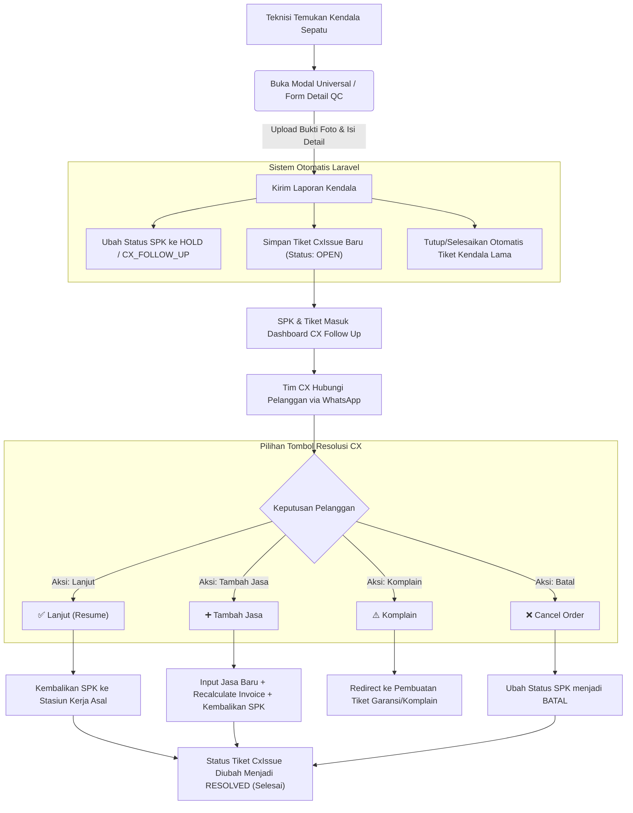

# Panduan & Alur Kerja Kendala Pelanggan (CX Issues & Follow-Up Guide)

Dokumen ini menjelaskan secara menyeluruh tentang bagaimana kendala pengerjaan sepatu (**CX Issue**) dilaporkan oleh tim workshop/gudang, modal-modal formulir yang digunakan, alur perjalanan datanya, hingga tindakan penyelesaian yang dilakukan oleh tim Customer Experience (CX) di halaman follow-up.

---

## 1. Sumber Data & Kategori Kendala (Asal Laporan)

Sistem secara otomatis mengidentifikasi stasiun kerja asal laporan berdasarkan status pengerjaan sepatu saat tombol lapor diklik:

| Sumber Data (Source) | Stasiun Kerja Terkait | Penjelasan Kondisi |
| :--- | :--- | :--- |
| **`WORKSHOP_SORTIR`** | Stasiun Sortir | Kendala fisik yang ditemukan saat penerimaan & pemilahan sepatu awal. |
| **`WORKSHOP_PREP`** | Stasiun Preparation | Kendala pada tahap persiapan/pencucian awal (noda membandel, material rapuh, dll). |
| **`WORKSHOP_PROD`** | Stasiun Production | Masalah selama pengerjaan utama (pencucian, lem sol, jahit upper). |
| **`WORKSHOP_QC`** | Stasiun Quality Control | Sepatu tidak lulus pemeriksaan kualitas akhir dan butuh konfirmasi pelanggan. |
| **`GUDANG`** | Gudang Penerimaan | Masalah pada barang yang baru datang (belum/masuk pemeriksaan). |
| **`MANUAL`** | Di luar stasiun kerja | Input langsung atau penanganan kendala umum lainnya. |

---

## 2. Modal & Formulir Pengaduan Kendala

Terdapat dua antarmuka formulir yang digunakan oleh tim lapangan untuk mengirim laporan ke tim CX:

### A. Modal Lapor Kendala Universal (`report-modal.blade.php`)
Digunakan hampir di seluruh dashboard stasiun kerja (**Sortir, Prep, Prod, QC, Finish, Assessment**).
* **Kategori Masalah:** 
  * **Teknis, Material, Konfirmasi:** Petugas memilih kendala & opsi solusi dari basis data master (disediakan opsi "Lainnya" untuk mengetik bebas) dan mengunggah foto bukti fisik.
  * **Overload:** Digunakan jika workshop sangat antre; petugas mengusulkan **Tanggal Estimasi Selesai Baru** untuk persetujuan CX.

### B. Formulir Khusus Detail QC (`qc/show.blade.php`)
Terletak permanen pada panel kanan halaman rincian detail Quality Control.
* **Isi Formulir:** Memilih kategori kendala (Teknis, Material, Waktu, Tambah Jasa, Lainnya), menulis deskripsi keluhan secara bebas, dan wajib mengunggah foto bukti fisik.

---

## 3. Diagram Alur Kerja Keseluruhan (End-to-End)

---

## 4. Panduan Aksi Tombol Resolusi pada Dashboard CX

Saat tim CX membuka dashboard [Antrean CX Follow Up](file:///c:/laragon/www/SistemWorkshop/resources/views/livewire/cx/index.blade.php), berikut adalah rincian fungsional tombol resolusi:

### 🟢 A. Tombol `✅ Lanjut (Resume)`
* **Tujuan:** Melanjutkan pengerjaan sepatu tanpa mengubah isi layanan awal.
* **Proses Latar Belakang:**
  * **Status SPK:** Dikembalikan ke stasiun kerja asalnya (misal: jika dari `WORKSHOP_PREP` dikembalikan ke `PREPARATION`). Jika asal stasiun dari `GUDANG`, sepatu otomatis didorong ke `ASSESSMENT`.
  * **Catatan Workshop:** Kolom catatan resolusi dari CX otomatis ditempel ke **Catatan Catatan Teknisi** (`[CX]: <catatan_resolusi>`).
  * **Tanggal:** Memperbarui tanggal selesai estimasi pengerjaan jika diisi.
  * **Tiket Kendala:** Status `CxIssue` diubah dari `OPEN` menjadi `RESOLVED`.

### 🔵 B. Tombol `➕ Tambah Jasa`
* **Tujuan:** Memasukkan layanan pengerjaan tambahan baru yang disetujui pelanggan (misal: penambahan jahit sol / cuci premium).
* **Proses Latar Belakang:**
  * **Penyimpanan Jasa:** Menyimpan layanan baru ke database dengan status awal `'pending'` dan detail catatan dimasukkan sebagai catatan pengerjaan (NB) di cetakan SPK.
  * **Hitung Ulang Tagihan:** Sistem memanggil fungsi kalkulasi ulang untuk memperbarui nominal total transaksi pada invoice/nota pembayaran.
  * **Alur Status SPK:**
    * Jika kendala berasal dari **Gudang**: SPK dialihkan ke stasiun **Assessment**.
    * Jika SPK di luar workshop dan status pembayaran **Belum Lunas**: SPK dipindahkan ke status **Waiting Payment** untuk penagihan.
    * Jika normal/lunas: Dikembalikan ke stasiun pengerjaan asalnya agar jasa tambahan baru langsung diproses oleh teknisi.
  * **Tiket Kendala:** Status `CxIssue` diubah menjadi `RESOLVED`.

### 🟡 C. Tombol `⚠️ Komplain`
* **Tujuan:** Menangani klaim garansi atau keluhan tidak puas dari pelanggan setelah pengerjaan selesai.
* **Proses Latar Belakang:**
  * Sistem langsung mengarahkan (*redirect*) halaman browser ke formulir pembuatan komplain/klaim garansi resmi (`admin.complaints.create`) dengan menyertakan nomor SPK terkait.

### 🔴 D. Tombol `❌ Cancel Order`
* **Tujuan:** Membatalkan transaksi pengerjaan sepatu atas permintaan/kesepakatan pelanggan.
* **Proses Latar Belakang:**
  * **Status SPK:** Status pengerjaan sepatu langsung diubah menjadi **BATAL** (`WorkOrderStatus::BATAL`).
  * **Tiket Kendala:** Status `CxIssue` diubah menjadi `RESOLVED`.
  * **Audit Log:** Mencatat log riwayat transaksi batal ke database.
