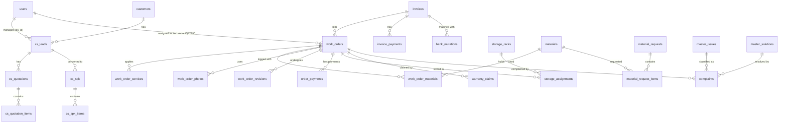

# 🗄️ Mapping Database & Hubungan Relasi Tabel - Sistem Workshop Sepatu

Dokumen ini menyediakan spesifikasi lengkap, rinci, dan terstruktur mengenai seluruh database **Sistem Workshop Sepatu** (ERP & CRM). Sistem ini menggunakan database **MySQL** dengan total **58 tabel** yang dikelompokkan ke dalam 6 divisi/domain fungsional.

## 📊 Ringkasan Statistik Database
- **Database Engine:** MySQL / InnoDB
- **Total Divisi/Domain:** 6 Modul
- **Total Tabel:** 58 Tabel
- **Core Entity:** `work_orders` & `invoices` (Single Source of Truth)

## 🗺️ Skema Relasi Entitas Utama (Mermaid ERD)
Berikut adalah visualisasi hubungan relasi antar entitas utama di dalam database:

---

## 1. Core & User Authentication
> Tabel-tabel dasar framework Laravel dan otorisasi pengguna.

### 📋 Tabel: `users`
**Deskripsi & Fungsi:** Menyimpan data pengguna (staf, admin, teknisi, CS) beserta peran dan password hash.

#### 🔹 Kolom & Spesifikasi
| Nama Kolom | Tipe Data | Nullable | Default | Key | Extra | Keterangan/Fungsi Kolom |
| :--- | :--- | :--- | :--- | :--- | :--- | :--- |
| `id` | `bigint unsigned` | `NO` | *NULL* | `PRI` | `auto_increment` | ID unik auto-increment (Primary Key) |
| `name` | `varchar(191)` | `NO` | *NULL* | `-` | `-` | Nama lengkap entitas atau item |
| `cs_code` | `varchar(3)` | `YES` | *NULL* | `-` | `-` | 3 letter code for CS/SPK |
| `email` | `varchar(191)` | `NO` | *NULL* | `UNI` | `-` | Alamat email aktif |
| `email_verified_at` | `timestamp` | `YES` | *NULL* | `-` | `-` | Waktu user melakukan verifikasi alamat email |
| `password` | `varchar(191)` | `NO` | *NULL* | `-` | `-` | Hash sandi keamanan pengguna |
| `role` | `varchar(191)` | `NO` | `user` | `-` | `-` | Hak akses peran pengguna (admin, cs, technician, warehouse, finance, cx, dll) |
| `access_rights` | `text` | `YES` | *NULL* | `-` | `-` | Hak akses spesifik tambahan / permission list dalam format teks/JSON |
| `specialization` | `varchar(191)` | `YES` | *NULL* | `-` | `-` | Spesialisasi teknisi (misal: Sol, Upper, Painting, Cleaning) |
| `phone` | `varchar(191)` | `YES` | *NULL* | `-` | `-` | Nomor telepon / kontak WhatsApp |
| `remember_token` | `varchar(100)` | `YES` | *NULL* | `-` | `-` | Token pengingat otentikasi sesi (Remember Me) |
| `created_at` | `timestamp` | `YES` | *NULL* | `-` | `-` | Waktu stempel tanggal data ini pertama kali dibuat |
| `updated_at` | `timestamp` | `YES` | *NULL* | `-` | `-` | Waktu stempel tanggal data ini terakhir kali diperbarui |

#### 🔑 Indeks / Indexing
| Nama Indeks | Unik | Kolom |
| :--- | :--- | :--- |
| `PRIMARY` | `YA` | `id` |
| `users_email_unique` | `YA` | `email` |

---

### 📋 Tabel: `sessions`
**Deskripsi & Fungsi:** Menyimpan sesi aktif pengguna di web browser.

#### 🔹 Kolom & Spesifikasi
| Nama Kolom | Tipe Data | Nullable | Default | Key | Extra | Keterangan/Fungsi Kolom |
| :--- | :--- | :--- | :--- | :--- | :--- | :--- |
| `id` | `varchar(191)` | `NO` | *NULL* | `PRI` | `-` | ID unik auto-increment (Primary Key) |
| `user_id` | `bigint unsigned` | `YES` | *NULL* | `MUL` | `-` | ID Pengguna terkait (Relasi ke tabel `users`) |
| `ip_address` | `varchar(45)` | `YES` | *NULL* | `-` | `-` | Alamat IP pengguna saat melakukan akses |
| `user_agent` | `text` | `YES` | *NULL* | `-` | `-` | Browser user agent pengguna saat mengakses |
| `payload` | `longtext` | `NO` | *NULL* | `-` | `-` | Data detail payload sesi / isi data |
| `last_activity` | `int` | `NO` | *NULL* | `MUL` | `-` | Timestamp aktivitas terakhir yang dilakukan |

#### 🔑 Indeks / Indexing
| Nama Indeks | Unik | Kolom |
| :--- | :--- | :--- |
| `PRIMARY` | `YA` | `id` |
| `sessions_user_id_index` | `TIDAK` | `user_id` |
| `sessions_last_activity_index` | `TIDAK` | `last_activity` |

---

### 📋 Tabel: `password_reset_tokens`
**Deskripsi & Fungsi:** Menyimpan token untuk reset kata sandi pengguna.

#### 🔹 Kolom & Spesifikasi
| Nama Kolom | Tipe Data | Nullable | Default | Key | Extra | Keterangan/Fungsi Kolom |
| :--- | :--- | :--- | :--- | :--- | :--- | :--- |
| `email` | `varchar(191)` | `NO` | *NULL* | `PRI` | `-` | Alamat email aktif |
| `token` | `varchar(191)` | `NO` | *NULL* | `-` | `-` | Data teks singkat berupa token |
| `created_at` | `timestamp` | `YES` | *NULL* | `-` | `-` | Waktu stempel tanggal data ini pertama kali dibuat |

#### 🔑 Indeks / Indexing
| Nama Indeks | Unik | Kolom |
| :--- | :--- | :--- |
| `PRIMARY` | `YA` | `email` |

---

### 📋 Tabel: `migrations`
**Deskripsi & Fungsi:** Mencatat riwayat eksekusi migrasi database Laravel.

#### 🔹 Kolom & Spesifikasi
| Nama Kolom | Tipe Data | Nullable | Default | Key | Extra | Keterangan/Fungsi Kolom |
| :--- | :--- | :--- | :--- | :--- | :--- | :--- |
| `id` | `int unsigned` | `NO` | *NULL* | `PRI` | `auto_increment` | ID unik auto-increment (Primary Key) |
| `migration` | `varchar(191)` | `NO` | *NULL* | `-` | `-` | Data teks singkat berupa migration |
| `batch` | `int` | `NO` | *NULL* | `-` | `-` | Data angka integer batch |

#### 🔑 Indeks / Indexing
| Nama Indeks | Unik | Kolom |
| :--- | :--- | :--- |
| `PRIMARY` | `YA` | `id` |

---

### 📋 Tabel: `failed_jobs`
**Deskripsi & Fungsi:** Mencatat antrean job queue yang gagal diproses.

#### 🔹 Kolom & Spesifikasi
| Nama Kolom | Tipe Data | Nullable | Default | Key | Extra | Keterangan/Fungsi Kolom |
| :--- | :--- | :--- | :--- | :--- | :--- | :--- |
| `id` | `bigint unsigned` | `NO` | *NULL* | `PRI` | `auto_increment` | ID unik auto-increment (Primary Key) |
| `uuid` | `varchar(191)` | `NO` | *NULL* | `UNI` | `-` | Universally Unique Identifier unik (UUID) |
| `connection` | `text` | `NO` | *NULL* | `-` | `-` | Kolom data connection |
| `queue` | `text` | `NO` | *NULL* | `-` | `-` | Kolom data queue |
| `payload` | `longtext` | `NO` | *NULL* | `-` | `-` | Data detail payload sesi / isi data |
| `exception` | `longtext` | `NO` | *NULL* | `-` | `-` | Kolom data exception |
| `failed_at` | `timestamp` | `NO` | `CURRENT_TIMESTAMP` | `-` | `DEFAULT_GENERATED` | Waktu stempel kejadian untuk proses failed |

#### 🔑 Indeks / Indexing
| Nama Indeks | Unik | Kolom |
| :--- | :--- | :--- |
| `PRIMARY` | `YA` | `id` |
| `failed_jobs_uuid_unique` | `YA` | `uuid` |

---

### 📋 Tabel: `jobs`
**Deskripsi & Fungsi:** Menyimpan antrean job yang siap dieksekusi secara asinkron.

#### 🔹 Kolom & Spesifikasi
| Nama Kolom | Tipe Data | Nullable | Default | Key | Extra | Keterangan/Fungsi Kolom |
| :--- | :--- | :--- | :--- | :--- | :--- | :--- |
| `id` | `bigint unsigned` | `NO` | *NULL* | `PRI` | `auto_increment` | ID unik auto-increment (Primary Key) |
| `queue` | `varchar(191)` | `NO` | *NULL* | `MUL` | `-` | Data teks singkat berupa queue |
| `payload` | `longtext` | `NO` | *NULL* | `-` | `-` | Data detail payload sesi / isi data |
| `attempts` | `tinyint unsigned` | `NO` | *NULL* | `-` | `-` | Data angka integer attempts |
| `reserved_at` | `int unsigned` | `YES` | *NULL* | `-` | `-` | Waktu stempel kejadian untuk proses reserved |
| `available_at` | `int unsigned` | `NO` | *NULL* | `-` | `-` | Waktu stempel kejadian untuk proses available |
| `created_at` | `int unsigned` | `NO` | *NULL* | `-` | `-` | Waktu stempel tanggal data ini pertama kali dibuat |

#### 🔑 Indeks / Indexing
| Nama Indeks | Unik | Kolom |
| :--- | :--- | :--- |
| `PRIMARY` | `YA` | `id` |
| `jobs_queue_index` | `TIDAK` | `queue` |

---

### 📋 Tabel: `job_batches`
**Deskripsi & Fungsi:** Mengelompokkan beberapa queue job ke dalam satu batch.

#### 🔹 Kolom & Spesifikasi
| Nama Kolom | Tipe Data | Nullable | Default | Key | Extra | Keterangan/Fungsi Kolom |
| :--- | :--- | :--- | :--- | :--- | :--- | :--- |
| `id` | `varchar(191)` | `NO` | *NULL* | `PRI` | `-` | ID unik auto-increment (Primary Key) |
| `name` | `varchar(191)` | `NO` | *NULL* | `-` | `-` | Nama lengkap entitas atau item |
| `total_jobs` | `int` | `NO` | *NULL* | `-` | `-` | Data angka integer total jobs |
| `pending_jobs` | `int` | `NO` | *NULL* | `-` | `-` | Data angka integer pending jobs |
| `failed_jobs` | `int` | `NO` | *NULL* | `-` | `-` | Data angka integer failed jobs |
| `failed_job_ids` | `longtext` | `NO` | *NULL* | `-` | `-` | Kolom data failed job ids |
| `options` | `mediumtext` | `YES` | *NULL* | `-` | `-` | Kolom data options |
| `cancelled_at` | `int` | `YES` | *NULL* | `-` | `-` | Waktu stempel kejadian untuk proses cancelled |
| `created_at` | `int` | `NO` | *NULL* | `-` | `-` | Waktu stempel tanggal data ini pertama kali dibuat |
| `finished_at` | `int` | `YES` | *NULL* | `-` | `-` | Waktu stempel kejadian untuk proses finished |

#### 🔑 Indeks / Indexing
| Nama Indeks | Unik | Kolom |
| :--- | :--- | :--- |
| `PRIMARY` | `YA` | `id` |

---

### 📋 Tabel: `cache`
**Deskripsi & Fungsi:** Menyimpan data cache berformat key-value.

#### 🔹 Kolom & Spesifikasi
| Nama Kolom | Tipe Data | Nullable | Default | Key | Extra | Keterangan/Fungsi Kolom |
| :--- | :--- | :--- | :--- | :--- | :--- | :--- |
| `key` | `varchar(191)` | `NO` | *NULL* | `PRI` | `-` | Data teks singkat berupa key |
| `value` | `mediumtext` | `NO` | *NULL* | `-` | `-` | Kolom data value |
| `expiration` | `int` | `NO` | *NULL* | `-` | `-` | Data angka integer expiration |

#### 🔑 Indeks / Indexing
| Nama Indeks | Unik | Kolom |
| :--- | :--- | :--- |
| `PRIMARY` | `YA` | `key` |

---

### 📋 Tabel: `cache_locks`
**Deskripsi & Fungsi:** Menyimpan lock data cache untuk mencegah race condition.

#### 🔹 Kolom & Spesifikasi
| Nama Kolom | Tipe Data | Nullable | Default | Key | Extra | Keterangan/Fungsi Kolom |
| :--- | :--- | :--- | :--- | :--- | :--- | :--- |
| `key` | `varchar(191)` | `NO` | *NULL* | `PRI` | `-` | Data teks singkat berupa key |
| `owner` | `varchar(191)` | `NO` | *NULL* | `-` | `-` | Data teks singkat berupa owner |
| `expiration` | `int` | `NO` | *NULL* | `-` | `-` | Data angka integer expiration |

#### 🔑 Indeks / Indexing
| Nama Indeks | Unik | Kolom |
| :--- | :--- | :--- |
| `PRIMARY` | `YA` | `key` |

---

## 2. Customer Relationship Management (CRM) & Leads
> Tabel-tabel yang mengelola prospek pelanggan, penawaran harga (quotations), surat perintah kerja awal (SPK), dan aktivitas promosi.

### 📋 Tabel: `customers`
**Deskripsi & Fungsi:** Menyimpan data profil lengkap pelanggan (nama, kontak, alamat terverifikasi).

#### 🔹 Kolom & Spesifikasi
| Nama Kolom | Tipe Data | Nullable | Default | Key | Extra | Keterangan/Fungsi Kolom |
| :--- | :--- | :--- | :--- | :--- | :--- | :--- |
| `id` | `bigint unsigned` | `NO` | *NULL* | `PRI` | `auto_increment` | ID unik auto-increment (Primary Key) |
| `name` | `varchar(191)` | `NO` | *NULL* | `MUL` | `-` | Nama lengkap entitas atau item |
| `phone` | `varchar(191)` | `NO` | *NULL* | `UNI` | `-` | Nomor telepon / kontak WhatsApp |
| `email` | `varchar(191)` | `YES` | *NULL* | `-` | `-` | Alamat email aktif |
| `address` | `text` | `YES` | *NULL* | `-` | `-` | Kolom data address |
| `city` | `varchar(191)` | `YES` | *NULL* | `-` | `-` | Data teks singkat berupa city |
| `city_id` | `varchar(191)` | `YES` | *NULL* | `-` | `-` | ID referensi terkait (Relasi ke tabel `citys` atau sejenisnya) |
| `district_id` | `varchar(191)` | `YES` | *NULL* | `-` | `-` | ID referensi terkait (Relasi ke tabel `districts` atau sejenisnya) |
| `village_id` | `varchar(191)` | `YES` | *NULL* | `-` | `-` | ID referensi terkait (Relasi ke tabel `villages` atau sejenisnya) |
| `province` | `varchar(191)` | `YES` | *NULL* | `-` | `-` | Data teks singkat berupa province |
| `province_id` | `varchar(191)` | `YES` | *NULL* | `-` | `-` | ID referensi terkait (Relasi ke tabel `provinces` atau sejenisnya) |
| `postal_code` | `varchar(191)` | `YES` | *NULL* | `-` | `-` | Data teks singkat berupa postal code |
| `district` | `varchar(191)` | `YES` | *NULL* | `-` | `-` | Data teks singkat berupa district |
| `village` | `varchar(191)` | `YES` | *NULL* | `-` | `-` | Data teks singkat berupa village |
| `notes` | `text` | `YES` | *NULL* | `-` | `-` | Catatan tambahan atau keterangan internal |
| `address_token` | `varchar(191)` | `YES` | *NULL* | `UNI` | `-` | Data teks singkat berupa address token |
| `address_verification_url` | `text` | `YES` | *NULL* | `-` | `-` | Alamat URL/Link untuk tautan address verification |
| `address_verified_at` | `timestamp` | `YES` | *NULL* | `-` | `-` | Waktu stempel kejadian untuk proses address verified |
| `created_at` | `timestamp` | `YES` | *NULL* | `-` | `-` | Waktu stempel tanggal data ini pertama kali dibuat |
| `updated_at` | `timestamp` | `YES` | *NULL* | `-` | `-` | Waktu stempel tanggal data ini terakhir kali diperbarui |
| `deleted_at` | `timestamp` | `YES` | *NULL* | `-` | `-` | Waktu stempel tanggal data ini dihapus secara lunak (Soft Delete) |

#### 🔑 Indeks / Indexing
| Nama Indeks | Unik | Kolom |
| :--- | :--- | :--- |
| `PRIMARY` | `YA` | `id` |
| `customers_phone_unique` | `YA` | `phone` |
| `customers_address_token_unique` | `YA` | `address_token` |
| `customers_phone_index` | `TIDAK` | `phone` |
| `customers_name_index` | `TIDAK` | `name` |
| `customers_address_token_index` | `TIDAK` | `address_token` |

---

### 📋 Tabel: `customer_photos`
**Deskripsi & Fungsi:** Menyimpan foto aset/sepatu pelanggan pada saat pertama kali diserahkan.

#### 🔹 Kolom & Spesifikasi
| Nama Kolom | Tipe Data | Nullable | Default | Key | Extra | Keterangan/Fungsi Kolom |
| :--- | :--- | :--- | :--- | :--- | :--- | :--- |
| `id` | `bigint unsigned` | `NO` | *NULL* | `PRI` | `auto_increment` | ID unik auto-increment (Primary Key) |
| `customer_id` | `bigint unsigned` | `NO` | *NULL* | `MUL` | `-` | ID Pelanggan terkait (Relasi ke tabel `customers`) |
| `file_path` | `varchar(191)` | `NO` | *NULL* | `-` | `-` | File path lokasi penyimpanan berkas media file |
| `caption` | `varchar(191)` | `YES` | *NULL* | `-` | `-` | Data teks singkat berupa caption |
| `type` | `varchar(191)` | `NO` | `general` | `-` | `-` | Data teks singkat berupa type |
| `uploaded_by` | `bigint unsigned` | `YES` | *NULL* | `MUL` | `-` | ID Pengguna yang melakukan aksi uploaded (Relasi ke tabel `users`) |
| `created_at` | `timestamp` | `YES` | *NULL* | `-` | `-` | Waktu stempel tanggal data ini pertama kali dibuat |
| `updated_at` | `timestamp` | `YES` | *NULL* | `-` | `-` | Waktu stempel tanggal data ini terakhir kali diperbarui |

#### 🔑 Indeks / Indexing
| Nama Indeks | Unik | Kolom |
| :--- | :--- | :--- |
| `PRIMARY` | `YA` | `id` |
| `customer_photos_uploaded_by_foreign` | `TIDAK` | `uploaded_by` |
| `customer_photos_customer_id_index` | `TIDAK` | `customer_id` |

#### 🔗 Hubungan Relasi (Foreign Keys)
| Kolom Asal | Tabel Referensi | Kolom Referensi | Nama Constraint |
| :--- | :--- | :--- | :--- |
| `customer_id` | [`customers`](#-tabel-customers) | `id` | `customer_photos_customer_id_foreign` |
| `uploaded_by` | [`users`](#-tabel-users) | `id` | `customer_photos_uploaded_by_foreign` |

---

### 📋 Tabel: `cs_leads`
**Deskripsi & Fungsi:** Mengelola alur prospek (CRM Pipeline) dari Greeting hingga Converted atau Lost.

#### 🔹 Kolom & Spesifikasi
| Nama Kolom | Tipe Data | Nullable | Default | Key | Extra | Keterangan/Fungsi Kolom |
| :--- | :--- | :--- | :--- | :--- | :--- | :--- |
| `id` | `bigint unsigned` | `NO` | *NULL* | `PRI` | `auto_increment` | ID unik auto-increment (Primary Key) |
| `customer_name` | `varchar(191)` | `YES` | *NULL* | `MUL` | `-` | Nama lengkap prospek pelanggan |
| `channel` | `enum('ONLINE','OFFLINE')` | `NO` | `ONLINE` | `-` | `-` | Kolom data channel |
| `customer_phone` | `varchar(191)` | `NO` | *NULL* | `MUL` | `-` | Nomor telepon/WhatsApp prospek pelanggan |
| `customer_email` | `varchar(191)` | `YES` | *NULL* | `-` | `-` | Alamat email prospek pelanggan |
| `customer_address` | `text` | `YES` | *NULL* | `-` | `-` | Kolom data customer address |
| `customer_city` | `varchar(191)` | `YES` | *NULL* | `-` | `-` | Data teks singkat berupa customer city |
| `customer_province` | `varchar(191)` | `YES` | *NULL* | `-` | `-` | Data teks singkat berupa customer province |
| `source` | `varchar(255)` | `YES` | `WhatsApp` | `-` | `-` | Asal sumber lead (WhatsApp, Instagram, Website, Walk-in, dll) |
| `source_detail` | `text` | `YES` | *NULL* | `-` | `-` | Kolom data source detail |
| `first_contact_at` | `timestamp` | `YES` | *NULL* | `-` | `-` | Waktu stempel kejadian untuk proses first contact |
| `first_response_at` | `timestamp` | `YES` | *NULL* | `-` | `-` | Waktu stempel kejadian untuk proses first response |
| `response_time_minutes` | `int` | `YES` | *NULL* | `-` | `-` | Waktu respon pertama dalam satuan menit |
| `priority` | `enum('HOT','WARM','COLD')` | `YES` | `WARM` | `-` | `-` | Prioritas penanganan (HOT, WARM, COLD) |
| `expected_value` | `decimal(12,2)` | `YES` | *NULL* | `-` | `-` | Nilai proyeksi nominal transaksi yang diharapkan |
| `lost_reason` | `text` | `YES` | *NULL* | `-` | `-` | Alasan pelanggan menolak/tidak jadi order (diisi jika status LOST) |
| `converted_to_work_order_id` | `bigint unsigned` | `YES` | *NULL* | `MUL` | `-` | ID referensi terkait (Relasi ke tabel `converted_to_work_orders` atau sejenisnya) |
| `status` | `varchar(191)` | `NO` | `NEW` | `-` | `-` | Tahapan lead CRM (GREETING, KONSULTASI, FOLLOW_UP, CLOSING, CONVERTED, LOST) |
| `cs_id` | `bigint unsigned` | `YES` | *NULL* | `MUL` | `-` | ID Staf CS penanggung jawab lead ini (Relasi ke tabel `users`) |
| `last_activity_at` | `timestamp` | `YES` | *NULL* | `-` | `-` | Waktu stempel kejadian untuk proses last activity |
| `next_follow_up_at` | `timestamp` | `YES` | *NULL* | `-` | `-` | Waktu jadwal follow up berikutnya untuk diingatkan oleh sistem |
| `notes` | `text` | `YES` | *NULL* | `-` | `-` | Catatan tambahan atau keterangan internal |
| `created_at` | `timestamp` | `YES` | *NULL* | `-` | `-` | Waktu stempel tanggal data ini pertama kali dibuat |
| `updated_at` | `timestamp` | `YES` | *NULL* | `-` | `-` | Waktu stempel tanggal data ini terakhir kali diperbarui |
| `deleted_at` | `timestamp` | `YES` | *NULL* | `-` | `-` | Waktu stempel tanggal data ini dihapus secara lunak (Soft Delete) |

#### 🔑 Indeks / Indexing
| Nama Indeks | Unik | Kolom |
| :--- | :--- | :--- |
| `PRIMARY` | `YA` | `id` |
| `cs_leads_customer_phone_index` | `TIDAK` | `customer_phone` |
| `cs_leads_converted_to_work_order_id_foreign` | `TIDAK` | `converted_to_work_order_id` |
| `cs_leads_customer_name_index` | `TIDAK` | `customer_name` |
| `cs_leads_cs_id_foreign` | `TIDAK` | `cs_id` |

#### 🔗 Hubungan Relasi (Foreign Keys)
| Kolom Asal | Tabel Referensi | Kolom Referensi | Nama Constraint |
| :--- | :--- | :--- | :--- |
| `converted_to_work_order_id` | [`work_orders`](#-tabel-work_orders) | `id` | `cs_leads_converted_to_work_order_id_foreign` |
| `cs_id` | [`users`](#-tabel-users) | `id` | `cs_leads_cs_id_foreign` |

---

### 📋 Tabel: `cs_activities`
**Deskripsi & Fungsi:** Mencatat log aktivitas interaksi CS dengan pelanggan (misal: follow up, telfon).

#### 🔹 Kolom & Spesifikasi
| Nama Kolom | Tipe Data | Nullable | Default | Key | Extra | Keterangan/Fungsi Kolom |
| :--- | :--- | :--- | :--- | :--- | :--- | :--- |
| `id` | `bigint unsigned` | `NO` | *NULL* | `PRI` | `auto_increment` | ID unik auto-increment (Primary Key) |
| `cs_lead_id` | `bigint unsigned` | `NO` | *NULL* | `MUL` | `-` | ID referensi terkait (Relasi ke tabel `cs_leads` atau sejenisnya) |
| `user_id` | `bigint unsigned` | `YES` | *NULL* | `MUL` | `-` | ID Pengguna terkait (Relasi ke tabel `users`) |
| `type` | `enum('CHAT','CALL','EMAIL','MEETING','NOTE','STATUS_CHANGE','QUOTATION_SENT','QUOTATION_ACCEPTED','QUOTATION_REJECTED')` | `NO` | *NULL* | `-` | `-` | Kolom data type |
| `channel` | `varchar(191)` | `YES` | *NULL* | `-` | `-` | Data teks singkat berupa channel |
| `content` | `text` | `NO` | *NULL* | `-` | `-` | Kolom data content |
| `metadata` | `longtext` | `YES` | *NULL* | `-` | `-` | Kolom data metadata |
| `created_at` | `timestamp` | `YES` | *NULL* | `-` | `-` | Waktu stempel tanggal data ini pertama kali dibuat |
| `updated_at` | `timestamp` | `YES` | *NULL* | `-` | `-` | Waktu stempel tanggal data ini terakhir kali diperbarui |

#### 🔑 Indeks / Indexing
| Nama Indeks | Unik | Kolom |
| :--- | :--- | :--- |
| `PRIMARY` | `YA` | `id` |
| `cs_activities_cs_lead_id_created_at_index` | `TIDAK` | `cs_lead_id`, `created_at` |
| `cs_activities_user_id_foreign` | `TIDAK` | `user_id` |

#### 🔗 Hubungan Relasi (Foreign Keys)
| Kolom Asal | Tabel Referensi | Kolom Referensi | Nama Constraint |
| :--- | :--- | :--- | :--- |
| `cs_lead_id` | [`cs_leads`](#-tabel-cs_leads) | `id` | `cs_activities_cs_lead_id_foreign` |
| `user_id` | [`users`](#-tabel-users) | `id` | `cs_activities_user_id_foreign` |

---

### 📋 Tabel: `cs_quotations`
**Deskripsi & Fungsi:** Menyimpan data induk dokumen penawaran harga dengan versioning.

#### 🔹 Kolom & Spesifikasi
| Nama Kolom | Tipe Data | Nullable | Default | Key | Extra | Keterangan/Fungsi Kolom |
| :--- | :--- | :--- | :--- | :--- | :--- | :--- |
| `id` | `bigint unsigned` | `NO` | *NULL* | `PRI` | `auto_increment` | ID unik auto-increment (Primary Key) |
| `cs_lead_id` | `bigint unsigned` | `NO` | *NULL* | `MUL` | `-` | ID referensi terkait (Relasi ke tabel `cs_leads` atau sejenisnya) |
| `quotation_number` | `varchar(191)` | `NO` | *NULL* | `UNI` | `-` | Data teks singkat berupa quotation number |
| `version` | `int` | `NO` | `1` | `-` | `-` | Data angka integer version |
| `items` | `longtext` | `NO` | *NULL* | `-` | `-` | Kolom data items |
| `subtotal` | `decimal(12,2)` | `NO` | *NULL* | `-` | `-` | Data nominal angka desimal subtotal |
| `discount` | `decimal(12,2)` | `NO` | `0.00` | `-` | `-` | Nilai nominal potongan harga / diskon |
| `discount_type` | `varchar(191)` | `NO` | `AMOUNT` | `-` | `-` | Data teks singkat berupa discount type |
| `total` | `decimal(12,2)` | `NO` | *NULL* | `-` | `-` | Data nominal angka desimal total |
| `notes` | `text` | `YES` | *NULL* | `-` | `-` | Catatan tambahan atau keterangan internal |
| `requested_materials` | `longtext` | `YES` | *NULL* | `-` | `-` | Kolom data requested materials |
| `terms_conditions` | `text` | `YES` | *NULL* | `-` | `-` | Kolom data terms conditions |
| `status` | `enum('DRAFT','SENT','ACCEPTED','REJECTED','REVISED')` | `NO` | `DRAFT` | `-` | `-` | Status alur proses entitas saat ini |
| `sent_at` | `timestamp` | `YES` | *NULL* | `-` | `-` | Waktu stempel kejadian untuk proses sent |
| `responded_at` | `timestamp` | `YES` | *NULL* | `-` | `-` | Waktu stempel kejadian untuk proses responded |
| `rejection_reason` | `text` | `YES` | *NULL* | `-` | `-` | Kolom data rejection reason |
| `valid_until` | `date` | `YES` | *NULL* | `-` | `-` | Kolom data valid until |
| `created_at` | `timestamp` | `YES` | *NULL* | `-` | `-` | Waktu stempel tanggal data ini pertama kali dibuat |
| `updated_at` | `timestamp` | `YES` | *NULL* | `-` | `-` | Waktu stempel tanggal data ini terakhir kali diperbarui |
| `shoe_brand` | `varchar(191)` | `YES` | *NULL* | `-` | `-` | Data teks singkat berupa shoe brand |
| `shoe_type` | `varchar(191)` | `YES` | *NULL* | `-` | `-` | Data teks singkat berupa shoe type |
| `shoe_color` | `varchar(191)` | `YES` | *NULL* | `-` | `-` | Data teks singkat berupa shoe color |
| `shoe_size` | `varchar(191)` | `YES` | *NULL* | `-` | `-` | Data teks singkat berupa shoe size |
| `deleted_at` | `timestamp` | `YES` | *NULL* | `-` | `-` | Waktu stempel tanggal data ini dihapus secara lunak (Soft Delete) |

#### 🔑 Indeks / Indexing
| Nama Indeks | Unik | Kolom |
| :--- | :--- | :--- |
| `PRIMARY` | `YA` | `id` |
| `cs_quotations_quotation_number_unique` | `YA` | `quotation_number` |
| `cs_quotations_cs_lead_id_version_index` | `TIDAK` | `cs_lead_id`, `version` |
| `cs_quotations_quotation_number_index` | `TIDAK` | `quotation_number` |

#### 🔗 Hubungan Relasi (Foreign Keys)
| Kolom Asal | Tabel Referensi | Kolom Referensi | Nama Constraint |
| :--- | :--- | :--- | :--- |
| `cs_lead_id` | [`cs_leads`](#-tabel-cs_leads) | `id` | `cs_quotations_cs_lead_id_foreign` |

---

### 📋 Tabel: `cs_quotation_items`
**Deskripsi & Fungsi:** Item detail layanan yang ditawarkan dalam quotation.

#### 🔹 Kolom & Spesifikasi
| Nama Kolom | Tipe Data | Nullable | Default | Key | Extra | Keterangan/Fungsi Kolom |
| :--- | :--- | :--- | :--- | :--- | :--- | :--- |
| `id` | `bigint unsigned` | `NO` | *NULL* | `PRI` | `auto_increment` | ID unik auto-increment (Primary Key) |
| `quotation_id` | `bigint unsigned` | `NO` | *NULL* | `MUL` | `-` | ID referensi terkait (Relasi ke tabel `quotations` atau sejenisnya) |
| `item_number` | `int` | `NO` | `1` | `-` | `-` | Data angka integer item number |
| `category` | `varchar(191)` | `YES` | *NULL* | `-` | `-` | Data teks singkat berupa category |
| `shoe_type` | `varchar(191)` | `YES` | *NULL* | `-` | `-` | Data teks singkat berupa shoe type |
| `shoe_brand` | `varchar(191)` | `YES` | *NULL* | `-` | `-` | Data teks singkat berupa shoe brand |
| `shoe_size` | `varchar(191)` | `YES` | *NULL* | `-` | `-` | Data teks singkat berupa shoe size |
| `shoe_color` | `varchar(191)` | `YES` | *NULL* | `-` | `-` | Data teks singkat berupa shoe color |
| `photo_path` | `varchar(191)` | `YES` | *NULL* | `-` | `-` | File path lokasi penyimpanan berkas media photo |
| `condition_notes` | `text` | `YES` | *NULL* | `-` | `-` | Kolom data condition notes |
| `services` | `longtext` | `YES` | *NULL* | `-` | `-` | Kolom data services |
| `requested_materials` | `longtext` | `YES` | *NULL* | `-` | `-` | Kolom data requested materials |
| `item_total_price` | `decimal(12,2)` | `NO` | `0.00` | `-` | `-` | Data nominal angka desimal item total price |
| `hk_days` | `int` | `NO` | `0` | `-` | `-` | Data angka integer hk days |
| `is_warranty` | `tinyint(1)` | `NO` | `0` | `-` | `-` | Flag penanda apakah data ini merupakan warranty |
| `created_at` | `timestamp` | `YES` | *NULL* | `-` | `-` | Waktu stempel tanggal data ini pertama kali dibuat |
| `updated_at` | `timestamp` | `YES` | *NULL* | `-` | `-` | Waktu stempel tanggal data ini terakhir kali diperbarui |
| `item_notes` | `text` | `YES` | *NULL* | `-` | `-` | Kolom data item notes |

#### 🔑 Indeks / Indexing
| Nama Indeks | Unik | Kolom |
| :--- | :--- | :--- |
| `PRIMARY` | `YA` | `id` |
| `cs_quotation_items_quotation_id_item_number_index` | `TIDAK` | `quotation_id`, `item_number` |

#### 🔗 Hubungan Relasi (Foreign Keys)
| Kolom Asal | Tabel Referensi | Kolom Referensi | Nama Constraint |
| :--- | :--- | :--- | :--- |
| `quotation_id` | [`cs_quotations`](#-tabel-cs_quotations) | `id` | `cs_quotation_items_quotation_id_foreign` |

---

### 📋 Tabel: `cs_spk`
**Deskripsi & Fungsi:** Menyimpan Surat Perintah Kerja (SPK) awal yang diterbitkan oleh CS.

#### 🔹 Kolom & Spesifikasi
| Nama Kolom | Tipe Data | Nullable | Default | Key | Extra | Keterangan/Fungsi Kolom |
| :--- | :--- | :--- | :--- | :--- | :--- | :--- |
| `id` | `bigint unsigned` | `NO` | *NULL* | `PRI` | `auto_increment` | ID unik auto-increment (Primary Key) |
| `cs_lead_id` | `bigint unsigned` | `NO` | *NULL* | `MUL` | `-` | ID referensi terkait (Relasi ke tabel `cs_leads` atau sejenisnya) |
| `work_order_id` | `bigint unsigned` | `YES` | *NULL* | `MUL` | `-` | ID Work Order terkait (Relasi ke tabel `work_orders`) |
| `spk_number` | `varchar(191)` | `NO` | *NULL* | `UNI` | `-` | Data teks singkat berupa spk number |
| `total_items` | `int` | `NO` | `1` | `-` | `-` | Data angka integer total items |
| `customer_id` | `bigint unsigned` | `NO` | *NULL* | `MUL` | `-` | ID Pelanggan terkait (Relasi ke tabel `customers`) |
| `services` | `longtext` | `NO` | *NULL* | `-` | `-` | Kolom data services |
| `total_price` | `decimal(12,2)` | `NO` | *NULL* | `-` | `-` | Total nominal keseluruhan transaksi (setelah pajak/diskon) |
| `shipping_cost` | `int` | `NO` | `0` | `-` | `-` | Data angka integer shipping cost |
| `dp_amount` | `decimal(12,2)` | `NO` | `0.00` | `-` | `-` | Data nominal angka desimal dp amount |
| `payment_type` | `varchar(191)` | `NO` | `BEFORE` | `-` | `-` | Data teks singkat berupa payment type |
| `dp_status` | `enum('PENDING','PAID','WAIVED')` | `NO` | `PENDING` | `-` | `-` | Kolom data dp status |
| `dp_paid_at` | `timestamp` | `YES` | *NULL* | `-` | `-` | Waktu stempel kejadian untuk proses dp paid |
| `payment_method` | `varchar(191)` | `YES` | *NULL* | `-` | `-` | Data teks singkat berupa payment method |
| `payment_notes` | `text` | `YES` | *NULL* | `-` | `-` | Kolom data payment notes |
| `proof_image` | `varchar(191)` | `YES` | *NULL* | `-` | `-` | Data teks singkat berupa proof image |
| `expected_delivery_date` | `date` | `YES` | *NULL* | `-` | `-` | Tanggal tercatatnya kejadian untuk proses expected delivery |
| `special_instructions` | `text` | `YES` | *NULL* | `-` | `-` | Kolom data special instructions |
| `requested_materials` | `longtext` | `YES` | *NULL* | `-` | `-` | Kolom data requested materials |
| `shoe_brand` | `varchar(191)` | `YES` | *NULL* | `-` | `-` | Data teks singkat berupa shoe brand |
| `shoe_size` | `varchar(191)` | `YES` | *NULL* | `-` | `-` | Data teks singkat berupa shoe size |
| `category` | `varchar(191)` | `YES` | *NULL* | `-` | `-` | Data teks singkat berupa category |
| `shoe_type` | `varchar(191)` | `YES` | *NULL* | `-` | `-` | Data teks singkat berupa shoe type |
| `shoe_color` | `varchar(191)` | `YES` | *NULL* | `-` | `-` | Data teks singkat berupa shoe color |
| `priority` | `varchar(191)` | `NO` | `Reguler` | `-` | `-` | Data teks singkat berupa priority |
| `delivery_type` | `varchar(191)` | `YES` | *NULL* | `-` | `-` | Data teks singkat berupa delivery type |
| `cs_code` | `varchar(10)` | `YES` | *NULL* | `-` | `-` | Data teks singkat berupa cs code |
| `pdf_path` | `varchar(191)` | `YES` | *NULL* | `-` | `-` | File path lokasi penyimpanan berkas media pdf |
| `status` | `enum('DRAFT','WAITING_DP','WAITING_VERIFICATION','DP_PAID','HANDED_TO_WORKSHOP')` | `YES` | `DRAFT` | `-` | `-` | Status alur proses entitas saat ini |
| `handed_at` | `timestamp` | `YES` | *NULL* | `-` | `-` | Waktu stempel kejadian untuk proses handed |
| `handed_by` | `bigint unsigned` | `YES` | *NULL* | `MUL` | `-` | ID Pengguna yang melakukan aksi handed (Relasi ke tabel `users`) |
| `created_at` | `timestamp` | `YES` | *NULL* | `-` | `-` | Waktu stempel tanggal data ini pertama kali dibuat |
| `updated_at` | `timestamp` | `YES` | *NULL* | `-` | `-` | Waktu stempel tanggal data ini terakhir kali diperbarui |
| `deleted_at` | `timestamp` | `YES` | *NULL* | `-` | `-` | Waktu stempel tanggal data ini dihapus secara lunak (Soft Delete) |

#### 🔑 Indeks / Indexing
| Nama Indeks | Unik | Kolom |
| :--- | :--- | :--- |
| `PRIMARY` | `YA` | `id` |
| `cs_spk_spk_number_unique` | `YA` | `spk_number` |
| `cs_spk_work_order_id_foreign` | `TIDAK` | `work_order_id` |
| `cs_spk_customer_id_foreign` | `TIDAK` | `customer_id` |
| `cs_spk_handed_by_foreign` | `TIDAK` | `handed_by` |
| `cs_spk_spk_number_index` | `TIDAK` | `spk_number` |
| `cs_spk_cs_lead_id_status_index` | `TIDAK` | `cs_lead_id`, `status` |

#### 🔗 Hubungan Relasi (Foreign Keys)
| Kolom Asal | Tabel Referensi | Kolom Referensi | Nama Constraint |
| :--- | :--- | :--- | :--- |
| `cs_lead_id` | [`cs_leads`](#-tabel-cs_leads) | `id` | `cs_spk_cs_lead_id_foreign` |
| `customer_id` | [`customers`](#-tabel-customers) | `id` | `cs_spk_customer_id_foreign` |
| `handed_by` | [`users`](#-tabel-users) | `id` | `cs_spk_handed_by_foreign` |
| `work_order_id` | [`work_orders`](#-tabel-work_orders) | `id` | `cs_spk_work_order_id_foreign` |

---

### 📋 Tabel: `cs_spk_items`
**Deskripsi & Fungsi:** Detail item pengerjaan (sepatu dan jenis layanan) di dalam SPK.

#### 🔹 Kolom & Spesifikasi
| Nama Kolom | Tipe Data | Nullable | Default | Key | Extra | Keterangan/Fungsi Kolom |
| :--- | :--- | :--- | :--- | :--- | :--- | :--- |
| `id` | `bigint unsigned` | `NO` | *NULL* | `PRI` | `auto_increment` | ID unik auto-increment (Primary Key) |
| `spk_id` | `bigint unsigned` | `NO` | *NULL* | `MUL` | `-` | ID referensi terkait (Relasi ke tabel `spks` atau sejenisnya) |
| `quotation_item_id` | `bigint unsigned` | `YES` | *NULL* | `MUL` | `-` | ID referensi terkait (Relasi ke tabel `quotation_items` atau sejenisnya) |
| `work_order_id` | `bigint unsigned` | `YES` | *NULL* | `MUL` | `-` | ID Work Order terkait (Relasi ke tabel `work_orders`) |
| `category` | `varchar(191)` | `YES` | *NULL* | `-` | `-` | Data teks singkat berupa category |
| `shoe_type` | `varchar(191)` | `YES` | *NULL* | `-` | `-` | Data teks singkat berupa shoe type |
| `shoe_brand` | `varchar(191)` | `YES` | *NULL* | `-` | `-` | Data teks singkat berupa shoe brand |
| `shoe_size` | `varchar(191)` | `YES` | *NULL* | `-` | `-` | Data teks singkat berupa shoe size |
| `shoe_color` | `varchar(191)` | `YES` | *NULL* | `-` | `-` | Data teks singkat berupa shoe color |
| `services` | `longtext` | `YES` | *NULL* | `-` | `-` | Kolom data services |
| `requested_materials` | `longtext` | `YES` | *NULL* | `-` | `-` | Kolom data requested materials |
| `item_total_price` | `decimal(12,2)` | `NO` | `0.00` | `-` | `-` | Data nominal angka desimal item total price |
| `hk_days` | `int` | `NO` | `0` | `-` | `-` | Data angka integer hk days |
| `is_warranty` | `tinyint(1)` | `NO` | `0` | `-` | `-` | Flag penanda apakah data ini merupakan warranty |
| `promotion_id` | `bigint unsigned` | `YES` | *NULL* | `MUL` | `-` | ID referensi terkait (Relasi ke tabel `promotions` atau sejenisnya) |
| `original_price` | `decimal(12,2)` | `YES` | *NULL* | `-` | `-` | Price before discount |
| `discount_amount` | `decimal(12,2)` | `NO` | `0.00` | `-` | `-` | Discount amount from promo |
| `status` | `enum('PENDING','HANDED_TO_WORKSHOP','IN_PROGRESS','COMPLETED')` | `NO` | `PENDING` | `-` | `-` | Status alur proses entitas saat ini |
| `created_at` | `timestamp` | `YES` | *NULL* | `-` | `-` | Waktu stempel tanggal data ini pertama kali dibuat |
| `updated_at` | `timestamp` | `YES` | *NULL* | `-` | `-` | Waktu stempel tanggal data ini terakhir kali diperbarui |
| `item_notes` | `text` | `YES` | *NULL* | `-` | `-` | Kolom data item notes |

#### 🔑 Indeks / Indexing
| Nama Indeks | Unik | Kolom |
| :--- | :--- | :--- |
| `PRIMARY` | `YA` | `id` |
| `cs_spk_items_quotation_item_id_foreign` | `TIDAK` | `quotation_item_id` |
| `cs_spk_items_spk_id_status_index` | `TIDAK` | `spk_id`, `status` |
| `cs_spk_items_work_order_id_index` | `TIDAK` | `work_order_id` |
| `cs_spk_items_promotion_id_foreign` | `TIDAK` | `promotion_id` |

#### 🔗 Hubungan Relasi (Foreign Keys)
| Kolom Asal | Tabel Referensi | Kolom Referensi | Nama Constraint |
| :--- | :--- | :--- | :--- |
| `promotion_id` | [`promotions`](#-tabel-promotions) | `id` | `cs_spk_items_promotion_id_foreign` |
| `quotation_item_id` | [`cs_quotation_items`](#-tabel-cs_quotation_items) | `id` | `cs_spk_items_quotation_item_id_foreign` |
| `spk_id` | [`cs_spk`](#-tabel-cs_spk) | `id` | `cs_spk_items_spk_id_foreign` |
| `work_order_id` | [`work_orders`](#-tabel-work_orders) | `id` | `cs_spk_items_work_order_id_foreign` |

---

### 📋 Tabel: `promotions`
**Deskripsi & Fungsi:** Tabel induk promosi aktif (diskon, promo musiman).

#### 🔹 Kolom & Spesifikasi
| Nama Kolom | Tipe Data | Nullable | Default | Key | Extra | Keterangan/Fungsi Kolom |
| :--- | :--- | :--- | :--- | :--- | :--- | :--- |
| `id` | `bigint unsigned` | `NO` | *NULL* | `PRI` | `auto_increment` | ID unik auto-increment (Primary Key) |
| `code` | `varchar(50)` | `NO` | *NULL* | `UNI` | `-` | Data teks singkat berupa code |
| `name` | `varchar(191)` | `NO` | *NULL* | `-` | `-` | Nama lengkap entitas atau item |
| `description` | `text` | `YES` | *NULL* | `-` | `-` | Deskripsi lengkap atau penjelasan data |
| `type` | `enum('PERCENTAGE','FIXED','BUNDLE','BOGO')` | `NO` | *NULL* | `MUL` | `-` | Kolom data type |
| `discount_percentage` | `decimal(5,2)` | `YES` | *NULL* | `-` | `-` | For PERCENTAGE type (e.g., 20.00 = 20%) |
| `discount_amount` | `decimal(12,2)` | `YES` | *NULL* | `-` | `-` | For FIXED type (e.g., 50000) |
| `max_discount_amount` | `decimal(12,2)` | `YES` | *NULL* | `-` | `-` | Maximum discount cap |
| `min_purchase_amount` | `decimal(12,2)` | `YES` | *NULL* | `-` | `-` | Minimum purchase requirement |
| `valid_from` | `datetime` | `NO` | *NULL* | `MUL` | `-` | Stempel waktu untuk valid from |
| `valid_until` | `datetime` | `NO` | *NULL* | `-` | `-` | Stempel waktu untuk valid until |
| `is_active` | `tinyint(1)` | `NO` | `1` | `MUL` | `-` | Flag penanda apakah data ini merupakan active |
| `applicable_to` | `enum('ALL_SERVICES','SPECIFIC_SERVICES','CATEGORIES')` | `NO` | `ALL_SERVICES` | `-` | `-` | Kolom data applicable to |
| `customer_tier` | `enum('ALL','VIP','REGULAR','NEW')` | `NO` | `ALL` | `-` | `-` | Kolom data customer tier |
| `max_usage_total` | `int` | `YES` | *NULL* | `-` | `-` | Total maximum usage across all customers |
| `max_usage_per_customer` | `int` | `NO` | `1` | `-` | `-` | Maximum usage per customer |
| `current_usage_count` | `int` | `NO` | `0` | `-` | `-` | Current usage counter |
| `is_stackable` | `tinyint(1)` | `NO` | `0` | `-` | `-` | Can be stacked with other promos |
| `priority` | `int` | `NO` | `0` | `-` | `-` | Higher number = higher priority |
| `created_by` | `bigint unsigned` | `YES` | *NULL* | `-` | `-` | ID Pengguna yang melakukan aksi created (Relasi ke tabel `users`) |
| `created_at` | `timestamp` | `YES` | *NULL* | `-` | `-` | Waktu stempel tanggal data ini pertama kali dibuat |
| `updated_at` | `timestamp` | `YES` | *NULL* | `-` | `-` | Waktu stempel tanggal data ini terakhir kali diperbarui |
| `deleted_at` | `timestamp` | `YES` | *NULL* | `-` | `-` | Waktu stempel tanggal data ini dihapus secara lunak (Soft Delete) |

#### 🔑 Indeks / Indexing
| Nama Indeks | Unik | Kolom |
| :--- | :--- | :--- |
| `PRIMARY` | `YA` | `id` |
| `promotions_code_unique` | `YA` | `code` |
| `promotions_code_index` | `TIDAK` | `code` |
| `promotions_valid_from_valid_until_index` | `TIDAK` | `valid_from`, `valid_until` |
| `promotions_is_active_index` | `TIDAK` | `is_active` |
| `promotions_type_index` | `TIDAK` | `type` |

---

### 📋 Tabel: `promotion_bundles`
**Deskripsi & Fungsi:** Paket bundle promosi yang menggabungkan beberapa layanan.

#### 🔹 Kolom & Spesifikasi
| Nama Kolom | Tipe Data | Nullable | Default | Key | Extra | Keterangan/Fungsi Kolom |
| :--- | :--- | :--- | :--- | :--- | :--- | :--- |
| `id` | `bigint unsigned` | `NO` | *NULL* | `PRI` | `auto_increment` | ID unik auto-increment (Primary Key) |
| `promotion_id` | `bigint unsigned` | `NO` | *NULL* | `MUL` | `-` | ID referensi terkait (Relasi ke tabel `promotions` atau sejenisnya) |
| `required_services` | `longtext` | `NO` | *NULL* | `-` | `-` | Array of service IDs that must be selected together (JSON) |
| `created_at` | `timestamp` | `YES` | *NULL* | `-` | `-` | Waktu stempel tanggal data ini pertama kali dibuat |
| `updated_at` | `timestamp` | `YES` | *NULL* | `-` | `-` | Waktu stempel tanggal data ini terakhir kali diperbarui |

#### 🔑 Indeks / Indexing
| Nama Indeks | Unik | Kolom |
| :--- | :--- | :--- |
| `PRIMARY` | `YA` | `id` |
| `promotion_bundles_promotion_id_foreign` | `TIDAK` | `promotion_id` |

#### 🔗 Hubungan Relasi (Foreign Keys)
| Kolom Asal | Tabel Referensi | Kolom Referensi | Nama Constraint |
| :--- | :--- | :--- | :--- |
| `promotion_id` | [`promotions`](#-tabel-promotions) | `id` | `promotion_bundles_promotion_id_foreign` |

---

### 📋 Tabel: `promotion_services`
**Deskripsi & Fungsi:** Relasi many-to-many antara promosi dan layanan yang dipromosikan.

#### 🔹 Kolom & Spesifikasi
| Nama Kolom | Tipe Data | Nullable | Default | Key | Extra | Keterangan/Fungsi Kolom |
| :--- | :--- | :--- | :--- | :--- | :--- | :--- |
| `id` | `bigint unsigned` | `NO` | *NULL* | `PRI` | `auto_increment` | ID unik auto-increment (Primary Key) |
| `promotion_id` | `bigint unsigned` | `NO` | *NULL* | `MUL` | `-` | ID referensi terkait (Relasi ke tabel `promotions` atau sejenisnya) |
| `service_id` | `bigint unsigned` | `NO` | *NULL* | `MUL` | `-` | ID referensi terkait (Relasi ke tabel `services` atau sejenisnya) |
| `created_at` | `timestamp` | `YES` | *NULL* | `-` | `-` | Waktu stempel tanggal data ini pertama kali dibuat |
| `updated_at` | `timestamp` | `YES` | *NULL* | `-` | `-` | Waktu stempel tanggal data ini terakhir kali diperbarui |

#### 🔑 Indeks / Indexing
| Nama Indeks | Unik | Kolom |
| :--- | :--- | :--- |
| `PRIMARY` | `YA` | `id` |
| `unique_promo_service` | `YA` | `promotion_id`, `service_id` |
| `promotion_services_service_id_foreign` | `TIDAK` | `service_id` |

#### 🔗 Hubungan Relasi (Foreign Keys)
| Kolom Asal | Tabel Referensi | Kolom Referensi | Nama Constraint |
| :--- | :--- | :--- | :--- |
| `promotion_id` | [`promotions`](#-tabel-promotions) | `id` | `promotion_services_promotion_id_foreign` |
| `service_id` | [`services`](#-tabel-services) | `id` | `promotion_services_service_id_foreign` |

---

### 📋 Tabel: `promotion_usage_logs`
**Deskripsi & Fungsi:** Mencatat riwayat penggunaan promosi oleh pelanggan.

#### 🔹 Kolom & Spesifikasi
| Nama Kolom | Tipe Data | Nullable | Default | Key | Extra | Keterangan/Fungsi Kolom |
| :--- | :--- | :--- | :--- | :--- | :--- | :--- |
| `id` | `bigint unsigned` | `NO` | *NULL* | `PRI` | `auto_increment` | ID unik auto-increment (Primary Key) |
| `promotion_id` | `bigint unsigned` | `NO` | *NULL* | `MUL` | `-` | ID referensi terkait (Relasi ke tabel `promotions` atau sejenisnya) |
| `cs_lead_id` | `bigint unsigned` | `YES` | *NULL* | `MUL` | `-` | ID referensi terkait (Relasi ke tabel `cs_leads` atau sejenisnya) |
| `cs_spk_id` | `bigint unsigned` | `YES` | *NULL* | `MUL` | `-` | ID referensi terkait (Relasi ke tabel `cs_spks` atau sejenisnya) |
| `work_order_id` | `bigint unsigned` | `YES` | *NULL* | `MUL` | `-` | ID Work Order terkait (Relasi ke tabel `work_orders`) |
| `customer_phone` | `varchar(20)` | `YES` | *NULL* | `MUL` | `-` | Data teks singkat berupa customer phone |
| `original_amount` | `decimal(12,2)` | `NO` | *NULL* | `-` | `-` | Price before discount |
| `discount_amount` | `decimal(12,2)` | `NO` | *NULL* | `-` | `-` | Discount amount |
| `final_amount` | `decimal(12,2)` | `NO` | *NULL* | `-` | `-` | Price after discount |
| `applied_by` | `bigint unsigned` | `YES` | *NULL* | `-` | `-` | User ID who applied the promo |
| `applied_at` | `timestamp` | `NO` | `CURRENT_TIMESTAMP` | `MUL` | `DEFAULT_GENERATED` | Waktu stempel kejadian untuk proses applied |

#### 🔑 Indeks / Indexing
| Nama Indeks | Unik | Kolom |
| :--- | :--- | :--- |
| `PRIMARY` | `YA` | `id` |
| `promotion_usage_logs_promotion_id_foreign` | `TIDAK` | `promotion_id` |
| `promotion_usage_logs_cs_lead_id_foreign` | `TIDAK` | `cs_lead_id` |
| `promotion_usage_logs_work_order_id_foreign` | `TIDAK` | `work_order_id` |
| `promotion_usage_logs_customer_phone_index` | `TIDAK` | `customer_phone` |
| `promotion_usage_logs_cs_spk_id_index` | `TIDAK` | `cs_spk_id` |
| `promotion_usage_logs_applied_at_index` | `TIDAK` | `applied_at` |

#### 🔗 Hubungan Relasi (Foreign Keys)
| Kolom Asal | Tabel Referensi | Kolom Referensi | Nama Constraint |
| :--- | :--- | :--- | :--- |
| `cs_lead_id` | [`cs_leads`](#-tabel-cs_leads) | `id` | `promotion_usage_logs_cs_lead_id_foreign` |
| `promotion_id` | [`promotions`](#-tabel-promotions) | `id` | `promotion_usage_logs_promotion_id_foreign` |
| `work_order_id` | [`work_orders`](#-tabel-work_orders) | `id` | `promotion_usage_logs_work_order_id_foreign` |

---

### 📋 Tabel: `promotion_activities`
**Deskripsi & Fungsi:** Log aktivitas promosi (pengiriman blast promo, dll).

#### 🔹 Kolom & Spesifikasi
| Nama Kolom | Tipe Data | Nullable | Default | Key | Extra | Keterangan/Fungsi Kolom |
| :--- | :--- | :--- | :--- | :--- | :--- | :--- |
| `id` | `bigint unsigned` | `NO` | *NULL* | `PRI` | `auto_increment` | ID unik auto-increment (Primary Key) |
| `promotion_id` | `bigint unsigned` | `NO` | *NULL* | `MUL` | `-` | ID referensi terkait (Relasi ke tabel `promotions` atau sejenisnya) |
| `user_id` | `bigint unsigned` | `YES` | *NULL* | `MUL` | `-` | ID Pengguna terkait (Relasi ke tabel `users`) |
| `type` | `varchar(191)` | `NO` | *NULL* | `-` | `-` | Data teks singkat berupa type |
| `content` | `text` | `NO` | *NULL* | `-` | `-` | Kolom data content |
| `metadata` | `longtext` | `YES` | *NULL* | `-` | `-` | JSON |
| `created_at` | `timestamp` | `YES` | *NULL* | `-` | `-` | Waktu stempel tanggal data ini pertama kali dibuat |
| `updated_at` | `timestamp` | `YES` | *NULL* | `-` | `-` | Waktu stempel tanggal data ini terakhir kali diperbarui |

#### 🔑 Indeks / Indexing
| Nama Indeks | Unik | Kolom |
| :--- | :--- | :--- |
| `PRIMARY` | `YA` | `id` |
| `promotion_activities_promotion_id_foreign` | `TIDAK` | `promotion_id` |
| `promotion_activities_user_id_foreign` | `TIDAK` | `user_id` |

#### 🔗 Hubungan Relasi (Foreign Keys)
| Kolom Asal | Tabel Referensi | Kolom Referensi | Nama Constraint |
| :--- | :--- | :--- | :--- |
| `promotion_id` | [`promotions`](#-tabel-promotions) | `id` | `promotion_activities_promotion_id_foreign` |
| `user_id` | [`users`](#-tabel-users) | `id` | `promotion_activities_user_id_foreign` |

---

## 3. Workshop & Production (Operations)
> Jantung dari operasional pengerjaan fisik sepatu, melacak status stasiun teknisi, QC, foto progress, revisi, dan master layanan.

### 📋 Tabel: `work_orders`
**Deskripsi & Fungsi:** Tabel core yang merepresentasikan pengerjaan 1 pasang sepatu, melacak status antrean, PIC teknisi, data billing, dan progress pengerjaan.

#### 🔹 Kolom & Spesifikasi
| Nama Kolom | Tipe Data | Nullable | Default | Key | Extra | Keterangan/Fungsi Kolom |
| :--- | :--- | :--- | :--- | :--- | :--- | :--- |
| `id` | `bigint unsigned` | `NO` | *NULL* | `PRI` | `auto_increment` | ID unik auto-increment (Primary Key) |
| `parent_id` | `bigint unsigned` | `YES` | *NULL* | `MUL` | `-` | ID referensi data induk (Self Reference) |
| `invoice_id` | `bigint unsigned` | `YES` | *NULL* | `MUL` | `-` | ID Invoice terkait (Relasi ke tabel `invoices`) |
| `spk_number` | `varchar(191)` | `NO` | *NULL* | `UNI` | `-` | Nomor SPK unik yang diterbitkan oleh CS (Format: SPK/YYYYMMDD/[CS-CODE]/[SEQ]) |
| `cs_code` | `varchar(3)` | `YES` | *NULL* | `-` | `-` | CS Code from SPK Number |
| `customer_name` | `varchar(191)` | `NO` | *NULL* | `MUL` | `-` | Data teks singkat berupa customer name |
| `customer_phone` | `varchar(191)` | `NO` | *NULL* | `MUL` | `-` | Data teks singkat berupa customer phone |
| `customer_address` | `text` | `YES` | *NULL* | `-` | `-` | Kolom data customer address |
| `shoe_brand` | `varchar(191)` | `YES` | *NULL* | `-` | `-` | Merk/Brand sepatu pelanggan (misal: Nike, Adidas, Gucci) |
| `shoe_type` | `varchar(191)` | `YES` | *NULL* | `-` | `-` | Model/Tipe sepatu pelanggan (misal: Sneakers, Boots, Loafers) |
| `shoe_size` | `varchar(191)` | `YES` | *NULL* | `-` | `-` | Ukuran sepatu pelanggan (EU/US/UK) |
| `shoe_color` | `varchar(191)` | `YES` | *NULL* | `-` | `-` | Warna dominan sepatu pelanggan |
| `category` | `varchar(191)` | `YES` | *NULL* | `-` | `-` | Sepatu, Tas, Topi, Lainnya |
| `status` | `varchar(191)` | `NO` | `DITERIMA` | `MUL` | `-` | Status alur proses entitas saat ini |
| `finish_report_url` | `text` | `YES` | *NULL* | `-` | `-` | Alamat URL/Link untuk tautan finish report |
| `before_report_url` | `varchar(191)` | `YES` | *NULL* | `-` | `-` | Alamat URL/Link untuk tautan before report |
| `waktu` | `datetime` | `YES` | *NULL* | `-` | `-` | Waktu perubahan status terakhir |
| `workshop_manifest_id` | `bigint unsigned` | `YES` | *NULL* | `MUL` | `-` | ID referensi terkait (Relasi ke tabel `workshop_manifests` atau sejenisnya) |
| `payment_proof` | `varchar(191)` | `YES` | *NULL* | `-` | `-` | File path bukti pembayaran yang diunggah |
| `payment_method` | `varchar(191)` | `YES` | *NULL* | `-` | `-` | Metode pembayaran yang dipilih (TRANSFER_BCA, CASH, QRIS, dll) |
| `payment_notes` | `text` | `YES` | *NULL* | `-` | `-` | Catatan tambahan terkait transaksi pembayaran |
| `reminder_count` | `int` | `NO` | `0` | `-` | `-` | Jumlah pengingat tagihan yang sudah dikirim ke WhatsApp pelanggan |
| `last_reminder_at` | `timestamp` | `YES` | *NULL* | `-` | `-` | Waktu stempel kejadian untuk proses last reminder |
| `donated_at` | `timestamp` | `YES` | *NULL* | `-` | `-` | Tanggal sepatu dideklarasikan sebagai donasi jika tidak diambil melebihi batas waktu |
| `priority_score` | `decimal(5,2)` | `YES` | *NULL* | `MUL` | `-` | Skor prioritas pengerjaan untuk antrean otomatis workshop |
| `has_active_oto` | `tinyint(1)` | `NO` | `0` | `-` | `-` | Flag penanda apakah order ini memiliki penawaran OTO (One-Time Offer) aktif |
| `oto_addition_amount` | `decimal(10,2)` | `NO` | `0.00` | `-` | `-` | Biaya tambahan dari program penawaran OTO |
| `oto_discount_amount` | `decimal(10,2)` | `NO` | `0.00` | `-` | `-` | Diskon tambahan dari program penawaran OTO |
| `oto_priority_boost` | `int` | `NO` | `0` | `-` | `-` | Nilai tambahan prioritas pengerjaan dari program OTO |
| `discount` | `decimal(15,2)` | `NO` | `0.00` | `-` | `-` | Nilai nominal potongan harga / diskon |
| `unique_code` | `int` | `YES` | *NULL* | `-` | `-` | Kode unik (3 digit terakhir nominal) untuk verifikasi transfer bank |
| `previous_status` | `varchar(191)` | `YES` | *NULL* | `-` | `-` | Data teks singkat berupa previous status |
| `total_service_price` | `int` | `NO` | `0` | `-` | `-` | Subtotal biaya layanan pengerjaan sepatu asli |
| `cost_oto` | `int` | `NO` | `0` | `-` | `-` | Total biaya tambahan OTO yang diambil oleh pelanggan |
| `cost_add_service` | `int` | `NO` | `0` | `-` | `-` | Total biaya dari layanan tambahan tengah jalan yang diminta pelanggan |
| `shipping_cost` | `int` | `NO` | `0` | `-` | `-` | Biaya pengiriman estimasi ke alamat pelanggan |
| `actual_shipping_cost` | `decimal(15,2)` | `YES` | *NULL* | `-` | `-` | Biaya pengiriman riil yang dibayarkan ke kurir/ekspedisi |
| `shipping_type` | `varchar(191)` | `YES` | *NULL* | `-` | `-` | Tipe pengiriman (Regular, Express, Instant, dll) |
| `shipping_zone` | `varchar(191)` | `YES` | *NULL* | `-` | `-` | Zona wilayah tujuan pengiriman ekspedisi |
| `total_transaksi` | `int` | `NO` | `0` | `MUL` | `-` | Total tagihan transaksi final (Subtotal + OTO + Ongkir + Kode Unik - Diskon) |
| `total_paid` | `int` | `NO` | `0` | `-` | `-` | Total nominal pembayaran pelanggan yang sudah diverifikasi Finance |
| `sisa_tagihan` | `int` | `NO` | `0` | `MUL` | `-` | Sisa nominal tagihan yang harus dilunasi pelanggan |
| `status_pembayaran` | `varchar(191)` | `YES` | *NULL* | `-` | `-` | Status bayar (Belum Bayar, DP/Cicil, Lunas) |
| `invoice_token` | `varchar(64)` | `YES` | *NULL* | `UNI` | `-` | Token publik acak untuk link invoice online pelanggan |
| `invoice_awal` | `text` | `YES` | *NULL* | `-` | `-` | Link / file path dokumen invoice awal (DP) |
| `invoice_akhir` | `text` | `YES` | *NULL* | `-` | `-` | Link / file path dokumen invoice akhir (Pelunasan) |
| `payment_due_date` | `date` | `YES` | *NULL* | `-` | `-` | Tanggal jatuh tempo pembayaran |
| `category_spk` | `varchar(191)` | `YES` | *NULL* | `-` | `-` | Kategori dokumen SPK (misal: Reguler, Garansi, Promo) |
| `payment_status_detail` | `varchar(191)` | `YES` | *NULL* | `-` | `-` | Keterangan detail status pembayaran saat ini |
| `final_status` | `varchar(191)` | `YES` | *NULL* | `-` | `-` | Status pengerjaan final setelah lolos uji QC |
| `accessories_data` | `longtext` | `YES` | *NULL* | `-` | `-` | Data kelengkapan aksesoris (tali, insole, box) dalam format JSON |
| `reception_qc_passed` | `tinyint(1)` | `YES` | *NULL* | `-` | `-` | Flag penanda apakah sepatu lolos inspeksi awal reception gudang |
| `reception_rejection_reason` | `text` | `YES` | *NULL* | `-` | `-` | Alasan penolakan jika barang tidak layak diproses saat unboxing |
| `notes` | `text` | `YES` | *NULL* | `-` | `-` | Catatan tambahan atau keterangan internal |
| `hk_days` | `int` | `YES` | *NULL* | `-` | `-` | Estimasi Hari Kerja pengerjaan |
| `is_warranty` | `tinyint(1)` | `NO` | `0` | `-` | `-` | Flag penanda apakah order ini merupakan reparasi klaim garansi gratis |
| `technician_notes` | `text` | `YES` | *NULL* | `-` | `-` | Catatan internal teknisi selama proses produksi |
| `spk_description` | `text` | `YES` | *NULL* | `-` | `-` | Instruksi pengerjaan / deskripsi detail SPK dari CS |
| `priority` | `varchar(191)` | `NO` | `Normal` | `-` | `-` | Tingkat prioritas order (NORMAL, HIGH, URGENT) |
| `transaction_type` | `varchar(191)` | `YES` | *NULL* | `-` | `-` | Jenis transaksi (Walk-in, Kirim Paket, Pick-up) |
| `source_jasa` | `varchar(191)` | `YES` | *NULL* | `-` | `-` | Saluran masuk pesanan (WhatsApp, Instagram, Web, dll) |
| `current_location` | `varchar(191)` | `YES` | *NULL* | `-` | `-` | Lokasi fisik sepatu saat ini di area workshop/gudang |
| `is_revising` | `tinyint(1)` | `NO` | `0` | `-` | `-` | Flag penanda apakah sepatu sedang dalam proses revisi karena gagal QC |
| `entry_date` | `timestamp` | `NO` | `CURRENT_TIMESTAMP` | `-` | `DEFAULT_GENERATED` | Tanggal fisik sepatu masuk ke reception gudang |
| `taken_date` | `timestamp` | `YES` | *NULL* | `MUL` | `-` | Tanggal fisik sepatu diambil atau dikirim kembali ke pelanggan |
| `warranty_duration_months` | `tinyint unsigned` | `YES` | *NULL* | `-` | `-` | Masa berlaku garansi pengerjaan (satuan bulan) |
| `warranty_expires_at` | `datetime` | `YES` | *NULL* | `-` | `-` | Tanggal kedaluwarsa masa garansi sepatu |
| `pickup_method` | `varchar(191)` | `YES` | *NULL* | `-` | `-` | Metode pengambilan sepatu (COD, Delivery, Walk-in, dll) |
| `estimation_date` | `timestamp` | `YES` | *NULL* | `-` | `-` | Tanggal target selesai pengerjaan |
| `is_manual_estimasi` | `tinyint(1)` | `NO` | `0` | `-` | `-` | Flag penanda apakah estimasi waktu selesai diinput manual |
| `new_estimation_date` | `date` | `YES` | *NULL* | `-` | `-` | Tanggal estimasi baru jika terjadi revisi pengerjaan |
| `finished_date` | `timestamp` | `YES` | *NULL* | `MUL` | `-` | Tanggal pengerjaan fisik selesai 100% |
| `prep_washing_started_at` | `timestamp` | `YES` | *NULL* | `-` | `-` | Waktu mulai pencucian awal (washing) |
| `prep_washing_completed_at` | `timestamp` | `YES` | *NULL* | `-` | `-` | Waktu selesai pencucian awal (washing) |
| `prep_washing_by` | `bigint unsigned` | `YES` | *NULL* | `MUL` | `-` | ID Teknisi pencuci awal (Relasi ke tabel `users`) |
| `prep_sol_started_at` | `timestamp` | `YES` | *NULL* | `-` | `-` | Waktu mulai persiapan area sol |
| `prep_sol_completed_at` | `timestamp` | `YES` | *NULL* | `-` | `-` | Waktu selesai persiapan area sol |
| `prep_sol_by` | `bigint unsigned` | `YES` | *NULL* | `MUL` | `-` | ID Teknisi pembongkar/persiapan sol (Relasi ke tabel `users`) |
| `prep_upper_started_at` | `timestamp` | `YES` | *NULL* | `-` | `-` | Waktu mulai persiapan area upper |
| `prep_upper_completed_at` | `timestamp` | `YES` | *NULL* | `-` | `-` | Waktu selesai persiapan area upper |
| `prep_upper_by` | `bigint unsigned` | `YES` | *NULL* | `MUL` | `-` | ID Teknisi pembongkar/persiapan upper (Relasi ke tabel `users`) |
| `prod_sol_started_at` | `timestamp` | `YES` | *NULL* | `-` | `-` | Waktu mulai penjahitan/pengeleman sol |
| `prod_sol_completed_at` | `timestamp` | `YES` | *NULL* | `-` | `-` | Waktu selesai penjahitan/pengeleman sol |
| `prod_sol_by` | `bigint unsigned` | `YES` | *NULL* | `MUL` | `-` | ID Teknisi ahli sol (Relasi ke tabel `users`) |
| `prod_upper_started_at` | `timestamp` | `YES` | *NULL* | `-` | `-` | Waktu mulai penjahitan upper |
| `prod_upper_completed_at` | `timestamp` | `YES` | *NULL* | `-` | `-` | Waktu selesai penjahitan upper |
| `prod_upper_by` | `bigint unsigned` | `YES` | *NULL* | `MUL` | `-` | ID Teknisi ahli upper (Relasi ke tabel `users`) |
| `prod_cleaning_started_at` | `timestamp` | `YES` | *NULL* | `-` | `-` | Waktu mulai detailing repaint / cleaning final |
| `prod_cleaning_completed_at` | `timestamp` | `YES` | *NULL* | `-` | `-` | Waktu selesai detailing repaint / cleaning final |
| `prod_cleaning_by` | `bigint unsigned` | `YES` | *NULL* | `MUL` | `-` | ID Teknisi repaint/detailing (Relasi ke tabel `users`) |
| `qc_jahit_started_at` | `timestamp` | `YES` | *NULL* | `-` | `-` | Waktu mulai QC penjahitan |
| `qc_jahit_completed_at` | `timestamp` | `YES` | *NULL* | `-` | `-` | Waktu selesai QC penjahitan |
| `qc_jahit_by` | `bigint unsigned` | `YES` | *NULL* | `MUL` | `-` | ID Staf QC jahit (Relasi ke tabel `users`) |
| `qc_cleanup_started_at` | `timestamp` | `YES` | *NULL* | `-` | `-` | Waktu mulai QC pembersihan lem/sisa cat |
| `qc_cleanup_completed_at` | `timestamp` | `YES` | *NULL* | `-` | `-` | Waktu selesai QC pembersihan lem/sisa cat |
| `qc_cleanup_by` | `bigint unsigned` | `YES` | *NULL* | `MUL` | `-` | ID Staf QC cleanup (Relasi ke tabel `users`) |
| `qc_final_started_at` | `timestamp` | `YES` | *NULL* | `-` | `-` | Waktu mulai QC final keseluruhan |
| `qc_final_completed_at` | `timestamp` | `YES` | *NULL* | `-` | `-` | Waktu selesai QC final keseluruhan |
| `storage_rack_code` | `varchar(191)` | `YES` | *NULL* | `MUL` | `-` | Kode rak penyimpanan aktif sepatu saat ini |
| `stored_at` | `timestamp` | `YES` | *NULL* | `-` | `-` | Waktu sepatu diletakkan di rak penyimpanan |
| `retrieved_at` | `timestamp` | `YES` | *NULL* | `-` | `-` | Waktu sepatu diambil dari rak untuk diserahkan ke kurir/pelanggan |
| `qc_final_by` | `bigint unsigned` | `YES` | *NULL* | `MUL` | `-` | ID Staf QC final yang menyetujui pengerjaan (Relasi ke tabel `users`) |
| `technician_production_id` | `bigint unsigned` | `YES` | *NULL* | `MUL` | `-` | ID referensi terkait (Relasi ke tabel `technician_productions` atau sejenisnya) |
| `pic_sortir_sol_id` | `bigint unsigned` | `YES` | *NULL* | `MUL` | `-` | ID Supervisor sortir sol (Relasi ke tabel `users`) |
| `pic_sortir_upper_id` | `bigint unsigned` | `YES` | *NULL* | `MUL` | `-` | ID Supervisor sortir upper (Relasi ke tabel `users`) |
| `qc_jahit_technician_id` | `bigint unsigned` | `YES` | *NULL* | `MUL` | `-` | ID Teknisi yang mengerjakan ulang jika revisi jahit (Relasi ke tabel `users`) |
| `qc_cleanup_technician_id` | `bigint unsigned` | `YES` | *NULL* | `MUL` | `-` | ID Teknisi yang mengerjakan ulang jika revisi cleanup (Relasi ke tabel `users`) |
| `qc_final_pic_id` | `bigint unsigned` | `YES` | *NULL* | `MUL` | `-` | ID Supervisor QC final (Relasi ke tabel `users`) |
| `created_by` | `bigint unsigned` | `YES` | *NULL* | `MUL` | `-` | ID Pengguna yang melakukan aksi created (Relasi ke tabel `users`) |
| `customer_email` | `varchar(191)` | `YES` | *NULL* | `-` | `-` | Data teks singkat berupa customer email |
| `created_at` | `timestamp` | `YES` | *NULL* | `-` | `-` | Waktu stempel tanggal data ini pertama kali dibuat |
| `updated_at` | `timestamp` | `YES` | *NULL* | `-` | `-` | Waktu stempel tanggal data ini terakhir kali diperbarui |
| `deleted_at` | `timestamp` | `YES` | *NULL* | `-` | `-` | Waktu stempel tanggal data ini dihapus secara lunak (Soft Delete) |
| `finance_entry_at` | `timestamp` | `YES` | *NULL* | `MUL` | `-` | Waktu data diserahkan ke Finance untuk pelacakan billing |
| `finance_exit_at` | `timestamp` | `YES` | *NULL* | `-` | `-` | Waktu pelunasan tervalidasi Finance |
| `pic_finance_id` | `bigint unsigned` | `YES` | *NULL* | `MUL` | `-` | ID Staf finance verifikator pembayaran (Relasi ke tabel `users`) |
| `cx_handler_id` | `bigint unsigned` | `YES` | *NULL* | `MUL` | `-` | ID Staf Customer Experience yang menangani follow-up (Relasi ke tabel `users`) |
| `accessories_tali` | `varchar(20)` | `YES` | *NULL* | `-` | `-` | Simpan/Nempel/Tidak Ada |
| `accessories_insole` | `varchar(20)` | `YES` | *NULL* | `-` | `-` | Jumlah aksesoris insole bawaan sepatu |
| `accessories_box` | `varchar(20)` | `YES` | *NULL* | `-` | `-` | Flag penanda menyertakan box sepatu bawaan asli |
| `accessories_other` | `text` | `YES` | *NULL* | `-` | `-` | Deskripsi aksesoris bawaan lainnya (shoe tree, silica gel, dll) |
| `warehouse_qc_status` | `varchar(191)` | `YES` | *NULL* | `-` | `-` | Status QC akhir barang masuk gudang barang jadi |
| `warehouse_qc_notes` | `text` | `YES` | *NULL* | `-` | `-` | Catatan QC akhir gudang |
| `warehouse_qc_by` | `bigint unsigned` | `YES` | *NULL* | `MUL` | `-` | ID Staf gudang pemeriksa QC akhir (Relasi ke tabel `users`) |
| `warehouse_qc_at` | `timestamp` | `YES` | *NULL* | `-` | `-` | Waktu dilakukannya QC akhir gudang |
| `late_description` | `text` | `YES` | *NULL* | `-` | `-` | Keterangan alasan keterlambatan jika pengerjaan melewati estimasi |
| `material_name` | `varchar(191)` | `YES` | *NULL* | `-` | `-` | Nama material pesanan khusus jika dibutuhkan |
| `material_photo_path` | `varchar(191)` | `YES` | *NULL* | `-` | `-` | Path foto material pesanan khusus |
| `material_arrival_date` | `date` | `YES` | *NULL* | `-` | `-` | Tanggal kedatangan material pesanan khusus |

#### 🔑 Indeks / Indexing
| Nama Indeks | Unik | Kolom |
| :--- | :--- | :--- |
| `PRIMARY` | `YA` | `id` |
| `work_orders_spk_number_unique` | `YA` | `spk_number` |
| `work_orders_invoice_token_unique` | `YA` | `invoice_token` |
| `work_orders_prep_washing_by_foreign` | `TIDAK` | `prep_washing_by` |
| `work_orders_prep_sol_by_foreign` | `TIDAK` | `prep_sol_by` |
| `work_orders_prep_upper_by_foreign` | `TIDAK` | `prep_upper_by` |
| `work_orders_prod_sol_by_foreign` | `TIDAK` | `prod_sol_by` |
| `work_orders_prod_upper_by_foreign` | `TIDAK` | `prod_upper_by` |
| `work_orders_prod_cleaning_by_foreign` | `TIDAK` | `prod_cleaning_by` |
| `work_orders_qc_jahit_by_foreign` | `TIDAK` | `qc_jahit_by` |
| `work_orders_qc_cleanup_by_foreign` | `TIDAK` | `qc_cleanup_by` |
| `work_orders_qc_final_by_foreign` | `TIDAK` | `qc_final_by` |
| `work_orders_technician_production_id_foreign` | `TIDAK` | `technician_production_id` |
| `work_orders_pic_sortir_sol_id_foreign` | `TIDAK` | `pic_sortir_sol_id` |
| `work_orders_pic_sortir_upper_id_foreign` | `TIDAK` | `pic_sortir_upper_id` |
| `work_orders_qc_jahit_technician_id_foreign` | `TIDAK` | `qc_jahit_technician_id` |
| `work_orders_qc_cleanup_technician_id_foreign` | `TIDAK` | `qc_cleanup_technician_id` |
| `work_orders_qc_final_pic_id_foreign` | `TIDAK` | `qc_final_pic_id` |
| `work_orders_created_by_foreign` | `TIDAK` | `created_by` |
| `work_orders_status_index` | `TIDAK` | `status` |
| `work_orders_finished_date_index` | `TIDAK` | `finished_date` |
| `work_orders_taken_date_index` | `TIDAK` | `taken_date` |
| `work_orders_spk_number_index` | `TIDAK` | `spk_number` |
| `work_orders_customer_phone_index` | `TIDAK` | `customer_phone` |
| `work_orders_warehouse_qc_by_foreign` | `TIDAK` | `warehouse_qc_by` |
| `work_orders_priority_score_index` | `TIDAK` | `priority_score` |
| `work_orders_storage_rack_code_index` | `TIDAK` | `storage_rack_code` |
| `work_orders_cx_handler_id_foreign` | `TIDAK` | `cx_handler_id` |
| `work_orders_workshop_manifest_id_foreign` | `TIDAK` | `workshop_manifest_id` |
| `work_orders_customer_name_index` | `TIDAK` | `customer_name` |
| `work_orders_finance_entry_at_index` | `TIDAK` | `finance_entry_at` |
| `work_orders_sisa_tagihan_index` | `TIDAK` | `sisa_tagihan` |
| `work_orders_total_transaksi_index` | `TIDAK` | `total_transaksi` |
| `work_orders_pic_finance_id_foreign` | `TIDAK` | `pic_finance_id` |
| `work_orders_invoice_id_foreign` | `TIDAK` | `invoice_id` |
| `work_orders_parent_id_foreign` | `TIDAK` | `parent_id` |

#### 🔗 Hubungan Relasi (Foreign Keys)
| Kolom Asal | Tabel Referensi | Kolom Referensi | Nama Constraint |
| :--- | :--- | :--- | :--- |
| `created_by` | [`users`](#-tabel-users) | `id` | `work_orders_created_by_foreign` |
| `cx_handler_id` | [`users`](#-tabel-users) | `id` | `work_orders_cx_handler_id_foreign` |
| `invoice_id` | [`invoices`](#-tabel-invoices) | `id` | `work_orders_invoice_id_foreign` |
| `parent_id` | [`work_orders`](#-tabel-work_orders) | `id` | `work_orders_parent_id_foreign` |
| `pic_finance_id` | [`users`](#-tabel-users) | `id` | `work_orders_pic_finance_id_foreign` |
| `pic_sortir_sol_id` | [`users`](#-tabel-users) | `id` | `work_orders_pic_sortir_sol_id_foreign` |
| `pic_sortir_upper_id` | [`users`](#-tabel-users) | `id` | `work_orders_pic_sortir_upper_id_foreign` |
| `prep_sol_by` | [`users`](#-tabel-users) | `id` | `work_orders_prep_sol_by_foreign` |
| `prep_upper_by` | [`users`](#-tabel-users) | `id` | `work_orders_prep_upper_by_foreign` |
| `prep_washing_by` | [`users`](#-tabel-users) | `id` | `work_orders_prep_washing_by_foreign` |
| `prod_cleaning_by` | [`users`](#-tabel-users) | `id` | `work_orders_prod_cleaning_by_foreign` |
| `prod_sol_by` | [`users`](#-tabel-users) | `id` | `work_orders_prod_sol_by_foreign` |
| `prod_upper_by` | [`users`](#-tabel-users) | `id` | `work_orders_prod_upper_by_foreign` |
| `qc_cleanup_by` | [`users`](#-tabel-users) | `id` | `work_orders_qc_cleanup_by_foreign` |
| `qc_cleanup_technician_id` | [`users`](#-tabel-users) | `id` | `work_orders_qc_cleanup_technician_id_foreign` |
| `qc_final_by` | [`users`](#-tabel-users) | `id` | `work_orders_qc_final_by_foreign` |
| `qc_final_pic_id` | [`users`](#-tabel-users) | `id` | `work_orders_qc_final_pic_id_foreign` |
| `qc_jahit_by` | [`users`](#-tabel-users) | `id` | `work_orders_qc_jahit_by_foreign` |
| `qc_jahit_technician_id` | [`users`](#-tabel-users) | `id` | `work_orders_qc_jahit_technician_id_foreign` |
| `technician_production_id` | [`users`](#-tabel-users) | `id` | `work_orders_technician_production_id_foreign` |
| `warehouse_qc_by` | [`users`](#-tabel-users) | `id` | `work_orders_warehouse_qc_by_foreign` |
| `workshop_manifest_id` | [`workshop_manifests`](#-tabel-workshop_manifests) | `id` | `work_orders_workshop_manifest_id_foreign` |

---

### 📋 Tabel: `work_order_services`
**Deskripsi & Fungsi:** Relasi layanan apa saja yang dilakukan pada suatu Work Order.

#### 🔹 Kolom & Spesifikasi
| Nama Kolom | Tipe Data | Nullable | Default | Key | Extra | Keterangan/Fungsi Kolom |
| :--- | :--- | :--- | :--- | :--- | :--- | :--- |
| `id` | `bigint unsigned` | `NO` | *NULL* | `PRI` | `auto_increment` | ID unik auto-increment (Primary Key) |
| `work_order_id` | `bigint unsigned` | `NO` | *NULL* | `MUL` | `-` | ID Work Order terkait (Relasi ke tabel `work_orders`) |
| `service_id` | `bigint unsigned` | `YES` | *NULL* | `MUL` | `-` | ID referensi terkait (Relasi ke tabel `services` atau sejenisnya) |
| `custom_service_name` | `varchar(191)` | `YES` | *NULL* | `-` | `-` | Data teks singkat berupa custom service name |
| `category_name` | `varchar(191)` | `YES` | *NULL* | `-` | `-` | Data teks singkat berupa category name |
| `cost` | `decimal(15,2)` | `NO` | `0.00` | `-` | `-` | Data nominal angka desimal cost |
| `promotion_id` | `bigint unsigned` | `YES` | *NULL* | `MUL` | `-` | ID referensi terkait (Relasi ke tabel `promotions` atau sejenisnya) |
| `original_cost` | `decimal(12,2)` | `YES` | *NULL* | `-` | `-` | Cost before discount |
| `discount_amount` | `decimal(12,2)` | `NO` | `0.00` | `-` | `-` | Discount amount from promo |
| `service_details` | `longtext` | `YES` | *NULL* | `-` | `-` | Kolom data service details |
| `status` | `varchar(191)` | `NO` | `PENDING` | `-` | `-` | Status alur proses entitas saat ini |
| `notes` | `text` | `YES` | *NULL* | `-` | `-` | Catatan tambahan atau keterangan internal |
| `custom_name` | `varchar(191)` | `YES` | *NULL* | `-` | `-` | Data teks singkat berupa custom name |
| `technician_id` | `bigint unsigned` | `YES` | *NULL* | `MUL` | `-` | ID Teknisi terkait (Relasi ke tabel `users`) |
| `created_at` | `timestamp` | `YES` | *NULL* | `-` | `-` | Waktu stempel tanggal data ini pertama kali dibuat |
| `updated_at` | `timestamp` | `YES` | *NULL* | `-` | `-` | Waktu stempel tanggal data ini terakhir kali diperbarui |

#### 🔑 Indeks / Indexing
| Nama Indeks | Unik | Kolom |
| :--- | :--- | :--- |
| `PRIMARY` | `YA` | `id` |
| `work_order_services_work_order_id_foreign` | `TIDAK` | `work_order_id` |
| `work_order_services_service_id_foreign` | `TIDAK` | `service_id` |
| `work_order_services_technician_id_foreign` | `TIDAK` | `technician_id` |
| `work_order_services_promotion_id_foreign` | `TIDAK` | `promotion_id` |

#### 🔗 Hubungan Relasi (Foreign Keys)
| Kolom Asal | Tabel Referensi | Kolom Referensi | Nama Constraint |
| :--- | :--- | :--- | :--- |
| `promotion_id` | [`promotions`](#-tabel-promotions) | `id` | `work_order_services_promotion_id_foreign` |
| `service_id` | [`services`](#-tabel-services) | `id` | `work_order_services_service_id_foreign` |
| `technician_id` | [`users`](#-tabel-users) | `id` | `work_order_services_technician_id_foreign` |
| `work_order_id` | [`work_orders`](#-tabel-work_orders) | `id` | `work_order_services_work_order_id_foreign` |

---

### 📋 Tabel: `work_order_materials`
**Deskripsi & Fungsi:** Relasi material/bahan baku apa saja yang digunakan pada suatu Work Order.

#### 🔹 Kolom & Spesifikasi
| Nama Kolom | Tipe Data | Nullable | Default | Key | Extra | Keterangan/Fungsi Kolom |
| :--- | :--- | :--- | :--- | :--- | :--- | :--- |
| `id` | `bigint unsigned` | `NO` | *NULL* | `PRI` | `auto_increment` | ID unik auto-increment (Primary Key) |
| `work_order_id` | `bigint unsigned` | `NO` | *NULL* | `MUL` | `-` | ID Work Order terkait (Relasi ke tabel `work_orders`) |
| `material_id` | `bigint unsigned` | `NO` | *NULL* | `MUL` | `-` | ID referensi terkait (Relasi ke tabel `materials` atau sejenisnya) |
| `quantity` | `int` | `NO` | `1` | `-` | `-` | Kuantitas atau jumlah unit barang |
| `status` | `varchar(191)` | `NO` | `PENDING` | `-` | `-` | Status alur proses entitas saat ini |
| `created_at` | `timestamp` | `YES` | *NULL* | `-` | `-` | Waktu stempel tanggal data ini pertama kali dibuat |
| `updated_at` | `timestamp` | `YES` | *NULL* | `-` | `-` | Waktu stempel tanggal data ini terakhir kali diperbarui |

#### 🔑 Indeks / Indexing
| Nama Indeks | Unik | Kolom |
| :--- | :--- | :--- |
| `PRIMARY` | `YA` | `id` |
| `work_order_materials_work_order_id_foreign` | `TIDAK` | `work_order_id` |
| `work_order_materials_material_id_foreign` | `TIDAK` | `material_id` |

#### 🔗 Hubungan Relasi (Foreign Keys)
| Kolom Asal | Tabel Referensi | Kolom Referensi | Nama Constraint |
| :--- | :--- | :--- | :--- |
| `material_id` | [`materials`](#-tabel-materials) | `id` | `work_order_materials_material_id_foreign` |
| `work_order_id` | [`work_orders`](#-tabel-work_orders) | `id` | `work_order_materials_work_order_id_foreign` |

---

### 📋 Tabel: `work_order_photos`
**Deskripsi & Fungsi:** Menyimpan foto progress pengerjaan sepatu dari berbagai stasiun (reception, progress, QC, final).

#### 🔹 Kolom & Spesifikasi
| Nama Kolom | Tipe Data | Nullable | Default | Key | Extra | Keterangan/Fungsi Kolom |
| :--- | :--- | :--- | :--- | :--- | :--- | :--- |
| `id` | `bigint unsigned` | `NO` | *NULL* | `PRI` | `auto_increment` | ID unik auto-increment (Primary Key) |
| `work_order_id` | `bigint unsigned` | `NO` | *NULL* | `MUL` | `-` | ID Work Order terkait (Relasi ke tabel `work_orders`) |
| `step` | `varchar(191)` | `NO` | *NULL* | `-` | `-` | Data teks singkat berupa step |
| `file_path` | `varchar(191)` | `NO` | *NULL* | `-` | `-` | File path lokasi penyimpanan berkas media file |
| `is_spk_cover` | `tinyint(1)` | `NO` | `0` | `-` | `-` | Flag penanda apakah data ini merupakan spk cover |
| `is_primary_reference` | `tinyint(1)` | `NO` | `0` | `-` | `-` | Flag penanda apakah data ini merupakan primary reference |
| `caption` | `varchar(191)` | `YES` | *NULL* | `-` | `-` | Data teks singkat berupa caption |
| `is_public` | `tinyint(1)` | `NO` | `1` | `-` | `-` | Flag penanda apakah data ini merupakan public |
| `user_id` | `bigint unsigned` | `YES` | *NULL* | `MUL` | `-` | ID Pengguna terkait (Relasi ke tabel `users`) |
| `created_at` | `timestamp` | `YES` | *NULL* | `-` | `-` | Waktu stempel tanggal data ini pertama kali dibuat |
| `updated_at` | `timestamp` | `YES` | *NULL* | `-` | `-` | Waktu stempel tanggal data ini terakhir kali diperbarui |

#### 🔑 Indeks / Indexing
| Nama Indeks | Unik | Kolom |
| :--- | :--- | :--- |
| `PRIMARY` | `YA` | `id` |
| `work_order_photos_user_id_foreign` | `TIDAK` | `user_id` |
| `work_order_photos_work_order_id_index` | `TIDAK` | `work_order_id` |

#### 🔗 Hubungan Relasi (Foreign Keys)
| Kolom Asal | Tabel Referensi | Kolom Referensi | Nama Constraint |
| :--- | :--- | :--- | :--- |
| `user_id` | [`users`](#-tabel-users) | `id` | `work_order_photos_user_id_foreign` |
| `work_order_id` | [`work_orders`](#-tabel-work_orders) | `id` | `work_order_photos_work_order_id_foreign` |

---

### 📋 Tabel: `work_order_revisions`
**Deskripsi & Fungsi:** Mencatat riwayat penolakan QC dan detail revisi/retake pengerjaan oleh teknisi.

#### 🔹 Kolom & Spesifikasi
| Nama Kolom | Tipe Data | Nullable | Default | Key | Extra | Keterangan/Fungsi Kolom |
| :--- | :--- | :--- | :--- | :--- | :--- | :--- |
| `id` | `bigint unsigned` | `NO` | *NULL* | `PRI` | `auto_increment` | ID unik auto-increment (Primary Key) |
| `work_order_id` | `bigint unsigned` | `NO` | *NULL* | `MUL` | `-` | ID Work Order terkait (Relasi ke tabel `work_orders`) |
| `description` | `text` | `NO` | *NULL* | `-` | `-` | Deskripsi lengkap atau penjelasan data |
| `photo_path` | `varchar(191)` | `YES` | *NULL* | `-` | `-` | File path lokasi penyimpanan berkas media photo |
| `photo_paths` | `longtext` | `YES` | *NULL* | `-` | `-` | Kolom data photo paths |
| `status` | `varchar(191)` | `NO` | `OPEN` | `-` | `-` | Status alur proses entitas saat ini |
| `created_by` | `bigint unsigned` | `NO` | *NULL* | `MUL` | `-` | ID Pengguna yang melakukan aksi created (Relasi ke tabel `users`) |
| `resolved_by` | `bigint unsigned` | `YES` | *NULL* | `MUL` | `-` | ID Pengguna yang melakukan aksi resolved (Relasi ke tabel `users`) |
| `finished_at` | `timestamp` | `YES` | *NULL* | `-` | `-` | Waktu stempel kejadian untuk proses finished |
| `created_at` | `timestamp` | `YES` | *NULL* | `-` | `-` | Waktu stempel tanggal data ini pertama kali dibuat |
| `updated_at` | `timestamp` | `YES` | *NULL* | `-` | `-` | Waktu stempel tanggal data ini terakhir kali diperbarui |

#### 🔑 Indeks / Indexing
| Nama Indeks | Unik | Kolom |
| :--- | :--- | :--- |
| `PRIMARY` | `YA` | `id` |
| `work_order_revisions_work_order_id_foreign` | `TIDAK` | `work_order_id` |
| `work_order_revisions_created_by_foreign` | `TIDAK` | `created_by` |
| `work_order_revisions_resolved_by_foreign` | `TIDAK` | `resolved_by` |

#### 🔗 Hubungan Relasi (Foreign Keys)
| Kolom Asal | Tabel Referensi | Kolom Referensi | Nama Constraint |
| :--- | :--- | :--- | :--- |
| `created_by` | [`users`](#-tabel-users) | `id` | `work_order_revisions_created_by_foreign` |
| `resolved_by` | [`users`](#-tabel-users) | `id` | `work_order_revisions_resolved_by_foreign` |
| `work_order_id` | [`work_orders`](#-tabel-work_orders) | `id` | `work_order_revisions_work_order_id_foreign` |

---

### 📋 Tabel: `work_order_logs`
**Deskripsi & Fungsi:** Audit trail perubahan status stasiun Work Order.

#### 🔹 Kolom & Spesifikasi
| Nama Kolom | Tipe Data | Nullable | Default | Key | Extra | Keterangan/Fungsi Kolom |
| :--- | :--- | :--- | :--- | :--- | :--- | :--- |
| `id` | `bigint unsigned` | `NO` | *NULL* | `PRI` | `auto_increment` | ID unik auto-increment (Primary Key) |
| `work_order_id` | `bigint unsigned` | `NO` | *NULL* | `MUL` | `-` | ID Work Order terkait (Relasi ke tabel `work_orders`) |
| `user_id` | `bigint unsigned` | `YES` | *NULL* | `MUL` | `-` | ID Pengguna terkait (Relasi ke tabel `users`) |
| `step` | `varchar(191)` | `YES` | *NULL* | `-` | `-` | Data teks singkat berupa step |
| `action` | `varchar(191)` | `NO` | *NULL* | `-` | `-` | Data teks singkat berupa action |
| `description` | `text` | `YES` | *NULL* | `-` | `-` | Deskripsi lengkap atau penjelasan data |
| `created_at` | `timestamp` | `YES` | *NULL* | `-` | `-` | Waktu stempel tanggal data ini pertama kali dibuat |
| `updated_at` | `timestamp` | `YES` | *NULL* | `-` | `-` | Waktu stempel tanggal data ini terakhir kali diperbarui |

#### 🔑 Indeks / Indexing
| Nama Indeks | Unik | Kolom |
| :--- | :--- | :--- |
| `PRIMARY` | `YA` | `id` |
| `work_order_logs_work_order_id_foreign` | `TIDAK` | `work_order_id` |
| `work_order_logs_user_id_foreign` | `TIDAK` | `user_id` |

#### 🔗 Hubungan Relasi (Foreign Keys)
| Kolom Asal | Tabel Referensi | Kolom Referensi | Nama Constraint |
| :--- | :--- | :--- | :--- |
| `user_id` | [`users`](#-tabel-users) | `id` | `work_order_logs_user_id_foreign` |
| `work_order_id` | [`work_orders`](#-tabel-work_orders) | `id` | `work_order_logs_work_order_id_foreign` |

---

### 📋 Tabel: `work_order_warranties`
**Deskripsi & Fungsi:** Log garansi yang diaktifkan untuk pengerjaan Work Order tersebut.

#### 🔹 Kolom & Spesifikasi
| Nama Kolom | Tipe Data | Nullable | Default | Key | Extra | Keterangan/Fungsi Kolom |
| :--- | :--- | :--- | :--- | :--- | :--- | :--- |
| `id` | `bigint unsigned` | `NO` | *NULL* | `PRI` | `auto_increment` | ID unik auto-increment (Primary Key) |
| `work_order_id` | `bigint unsigned` | `NO` | *NULL* | `MUL` | `-` | ID Work Order terkait (Relasi ke tabel `work_orders`) |
| `garansi_spk_number` | `varchar(191)` | `NO` | *NULL* | `UNI` | `-` | Data teks singkat berupa garansi spk number |
| `description` | `text` | `NO` | *NULL* | `-` | `-` | Deskripsi lengkap atau penjelasan data |
| `penggunaan` | `varchar(191)` | `YES` | *NULL* | `-` | `-` | Data teks singkat berupa penggunaan |
| `photos` | `text` | `YES` | *NULL* | `-` | `-` | Kolom data photos |
| `status` | `varchar(191)` | `NO` | `OPEN` | `MUL` | `-` | Status alur proses entitas saat ini |
| `created_by` | `bigint unsigned` | `NO` | *NULL* | `MUL` | `-` | ID Pengguna yang melakukan aksi created (Relasi ke tabel `users`) |
| `finished_by` | `bigint unsigned` | `YES` | *NULL* | `MUL` | `-` | ID Pengguna yang melakukan aksi finished (Relasi ke tabel `users`) |
| `finished_at` | `timestamp` | `YES` | *NULL* | `-` | `-` | Waktu stempel kejadian untuk proses finished |
| `created_at` | `timestamp` | `YES` | *NULL* | `MUL` | `-` | Waktu stempel tanggal data ini pertama kali dibuat |
| `updated_at` | `timestamp` | `YES` | *NULL* | `-` | `-` | Waktu stempel tanggal data ini terakhir kali diperbarui |

#### 🔑 Indeks / Indexing
| Nama Indeks | Unik | Kolom |
| :--- | :--- | :--- |
| `PRIMARY` | `YA` | `id` |
| `work_order_warranties_garansi_spk_number_unique` | `YA` | `garansi_spk_number` |
| `work_order_warranties_work_order_id_foreign` | `TIDAK` | `work_order_id` |
| `work_order_warranties_created_by_foreign` | `TIDAK` | `created_by` |
| `work_order_warranties_finished_by_foreign` | `TIDAK` | `finished_by` |
| `work_order_warranties_created_at_index` | `TIDAK` | `created_at` |
| `work_order_warranties_status_index` | `TIDAK` | `status` |

#### 🔗 Hubungan Relasi (Foreign Keys)
| Kolom Asal | Tabel Referensi | Kolom Referensi | Nama Constraint |
| :--- | :--- | :--- | :--- |
| `created_by` | [`users`](#-tabel-users) | `id` | `work_order_warranties_created_by_foreign` |
| `finished_by` | [`users`](#-tabel-users) | `id` | `work_order_warranties_finished_by_foreign` |
| `work_order_id` | [`work_orders`](#-tabel-work_orders) | `id` | `work_order_warranties_work_order_id_foreign` |

---

### 📋 Tabel: `services`
**Deskripsi & Fungsi:** Master data layanan workshop (misal: Deep Clean, Upper Repair, Resoling) beserta harga dasarnya.

#### 🔹 Kolom & Spesifikasi
| Nama Kolom | Tipe Data | Nullable | Default | Key | Extra | Keterangan/Fungsi Kolom |
| :--- | :--- | :--- | :--- | :--- | :--- | :--- |
| `id` | `bigint unsigned` | `NO` | *NULL* | `PRI` | `auto_increment` | ID unik auto-increment (Primary Key) |
| `name` | `varchar(191)` | `NO` | *NULL* | `-` | `-` | Nama lengkap entitas atau item |
| `category` | `varchar(191)` | `YES` | *NULL* | `-` | `-` | Data teks singkat berupa category |
| `price` | `decimal(15,2)` | `NO` | *NULL* | `-` | `-` | Nilai harga satuan item |
| `duration_minutes` | `int` | `NO` | `60` | `-` | `-` | Data angka integer duration minutes |
| `hk_days` | `int` | `YES` | *NULL* | `-` | `-` | Data angka integer hk days |
| `unit` | `varchar(191)` | `NO` | `pair` | `-` | `-` | Data teks singkat berupa unit |
| `description` | `text` | `YES` | *NULL* | `-` | `-` | Deskripsi lengkap atau penjelasan data |
| `created_at` | `timestamp` | `YES` | *NULL* | `-` | `-` | Waktu stempel tanggal data ini pertama kali dibuat |
| `updated_at` | `timestamp` | `YES` | *NULL* | `-` | `-` | Waktu stempel tanggal data ini terakhir kali diperbarui |
| `deleted_at` | `timestamp` | `YES` | *NULL* | `-` | `-` | Waktu stempel tanggal data ini dihapus secara lunak (Soft Delete) |

#### 🔑 Indeks / Indexing
| Nama Indeks | Unik | Kolom |
| :--- | :--- | :--- |
| `PRIMARY` | `YA` | `id` |

---

### 📋 Tabel: `workshop_manifests`
**Deskripsi & Fungsi:** Dokumen manifest produksi untuk pengelompokkan batch pengerjaan sepatu.

#### 🔹 Kolom & Spesifikasi
| Nama Kolom | Tipe Data | Nullable | Default | Key | Extra | Keterangan/Fungsi Kolom |
| :--- | :--- | :--- | :--- | :--- | :--- | :--- |
| `id` | `bigint unsigned` | `NO` | *NULL* | `PRI` | `auto_increment` | ID unik auto-increment (Primary Key) |
| `manifest_number` | `varchar(191)` | `NO` | *NULL* | `UNI` | `-` | Data teks singkat berupa manifest number |
| `dispatcher_id` | `bigint unsigned` | `YES` | *NULL* | `MUL` | `-` | ID referensi terkait (Relasi ke tabel `dispatchers` atau sejenisnya) |
| `receiver_id` | `bigint unsigned` | `YES` | *NULL* | `MUL` | `-` | ID referensi terkait (Relasi ke tabel `receivers` atau sejenisnya) |
| `status` | `varchar(191)` | `NO` | `SENT` | `-` | `-` | Status alur proses entitas saat ini |
| `notes` | `text` | `YES` | *NULL* | `-` | `-` | Catatan tambahan atau keterangan internal |
| `dispatched_at` | `timestamp` | `NO` | `CURRENT_TIMESTAMP` | `-` | `DEFAULT_GENERATED` | Waktu stempel kejadian untuk proses dispatched |
| `received_at` | `timestamp` | `YES` | *NULL* | `-` | `-` | Waktu stempel kejadian untuk proses received |
| `deleted_at` | `timestamp` | `YES` | *NULL* | `-` | `-` | Waktu stempel tanggal data ini dihapus secara lunak (Soft Delete) |
| `created_at` | `timestamp` | `YES` | *NULL* | `-` | `-` | Waktu stempel tanggal data ini pertama kali dibuat |
| `updated_at` | `timestamp` | `YES` | *NULL* | `-` | `-` | Waktu stempel tanggal data ini terakhir kali diperbarui |

#### 🔑 Indeks / Indexing
| Nama Indeks | Unik | Kolom |
| :--- | :--- | :--- |
| `PRIMARY` | `YA` | `id` |
| `workshop_manifests_manifest_number_unique` | `YA` | `manifest_number` |
| `workshop_manifests_dispatcher_id_foreign` | `TIDAK` | `dispatcher_id` |
| `workshop_manifests_receiver_id_foreign` | `TIDAK` | `receiver_id` |

#### 🔗 Hubungan Relasi (Foreign Keys)
| Kolom Asal | Tabel Referensi | Kolom Referensi | Nama Constraint |
| :--- | :--- | :--- | :--- |
| `dispatcher_id` | [`users`](#-tabel-users) | `id` | `workshop_manifests_dispatcher_id_foreign` |
| `receiver_id` | [`users`](#-tabel-users) | `id` | `workshop_manifests_receiver_id_foreign` |

---

## 4. Warehouse & Inventory Management
> Mengelola penyimpanan fisik sepatu di rak gudang, persediaan bahan baku (materials), permintaan bahan oleh teknisi, pengadaan, dan pengeluaran barang.

### 📋 Tabel: `storage_racks`
**Deskripsi & Fungsi:** Master rak penyimpanan fisik sepatu beserta zona lokasi dan kapasitasnya.

#### 🔹 Kolom & Spesifikasi
| Nama Kolom | Tipe Data | Nullable | Default | Key | Extra | Keterangan/Fungsi Kolom |
| :--- | :--- | :--- | :--- | :--- | :--- | :--- |
| `id` | `bigint unsigned` | `NO` | *NULL* | `PRI` | `auto_increment` | ID unik auto-increment (Primary Key) |
| `rack_code` | `varchar(191)` | `NO` | *NULL* | `MUL` | `-` | Kode identifikasi rak fisik (misal: RK-A-01, RK-B-05) |
| `category` | `enum('shoes','accessories','before','manual','manual_tl','manual_tn','manual_l')` | `YES` | `shoes` | `-` | `-` | Kolom data category |
| `location` | `varchar(191)` | `YES` | *NULL* | `-` | `-` | Data teks singkat berupa location |
| `capacity` | `int` | `NO` | `20` | `-` | `-` | Data angka integer capacity |
| `current_count` | `int` | `NO` | `0` | `-` | `-` | Jumlah pasang sepatu yang berada di rak saat ini |
| `status` | `enum('active','inactive')` | `NO` | `active` | `MUL` | `-` | Status alur proses entitas saat ini |
| `notes` | `text` | `YES` | *NULL* | `-` | `-` | Catatan tambahan atau keterangan internal |
| `created_at` | `timestamp` | `YES` | *NULL* | `-` | `-` | Waktu stempel tanggal data ini pertama kali dibuat |
| `updated_at` | `timestamp` | `YES` | *NULL* | `-` | `-` | Waktu stempel tanggal data ini terakhir kali diperbarui |
| `deleted_at` | `timestamp` | `YES` | *NULL* | `-` | `-` | Waktu stempel tanggal data ini dihapus secara lunak (Soft Delete) |

#### 🔑 Indeks / Indexing
| Nama Indeks | Unik | Kolom |
| :--- | :--- | :--- |
| `PRIMARY` | `YA` | `id` |
| `storage_racks_rack_code_category_unique` | `YA` | `rack_code`, `category` |
| `storage_racks_rack_code_index` | `TIDAK` | `rack_code` |
| `storage_racks_status_index` | `TIDAK` | `status` |

---

### 📋 Tabel: `storage_assignments`
**Deskripsi & Fungsi:** Pencatatan alokasi sepatu pelanggan ke rak penyimpanan fisik (penempatan & pengambilan).

#### 🔹 Kolom & Spesifikasi
| Nama Kolom | Tipe Data | Nullable | Default | Key | Extra | Keterangan/Fungsi Kolom |
| :--- | :--- | :--- | :--- | :--- | :--- | :--- |
| `id` | `bigint unsigned` | `NO` | *NULL* | `PRI` | `auto_increment` | ID unik auto-increment (Primary Key) |
| `work_order_id` | `bigint unsigned` | `NO` | *NULL* | `MUL` | `-` | ID Work Order terkait (Relasi ke tabel `work_orders`) |
| `rack_code` | `varchar(191)` | `NO` | *NULL* | `MUL` | `-` | Data teks singkat berupa rack code |
| `category` | `enum('shoes','accessories','before')` | `YES` | *NULL* | `MUL` | `-` | Kolom data category |
| `item_type` | `enum('shoes','accessories','before')` | `YES` | `shoes` | `-` | `-` | Kolom data item type |
| `stored_at` | `timestamp` | `NO` | *NULL* | `MUL` | `-` | Waktu stempel kejadian untuk proses stored |
| `retrieved_at` | `timestamp` | `YES` | *NULL* | `-` | `-` | Waktu stempel kejadian untuk proses retrieved |
| `stored_by` | `bigint unsigned` | `YES` | *NULL* | `MUL` | `-` | ID Pengguna yang melakukan aksi stored (Relasi ke tabel `users`) |
| `retrieved_by` | `bigint unsigned` | `YES` | *NULL* | `MUL` | `-` | ID Pengguna yang melakukan aksi retrieved (Relasi ke tabel `users`) |
| `status` | `enum('stored','retrieved')` | `NO` | `stored` | `MUL` | `-` | Status alur proses entitas saat ini |
| `notes` | `text` | `YES` | *NULL* | `-` | `-` | Catatan tambahan atau keterangan internal |
| `created_at` | `timestamp` | `YES` | *NULL* | `-` | `-` | Waktu stempel tanggal data ini pertama kali dibuat |
| `updated_at` | `timestamp` | `YES` | *NULL* | `-` | `-` | Waktu stempel tanggal data ini terakhir kali diperbarui |

#### 🔑 Indeks / Indexing
| Nama Indeks | Unik | Kolom |
| :--- | :--- | :--- |
| `PRIMARY` | `YA` | `id` |
| `storage_assignments_stored_by_foreign` | `TIDAK` | `stored_by` |
| `storage_assignments_retrieved_by_foreign` | `TIDAK` | `retrieved_by` |
| `storage_assignments_work_order_id_index` | `TIDAK` | `work_order_id` |
| `storage_assignments_rack_code_index` | `TIDAK` | `rack_code` |
| `storage_assignments_status_index` | `TIDAK` | `status` |
| `storage_assignments_stored_at_index` | `TIDAK` | `stored_at` |
| `storage_assignments_category_index` | `TIDAK` | `category` |

#### 🔗 Hubungan Relasi (Foreign Keys)
| Kolom Asal | Tabel Referensi | Kolom Referensi | Nama Constraint |
| :--- | :--- | :--- | :--- |
| `retrieved_by` | [`users`](#-tabel-users) | `id` | `storage_assignments_retrieved_by_foreign` |
| `stored_by` | [`users`](#-tabel-users) | `id` | `storage_assignments_stored_by_foreign` |
| `work_order_id` | [`work_orders`](#-tabel-work_orders) | `id` | `storage_assignments_work_order_id_foreign` |

---

### 📋 Tabel: `materials`
**Deskripsi & Fungsi:** Master inventaris bahan baku (sol Vibram, cat Angelus, lem, dll) beserta stok aktual.

#### 🔹 Kolom & Spesifikasi
| Nama Kolom | Tipe Data | Nullable | Default | Key | Extra | Keterangan/Fungsi Kolom |
| :--- | :--- | :--- | :--- | :--- | :--- | :--- |
| `id` | `bigint unsigned` | `NO` | *NULL* | `PRI` | `auto_increment` | ID unik auto-increment (Primary Key) |
| `name` | `varchar(191)` | `NO` | *NULL* | `-` | `-` | Nama lengkap entitas atau item |
| `type` | `varchar(191)` | `NO` | `Material Upper` | `-` | `-` | Data teks singkat berupa type |
| `category` | `varchar(191)` | `YES` | *NULL* | `-` | `-` | Data teks singkat berupa category |
| `sub_category` | `varchar(191)` | `YES` | *NULL* | `-` | `-` | Data teks singkat berupa sub category |
| `size` | `varchar(191)` | `YES` | *NULL* | `-` | `-` | Data teks singkat berupa size |
| `stock` | `int` | `NO` | `0` | `-` | `-` | Data angka integer stock |
| `reserved_stock` | `int` | `NO` | `0` | `-` | `-` | Data angka integer reserved stock |
| `unit` | `varchar(191)` | `NO` | `pcs` | `-` | `-` | Data teks singkat berupa unit |
| `price` | `decimal(15,2)` | `NO` | `0.00` | `-` | `-` | Nilai harga satuan item |
| `min_stock` | `int` | `NO` | `5` | `-` | `-` | Data angka integer min stock |
| `status` | `varchar(191)` | `NO` | `Ready` | `-` | `-` | Status alur proses entitas saat ini |
| `pic_user_id` | `bigint unsigned` | `YES` | *NULL* | `MUL` | `-` | ID referensi terkait (Relasi ke tabel `pic_users` atau sejenisnya) |
| `created_at` | `timestamp` | `YES` | *NULL* | `-` | `-` | Waktu stempel tanggal data ini pertama kali dibuat |
| `updated_at` | `timestamp` | `YES` | *NULL* | `-` | `-` | Waktu stempel tanggal data ini terakhir kali diperbarui |
| `deleted_at` | `timestamp` | `YES` | *NULL* | `-` | `-` | Waktu stempel tanggal data ini dihapus secara lunak (Soft Delete) |

#### 🔑 Indeks / Indexing
| Nama Indeks | Unik | Kolom |
| :--- | :--- | :--- |
| `PRIMARY` | `YA` | `id` |
| `materials_pic_user_id_foreign` | `TIDAK` | `pic_user_id` |

#### 🔗 Hubungan Relasi (Foreign Keys)
| Kolom Asal | Tabel Referensi | Kolom Referensi | Nama Constraint |
| :--- | :--- | :--- | :--- |
| `pic_user_id` | [`users`](#-tabel-users) | `id` | `materials_pic_user_id_foreign` |

---

### 📋 Tabel: `material_requests`
**Deskripsi & Fungsi:** Dokumen permintaan bahan baku dari teknisi workshop ke gudang.

#### 🔹 Kolom & Spesifikasi
| Nama Kolom | Tipe Data | Nullable | Default | Key | Extra | Keterangan/Fungsi Kolom |
| :--- | :--- | :--- | :--- | :--- | :--- | :--- |
| `id` | `bigint unsigned` | `NO` | *NULL* | `PRI` | `auto_increment` | ID unik auto-increment (Primary Key) |
| `request_number` | `varchar(191)` | `NO` | *NULL* | `UNI` | `-` | Format: REQ-YYYY-0001 |
| `work_order_id` | `bigint unsigned` | `YES` | *NULL* | `MUL` | `-` | ID Work Order terkait (Relasi ke tabel `work_orders`) |
| `oto_id` | `bigint unsigned` | `YES` | *NULL* | `MUL` | `-` | ID referensi terkait (Relasi ke tabel `otos` atau sejenisnya) |
| `requested_by` | `bigint unsigned` | `NO` | *NULL* | `MUL` | `-` | ID Pengguna yang melakukan aksi requested (Relasi ke tabel `users`) |
| `type` | `enum('SHOPPING','PRODUCTION_PO')` | `NO` | *NULL* | `-` | `-` | SHOPPING: budget request, PRODUCTION_PO: purchase order |
| `status` | `enum('PENDING','APPROVED','REJECTED','PURCHASED','CANCELLED')` | `NO` | `PENDING` | `-` | `-` | Status alur proses entitas saat ini |
| `notes` | `text` | `YES` | *NULL* | `-` | `-` | Catatan tambahan atau keterangan internal |
| `total_estimated_cost` | `decimal(15,2)` | `NO` | `0.00` | `-` | `-` | Data nominal angka desimal total estimated cost |
| `approved_by` | `bigint unsigned` | `YES` | *NULL* | `MUL` | `-` | ID Pengguna yang melakukan aksi approved (Relasi ke tabel `users`) |
| `approved_at` | `timestamp` | `YES` | *NULL* | `-` | `-` | Waktu stempel kejadian untuk proses approved |
| `created_at` | `timestamp` | `YES` | *NULL* | `-` | `-` | Waktu stempel tanggal data ini pertama kali dibuat |
| `updated_at` | `timestamp` | `YES` | *NULL* | `-` | `-` | Waktu stempel tanggal data ini terakhir kali diperbarui |
| `deleted_at` | `timestamp` | `YES` | *NULL* | `-` | `-` | Waktu stempel tanggal data ini dihapus secara lunak (Soft Delete) |

#### 🔑 Indeks / Indexing
| Nama Indeks | Unik | Kolom |
| :--- | :--- | :--- |
| `PRIMARY` | `YA` | `id` |
| `material_requests_request_number_unique` | `YA` | `request_number` |
| `material_requests_work_order_id_foreign` | `TIDAK` | `work_order_id` |
| `material_requests_oto_id_foreign` | `TIDAK` | `oto_id` |
| `material_requests_requested_by_foreign` | `TIDAK` | `requested_by` |
| `material_requests_approved_by_foreign` | `TIDAK` | `approved_by` |

#### 🔗 Hubungan Relasi (Foreign Keys)
| Kolom Asal | Tabel Referensi | Kolom Referensi | Nama Constraint |
| :--- | :--- | :--- | :--- |
| `approved_by` | [`users`](#-tabel-users) | `id` | `material_requests_approved_by_foreign` |
| `oto_id` | [`otos`](#-tabel-otos) | `id` | `material_requests_oto_id_foreign` |
| `requested_by` | [`users`](#-tabel-users) | `id` | `material_requests_requested_by_foreign` |
| `work_order_id` | [`work_orders`](#-tabel-work_orders) | `id` | `material_requests_work_order_id_foreign` |

---

### 📋 Tabel: `material_request_items`
**Deskripsi & Fungsi:** Detail jenis dan jumlah bahan baku yang diminta di dalam dokumen permintaan.

#### 🔹 Kolom & Spesifikasi
| Nama Kolom | Tipe Data | Nullable | Default | Key | Extra | Keterangan/Fungsi Kolom |
| :--- | :--- | :--- | :--- | :--- | :--- | :--- |
| `id` | `bigint unsigned` | `NO` | *NULL* | `PRI` | `auto_increment` | ID unik auto-increment (Primary Key) |
| `material_request_id` | `bigint unsigned` | `NO` | *NULL* | `MUL` | `-` | ID referensi terkait (Relasi ke tabel `material_requests` atau sejenisnya) |
| `work_order_id` | `bigint unsigned` | `YES` | *NULL* | `MUL` | `-` | ID Work Order terkait (Relasi ke tabel `work_orders`) |
| `material_id` | `bigint unsigned` | `YES` | *NULL* | `MUL` | `-` | ID referensi terkait (Relasi ke tabel `materials` atau sejenisnya) |
| `material_name` | `varchar(191)` | `NO` | *NULL* | `-` | `-` | Data teks singkat berupa material name |
| `specification` | `varchar(191)` | `YES` | *NULL* | `-` | `-` | Size, sub-category, etc. |
| `quantity` | `int` | `NO` | *NULL* | `-` | `-` | Kuantitas atau jumlah unit barang |
| `unit` | `varchar(191)` | `NO` | `pcs` | `-` | `-` | Data teks singkat berupa unit |
| `estimated_price` | `decimal(15,2)` | `NO` | `0.00` | `-` | `-` | Data nominal angka desimal estimated price |
| `notes` | `text` | `YES` | *NULL* | `-` | `-` | Catatan tambahan atau keterangan internal |
| `created_at` | `timestamp` | `YES` | *NULL* | `-` | `-` | Waktu stempel tanggal data ini pertama kali dibuat |
| `updated_at` | `timestamp` | `YES` | *NULL* | `-` | `-` | Waktu stempel tanggal data ini terakhir kali diperbarui |

#### 🔑 Indeks / Indexing
| Nama Indeks | Unik | Kolom |
| :--- | :--- | :--- |
| `PRIMARY` | `YA` | `id` |
| `material_request_items_material_request_id_foreign` | `TIDAK` | `material_request_id` |
| `material_request_items_material_id_foreign` | `TIDAK` | `material_id` |
| `material_request_items_work_order_id_foreign` | `TIDAK` | `work_order_id` |

#### 🔗 Hubungan Relasi (Foreign Keys)
| Kolom Asal | Tabel Referensi | Kolom Referensi | Nama Constraint |
| :--- | :--- | :--- | :--- |
| `material_id` | [`materials`](#-tabel-materials) | `id` | `material_request_items_material_id_foreign` |
| `material_request_id` | [`material_requests`](#-tabel-material_requests) | `id` | `material_request_items_material_request_id_foreign` |
| `work_order_id` | [`work_orders`](#-tabel-work_orders) | `id` | `material_request_items_work_order_id_foreign` |

---

### 📋 Tabel: `material_reservations`
**Deskripsi & Fungsi:** Pencatatan alokasi bahan baku yang di-reserve untuk pengerjaan SPK aktif.

#### 🔹 Kolom & Spesifikasi
| Nama Kolom | Tipe Data | Nullable | Default | Key | Extra | Keterangan/Fungsi Kolom |
| :--- | :--- | :--- | :--- | :--- | :--- | :--- |
| `id` | `bigint unsigned` | `NO` | *NULL* | `PRI` | `auto_increment` | ID unik auto-increment (Primary Key) |
| `material_id` | `bigint unsigned` | `NO` | *NULL* | `MUL` | `-` | ID referensi terkait (Relasi ke tabel `materials` atau sejenisnya) |
| `oto_id` | `bigint unsigned` | `YES` | *NULL* | `MUL` | `-` | ID referensi terkait (Relasi ke tabel `otos` atau sejenisnya) |
| `work_order_id` | `bigint unsigned` | `YES` | *NULL* | `MUL` | `-` | ID Work Order terkait (Relasi ke tabel `work_orders`) |
| `quantity` | `int` | `NO` | *NULL* | `-` | `-` | Kuantitas atau jumlah unit barang |
| `type` | `enum('SOFT','HARD')` | `NO` | `SOFT` | `-` | `-` | Kolom data type |
| `status` | `enum('ACTIVE','CONFIRMED','RELEASED','EXPIRED')` | `NO` | `ACTIVE` | `MUL` | `-` | Status alur proses entitas saat ini |
| `expires_at` | `timestamp` | `YES` | *NULL* | `-` | `-` | Waktu stempel kejadian untuk proses expires |
| `confirmed_at` | `timestamp` | `YES` | *NULL* | `-` | `-` | Waktu stempel kejadian untuk proses confirmed |
| `released_at` | `timestamp` | `YES` | *NULL* | `-` | `-` | Waktu stempel kejadian untuk proses released |
| `created_at` | `timestamp` | `YES` | *NULL* | `-` | `-` | Waktu stempel tanggal data ini pertama kali dibuat |
| `updated_at` | `timestamp` | `YES` | *NULL* | `-` | `-` | Waktu stempel tanggal data ini terakhir kali diperbarui |

#### 🔑 Indeks / Indexing
| Nama Indeks | Unik | Kolom |
| :--- | :--- | :--- |
| `PRIMARY` | `YA` | `id` |
| `material_reservations_work_order_id_foreign` | `TIDAK` | `work_order_id` |
| `material_reservations_material_id_index` | `TIDAK` | `material_id` |
| `material_reservations_oto_id_index` | `TIDAK` | `oto_id` |
| `material_reservations_status_index` | `TIDAK` | `status` |

#### 🔗 Hubungan Relasi (Foreign Keys)
| Kolom Asal | Tabel Referensi | Kolom Referensi | Nama Constraint |
| :--- | :--- | :--- | :--- |
| `material_id` | [`materials`](#-tabel-materials) | `id` | `material_reservations_material_id_foreign` |
| `oto_id` | [`otos`](#-tabel-otos) | `id` | `material_reservations_oto_id_foreign` |
| `work_order_id` | [`work_orders`](#-tabel-work_orders) | `id` | `material_reservations_work_order_id_foreign` |

---

### 📋 Tabel: `material_transactions`
**Deskripsi & Fungsi:** Jurnal transaksi keluar-masuk bahan baku untuk kebutuhan audit (stock opname).

#### 🔹 Kolom & Spesifikasi
| Nama Kolom | Tipe Data | Nullable | Default | Key | Extra | Keterangan/Fungsi Kolom |
| :--- | :--- | :--- | :--- | :--- | :--- | :--- |
| `id` | `bigint unsigned` | `NO` | *NULL* | `PRI` | `auto_increment` | ID unik auto-increment (Primary Key) |
| `material_id` | `bigint unsigned` | `NO` | *NULL* | `MUL` | `-` | ID referensi terkait (Relasi ke tabel `materials` atau sejenisnya) |
| `type` | `enum('IN','OUT')` | `NO` | *NULL* | `-` | `-` | Kolom data type |
| `quantity` | `int` | `NO` | *NULL* | `-` | `-` | Kuantitas atau jumlah unit barang |
| `balance_after` | `int` | `YES` | *NULL* | `-` | `-` | Stock balance after this transaction |
| `unit_price` | `decimal(15,2)` | `YES` | *NULL* | `-` | `-` | Material price snapshot at the time of transaction |
| `total_value` | `decimal(15,2)` | `YES` | *NULL* | `-` | `-` | quantity * unit_price |
| `reference_type` | `varchar(191)` | `YES` | *NULL* | `-` | `-` | Data teks singkat berupa reference type |
| `reference_id` | `bigint unsigned` | `YES` | *NULL* | `-` | `-` | ID referensi terkait (Relasi ke tabel `references` atau sejenisnya) |
| `user_id` | `bigint unsigned` | `NO` | *NULL* | `MUL` | `-` | ID Pengguna terkait (Relasi ke tabel `users`) |
| `notes` | `text` | `YES` | *NULL* | `-` | `-` | Catatan tambahan atau keterangan internal |
| `created_at` | `timestamp` | `YES` | *NULL* | `-` | `-` | Waktu stempel tanggal data ini pertama kali dibuat |
| `updated_at` | `timestamp` | `YES` | *NULL* | `-` | `-` | Waktu stempel tanggal data ini terakhir kali diperbarui |

#### 🔑 Indeks / Indexing
| Nama Indeks | Unik | Kolom |
| :--- | :--- | :--- |
| `PRIMARY` | `YA` | `id` |
| `material_transactions_material_id_foreign` | `TIDAK` | `material_id` |
| `material_transactions_user_id_foreign` | `TIDAK` | `user_id` |

#### 🔗 Hubungan Relasi (Foreign Keys)
| Kolom Asal | Tabel Referensi | Kolom Referensi | Nama Constraint |
| :--- | :--- | :--- | :--- |
| `material_id` | [`materials`](#-tabel-materials) | `id` | `material_transactions_material_id_foreign` |
| `user_id` | [`users`](#-tabel-users) | `id` | `material_transactions_user_id_foreign` |

---

### 📋 Tabel: `purchases`
**Deskripsi & Fungsi:** Tabel induk pembelian bahan baku umum.

#### 🔹 Kolom & Spesifikasi
| Nama Kolom | Tipe Data | Nullable | Default | Key | Extra | Keterangan/Fungsi Kolom |
| :--- | :--- | :--- | :--- | :--- | :--- | :--- |
| `id` | `bigint unsigned` | `NO` | *NULL* | `PRI` | `auto_increment` | ID unik auto-increment (Primary Key) |
| `po_number` | `varchar(191)` | `NO` | *NULL* | `UNI` | `-` | Data teks singkat berupa po number |
| `supplier_name` | `varchar(191)` | `YES` | *NULL* | `-` | `-` | Data teks singkat berupa supplier name |
| `material_id` | `bigint unsigned` | `NO` | *NULL* | `MUL` | `-` | ID referensi terkait (Relasi ke tabel `materials` atau sejenisnya) |
| `quantity` | `int` | `NO` | *NULL* | `-` | `-` | Kuantitas atau jumlah unit barang |
| `unit_price` | `decimal(15,2)` | `NO` | *NULL* | `-` | `-` | Data nominal angka desimal unit price |
| `total_price` | `decimal(15,2)` | `NO` | *NULL* | `-` | `-` | Total nominal keseluruhan transaksi (setelah pajak/diskon) |
| `paid_amount` | `decimal(15,2)` | `NO` | `0.00` | `-` | `-` | Data nominal angka desimal paid amount |
| `status` | `varchar(191)` | `NO` | `pending` | `-` | `-` | Status alur proses entitas saat ini |
| `payment_status` | `varchar(191)` | `NO` | `unpaid` | `-` | `-` | Data teks singkat berupa payment status |
| `quality_rating` | `int` | `YES` | *NULL* | `-` | `-` | 1-5 rating |
| `created_by` | `bigint unsigned` | `YES` | *NULL* | `MUL` | `-` | ID Pengguna yang melakukan aksi created (Relasi ke tabel `users`) |
| `order_date` | `timestamp` | `NO` | `CURRENT_TIMESTAMP` | `-` | `DEFAULT_GENERATED` | Tanggal tercatatnya kejadian untuk proses order |
| `due_date` | `date` | `YES` | *NULL* | `-` | `-` | Tanggal tercatatnya kejadian untuk proses due |
| `received_date` | `timestamp` | `YES` | *NULL* | `-` | `-` | Tanggal tercatatnya kejadian untuk proses received |
| `notes` | `text` | `YES` | *NULL* | `-` | `-` | Catatan tambahan atau keterangan internal |
| `created_at` | `timestamp` | `YES` | *NULL* | `-` | `-` | Waktu stempel tanggal data ini pertama kali dibuat |
| `updated_at` | `timestamp` | `YES` | *NULL* | `-` | `-` | Waktu stempel tanggal data ini terakhir kali diperbarui |
| `deleted_at` | `timestamp` | `YES` | *NULL* | `-` | `-` | Waktu stempel tanggal data ini dihapus secara lunak (Soft Delete) |

#### 🔑 Indeks / Indexing
| Nama Indeks | Unik | Kolom |
| :--- | :--- | :--- |
| `PRIMARY` | `YA` | `id` |
| `purchases_po_number_unique` | `YA` | `po_number` |
| `purchases_material_id_foreign` | `TIDAK` | `material_id` |
| `purchases_created_by_foreign` | `TIDAK` | `created_by` |

#### 🔗 Hubungan Relasi (Foreign Keys)
| Kolom Asal | Tabel Referensi | Kolom Referensi | Nama Constraint |
| :--- | :--- | :--- | :--- |
| `created_by` | [`users`](#-tabel-users) | `id` | `purchases_created_by_foreign` |
| `material_id` | [`materials`](#-tabel-materials) | `id` | `purchases_material_id_foreign` |

---

### 📋 Tabel: `warehouse_purchases`
**Deskripsi & Fungsi:** Dokumen pembelian bahan baku ke supplier oleh tim gudang.

#### 🔹 Kolom & Spesifikasi
| Nama Kolom | Tipe Data | Nullable | Default | Key | Extra | Keterangan/Fungsi Kolom |
| :--- | :--- | :--- | :--- | :--- | :--- | :--- |
| `id` | `bigint unsigned` | `NO` | *NULL* | `PRI` | `auto_increment` | ID unik auto-increment (Primary Key) |
| `purchase_number` | `varchar(191)` | `NO` | *NULL* | `UNI` | `-` | Data teks singkat berupa purchase number |
| `external_reference` | `varchar(191)` | `YES` | *NULL* | `-` | `-` | Nomor Nota dari Vendor |
| `purchase_type` | `enum('Reguler','Prioritas','Urgent')` | `NO` | `Reguler` | `-` | `-` | Kolom data purchase type |
| `status` | `varchar(191)` | `NO` | `PENDING` | `-` | `-` | Status alur proses entitas saat ini |
| `total_amount` | `decimal(15,2)` | `NO` | `0.00` | `-` | `-` | Data nominal angka desimal total amount |
| `purchase_date` | `date` | `NO` | *NULL* | `-` | `-` | Tanggal tercatatnya kejadian untuk proses purchase |
| `user_id` | `bigint unsigned` | `NO` | *NULL* | `MUL` | `-` | ID Pengguna terkait (Relasi ke tabel `users`) |
| `notes` | `text` | `YES` | *NULL* | `-` | `-` | Catatan tambahan atau keterangan internal |
| `created_at` | `timestamp` | `YES` | *NULL* | `-` | `-` | Waktu stempel tanggal data ini pertama kali dibuat |
| `updated_at` | `timestamp` | `YES` | *NULL* | `-` | `-` | Waktu stempel tanggal data ini terakhir kali diperbarui |
| `deleted_at` | `timestamp` | `YES` | *NULL* | `-` | `-` | Waktu stempel tanggal data ini dihapus secara lunak (Soft Delete) |

#### 🔑 Indeks / Indexing
| Nama Indeks | Unik | Kolom |
| :--- | :--- | :--- |
| `PRIMARY` | `YA` | `id` |
| `warehouse_purchases_purchase_number_unique` | `YA` | `purchase_number` |
| `warehouse_purchases_user_id_foreign` | `TIDAK` | `user_id` |

#### 🔗 Hubungan Relasi (Foreign Keys)
| Kolom Asal | Tabel Referensi | Kolom Referensi | Nama Constraint |
| :--- | :--- | :--- | :--- |
| `user_id` | [`users`](#-tabel-users) | `id` | `warehouse_purchases_user_id_foreign` |

---

### 📋 Tabel: `warehouse_purchase_items`
**Deskripsi & Fungsi:** Item detail bahan baku yang dibeli dari supplier.

#### 🔹 Kolom & Spesifikasi
| Nama Kolom | Tipe Data | Nullable | Default | Key | Extra | Keterangan/Fungsi Kolom |
| :--- | :--- | :--- | :--- | :--- | :--- | :--- |
| `id` | `bigint unsigned` | `NO` | *NULL* | `PRI` | `auto_increment` | ID unik auto-increment (Primary Key) |
| `warehouse_purchase_id` | `bigint unsigned` | `NO` | *NULL* | `MUL` | `-` | ID referensi terkait (Relasi ke tabel `warehouse_purchases` atau sejenisnya) |
| `material_id` | `bigint unsigned` | `NO` | *NULL* | `MUL` | `-` | ID referensi terkait (Relasi ke tabel `materials` atau sejenisnya) |
| `spk_number` | `varchar(191)` | `YES` | *NULL* | `MUL` | `-` | Data teks singkat berupa spk number |
| `quantity` | `int` | `NO` | *NULL* | `-` | `-` | Kuantitas atau jumlah unit barang |
| `price` | `decimal(15,2)` | `NO` | *NULL* | `-` | `-` | Nilai harga satuan item |
| `subtotal` | `decimal(15,2)` | `NO` | *NULL* | `-` | `-` | Data nominal angka desimal subtotal |
| `created_at` | `timestamp` | `YES` | *NULL* | `-` | `-` | Waktu stempel tanggal data ini pertama kali dibuat |
| `updated_at` | `timestamp` | `YES` | *NULL* | `-` | `-` | Waktu stempel tanggal data ini terakhir kali diperbarui |

#### 🔑 Indeks / Indexing
| Nama Indeks | Unik | Kolom |
| :--- | :--- | :--- |
| `PRIMARY` | `YA` | `id` |
| `warehouse_purchase_items_warehouse_purchase_id_foreign` | `TIDAK` | `warehouse_purchase_id` |
| `warehouse_purchase_items_material_id_foreign` | `TIDAK` | `material_id` |
| `warehouse_purchase_items_spk_number_index` | `TIDAK` | `spk_number` |

#### 🔗 Hubungan Relasi (Foreign Keys)
| Kolom Asal | Tabel Referensi | Kolom Referensi | Nama Constraint |
| :--- | :--- | :--- | :--- |
| `material_id` | [`materials`](#-tabel-materials) | `id` | `warehouse_purchase_items_material_id_foreign` |
| `warehouse_purchase_id` | [`warehouse_purchases`](#-tabel-warehouse_purchases) | `id` | `warehouse_purchase_items_warehouse_purchase_id_foreign` |

---

### 📋 Tabel: `warehouse_disbursements`
**Deskripsi & Fungsi:** Dokumen pengeluaran kas gudang untuk kebutuhan operasional inventaris.

#### 🔹 Kolom & Spesifikasi
| Nama Kolom | Tipe Data | Nullable | Default | Key | Extra | Keterangan/Fungsi Kolom |
| :--- | :--- | :--- | :--- | :--- | :--- | :--- |
| `id` | `bigint unsigned` | `NO` | *NULL* | `PRI` | `auto_increment` | ID unik auto-increment (Primary Key) |
| `disbursement_number` | `varchar(191)` | `NO` | *NULL* | `UNI` | `-` | Data teks singkat berupa disbursement number |
| `status` | `varchar(191)` | `NO` | `COMPLETED` | `-` | `-` | Status alur proses entitas saat ini |
| `external_reference` | `varchar(191)` | `YES` | *NULL* | `-` | `-` | Nomor Referensi Manual/Memo |
| `total_amount` | `decimal(15,2)` | `NO` | `0.00` | `-` | `-` | Data nominal angka desimal total amount |
| `disbursement_date` | `date` | `NO` | *NULL* | `-` | `-` | Tanggal tercatatnya kejadian untuk proses disbursement |
| `user_id` | `bigint unsigned` | `NO` | *NULL* | `MUL` | `-` | ID Pengguna terkait (Relasi ke tabel `users`) |
| `notes` | `text` | `YES` | *NULL* | `-` | `-` | Catatan tambahan atau keterangan internal |
| `created_at` | `timestamp` | `YES` | *NULL* | `-` | `-` | Waktu stempel tanggal data ini pertama kali dibuat |
| `updated_at` | `timestamp` | `YES` | *NULL* | `-` | `-` | Waktu stempel tanggal data ini terakhir kali diperbarui |
| `deleted_at` | `timestamp` | `YES` | *NULL* | `-` | `-` | Waktu stempel tanggal data ini dihapus secara lunak (Soft Delete) |

#### 🔑 Indeks / Indexing
| Nama Indeks | Unik | Kolom |
| :--- | :--- | :--- |
| `PRIMARY` | `YA` | `id` |
| `warehouse_disbursements_disbursement_number_unique` | `YA` | `disbursement_number` |
| `warehouse_disbursements_user_id_foreign` | `TIDAK` | `user_id` |

#### 🔗 Hubungan Relasi (Foreign Keys)
| Kolom Asal | Tabel Referensi | Kolom Referensi | Nama Constraint |
| :--- | :--- | :--- | :--- |
| `user_id` | [`users`](#-tabel-users) | `id` | `warehouse_disbursements_user_id_foreign` |

---

### 📋 Tabel: `warehouse_disbursement_items`
**Deskripsi & Fungsi:** Item detail pengeluaran dari kas gudang.

#### 🔹 Kolom & Spesifikasi
| Nama Kolom | Tipe Data | Nullable | Default | Key | Extra | Keterangan/Fungsi Kolom |
| :--- | :--- | :--- | :--- | :--- | :--- | :--- |
| `id` | `bigint unsigned` | `NO` | *NULL* | `PRI` | `auto_increment` | ID unik auto-increment (Primary Key) |
| `warehouse_disbursement_id` | `bigint unsigned` | `NO` | *NULL* | `MUL` | `-` | ID referensi terkait (Relasi ke tabel `warehouse_disbursements` atau sejenisnya) |
| `material_id` | `bigint unsigned` | `NO` | *NULL* | `MUL` | `-` | ID referensi terkait (Relasi ke tabel `materials` atau sejenisnya) |
| `spk_number` | `varchar(191)` | `YES` | *NULL* | `MUL` | `-` | Data teks singkat berupa spk number |
| `quantity` | `int` | `NO` | *NULL* | `-` | `-` | Kuantitas atau jumlah unit barang |
| `price` | `decimal(15,2)` | `NO` | *NULL* | `-` | `-` | Nilai harga satuan item |
| `subtotal` | `decimal(15,2)` | `NO` | *NULL* | `-` | `-` | Data nominal angka desimal subtotal |
| `created_at` | `timestamp` | `YES` | *NULL* | `-` | `-` | Waktu stempel tanggal data ini pertama kali dibuat |
| `updated_at` | `timestamp` | `YES` | *NULL* | `-` | `-` | Waktu stempel tanggal data ini terakhir kali diperbarui |

#### 🔑 Indeks / Indexing
| Nama Indeks | Unik | Kolom |
| :--- | :--- | :--- |
| `PRIMARY` | `YA` | `id` |
| `warehouse_disbursement_items_warehouse_disbursement_id_foreign` | `TIDAK` | `warehouse_disbursement_id` |
| `warehouse_disbursement_items_material_id_foreign` | `TIDAK` | `material_id` |
| `warehouse_disbursement_items_spk_number_index` | `TIDAK` | `spk_number` |

#### 🔗 Hubungan Relasi (Foreign Keys)
| Kolom Asal | Tabel Referensi | Kolom Referensi | Nama Constraint |
| :--- | :--- | :--- | :--- |
| `material_id` | [`materials`](#-tabel-materials) | `id` | `warehouse_disbursement_items_material_id_foreign` |
| `warehouse_disbursement_id` | [`warehouse_disbursements`](#-tabel-warehouse_disbursements) | `id` | `warehouse_disbursement_items_warehouse_disbursement_id_foreign` |

---

### 📋 Tabel: `manual_storage_items`
**Deskripsi & Fungsi:** Pencatatan manual inventaris gudang yang berada di luar sistem otomatis.

#### 🔹 Kolom & Spesifikasi
| Nama Kolom | Tipe Data | Nullable | Default | Key | Extra | Keterangan/Fungsi Kolom |
| :--- | :--- | :--- | :--- | :--- | :--- | :--- |
| `id` | `bigint unsigned` | `NO` | *NULL* | `PRI` | `auto_increment` | ID unik auto-increment (Primary Key) |
| `item_name` | `varchar(191)` | `NO` | *NULL* | `-` | `-` | Data teks singkat berupa item name |
| `spk_number` | `varchar(191)` | `YES` | *NULL* | `MUL` | `-` | Data teks singkat berupa spk number |
| `rack_code` | `varchar(191)` | `NO` | *NULL* | `MUL` | `-` | Data teks singkat berupa rack code |
| `quantity` | `int` | `NO` | `1` | `-` | `-` | Kuantitas atau jumlah unit barang |
| `image_path` | `varchar(191)` | `YES` | *NULL* | `-` | `-` | File path lokasi penyimpanan berkas media image |
| `description` | `text` | `YES` | *NULL* | `-` | `-` | Deskripsi lengkap atau penjelasan data |
| `status` | `varchar(191)` | `NO` | `stored` | `MUL` | `-` | Status alur proses entitas saat ini |
| `payment_status` | `enum('tagih_lunas','tagih_nanti','lunas')` | `NO` | `lunas` | `MUL` | `-` | Kolom data payment status |
| `total_price` | `decimal(15,2)` | `NO` | `0.00` | `-` | `-` | Total nominal keseluruhan transaksi (setelah pajak/diskon) |
| `paid_amount` | `decimal(15,2)` | `NO` | `0.00` | `-` | `-` | Data nominal angka desimal paid amount |
| `in_date` | `datetime` | `NO` | *NULL* | `-` | `-` | Tanggal tercatatnya kejadian untuk proses in |
| `out_date` | `datetime` | `YES` | *NULL* | `-` | `-` | Tanggal tercatatnya kejadian untuk proses out |
| `stored_by` | `bigint unsigned` | `NO` | *NULL* | `MUL` | `-` | ID Pengguna yang melakukan aksi stored (Relasi ke tabel `users`) |
| `retrieved_by` | `bigint unsigned` | `YES` | *NULL* | `MUL` | `-` | ID Pengguna yang melakukan aksi retrieved (Relasi ke tabel `users`) |
| `deleted_at` | `timestamp` | `YES` | *NULL* | `-` | `-` | Waktu stempel tanggal data ini dihapus secara lunak (Soft Delete) |
| `created_at` | `timestamp` | `YES` | *NULL* | `-` | `-` | Waktu stempel tanggal data ini pertama kali dibuat |
| `updated_at` | `timestamp` | `YES` | *NULL* | `-` | `-` | Waktu stempel tanggal data ini terakhir kali diperbarui |

#### 🔑 Indeks / Indexing
| Nama Indeks | Unik | Kolom |
| :--- | :--- | :--- |
| `PRIMARY` | `YA` | `id` |
| `manual_storage_items_stored_by_foreign` | `TIDAK` | `stored_by` |
| `manual_storage_items_retrieved_by_foreign` | `TIDAK` | `retrieved_by` |
| `manual_storage_items_rack_code_index` | `TIDAK` | `rack_code` |
| `manual_storage_items_status_index` | `TIDAK` | `status` |
| `manual_storage_items_spk_number_index` | `TIDAK` | `spk_number` |
| `manual_storage_items_payment_status_index` | `TIDAK` | `payment_status` |

#### 🔗 Hubungan Relasi (Foreign Keys)
| Kolom Asal | Tabel Referensi | Kolom Referensi | Nama Constraint |
| :--- | :--- | :--- | :--- |
| `retrieved_by` | [`users`](#-tabel-users) | `id` | `manual_storage_items_retrieved_by_foreign` |
| `stored_by` | [`users`](#-tabel-users) | `id` | `manual_storage_items_stored_by_foreign` |

---

## 5. Invoicing, Payments, & Finance
> Sistem keuangan yang mengelola invoice tagihan pelanggan, pembayaran DP/cicilan/lunas, pencocokan mutasi bank otomatis, dan verifikasi keuangan.

### 📋 Tabel: `invoices`
**Deskripsi & Fungsi:** Dokumen tagihan keuangan pelanggan yang berisi total biaya pengerjaan, diskon, kode unik, dan status pembayaran.

#### 🔹 Kolom & Spesifikasi
| Nama Kolom | Tipe Data | Nullable | Default | Key | Extra | Keterangan/Fungsi Kolom |
| :--- | :--- | :--- | :--- | :--- | :--- | :--- |
| `id` | `bigint unsigned` | `NO` | *NULL* | `PRI` | `auto_increment` | ID unik auto-increment (Primary Key) |
| `invoice_number` | `varchar(191)` | `NO` | *NULL* | `UNI` | `-` | Data teks singkat berupa invoice number |
| `customer_id` | `bigint unsigned` | `NO` | *NULL* | `MUL` | `-` | ID Pelanggan terkait (Relasi ke tabel `customers`) |
| `total_amount` | `decimal(12,2)` | `NO` | `0.00` | `-` | `-` | Data nominal angka desimal total amount |
| `paid_amount` | `decimal(12,2)` | `NO` | `0.00` | `-` | `-` | Data nominal angka desimal paid amount |
| `discount` | `decimal(12,2)` | `NO` | `0.00` | `-` | `-` | Nilai nominal potongan harga / diskon |
| `target_dp_amount` | `decimal(12,2)` | `NO` | `0.00` | `-` | `-` | Data nominal angka desimal target dp amount |
| `dp_unique_code` | `int` | `YES` | *NULL* | `-` | `-` | Data angka integer dp unique code |
| `total_dp_with_code` | `decimal(15,2)` | `NO` | `0.00` | `-` | `-` | Data nominal angka desimal total dp with code |
| `final_unique_code` | `int` | `YES` | *NULL* | `-` | `-` | Data angka integer final unique code |
| `total_pelunasan_with_code` | `decimal(15,2)` | `NO` | `0.00` | `-` | `-` | Data nominal angka desimal total pelunasan with code |
| `shipping_cost` | `decimal(15,2)` | `NO` | `0.00` | `-` | `-` | Data nominal angka desimal shipping cost |
| `status` | `enum('Belum Bayar','DP/Cicil','Lunas')` | `NO` | `Belum Bayar` | `-` | `-` | Status alur proses entitas saat ini |
| `spk_status` | `varchar(20)` | `NO` | `BELUM SELESAI` | `-` | `-` | Data teks singkat berupa spk status |
| `due_date` | `date` | `YES` | *NULL* | `-` | `-` | Tanggal tercatatnya kejadian untuk proses due |
| `estimasi_selesai` | `date` | `YES` | *NULL* | `-` | `-` | Kolom data estimasi selesai |
| `is_manual_estimasi` | `tinyint(1)` | `NO` | `0` | `-` | `-` | Flag penanda apakah data ini merupakan manual estimasi |
| `notes` | `text` | `YES` | *NULL* | `-` | `-` | Catatan tambahan atau keterangan internal |
| `invoice_awal_url` | `varchar(191)` | `YES` | *NULL* | `-` | `-` | Alamat URL/Link untuk tautan invoice awal |
| `invoice_akhir_url` | `varchar(191)` | `YES` | *NULL* | `-` | `-` | Alamat URL/Link untuk tautan invoice akhir |
| `invoice_dp_url` | `varchar(191)` | `YES` | *NULL* | `-` | `-` | Alamat URL/Link untuk tautan invoice dp |
| `invoice_final_url` | `varchar(191)` | `YES` | *NULL* | `-` | `-` | Alamat URL/Link untuk tautan invoice final |
| `invoice_full_url` | `varchar(191)` | `YES` | *NULL* | `-` | `-` | Alamat URL/Link untuk tautan invoice full |
| `created_at` | `timestamp` | `YES` | *NULL* | `-` | `-` | Waktu stempel tanggal data ini pertama kali dibuat |
| `updated_at` | `timestamp` | `YES` | *NULL* | `-` | `-` | Waktu stempel tanggal data ini terakhir kali diperbarui |

#### 🔑 Indeks / Indexing
| Nama Indeks | Unik | Kolom |
| :--- | :--- | :--- |
| `PRIMARY` | `YA` | `id` |
| `invoices_invoice_number_unique` | `YA` | `invoice_number` |
| `invoices_customer_id_foreign` | `TIDAK` | `customer_id` |

#### 🔗 Hubungan Relasi (Foreign Keys)
| Kolom Asal | Tabel Referensi | Kolom Referensi | Nama Constraint |
| :--- | :--- | :--- | :--- |
| `customer_id` | [`customers`](#-tabel-customers) | `id` | `invoices_customer_id_foreign` |

---

### 📋 Tabel: `invoice_payments`
**Deskripsi & Fungsi:** Pencatatan riwayat pembayaran yang dialokasikan ke Invoice terkait.

#### 🔹 Kolom & Spesifikasi
| Nama Kolom | Tipe Data | Nullable | Default | Key | Extra | Keterangan/Fungsi Kolom |
| :--- | :--- | :--- | :--- | :--- | :--- | :--- |
| `id` | `bigint unsigned` | `NO` | *NULL* | `PRI` | `auto_increment` | ID unik auto-increment (Primary Key) |
| `invoice_id` | `bigint unsigned` | `NO` | *NULL* | `MUL` | `-` | ID Invoice terkait (Relasi ke tabel `invoices`) |
| `type` | `varchar(191)` | `YES` | *NULL* | `-` | `-` | Data teks singkat berupa type |
| `amount` | `decimal(15,2)` | `NO` | *NULL* | `-` | `-` | Nilai nominal uang transaksi |
| `payment_date` | `date` | `NO` | *NULL* | `-` | `-` | Tanggal tercatatnya kejadian untuk proses payment |
| `notes` | `text` | `YES` | *NULL* | `-` | `-` | Catatan tambahan atau keterangan internal |
| `verified` | `tinyint(1)` | `NO` | `0` | `-` | `-` | Data angka integer verified |
| `created_by` | `bigint unsigned` | `NO` | *NULL* | `MUL` | `-` | ID Pengguna yang melakukan aksi created (Relasi ke tabel `users`) |
| `created_at` | `timestamp` | `YES` | *NULL* | `-` | `-` | Waktu stempel tanggal data ini pertama kali dibuat |
| `updated_at` | `timestamp` | `YES` | *NULL* | `-` | `-` | Waktu stempel tanggal data ini terakhir kali diperbarui |

#### 🔑 Indeks / Indexing
| Nama Indeks | Unik | Kolom |
| :--- | :--- | :--- |
| `PRIMARY` | `YA` | `id` |
| `invoice_payments_created_by_foreign` | `TIDAK` | `created_by` |
| `invoice_payments_invoice_id_verified_index` | `TIDAK` | `invoice_id`, `verified` |

#### 🔗 Hubungan Relasi (Foreign Keys)
| Kolom Asal | Tabel Referensi | Kolom Referensi | Nama Constraint |
| :--- | :--- | :--- | :--- |
| `created_by` | [`users`](#-tabel-users) | `id` | `invoice_payments_created_by_foreign` |
| `invoice_id` | [`invoices`](#-tabel-invoices) | `id` | `invoice_payments_invoice_id_foreign` |

---

### 📋 Tabel: `order_payments`
**Deskripsi & Fungsi:** Pembayaran uang muka (DP) atau pelunasan dari pelanggan beserta bukti transfer manual.

#### 🔹 Kolom & Spesifikasi
| Nama Kolom | Tipe Data | Nullable | Default | Key | Extra | Keterangan/Fungsi Kolom |
| :--- | :--- | :--- | :--- | :--- | :--- | :--- |
| `id` | `bigint unsigned` | `NO` | *NULL* | `PRI` | `auto_increment` | ID unik auto-increment (Primary Key) |
| `work_order_id` | `bigint unsigned` | `YES` | *NULL* | `MUL` | `-` | ID Work Order terkait (Relasi ke tabel `work_orders`) |
| `invoice_id` | `bigint unsigned` | `YES` | *NULL* | `MUL` | `-` | ID Invoice terkait (Relasi ke tabel `invoices`) |
| `spk_number_snapshot` | `varchar(191)` | `YES` | *NULL* | `-` | `-` | Data teks singkat berupa spk number snapshot |
| `type` | `enum('before','after','BEFORE','AFTER','TAMBAH_JASA','LUNAS_AWAL','ONGKIR','OTO')` | `YES` | *NULL* | `-` | `-` | Kolom data type |
| `amount_total` | `int` | `NO` | *NULL* | `-` | `-` | Data angka integer amount total |
| `amount_service` | `int` | `NO` | `0` | `-` | `-` | Data angka integer amount service |
| `amount_shipping` | `int` | `NO` | `0` | `-` | `-` | Data angka integer amount shipping |
| `payment_method` | `varchar(191)` | `NO` | *NULL* | `-` | `-` | Data teks singkat berupa payment method |
| `paid_at` | `timestamp` | `NO` | `CURRENT_TIMESTAMP` | `-` | `DEFAULT_GENERATED` | Waktu stempel kejadian untuk proses paid |
| `pic_id` | `bigint unsigned` | `YES` | *NULL* | `MUL` | `-` | ID referensi terkait (Relasi ke tabel `pics` atau sejenisnya) |
| `notes` | `text` | `YES` | *NULL* | `-` | `-` | Catatan tambahan atau keterangan internal |
| `proof_image` | `varchar(191)` | `YES` | *NULL* | `-` | `-` | Data teks singkat berupa proof image |
| `is_verified` | `tinyint(1)` | `NO` | `0` | `-` | `-` | Flag penanda apakah data ini merupakan verified |
| `services_snapshot` | `text` | `YES` | *NULL* | `-` | `-` | Kolom data services snapshot |
| `customer_name_snapshot` | `varchar(191)` | `YES` | *NULL* | `-` | `-` | Data teks singkat berupa customer name snapshot |
| `customer_phone_snapshot` | `varchar(191)` | `YES` | *NULL* | `-` | `-` | Data teks singkat berupa customer phone snapshot |
| `total_bill_snapshot` | `int` | `YES` | *NULL* | `-` | `-` | Data angka integer total bill snapshot |
| `discount_snapshot` | `int` | `YES` | *NULL* | `-` | `-` | Data angka integer discount snapshot |
| `shipping_cost_snapshot` | `int` | `YES` | *NULL* | `-` | `-` | Data angka integer shipping cost snapshot |
| `balance_snapshot` | `int` | `YES` | *NULL* | `-` | `-` | Data angka integer balance snapshot |
| `created_at` | `timestamp` | `YES` | *NULL* | `-` | `-` | Waktu stempel tanggal data ini pertama kali dibuat |
| `updated_at` | `timestamp` | `YES` | *NULL* | `-` | `-` | Waktu stempel tanggal data ini terakhir kali diperbarui |

#### 🔑 Indeks / Indexing
| Nama Indeks | Unik | Kolom |
| :--- | :--- | :--- |
| `PRIMARY` | `YA` | `id` |
| `order_payments_work_order_id_foreign` | `TIDAK` | `work_order_id` |
| `order_payments_pic_id_foreign` | `TIDAK` | `pic_id` |
| `order_payments_invoice_id_foreign` | `TIDAK` | `invoice_id` |

#### 🔗 Hubungan Relasi (Foreign Keys)
| Kolom Asal | Tabel Referensi | Kolom Referensi | Nama Constraint |
| :--- | :--- | :--- | :--- |
| `invoice_id` | [`invoices`](#-tabel-invoices) | `id` | `order_payments_invoice_id_foreign` |
| `pic_id` | [`users`](#-tabel-users) | `id` | `order_payments_pic_id_foreign` |
| `work_order_id` | [`work_orders`](#-tabel-work_orders) | `id` | `order_payments_work_order_id_foreign` |

---

### 📋 Tabel: `bank_mutations`
**Deskripsi & Fungsi:** Jurnal mutasi rekening bank (koran bank) yang di-import untuk rekonsiliasi pembayaran.

#### 🔹 Kolom & Spesifikasi
| Nama Kolom | Tipe Data | Nullable | Default | Key | Extra | Keterangan/Fungsi Kolom |
| :--- | :--- | :--- | :--- | :--- | :--- | :--- |
| `id` | `bigint unsigned` | `NO` | *NULL* | `PRI` | `auto_increment` | ID unik auto-increment (Primary Key) |
| `transaction_date` | `date` | `NO` | *NULL* | `-` | `-` | Tanggal transaksi tercatat di rekening koran bank |
| `invoice_number` | `varchar(191)` | `YES` | *NULL* | `MUL` | `-` | Data teks singkat berupa invoice number |
| `amount` | `decimal(15,2)` | `NO` | *NULL* | `-` | `-` | Nominal nilai mutasi dalam Rupiah |
| `description` | `text` | `YES` | *NULL* | `-` | `-` | Keterangan atau berita transfer dari mutasi bank |
| `bank_code` | `varchar(20)` | `YES` | *NULL* | `-` | `-` | Data teks singkat berupa bank code |
| `mutation_type` | `enum('CR','DB')` | `NO` | `CR` | `-` | `-` | Kolom data mutation type |
| `used` | `tinyint(1)` | `NO` | `0` | `MUL` | `-` | Data angka integer used |
| `created_at` | `timestamp` | `YES` | *NULL* | `-` | `-` | Waktu stempel tanggal data ini pertama kali dibuat |
| `updated_at` | `timestamp` | `YES` | *NULL* | `-` | `-` | Waktu stempel tanggal data ini terakhir kali diperbarui |

#### 🔑 Indeks / Indexing
| Nama Indeks | Unik | Kolom |
| :--- | :--- | :--- |
| `PRIMARY` | `YA` | `id` |
| `bank_mutations_invoice_number_amount_index` | `TIDAK` | `invoice_number`, `amount` |
| `bank_mutations_used_index` | `TIDAK` | `used` |

---

### 📋 Tabel: `payment_verifications`
**Deskripsi & Fungsi:** Log verifikasi manual bukti pembayaran oleh tim Finance.

#### 🔹 Kolom & Spesifikasi
| Nama Kolom | Tipe Data | Nullable | Default | Key | Extra | Keterangan/Fungsi Kolom |
| :--- | :--- | :--- | :--- | :--- | :--- | :--- |
| `id` | `bigint unsigned` | `NO` | *NULL* | `PRI` | `auto_increment` | ID unik auto-increment (Primary Key) |
| `payment_id` | `bigint unsigned` | `NO` | *NULL* | `MUL` | `-` | ID referensi terkait (Relasi ke tabel `payments` atau sejenisnya) |
| `mutation_id` | `bigint unsigned` | `NO` | *NULL* | `MUL` | `-` | ID referensi terkait (Relasi ke tabel `mutations` atau sejenisnya) |
| `verified_by` | `bigint unsigned` | `NO` | *NULL* | `MUL` | `-` | ID Pengguna yang melakukan aksi verified (Relasi ke tabel `users`) |
| `verified_at` | `timestamp` | `NO` | *NULL* | `-` | `-` | Waktu stempel kejadian untuk proses verified |
| `notes` | `text` | `YES` | *NULL* | `-` | `-` | Catatan tambahan atau keterangan internal |
| `created_at` | `timestamp` | `YES` | *NULL* | `-` | `-` | Waktu stempel tanggal data ini pertama kali dibuat |
| `updated_at` | `timestamp` | `YES` | *NULL* | `-` | `-` | Waktu stempel tanggal data ini terakhir kali diperbarui |

#### 🔑 Indeks / Indexing
| Nama Indeks | Unik | Kolom |
| :--- | :--- | :--- |
| `PRIMARY` | `YA` | `id` |
| `payment_verifications_payment_id_mutation_id_unique` | `YA` | `payment_id`, `mutation_id` |
| `payment_verifications_mutation_id_foreign` | `TIDAK` | `mutation_id` |
| `payment_verifications_verified_by_foreign` | `TIDAK` | `verified_by` |

#### 🔗 Hubungan Relasi (Foreign Keys)
| Kolom Asal | Tabel Referensi | Kolom Referensi | Nama Constraint |
| :--- | :--- | :--- | :--- |
| `mutation_id` | [`bank_mutations`](#-tabel-bank_mutations) | `id` | `payment_verifications_mutation_id_foreign` |
| `payment_id` | [`invoice_payments`](#-tabel-invoice_payments) | `id` | `payment_verifications_payment_id_foreign` |
| `verified_by` | [`users`](#-tabel-users) | `id` | `payment_verifications_verified_by_foreign` |

---

## 6. Customer Experience (CX) & Retentions
> Fokus pada retensi pasca-reparasi meliputi komplain pelanggan, klaim garansi, pengiriman sepatu, serta penawaran eksklusif OTO (One Time Offer).

### 📋 Tabel: `complaints`
**Deskripsi & Fungsi:** Pencatatan keluhan/komplain pelanggan pasca pengerjaan sepatu.

#### 🔹 Kolom & Spesifikasi
| Nama Kolom | Tipe Data | Nullable | Default | Key | Extra | Keterangan/Fungsi Kolom |
| :--- | :--- | :--- | :--- | :--- | :--- | :--- |
| `id` | `bigint unsigned` | `NO` | *NULL* | `PRI` | `auto_increment` | ID unik auto-increment (Primary Key) |
| `work_order_id` | `bigint unsigned` | `NO` | *NULL* | `MUL` | `-` | ID Work Order terkait (Relasi ke tabel `work_orders`) |
| `customer_name` | `varchar(191)` | `YES` | *NULL* | `-` | `-` | Data teks singkat berupa customer name |
| `customer_phone` | `varchar(191)` | `YES` | *NULL* | `-` | `-` | Data teks singkat berupa customer phone |
| `category` | `enum('QUALITY','LATE','SERVICE','DAMAGE','OTHER')` | `NO` | *NULL* | `-` | `-` | Kolom data category |
| `description` | `text` | `NO` | *NULL* | `-` | `-` | Deskripsi lengkap atau penjelasan data |
| `photos` | `text` | `YES` | *NULL* | `-` | `-` | Kolom data photos |
| `status` | `enum('PENDING','PROCESS','RESOLVED','REJECTED')` | `NO` | `PENDING` | `-` | `-` | Status alur proses entitas saat ini |
| `admin_notes` | `text` | `YES` | *NULL* | `-` | `-` | Kolom data admin notes |
| `deleted_at` | `timestamp` | `YES` | *NULL* | `-` | `-` | Waktu stempel tanggal data ini dihapus secara lunak (Soft Delete) |
| `created_at` | `timestamp` | `YES` | *NULL* | `-` | `-` | Waktu stempel tanggal data ini pertama kali dibuat |
| `updated_at` | `timestamp` | `YES` | *NULL* | `-` | `-` | Waktu stempel tanggal data ini terakhir kali diperbarui |

#### 🔑 Indeks / Indexing
| Nama Indeks | Unik | Kolom |
| :--- | :--- | :--- |
| `PRIMARY` | `YA` | `id` |
| `complaints_work_order_id_foreign` | `TIDAK` | `work_order_id` |

#### 🔗 Hubungan Relasi (Foreign Keys)
| Kolom Asal | Tabel Referensi | Kolom Referensi | Nama Constraint |
| :--- | :--- | :--- | :--- |
| `work_order_id` | [`work_orders`](#-tabel-work_orders) | `id` | `complaints_work_order_id_foreign` |

---

### 📋 Tabel: `cx_after_confirmations`
**Deskripsi & Fungsi:** Dokumen konfirmasi kepuasan pelanggan setelah barang diterima.

#### 🔹 Kolom & Spesifikasi
| Nama Kolom | Tipe Data | Nullable | Default | Key | Extra | Keterangan/Fungsi Kolom |
| :--- | :--- | :--- | :--- | :--- | :--- | :--- |
| `id` | `bigint unsigned` | `NO` | *NULL* | `PRI` | `auto_increment` | ID unik auto-increment (Primary Key) |
| `work_order_id` | `bigint unsigned` | `NO` | *NULL* | `MUL` | `-` | ID Work Order terkait (Relasi ke tabel `work_orders`) |
| `entered_at` | `datetime` | `NO` | *NULL* | `-` | `-` | Waktu stempel kejadian untuk proses entered |
| `contacted_at` | `datetime` | `YES` | *NULL* | `-` | `-` | Waktu stempel kejadian untuk proses contacted |
| `pic_id` | `bigint unsigned` | `YES` | *NULL* | `MUL` | `-` | ID referensi terkait (Relasi ke tabel `pics` atau sejenisnya) |
| `response` | `enum('Puas','Komplain','Kurang Puas','No Respon 1x24 Jam','Hold')` | `YES` | *NULL* | `-` | `-` | Kolom data response |
| `notes` | `text` | `YES` | *NULL* | `-` | `-` | Catatan tambahan atau keterangan internal |
| `created_at` | `timestamp` | `YES` | *NULL* | `-` | `-` | Waktu stempel tanggal data ini pertama kali dibuat |
| `updated_at` | `timestamp` | `YES` | *NULL* | `-` | `-` | Waktu stempel tanggal data ini terakhir kali diperbarui |

#### 🔑 Indeks / Indexing
| Nama Indeks | Unik | Kolom |
| :--- | :--- | :--- |
| `PRIMARY` | `YA` | `id` |
| `cx_after_confirmations_work_order_id_foreign` | `TIDAK` | `work_order_id` |
| `cx_after_confirmations_pic_id_foreign` | `TIDAK` | `pic_id` |

#### 🔗 Hubungan Relasi (Foreign Keys)
| Kolom Asal | Tabel Referensi | Kolom Referensi | Nama Constraint |
| :--- | :--- | :--- | :--- |
| `pic_id` | [`users`](#-tabel-users) | `id` | `cx_after_confirmations_pic_id_foreign` |
| `work_order_id` | [`work_orders`](#-tabel-work_orders) | `id` | `cx_after_confirmations_work_order_id_foreign` |

---

### 📋 Tabel: `cx_issues`
**Deskripsi & Fungsi:** Detail masalah spesifik yang dialami pelanggan dalam program tindak lanjut CX.

#### 🔹 Kolom & Spesifikasi
| Nama Kolom | Tipe Data | Nullable | Default | Key | Extra | Keterangan/Fungsi Kolom |
| :--- | :--- | :--- | :--- | :--- | :--- | :--- |
| `id` | `bigint unsigned` | `NO` | *NULL* | `PRI` | `auto_increment` | ID unik auto-increment (Primary Key) |
| `work_order_id` | `bigint unsigned` | `NO` | *NULL* | `MUL` | `-` | ID Work Order terkait (Relasi ke tabel `work_orders`) |
| `spk_number` | `varchar(191)` | `YES` | *NULL* | `-` | `-` | Data teks singkat berupa spk number |
| `customer_phone` | `varchar(191)` | `YES` | *NULL* | `-` | `-` | Data teks singkat berupa customer phone |
| `customer_name` | `varchar(191)` | `YES` | *NULL* | `-` | `-` | Data teks singkat berupa customer name |
| `reported_by` | `bigint unsigned` | `YES` | *NULL* | `MUL` | `-` | ID Pengguna yang melakukan aksi reported (Relasi ke tabel `users`) |
| `type` | `varchar(191)` | `NO` | `FOLLOW_UP` | `-` | `-` | Data teks singkat berupa type |
| `source` | `varchar(191)` | `NO` | `GUDANG` | `-` | `-` | Data teks singkat berupa source |
| `category` | `varchar(191)` | `YES` | *NULL* | `-` | `-` | Data teks singkat berupa category |
| `description` | `text` | `YES` | *NULL* | `-` | `-` | Deskripsi lengkap atau penjelasan data |
| `kendala` | `text` | `YES` | *NULL* | `-` | `-` | Kolom data kendala |
| `opsi_solusi` | `text` | `YES` | *NULL* | `-` | `-` | Kolom data opsi solusi |
| `kendala_1` | `text` | `YES` | *NULL* | `-` | `-` | Kolom data kendala 1 |
| `kendala_2` | `text` | `YES` | *NULL* | `-` | `-` | Kolom data kendala 2 |
| `opsi_solusi_1` | `text` | `YES` | *NULL* | `-` | `-` | Kolom data opsi solusi 1 |
| `opsi_solusi_2` | `text` | `YES` | *NULL* | `-` | `-` | Kolom data opsi solusi 2 |
| `desc_upper` | `text` | `YES` | *NULL* | `-` | `-` | Kolom data desc upper |
| `desc_sol` | `text` | `YES` | *NULL* | `-` | `-` | Kolom data desc sol |
| `desc_kondisi_bawaan` | `text` | `YES` | *NULL* | `-` | `-` | Kolom data desc kondisi bawaan |
| `suggested_services` | `text` | `YES` | *NULL* | `-` | `-` | Kolom data suggested services |
| `recommended_services` | `text` | `YES` | *NULL* | `-` | `-` | Kolom data recommended services |
| `rec_service_1` | `text` | `YES` | *NULL* | `-` | `-` | Kolom data rec service 1 |
| `rec_service_2` | `text` | `YES` | *NULL* | `-` | `-` | Kolom data rec service 2 |
| `sug_service_1` | `text` | `YES` | *NULL* | `-` | `-` | Kolom data sug service 1 |
| `sug_service_2` | `text` | `YES` | *NULL* | `-` | `-` | Kolom data sug service 2 |
| `photos` | `longtext` | `YES` | *NULL* | `-` | `-` | Kolom data photos |
| `status` | `varchar(191)` | `NO` | `OPEN` | `-` | `-` | Status alur proses entitas saat ini |
| `shipping_status` | `enum('HOLD','SEND')` | `NO` | `HOLD` | `-` | `-` | Kolom data shipping status |
| `resolution` | `varchar(191)` | `YES` | *NULL* | `-` | `-` | Data teks singkat berupa resolution |
| `resolution_notes` | `text` | `YES` | *NULL* | `-` | `-` | Kolom data resolution notes |
| `resolved_by` | `bigint unsigned` | `YES` | *NULL* | `MUL` | `-` | ID Pengguna yang melakukan aksi resolved (Relasi ke tabel `users`) |
| `resolved_at` | `timestamp` | `YES` | *NULL* | `-` | `-` | Waktu stempel kejadian untuk proses resolved |
| `resolution_type` | `varchar(191)` | `YES` | *NULL* | `MUL` | `-` | Data teks singkat berupa resolution type |
| `created_at` | `timestamp` | `YES` | *NULL* | `-` | `-` | Waktu stempel tanggal data ini pertama kali dibuat |
| `updated_at` | `timestamp` | `YES` | *NULL* | `-` | `-` | Waktu stempel tanggal data ini terakhir kali diperbarui |

#### 🔑 Indeks / Indexing
| Nama Indeks | Unik | Kolom |
| :--- | :--- | :--- |
| `PRIMARY` | `YA` | `id` |
| `cx_issues_work_order_id_foreign` | `TIDAK` | `work_order_id` |
| `cx_issues_reported_by_foreign` | `TIDAK` | `reported_by` |
| `cx_issues_resolved_by_foreign` | `TIDAK` | `resolved_by` |
| `cx_issues_resolution_type_index` | `TIDAK` | `resolution_type` |

#### 🔗 Hubungan Relasi (Foreign Keys)
| Kolom Asal | Tabel Referensi | Kolom Referensi | Nama Constraint |
| :--- | :--- | :--- | :--- |
| `reported_by` | [`users`](#-tabel-users) | `id` | `cx_issues_reported_by_foreign` |
| `resolved_by` | [`users`](#-tabel-users) | `id` | `cx_issues_resolved_by_foreign` |
| `work_order_id` | [`work_orders`](#-tabel-work_orders) | `id` | `cx_issues_work_order_id_foreign` |

---

### 📋 Tabel: `master_issues`
**Deskripsi & Fungsi:** Master data jenis keluhan/isu standar perusahaan (misal: lem mengelupas, jahitan lepas).

#### 🔹 Kolom & Spesifikasi
| Nama Kolom | Tipe Data | Nullable | Default | Key | Extra | Keterangan/Fungsi Kolom |
| :--- | :--- | :--- | :--- | :--- | :--- | :--- |
| `id` | `bigint unsigned` | `NO` | *NULL* | `PRI` | `auto_increment` | ID unik auto-increment (Primary Key) |
| `category` | `enum('TEKNIS','MATERIAL','KONFIRMASI')` | `NO` | *NULL* | `-` | `-` | Kolom data category |
| `name` | `varchar(191)` | `NO` | *NULL* | `-` | `-` | Nama lengkap entitas atau item |
| `is_active` | `tinyint(1)` | `NO` | `1` | `-` | `-` | Flag penanda apakah data ini merupakan active |
| `created_at` | `timestamp` | `YES` | *NULL* | `-` | `-` | Waktu stempel tanggal data ini pertama kali dibuat |
| `updated_at` | `timestamp` | `YES` | *NULL* | `-` | `-` | Waktu stempel tanggal data ini terakhir kali diperbarui |

#### 🔑 Indeks / Indexing
| Nama Indeks | Unik | Kolom |
| :--- | :--- | :--- |
| `PRIMARY` | `YA` | `id` |

---

### 📋 Tabel: `master_solutions`
**Deskripsi & Fungsi:** Master data opsi solusi penyelesaian komplain (misal: pengerjaan ulang gratis, diskon).

#### 🔹 Kolom & Spesifikasi
| Nama Kolom | Tipe Data | Nullable | Default | Key | Extra | Keterangan/Fungsi Kolom |
| :--- | :--- | :--- | :--- | :--- | :--- | :--- |
| `id` | `bigint unsigned` | `NO` | *NULL* | `PRI` | `auto_increment` | ID unik auto-increment (Primary Key) |
| `category` | `enum('TEKNIS','MATERIAL','OVERLOAD','QC','KONFIRMASI')` | `NO` | *NULL* | `-` | `-` | Kolom data category |
| `name` | `varchar(191)` | `NO` | *NULL* | `-` | `-` | Nama lengkap entitas atau item |
| `is_active` | `tinyint(1)` | `NO` | `1` | `-` | `-` | Flag penanda apakah data ini merupakan active |
| `created_at` | `timestamp` | `YES` | *NULL* | `-` | `-` | Waktu stempel tanggal data ini pertama kali dibuat |
| `updated_at` | `timestamp` | `YES` | *NULL* | `-` | `-` | Waktu stempel tanggal data ini terakhir kali diperbarui |

#### 🔑 Indeks / Indexing
| Nama Indeks | Unik | Kolom |
| :--- | :--- | :--- |
| `PRIMARY` | `YA` | `id` |

---

### 📋 Tabel: `warranty_claims`
**Deskripsi & Fungsi:** Dokumen klaim garansi yang diajukan oleh pelanggan.

#### 🔹 Kolom & Spesifikasi
| Nama Kolom | Tipe Data | Nullable | Default | Key | Extra | Keterangan/Fungsi Kolom |
| :--- | :--- | :--- | :--- | :--- | :--- | :--- |
| `id` | `bigint unsigned` | `NO` | *NULL* | `PRI` | `auto_increment` | ID unik auto-increment (Primary Key) |
| `work_order_id` | `bigint unsigned` | `NO` | *NULL* | `MUL` | `-` | ID Work Order terkait (Relasi ke tabel `work_orders`) |
| `customer_name` | `varchar(191)` | `NO` | *NULL* | `-` | `-` | Data teks singkat berupa customer name |
| `customer_phone` | `varchar(191)` | `NO` | *NULL* | `-` | `-` | Data teks singkat berupa customer phone |
| `spk_number` | `varchar(191)` | `NO` | *NULL* | `-` | `-` | Data teks singkat berupa spk number |
| `problem_description` | `text` | `NO` | *NULL* | `-` | `-` | Kolom data problem description |
| `penggunaan` | `varchar(191)` | `YES` | *NULL* | `-` | `-` | Data teks singkat berupa penggunaan |
| `problem_photo` | `text` | `NO` | *NULL* | `-` | `-` | Kolom data problem photo |
| `google_review_photo` | `varchar(191)` | `NO` | *NULL* | `-` | `-` | Data teks singkat berupa google review photo |
| `status` | `enum('PENDING','APPROVED','REJECTED')` | `NO` | `PENDING` | `-` | `-` | Status review klaim (PENDING_REVIEW, APPROVED, REJECTED) |
| `rejection_reason` | `text` | `YES` | *NULL* | `-` | `-` | Kolom data rejection reason |
| `processed_by` | `bigint unsigned` | `YES` | *NULL* | `MUL` | `-` | ID Pengguna yang melakukan aksi processed (Relasi ke tabel `users`) |
| `processed_at` | `timestamp` | `YES` | *NULL* | `-` | `-` | Waktu stempel kejadian untuk proses processed |
| `created_at` | `timestamp` | `YES` | *NULL* | `-` | `-` | Waktu stempel tanggal data ini pertama kali dibuat |
| `updated_at` | `timestamp` | `YES` | *NULL* | `-` | `-` | Waktu stempel tanggal data ini terakhir kali diperbarui |

#### 🔑 Indeks / Indexing
| Nama Indeks | Unik | Kolom |
| :--- | :--- | :--- |
| `PRIMARY` | `YA` | `id` |
| `warranty_claims_work_order_id_foreign` | `TIDAK` | `work_order_id` |
| `warranty_claims_processed_by_foreign` | `TIDAK` | `processed_by` |

#### 🔗 Hubungan Relasi (Foreign Keys)
| Kolom Asal | Tabel Referensi | Kolom Referensi | Nama Constraint |
| :--- | :--- | :--- | :--- |
| `processed_by` | [`users`](#-tabel-users) | `id` | `warranty_claims_processed_by_foreign` |
| `work_order_id` | [`work_orders`](#-tabel-work_orders) | `id` | `warranty_claims_work_order_id_foreign` |

---

### 📋 Tabel: `shippings`
**Deskripsi & Fungsi:** Informasi ekspedisi logistik pengiriman sepatu kembali ke pelanggan.

#### 🔹 Kolom & Spesifikasi
| Nama Kolom | Tipe Data | Nullable | Default | Key | Extra | Keterangan/Fungsi Kolom |
| :--- | :--- | :--- | :--- | :--- | :--- | :--- |
| `id` | `bigint unsigned` | `NO` | *NULL* | `PRI` | `auto_increment` | ID unik auto-increment (Primary Key) |
| `work_order_id` | `bigint unsigned` | `NO` | *NULL* | `MUL` | `-` | ID Work Order terkait (Relasi ke tabel `work_orders`) |
| `tanggal_masuk` | `date` | `NO` | *NULL* | `-` | `-` | Kolom data tanggal masuk |
| `customer_name` | `varchar(191)` | `NO` | *NULL* | `-` | `-` | Data teks singkat berupa customer name |
| `customer_phone` | `varchar(191)` | `NO` | *NULL* | `-` | `-` | Data teks singkat berupa customer phone |
| `spk_number` | `varchar(191)` | `NO` | *NULL* | `-` | `-` | Data teks singkat berupa spk number |
| `is_verified` | `tinyint(1)` | `NO` | `0` | `-` | `-` | Flag penanda apakah data ini merupakan verified |
| `kategori_pengiriman` | `varchar(191)` | `YES` | *NULL* | `-` | `-` | Data teks singkat berupa kategori pengiriman |
| `ekspedisi` | `varchar(191)` | `YES` | *NULL* | `-` | `-` | Data teks singkat berupa ekspedisi |
| `tanggal_pengiriman` | `date` | `YES` | *NULL* | `-` | `-` | Kolom data tanggal pengiriman |
| `pic` | `varchar(191)` | `YES` | *NULL* | `-` | `-` | Data teks singkat berupa pic |
| `resi_pengiriman` | `varchar(191)` | `YES` | *NULL* | `-` | `-` | Data teks singkat berupa resi pengiriman |
| `created_at` | `timestamp` | `YES` | *NULL* | `-` | `-` | Waktu stempel tanggal data ini pertama kali dibuat |
| `updated_at` | `timestamp` | `YES` | *NULL* | `-` | `-` | Waktu stempel tanggal data ini terakhir kali diperbarui |

#### 🔑 Indeks / Indexing
| Nama Indeks | Unik | Kolom |
| :--- | :--- | :--- |
| `PRIMARY` | `YA` | `id` |
| `shippings_work_order_id_foreign` | `TIDAK` | `work_order_id` |

#### 🔗 Hubungan Relasi (Foreign Keys)
| Kolom Asal | Tabel Referensi | Kolom Referensi | Nama Constraint |
| :--- | :--- | :--- | :--- |
| `work_order_id` | [`work_orders`](#-tabel-work_orders) | `id` | `shippings_work_order_id_foreign` |

---

### 📋 Tabel: `otos`
**Deskripsi & Fungsi:** Master program penawaran tambahan (One-Time Offer) untuk meningkatkan nilai transaksi.

#### 🔹 Kolom & Spesifikasi
| Nama Kolom | Tipe Data | Nullable | Default | Key | Extra | Keterangan/Fungsi Kolom |
| :--- | :--- | :--- | :--- | :--- | :--- | :--- |
| `id` | `bigint unsigned` | `NO` | *NULL* | `PRI` | `auto_increment` | ID unik auto-increment (Primary Key) |
| `work_order_id` | `bigint unsigned` | `NO` | *NULL* | `MUL` | `-` | ID Work Order terkait (Relasi ke tabel `work_orders`) |
| `spk_number` | `varchar(191)` | `YES` | *NULL* | `-` | `-` | Data teks singkat berupa spk number |
| `customer_name` | `varchar(191)` | `YES` | *NULL* | `-` | `-` | Data teks singkat berupa customer name |
| `customer_phone` | `varchar(191)` | `YES` | *NULL* | `-` | `-` | Data teks singkat berupa customer phone |
| `title` | `varchar(191)` | `YES` | *NULL* | `-` | `-` | Data teks singkat berupa title |
| `description` | `text` | `YES` | *NULL* | `-` | `-` | Deskripsi lengkap atau penjelasan data |
| `oto_type` | `enum('UPSELL','CROSS_SELL','PROMO')` | `NO` | `UPSELL` | `-` | `-` | Kolom data oto type |
| `proposed_services` | `text` | `NO` | *NULL* | `-` | `-` | Kolom data proposed services |
| `total_normal_price` | `varchar(191)` | `NO` | *NULL* | `-` | `-` | Data teks singkat berupa total normal price |
| `total_oto_price` | `varchar(191)` | `NO` | *NULL* | `-` | `-` | Data teks singkat berupa total oto price |
| `total_discount` | `varchar(191)` | `NO` | *NULL* | `-` | `-` | Data teks singkat berupa total discount |
| `discount_percent` | `decimal(5,2)` | `NO` | *NULL* | `-` | `-` | Data nominal angka desimal discount percent |
| `estimated_days` | `int` | `NO` | `2` | `-` | `-` | Data angka integer estimated days |
| `valid_until` | `timestamp` | `NO` | *NULL* | `MUL` | `-` | Stempel waktu untuk valid until |
| `status` | `enum('PENDING_CX','CONTACTED','PENDING_CUSTOMER','ACCEPTED','REJECTED','EXPIRED','IN_PROGRESS','COMPLETED','CANCELLED')` | `YES` | `PENDING_CX` | `MUL` | `-` | Status alur proses entitas saat ini |
| `rejection_reason` | `varchar(191)` | `YES` | *NULL* | `-` | `-` | Data teks singkat berupa rejection reason |
| `rejection_notes` | `text` | `YES` | *NULL* | `-` | `-` | Kolom data rejection notes |
| `customer_responded_at` | `timestamp` | `YES` | *NULL* | `-` | `-` | Waktu stempel kejadian untuk proses customer responded |
| `customer_note` | `text` | `YES` | *NULL* | `-` | `-` | Kolom data customer note |
| `started_at` | `timestamp` | `YES` | *NULL* | `-` | `-` | Waktu stempel kejadian untuk proses started |
| `completed_at` | `timestamp` | `YES` | *NULL* | `-` | `-` | Waktu stempel kejadian untuk proses completed |
| `priority_score` | `int` | `NO` | `0` | `-` | `-` | Data angka integer priority score |
| `is_fast_track` | `tinyint(1)` | `NO` | `1` | `-` | `-` | Flag penanda apakah data ini merupakan fast track |
| `dp_required` | `varchar(191)` | `NO` | *NULL* | `-` | `-` | Data teks singkat berupa dp required |
| `dp_paid` | `tinyint(1)` | `NO` | `0` | `-` | `-` | Data angka integer dp paid |
| `dp_paid_at` | `timestamp` | `YES` | *NULL* | `-` | `-` | Waktu stempel kejadian untuk proses dp paid |
| `materials_reserved` | `tinyint(1)` | `NO` | `0` | `-` | `-` | Data angka integer materials reserved |
| `materials_confirmed` | `tinyint(1)` | `NO` | `0` | `-` | `-` | Data angka integer materials confirmed |
| `created_by` | `bigint unsigned` | `YES` | *NULL* | `MUL` | `-` | ID Pengguna yang melakukan aksi created (Relasi ke tabel `users`) |
| `cx_assigned_to` | `bigint unsigned` | `YES` | *NULL* | `MUL` | `-` | Data angka integer cx assigned to |
| `cx_contacted_at` | `timestamp` | `YES` | *NULL* | `-` | `-` | Waktu stempel kejadian untuk proses cx contacted |
| `cx_contact_method` | `enum('WHATSAPP','PHONE','EMAIL','IN_PERSON')` | `YES` | *NULL* | `-` | `-` | Kolom data cx contact method |
| `cx_notes` | `text` | `YES` | *NULL* | `-` | `-` | Kolom data cx notes |
| `cx_follow_up_count` | `int` | `NO` | `0` | `-` | `-` | Data angka integer cx follow up count |
| `created_at` | `timestamp` | `YES` | *NULL* | `-` | `-` | Waktu stempel tanggal data ini pertama kali dibuat |
| `updated_at` | `timestamp` | `YES` | *NULL* | `-` | `-` | Waktu stempel tanggal data ini terakhir kali diperbarui |
| `deleted_at` | `timestamp` | `YES` | *NULL* | `-` | `-` | Waktu stempel tanggal data ini dihapus secara lunak (Soft Delete) |

#### 🔑 Indeks / Indexing
| Nama Indeks | Unik | Kolom |
| :--- | :--- | :--- |
| `PRIMARY` | `YA` | `id` |
| `otos_created_by_foreign` | `TIDAK` | `created_by` |
| `otos_work_order_id_index` | `TIDAK` | `work_order_id` |
| `otos_status_index` | `TIDAK` | `status` |
| `otos_valid_until_index` | `TIDAK` | `valid_until` |
| `otos_cx_assigned_to_foreign` | `TIDAK` | `cx_assigned_to` |

#### 🔗 Hubungan Relasi (Foreign Keys)
| Kolom Asal | Tabel Referensi | Kolom Referensi | Nama Constraint |
| :--- | :--- | :--- | :--- |
| `created_by` | [`users`](#-tabel-users) | `id` | `otos_created_by_foreign` |
| `cx_assigned_to` | [`users`](#-tabel-users) | `id` | `otos_cx_assigned_to_foreign` |
| `work_order_id` | [`work_orders`](#-tabel-work_orders) | `id` | `otos_work_order_id_foreign` |

---

### 📋 Tabel: `oto_contact_logs`
**Deskripsi & Fungsi:** Mencatat log interaksi blast WhatsApp terkait penawaran OTO.

#### 🔹 Kolom & Spesifikasi
| Nama Kolom | Tipe Data | Nullable | Default | Key | Extra | Keterangan/Fungsi Kolom |
| :--- | :--- | :--- | :--- | :--- | :--- | :--- |
| `id` | `bigint unsigned` | `NO` | *NULL* | `PRI` | `auto_increment` | ID unik auto-increment (Primary Key) |
| `oto_id` | `bigint unsigned` | `NO` | *NULL* | `MUL` | `-` | ID referensi terkait (Relasi ke tabel `otos` atau sejenisnya) |
| `contacted_by` | `bigint unsigned` | `NO` | *NULL* | `MUL` | `-` | ID Pengguna yang melakukan aksi contacted (Relasi ke tabel `users`) |
| `contact_method` | `enum('WHATSAPP','PHONE','EMAIL','IN_PERSON')` | `NO` | *NULL* | `-` | `-` | Kolom data contact method |
| `notes` | `text` | `YES` | *NULL* | `-` | `-` | Catatan tambahan atau keterangan internal |
| `customer_response` | `enum('INTERESTED','NOT_INTERESTED','NEED_TIME','NO_ANSWER')` | `YES` | *NULL* | `-` | `-` | Kolom data customer response |
| `created_at` | `timestamp` | `YES` | *NULL* | `-` | `-` | Waktu stempel tanggal data ini pertama kali dibuat |
| `updated_at` | `timestamp` | `YES` | *NULL* | `-` | `-` | Waktu stempel tanggal data ini terakhir kali diperbarui |

#### 🔑 Indeks / Indexing
| Nama Indeks | Unik | Kolom |
| :--- | :--- | :--- |
| `PRIMARY` | `YA` | `id` |
| `oto_contact_logs_oto_id_index` | `TIDAK` | `oto_id` |
| `oto_contact_logs_contacted_by_index` | `TIDAK` | `contacted_by` |

#### 🔗 Hubungan Relasi (Foreign Keys)
| Kolom Asal | Tabel Referensi | Kolom Referensi | Nama Constraint |
| :--- | :--- | :--- | :--- |
| `contacted_by` | [`users`](#-tabel-users) | `id` | `oto_contact_logs_contacted_by_foreign` |
| `oto_id` | [`otos`](#-tabel-otos) | `id` | `oto_contact_logs_oto_id_foreign` |

---

