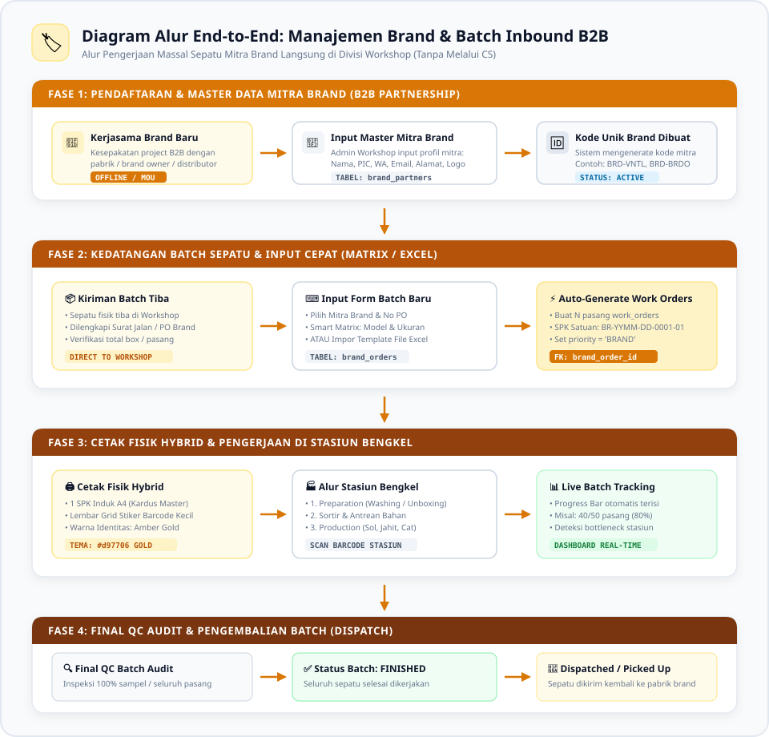
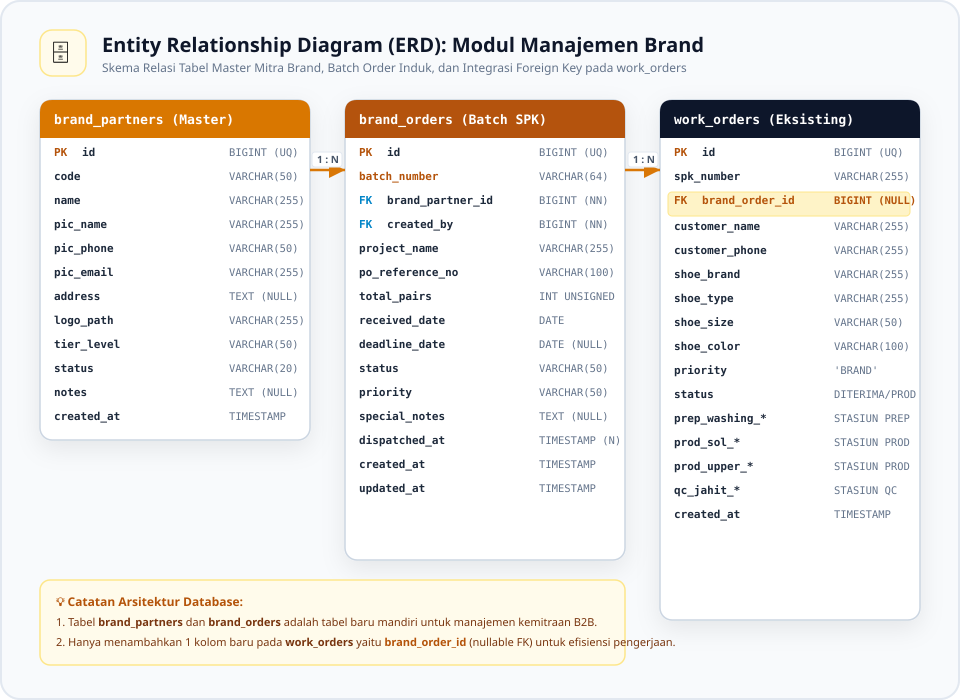
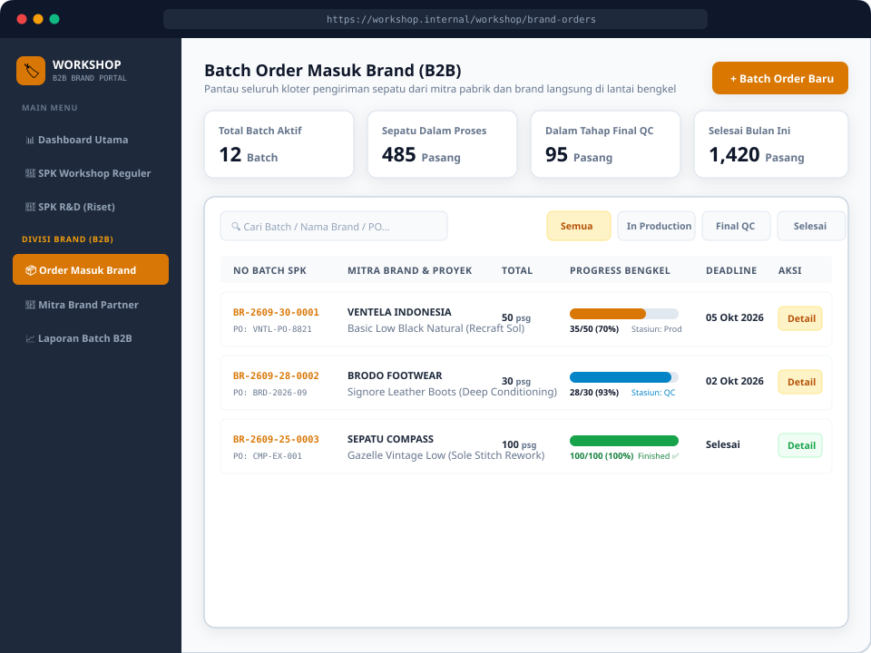
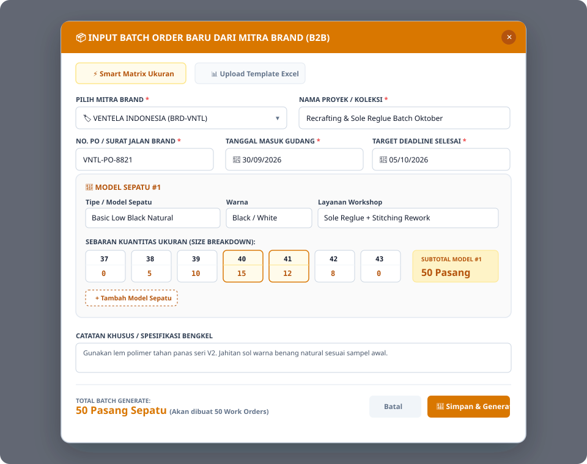
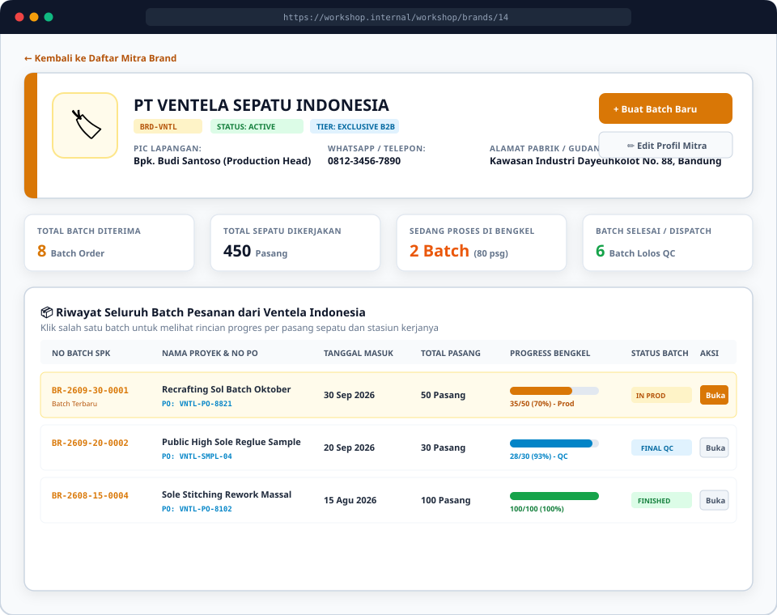
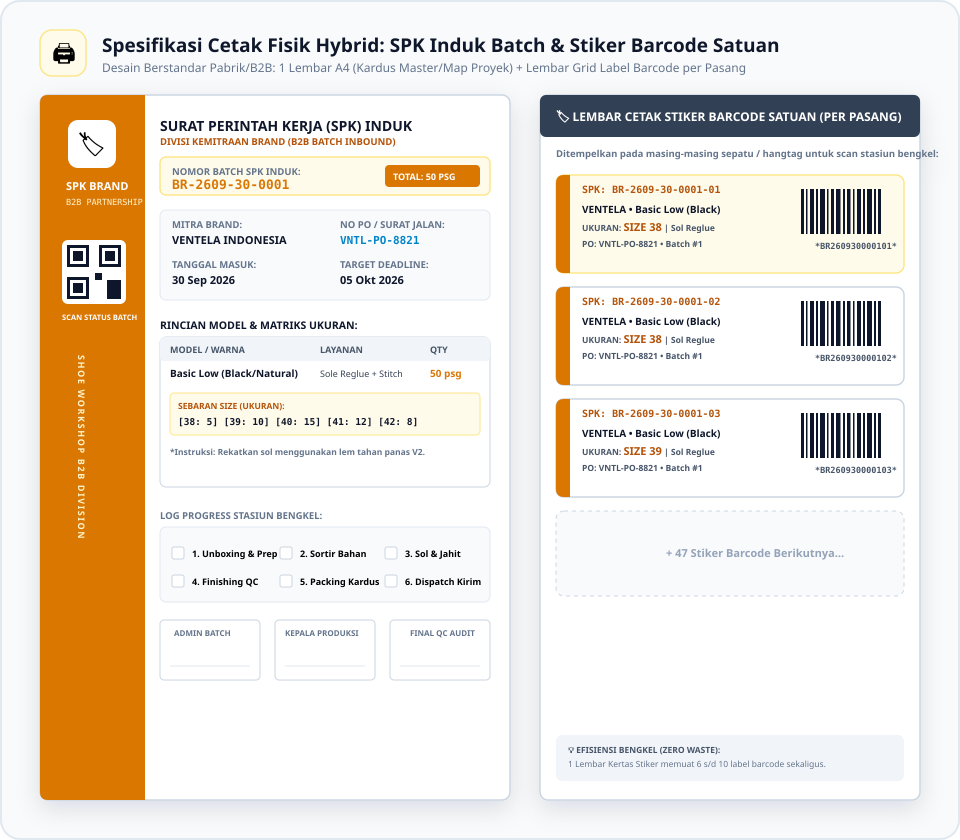

<style>
    @import url('https://fonts.googleapis.com/css2?family=Plus+Jakarta+Sans:wght@300;400;500;600;700;800&family=JetBrains+Mono:wght@400;500;600;700&display=swap');

    @page {
        size: A4;
        margin: 20mm 15mm 20mm 15mm;
        @bottom-right {
            content: "Halaman " counter(page) " dari " counter(pages);
            font-family: 'Plus Jakarta Sans', sans-serif;
            font-size: 8pt;
            color: #64748b;
        }
        @bottom-left {
            content: "Shoe Workshop • SOP & Arsitektur Manajemen Brand (B2B)";
            font-family: 'Plus Jakarta Sans', sans-serif;
            font-size: 8pt;
            color: #64748b;
        }
    }

    body {
        font-family: 'Plus Jakarta Sans', -apple-system, BlinkMacSystemFont, "Segoe UI", Roboto, sans-serif;
        font-size: 10pt;
        line-height: 1.6;
        color: #1e293b;
        background-color: #ffffff;
    }

    h1, h2, h3, h4 {
        color: #0f172a;
        font-weight: 700;
        page-break-after: avoid;
    }

    h1 {
        font-size: 20pt;
        border-bottom: 2.5px solid #d97706;
        padding-bottom: 6px;
        margin-top: 0;
        margin-bottom: 14pt;
        color: #b45309;
    }

    h2 {
        font-size: 14pt;
        border-left: 4.5px solid #d97706;
        padding-left: 10px;
        margin-top: 18pt;
        margin-bottom: 10pt;
        background: #fffbeb;
        padding-top: 4px;
        padding-bottom: 4px;
        border-radius: 0 6px 6px 0;
    }

    h3 {
        font-size: 11.5pt;
        margin-top: 14pt;
        margin-bottom: 6pt;
        color: #92400e;
    }

    h4 {
        font-size: 10.5pt;
        margin-top: 11pt;
        margin-bottom: 5pt;
        color: #78350f;
        border-left: 3px solid #d97706;
        padding-left: 8px;
        font-weight: 700;
    }

    p, ul, ol {
        margin-bottom: 8pt;
    }

    li {
        margin-bottom: 3pt;
    }

    table {
        width: 100%;
        border-collapse: collapse;
        margin-top: 10pt;
        margin-bottom: 14pt;
        font-size: 9pt;
        page-break-inside: avoid;
    }

    th, td {
        border: 1px solid #cbd5e1;
        padding: 7px 10px;
        text-align: left;
        vertical-align: top;
    }

    th {
        background-color: #fef3c7;
        color: #92400e;
        font-weight: 700;
    }

    tr:nth-child(even) {
        background-color: #fdfdfd;
    }

    code {
        font-family: 'JetBrains Mono', monospace;
        font-size: 8.5pt;
        background-color: #fef3c7;
        color: #b45309;
        padding: 2px 5px;
        border-radius: 4px;
        border: 1px solid #fde68a;
    }

    pre code {
        display: block;
        padding: 10px;
        background-color: #0f172a;
        color: #f8fafc;
        border-radius: 8px;
        border: none;
        overflow-x: auto;
        font-size: 8.5pt;
        line-height: 1.45;
    }

    .page-break {
        page-break-after: always;
        break-after: page;
        height: 0;
        display: block;
    }

    .badge-amber {
        display: inline-block;
        padding: 2px 8px;
        background-color: #fef3c7;
        color: #b45309;
        border: 1px solid #fde68a;
        border-radius: 9999px;
        font-weight: 700;
        font-size: 8pt;
    }

    .cover-container {
        display: flex;
        flex-direction: column;
        justify-content: space-between;
        min-height: 90vh;
        padding: 20px 0;
    }

    .cover-header {
        margin-top: 40px;
    }

    .cover-title {
        font-size: 26pt;
        font-weight: 800;
        color: #0f172a;
        line-height: 1.25;
        margin-bottom: 12px;
        border-bottom: 4px solid #d97706;
        padding-bottom: 14px;
    }

    .cover-subtitle {
        font-size: 13pt;
        color: #64748b;
        line-height: 1.5;
        margin-bottom: 25px;
    }

    .cover-meta {
        background: #fffbeb;
        border: 1.5px solid #fde68a;
        border-radius: 12px;
        padding: 18px 22px;
        margin-top: 30px;
    }

    .cover-footer {
        font-size: 9pt;
        color: #94a3b8;
        border-top: 1px solid #e2e8f0;
        padding-top: 15px;
        display: flex;
        justify-content: space-between;
    }
</style>

<!-- ================= COVER PAGE ================= -->
<div class="cover-container">
    <div class="cover-header">
        <p style="text-transform: uppercase; letter-spacing: 0.15em; font-size: 10pt; font-weight: 800; color: #d97706; margin-bottom: 8px;">
            SHOE WORKSHOP • DOKUMEN ARSITEKTUR & SOP RESMI
        </p>
        <h1 class="cover-title">
            Spesifikasi Alur & Arsitektur Modul Manajemen Brand (B2B Batch Inbound)
        </h1>
        <p class="cover-subtitle">
            Standar Pengelolaan Batch Pesanan Masuk Langsung dari Pabrik & Mitra Brand di Divisi Workshop, Smart Matrix Input Ukuran, Integrasi Stasiun Pengerjaan, dan Desain Cetak Hybrid Berstandar Big 4
        </p>
    </div>

    <div class="cover-meta">
        <table style="border: none; margin: 0;">
            <tr style="background: transparent;"><td style="border: none; padding: 4px 0; width: 170px; font-weight: 700; color: #78350f;">Klasifikasi Dokumen</td><td style="border: none; padding: 4px 0; font-weight: 700; color: #0f172a;">: Confidential / Internal Enterprise Architecture SOP</td></tr>
            <tr style="background: transparent;"><td style="border: none; padding: 4px 0; font-weight: 700; color: #78350f;">Versi Dokumen</td><td style="border: none; padding: 4px 0; color: #0f172a;">: 1.0 (Final Approved Architecture)</td></tr>
            <tr style="background: transparent;"><td style="border: none; padding: 4px 0; font-weight: 700; color: #78350f;">Tanggal Rilis</td><td style="border: none; padding: 4px 0; color: #0f172a;">: Rabu, 30 September 2026</td></tr>
            <tr style="background: transparent;"><td style="border: none; padding: 4px 0; font-weight: 700; color: #78350f;">Target Pengguna</td><td style="border: none; padding: 4px 0; color: #0f172a;">: Admin Workshop, Kepala Produksi, Teknisi Stasiun, Staff Gudang Inbound</td></tr>
        </table>
    </div>

    <div class="cover-footer">
        <span>Divisi Teknologi Informasi & Pengembangan Sistem</span>
        <span>Shoe Workshop Indonesia © 2026</span>
    </div>
</div>

<div class="page-break"></div>

<!-- ================= DAFTAR ISI ================= -->
## Daftar Isi
1. [Bab 1: Latar Belakang & Definisi Modul Brand (B2B Inbound)](#bab-1-latar-belakang--definisi-modul-brand-b2b-inbound)
   * [1.1 Konteks Bisnis & Masalah](#11-konteks-bisnis--masalah)
   * [1.2 Mengapa Tidak Melalui Divisi CS?](#12-mengapa-tidak-melalui-divisi-cs)
   * [1.3 Solusi: Modul Brand Terpadu & Proteksi Master Customer CS](#13-solusi-modul-brand-terpadu--proteksi-master-customer-cs)
2. [Bab 2: End-to-End Workflow & Diagram Alur Sistem](#bab-2-end-to-end-workflow--diagram-alur-sistem)
3. [Bab 3: Arsitektur Skema Database & Relasi Entitas](#bab-3-arsitektur-skema-database--relasi-entitas)
   * [3.1 Entity Relationship Diagram (ERD)](#31-entity-relationship-diagram-erd)
   * [3.2 Spesifikasi Detail Struktur Tabel](#32-spesifikasi-detail-struktur-tabel)
   * [3.3 Pemetaan Lengkap Kolom yang Ter-generate ke `work_orders`](#33-pemetaan-lengkap-kolom-yang-ter-generate-ke-work_orders)
4. [Bab 4: Algoritma & Formula Penomoran SPK Brand (Batch & Satuan)](#bab-4-algoritma--formula-penomoran-spk-brand-batch--satuan)
   * [4.1 Formula Nomor SPK Induk Batch](#41-formula-nomor-spk-induk-batch-brand_ordersbatch_number)
   * [4.2 Formula Nomor SPK Satuan Sepatu](#42-formula-nomor-spk-satuan-sepatu-work_ordersspk_number)
   * [4.3 Keunggulan Formula Hierarkis](#43-keunggulan-formula-hierarkis)
   * [4.4 Alur Penanganan Multi-Model Sepatu dalam 1 Batch Brand](#44-alur-penanganan-multi-model-sepatu-dalam-1-batch-brand)
5. [Bab 5: Spesifikasi Wireframe Antarmuka Pengguna (UI Wireframes)](#bab-5-spesifikasi-wireframe-antarmuka-pengguna-ui-wireframes)
   * [5.1 Wireframe Dashboard Manajemen Batch Order Brand](#51-wireframe-dashboard-manajemen-batch-order-brand-workshopbrand-orders)
   * [5.2 Wireframe Modal Smart Matrix Input Ukuran & Import Excel](#52-wireframe-modal-smart-matrix-input-ukuran--import-excel)
   * [5.3 Wireframe Halaman Detail Master Brand (360 Partner View & Riwayat Pesanan)](#53-wireframe-halaman-detail-master-brand-360-partner-view--riwayat-pesanan)
6. [Bab 6: SOP Teknisi Lapangan Brand (B2B Inbound)](#bab-6-sop-teknisi-lapangan-brand-b2b-inbound)
   * [6.1 Prosedur Penerimaan & Identifikasi Fisik Batch](#61-prosedur-penerimaan--identifikasi-fisik-batch)
   * [6.2 Checklist Penyelesaian Batch Brand](#62-checklist-penyelesaian-batch-brand)
7. [Bab 7: Desain Lembar Cetak Fisik Hybrid (Print SPK & Stiker Barcode)](#bab-7-desain-lembar-cetak-fisik-hybrid-print-spk--stiker-barcode)
   * [7.1 Bagian Kiri: 1 Lembar SPK Induk Batch A4](#71-bagian-kiri-1-lembar-spk-induk-batch-a4)
   * [7.2 Bagian Kanan: Lembar Grid Stiker Barcode Satuan (Mini Labels)](#72-bagian-kanan-lembar-grid-stiker-barcode-satuan-mini-labels)
8. [Bab 8: Tata Kelola Hak Akses & Matriks Otorisasi](#bab-8-tata-kelola-hak-akses--matriks-otorisasi)
9. [Bab 9: Matriks Komparasi Alur Kerja: Ritel CS vs R&D vs Brand B2B](#bab-9-matriks-komparasi-alur-kerja-ritel-cs-vs-rd-vs-brand-b2b)
---

## Bab 1: Latar Belakang & Definisi Modul Brand (B2B Inbound)

### 1.1 Konteks Bisnis & Masalah
Dalam operasional Shoe Workshop, selain melayani jasa reparasi sepatu satuan dari pelanggan ritel melalui divisi Customer Service (CS), workshop secara rutin menerima kiriman sepatu dalam jumlah besar (batch/massal) langsung dari **Mitra Brand Sepatu (B2B / Pabrik / Distributor Resmi)**.

Contoh kasus kemitraan Brand:
* **Pabrik / Brand Lokal**: Mengirimkan 50–100 pasang sepatu sampel pameran atau *re-crafting* sol massal.
* **Distributor Brand Internasional**: Mengirimkan 30 pasang sepatu *leather boots* untuk perawatan berkala (*deep conditioning*).
* **Vendor Rework & QC**: Brand mengirimkan sepatu hasil produksi pabrik yang memerlukan perbaikan jahitan (*sole stitching rework*) sebelum didistribusikan ke pasar.

### 1.2 Mengapa Tidak Melalui Divisi CS?
Sebelumnya, jika ada kiriman brand masuk, tim workshop kebingungan karena:
1. **Bukan Pesanan Ritel Pelanggan**: Pesanan ini tidak melalui konsultasi WhatsApp CS, tidak ada proses tawar-menawar harga ritel, dan tidak memerlukan alur *lead follow-up*.
2. **Kuantitas Massal (Batch)**: Menginput 50 hingga 100 pasang sepatu satu per satu melalui form CS sangat lambat, tidak efisien, dan membebani antrean administrasi harian CS.
3. **Pencatatan Surat Jalan / PO Pabrik**: Brand memiliki nomor referensi Purchase Order (PO) atau Surat Jalan resmi yang harus dapat dilacak langsung oleh tim bengkel.

### 1.3 Solusi: Modul Brand Terpadu & Proteksi Master Customer CS
Sistem Workshop menyediakan alur khusus **B2B Brand Inbound** yang dikelola langsung oleh tim Workshop (Admin Workshop & Kepala Produksi):
* **Pendaftaran Mitra Brand Terpisah (`brand_partners`)**: Satu kali pendaftaran profil rekanan korporat/pabrik (Nama PT, PIC, WA, Email, Alamat Pabrik, dan Logo).
* **Master Customer CS (`customers`) 100% Terlindungi**: Data pelanggan perorangan B2C milik CS **tidak terkotori** oleh data pabrik atau vendor korporat, menjaga integritas CRM ritel.
* **Penerimaan Batch Order (`brand_orders`)**: Pencatatan kloter masuk dengan nomor PO, target deadline, dan pemantauan live progress.
* **Input Super Cepat (Smart Matrix Ukuran)**: Cukup input model sepatu dan masukkan sebaran ukuran (size breakdown) secara horizontal atau upload file template Excel.
* **Eksekusi Mulus di Bengkel**: Menghubungkan setiap pasang sepatu ke tabel `work_orders` dengan foreign key `brand_order_id`, sehingga teknisi di lantai bengkel dapat langsung memproses sepatu menggunakan scanner barcode di stasiun kerja yang sudah ada tanpa perlu membangun stasiun baru.

---

<div class="page-break"></div>

## Bab 2: End-to-End Workflow & Diagram Alur Sistem

Alur operasional pengerjaan pesanan Brand terbagi ke dalam 4 fase terintegrasi:

### 2.1 Diagram Alur Lengkap (Visual Flowchart)

<div align="center" style="margin: 18pt 0;">
    
</div>

### 2.2 Rincian Fase Operasional

#### Fase 1: Pendaftaran & Master Data Mitra Brand
1. Admin Workshop mendaftarkan profil mitra pabrik/brand pada menu **Manajemen Brand ➔ Mitra Brand**.
2. Sistem mencatat Nama Brand, Kode Singkatan (misal `BRD-VNTL`), nama PIC, kontak WhatsApp, email resmi, alamat pabrik, dan logo brand.
3. Rekanan yang terdaftar berstatus `ACTIVE` dan dapat dipilih kapan saja saat ada kiriman batch baru tiba.

#### Fase 2: Kedatangan Batch Sepatu & Input Cepat di Workshop
1. Kiriman fisik sepatu tiba di gudang workshop disertai dokumen Surat Jalan / Purchase Order (PO) dari Brand.
2. Staff Inbound / Admin Workshop membuka menu **Order Masuk Brand ➔ + Batch Order Baru**.
3. Admin memilih Mitra Brand, mengisi No PO, Tanggal Masuk, dan Target Deadline.
4. **Metode Input Sepatu**:
   * **Smart Size Matrix**: Admin mengetik nama model sepatu & layanan, lalu mengisi box kuantitas ukuran (misal Size 38: 5 pasang, Size 39: 10 pasang, Size 40: 15 pasang, Size 41: 12 pasang, Size 42: 8 pasang = Total 50 pasang).
   * **Alternatif File Excel**: Untuk kiriman ratusan pasang dengan variasi tinggi, tersedia fitur unggah file spreadsheet Excel/CSV.
5. Saat tombol **Simpan & Generate** ditekan, sistem secara atomik membuat:
   * 1 Record Induk di tabel `brand_orders` (Nomor SPK Induk: `BR-2609-30-0001`).
   * 50 Record Satuan di tabel `work_orders` (Nomor SPK Satuan: `BR-2609-30-0001-01` s/d `BR-2609-30-0001-50`).

#### Fase 3: Cetak Fisik Hybrid & Eksekusi Stasiun Bengkel
1. **Cetak Fisik Efisien**:
   * **1 Lembar SPK Induk A4**: Dicetak dengan sidebar warna khas **Amber / Royal Gold (`#d97706`)** dan ditempelkan pada kardus master / map pengerjaan proyek.
   * **Lembar Grid Stiker Barcode Satuan**: Dicetak pada kertas stiker label mini untuk ditempelkan pada masing-masing sepatu / hangtag.
2. **Pengerjaan di Stasiun Bengkel**:
   * Teknisi stasiun mengambil sepatu dan melakukan pemindaian barcode satuan menggunakan scanner scanner barcode reguler.
   * Sepatu mengalir melalui stasiun: `Preparation` ➔ `Sortir Bahan` ➔ `Production (Sol/Jahit/Upper)` ➔ `QC`.
   * Setiap kali teknisi menyelesaikan tahap pengerjaan suatu pasang sepatu, persentase progress bar pada dashboard batch induk otomatis ter-update secara real-time.

#### Fase 4: Final QC Audit, Status Khusus BRAND_FINISHED, & Pengembalian (Dispatch)
1. **Pemeriksaan di Stasiun QC Lapangan**:
   - Teknisi QC memeriksa kualitas pengerjaan fisik setiap pasang sepatu.
   - Saat sepatu dinyatakan lolos QC (*QC Passed*), teknisi memindai barcode sepatu satuan (`BR-2609-30-0001-xx`).
2. **Penerapan Status Khusus: `BRAND_FINISHED` (Bukan `SELESAI` Ritel)**:
   - Sistem secara otomatis mendeteksi bahwa sepatu memiliki relasi `brand_order_id`.
   - Sepatu **TIDAK DIUBAH** menjadi status `SELESAI` ritel biasa, melainkan dialihkan ke status khusus: **`BRAND_FINISHED`**.
   - Lokasi fisik sepatu otomatis diset ke: **`Area Staging B2B / Kardus Master Proyek`**.
3. **Proteksi & Isolasi Total dari Rak Pickup Customer Ritel CS**:
   - Dengan status `BRAND_FINISHED`, seluruh sepatu brand **disaring (terisolasi) secara otomatis** agar tidak pernah muncul di layar kasir atau rak pickup customer ritel CS.
   - Hal ini mencegah kasir/staff pickup ritel bingung atau salah mengambil puluhan sepatu pabrik untuk diserahkan ke pelanggan umum.
4. **Pembaruan Otomatis Progress Bar Batch Induk**:
   - Setiap kali satu pasang sepatu berstatus `BRAND_FINISHED`, progress bar pada dashboard batch induk bertambah secara real-time (contoh: dari `49/50` menjadi `50/50 (100%)`).
5. **Otomasi Status Batch & Penerbitan Surat Jalan Pengembalian (Dispatch B2B)**:
   - Begitu sepatu terakhir (pasang ke-50) berstatus `BRAND_FINISHED`:
     - Status batch induk di tabel `brand_orders` otomatis berubah menjadi **`FINISHED` (Siap Kirim Balik)**.
     - Muncul notifikasi pada monitor Admin Workshop: *"Batch Brand #PO-8821 telah lengkap 50/50 pasang"*.
   - Admin Workshop mengklik tombol **"🚚 Serah Terima / Dispatch ke Brand"**:
     - Sistem mencetak **Surat Jalan Pengembalian Barang (Delivery Note / Berita Acara Serah Terima B2B)** yang memuat daftar 50 pasang sepatu, model, ukuran, dan tanda tangan kurir/sopir pabrik penjemput.
     - Status batch induk dan seluruh 50 pasang sepatu di dalamnya resmi berubah menjadi **`DISPATCHED`** (Selesai & Dikembalikan ke Pabrik Mitra).

---

<div class="page-break"></div>

## Bab 3: Arsitektur Skema Database & Relasi Entitas

Rancangan database mengadopsi prinsip **Clean Architecture & High Cohesion**:
1. Menambahkan 2 tabel mandiri khusus kemitraan B2B: `brand_partners` dan `brand_orders`.
2. Menghubungkan pesanan batch ke tabel operasional `work_orders` menggunakan **1 kolom baru (nullable foreign key): `brand_order_id`**.

### 3.1 Entity Relationship Diagram (ERD)

<div align="center" style="margin: 18pt 0;">
    
</div>

### 3.2 Spesifikasi Detail Struktur Tabel

#### 1. Tabel Master: `brand_partners`
Menyimpan profil rekanan pabrik dan brand resmi yang bekerja sama dengan workshop.

```sql
CREATE TABLE `brand_partners` (
    `id` BIGINT UNSIGNED AUTO_INCREMENT PRIMARY KEY,
    `code` VARCHAR(50) NOT NULL UNIQUE COMMENT 'Kode unik brand, misal: BRD-VNTL, BRD-BRDO',
    `name` VARCHAR(255) NOT NULL COMMENT 'Nama resmi brand / PT mitra',
    `pic_name` VARCHAR(255) NOT NULL COMMENT 'Nama Person in Charge (PIC) brand',
    `pic_phone` VARCHAR(50) NOT NULL COMMENT 'Nomor WhatsApp / telepon PIC',
    `pic_email` VARCHAR(255) NULL COMMENT 'Alamat email korespondensi resmi',
    `address` TEXT NULL COMMENT 'Alamat pabrik / gudang / kantor brand',
    `logo_path` VARCHAR(255) NULL COMMENT 'Path file logo brand untuk display dashboard',
    `tier_level` VARCHAR(50) DEFAULT 'STANDARD' COMMENT 'Kategori mitra: STANDARD, EXCLUSIVE, VIP',
    `status` VARCHAR(20) DEFAULT 'ACTIVE' COMMENT 'Status kerjasama: ACTIVE, INACTIVE',
    `notes` TEXT NULL COMMENT 'Catatan terms of agreement atau preferensi khusus',
    `created_at` TIMESTAMP NULL,
    `updated_at` TIMESTAMP NULL
) ENGINE=InnoDB DEFAULT CHARSET=utf8mb4 COLLATE=utf8mb4_unicode_ci;
```

#### 2. Tabel Batch SPK Induk: `brand_orders`
Mencatat satu kloter pengiriman batch sepatu dari brand mitra ke workshop.

```sql
CREATE TABLE `brand_orders` (
    `id` BIGINT UNSIGNED AUTO_INCREMENT PRIMARY KEY,
    `batch_number` VARCHAR(64) NOT NULL UNIQUE COMMENT 'Format nomor SPK induk: BR-YYMM-DD-XXXX',
    `brand_partner_id` BIGINT UNSIGNED NOT NULL COMMENT 'Relasi ke brand_partners.id',
    `created_by` BIGINT UNSIGNED NOT NULL COMMENT 'User ID staff workshop yang menginput',
    `project_name` VARCHAR(255) NOT NULL COMMENT 'Nama proyek, misal: Recrafting Batch Oktober',
    `po_reference_no` VARCHAR(100) NULL COMMENT 'Nomor PO / Surat Jalan dari pihak Brand',
    `total_pairs` INT UNSIGNED NOT NULL DEFAULT 0 COMMENT 'Total kuantitas pasang sepatu dalam batch',
    `received_date` DATE NOT NULL COMMENT 'Tanggal fisik sepatu tiba di gudang workshop',
    `deadline_date` DATE NULL COMMENT 'Target tanggal selesai pengerjaan batch',
    `status` VARCHAR(50) DEFAULT 'INBOUND' COMMENT 'DRAFT, INBOUND, IN_PRODUCTION, QC_CHECK, FINISHED, DISPATCHED',
    `priority` VARCHAR(50) DEFAULT 'BRAND' COMMENT 'Label prioritas operasional: BRAND / B2B',
    `special_notes` TEXT NULL COMMENT 'Instruksi formula lem, warna benang, atau treatment khusus',
    `dispatched_at` TIMESTAMP NULL COMMENT 'Waktu pengembalian sepatu ke pihak brand',
    `created_at` TIMESTAMP NULL,
    `updated_at` TIMESTAMP NULL,
    FOREIGN KEY (`brand_partner_id`) REFERENCES `brand_partners`(`id`) ON DELETE RESTRICT,
    FOREIGN KEY (`created_by`) REFERENCES `users`(`id`) ON DELETE RESTRICT
) ENGINE=InnoDB DEFAULT CHARSET=utf8mb4 COLLATE=utf8mb4_unicode_ci;
```

#### 3. Penambahan Kolom pada Tabel Eksisting: `work_orders`
Satu kolom foreign key baru ditambahkan pada tabel `work_orders` agar sepatu satuan di dalam batch brand dapat menggunakan seluruh fitur stasiun pengerjaan bengkel secara langsung.

```sql
ALTER TABLE `work_orders`
ADD COLUMN `brand_order_id` BIGINT UNSIGNED NULL AFTER `spk_number`,
ADD CONSTRAINT `fk_work_orders_brand_order_id`
    FOREIGN KEY (`brand_order_id`) REFERENCES `brand_orders`(`id`)
    ON DELETE SET NULL;

CREATE INDEX `idx_work_orders_brand_order_id` ON `work_orders`(`brand_order_id`);
```

> [!NOTE]
> Pada pesanan ritel pelanggan biasa dari CS, kolom `brand_order_id` bernilai `NULL`. Pada pesanan Brand, kolom ini terisi ID batch terkait, kolom `customer_name` otomatis terisi nama Brand Partner, dan kolom `priority` bernilai `'BRAND'`.

### 3.3 Pemetaan Lengkap Kolom yang Ter-generate ke `work_orders`

Saat Admin Workshop mengklik tombol **"Simpan & Generate"** pada form batch Brand, sistem secara otomatis mengeksekusi pembuatan $N$ record baru pada tabel `work_orders` (di mana $N$ adalah total pasang sepatu dari seluruh model).

Berikut adalah pemetaan (*mapping*) terperinci setiap kolom database yang terisi secara otomatis:

| Nama Kolom di `work_orders` | Tipe Data | Sumber Nilai (Data Source) | Contoh Nilai Tersimpan | Keterangan & Dampak Sistem |
| :--- | :--- | :--- | :--- | :--- |
| **`spk_number`** | `VARCHAR(255)` | Generator formula hierarkis berurutan | `BR-2609-30-0001-01` | Unique Key per pasang sepatu, dicetak pada stiker barcode. |
| **`brand_order_id`** | `BIGINT UNSIGNED` | ID dari `brand_orders.id` yang baru dibuat | `14` | Foreign key penghubung ke batch order induk B2B. |
| **`customer_name`** | `VARCHAR(255)` | `brand_partners.name` | `VENTELA INDONESIA` | Otomatis diisi nama brand (tanpa mengotori master customer CS). |
| **`customer_phone`** | `VARCHAR(255)` | `brand_partners.pic_phone` & `pic_name` | `0812-3456-7890 (Bpk. Budi)` | Nomor WhatsApp PIC resmi untuk koordinasi pabrik. |
| **`customer_address`** | `TEXT` | `brand_partners.address` | `Kawasan Industri Dayeuhkolot No. 88, Bandung` | Alamat pabrik/gudang untuk tujuan pengiriman kembali (*dispatch*). |
| **`shoe_brand`** | `VARCHAR(255)` | `brand_partners.name` | `Ventela` | Nama brand sepatu yang terstandarisasi. |
| **`shoe_type`** | `VARCHAR(255)` | Input field Model Sepatu pada matrix | `Basic Low Natural` | Model/tipe spesifik dari kartu model yang dipilih. |
| **`shoe_color`** | `VARCHAR(100)` | Input field Warna pada matrix | `Black / White` | Varian warna sepatu. |
| **`shoe_size`** | `VARCHAR(50)` | Nomor ukuran pada box matrix yang terisi | `39`, `40`, `41`, dst. | Ukuran per pasang (dihasilkan loop sebanyak kuantitas size). |
| **`priority`** | `VARCHAR(50)` | Set nilai konstan sistem | `BRAND` | Memicu badge warna Amber Gold (`#d97706`) di layar teknisi. |
| **`status`** | `VARCHAR(50)` | Siklus stasiun bengkel | `DITERIMA` ➔ `BRAND_FINISHED` | Berubah seiring pergerakan stasiun; saat lolos QC beralih ke status khusus `BRAND_FINISHED` (bukan `SELESAI` ritel). |
| **`current_location`** | `VARCHAR(255)` | Lokasi fisik dinamis | `Gudang Inbound` ➔ `Kardus Master B2B` | Saat selesai QC otomatis diarahkan ke `Area Staging B2B / Kardus Master`. |
| **`notes`** | `TEXT` | `po_reference_no` + `special_notes` | `PO: VNTL-PO-8821. Lem tahan panas V2` | Instruksi kerja bagi teknisi lapangan. |
| **`entry_date`** | `TIMESTAMP` | `brand_orders.received_date` | `2026-09-30 08:30:00` | Waktu sepatu fisik tiba di gudang. |
| **`estimation_date`** | `TIMESTAMP` | `brand_orders.deadline_date` | `2026-10-05 17:00:00` | Target penyelesaian komitmen pengerjaan batch. |
| **`work_order_services`** | *Relasi Tabel Pivot* | Layanan yang dipilih pada kartu model | Di-attach ke tabel `work_order_services` | Mengaktifkan tahapan checklist stasiun (Sol, Jahit, Cat). |

> [!TIP]
> Kolom tahapan stasiun (seperti `prep_washing_*`, `prod_sol_*`, `qc_jahit_*`) sengaja dibiarkan `NULL` pada saat generate awal, dan akan terisi otomatis secara real-time saat teknisi di lantai bengkel melakukan pemindaian (*scan*) barcode satuan. Saat lolos QC, sepatu otomatis mendapatkan status **`BRAND_FINISHED`** dan terisolasi dari rak pickup customer ritel CS.

---

<div class="page-break"></div>

## Bab 4: Algoritma & Formula Penomoran SPK Brand (Batch & Satuan)

Untuk memastikan standarisasi data di lantai bengkel dan mencegah terjadinya tumpang tindih penomoran, sistem menerapkan formula berjenjang (*hierarchical numbering*) antara nomor batch induk dan nomor sepatu satuan.

### 4.1 Formula Nomor SPK Induk Batch (`brand_orders.batch_number`)
Format nomor batch induk dirumuskan sebagai berikut:

$$\mathbf{BR\ -\ [YYMM]\ -\ [DD]\ -\ [Sequence]}$$

* **`BR-`**: Kode prefix resmi divisi Brand / B2B Partnership.
* **`YYMM`**: 2 digit tahun dan 2 digit bulan saat batch didaftarkan (contoh: `2609` untuk September 2026).
* **`DD`**: 2 digit tanggal kedatangan batch (contoh: `30`).
* **`Sequence`**: 4 digit nomor urut batch harian yang di-reset setiap hari (`0001`, `0002`, dst).

*Contoh Nomor Batch*: **`BR-2609-30-0001`** (Batch Brand pertama yang tiba pada tanggal 30 September 2026).

### 4.2 Formula Nomor SPK Satuan Sepatu (`work_orders.spk_number`)
Setiap pasang sepatu di dalam batch secara otomatis diberi nomor SPK turunan dengan menyematkan nomor urut 2-digit (*item index suffix*):

$$\mathbf{[Nomor\ Batch\ Induk]\ -\ [Item\ Index]}$$

*Contoh Penomoran Satuan untuk Batch `BR-2609-30-0001` (Kuantitas 50 Pasang)*:
* Sepatu Pasang #1: **`BR-2609-30-0001-01`**
* Sepatu Pasang #2: **`BR-2609-30-0001-02`**
* Sepatu Pasang #3: **`BR-2609-30-0001-03`**
* $\dots$
* Sepatu Pasang #50: **`BR-2609-30-0001-50`**

### 4.3 Keunggulan Formula Hierarkis
1. **Pencarian Cepat di Scanner**: Saat teknisi memindai barcode sepatu satuan `BR-2609-30-0001-12`, sistem langsung mengetahui bahwa sepatu tersebut merupakan pasang ke-12 dari batch induk `BR-2609-30-0001`.
2. **Audit Kuantitas Akurat**: Jika dalam satu kardus terdapat 50 pasang, pengawas bengkel cukup mencocokkan nomor urut `-01` hingga `-50` untuk memastikan tidak ada sepatu yang tercecer.

### 4.4 Alur Penanganan Multi-Model Sepatu dalam 1 Batch Brand

Dalam kondisi operasional nyata di pabrik, satu pengiriman batch seringkali memuat **lebih dari 1 model sepatu** (misalnya kiriman 80 pasang memuat 3 varian model berbeda).

#### 1. Mekanisme Input di Layar (Dynamic Multi-Model Cards):
* Pengguna dapat menekan tombol **"+ Tambah Model Sepatu"** pada form modal Smart Matrix.
* Setiap varian model memiliki kartu tersendiri dengan model name, warna, jenis layanan, dan box ukuran masing-masing.

#### 2. Kebijakan Penomoran SPK Satuan (Penomoran Urut Flat Sederhana):
Sesuai standar operasional terbaik, sistem menggunakan **Penomoran Urut Flat Sederhana (`-01` s/d `-N`)** secara berkesinambungan melintasi seluruh model, agar nomor urut fisik di kardus master tidak terpecah dan mudah diaudit.

*Contoh Kasus Batch `BR-2609-30-0001` (Total 80 Pasang dengan 3 Varian Model)*:

| No | Model Sepatu | Warna | Layanan | Sebaran Ukuran (Size Breakdown) | Subtotal | Range Nomor SPK Satuan |
| :---: | :--- | :--- | :--- | :--- | :---: | :--- |
| **1** | **Ventela Basic Low** | Black/Natural | Sol Reglue + Jahit | Size 39 (10 psg), Size 40 (10 psg), Size 41 (10 psg) | 30 psg | `BR-2609-30-0001-01` s/d `BR-2609-30-0001-30` |
| **2** | **Ventela Public High** | All White | Deep Clean & Reglue | Size 40 (15 psg), Size 41 (15 psg) | 30 psg | `BR-2609-30-0001-31` s/d `BR-2609-30-0001-60` |
| **3** | **Ventela Armor Slip-On** | Navy Blue | Sole Stitching Rework | Size 41 (10 psg), Size 42 (10 psg) | 20 psg | `BR-2609-30-0001-61` s/d `BR-2609-30-0001-80` |
| | **TOTAL BATCH KESELURUHAN** | | | | **80 Pasang** | **Total 80 Work Orders Terbuat** |

---

<div class="page-break"></div>

## Bab 5: Spesifikasi Wireframe Antarmuka Pengguna (UI Wireframes)

Untuk memfasilitasi tim pengembang dalam membangun antarmuka yang intuitif dan berkinerja tinggi, berikut adalah spesifikasi wireframe resolusi tinggi untuk dua titik interaksi utama sistem Brand di Divisi Workshop.

---

### 5.1 Wireframe Dashboard Manajemen Batch Order Brand (`/workshop/brand-orders`)
Dashboard ini digunakan oleh Admin Workshop dan Kepala Produksi untuk memantau seluruh kloter batch kiriman brand yang sedang berjalan, mendeteksi stasiun bottleneck, dan memantau persentase penyelesaian proyek.

<div align="center" style="margin: 18pt 0;">
    
</div>

#### Rincian Komponen Dashboard:
1. **Navigasi Sidebar Khusus Brand**:
   - Menu grup baru bertajuk **"DIVISI BRAND (B2B)"** yang memuat sub-menu *Order Masuk Brand*, *Mitra Brand Partner*, dan *Laporan Batch B2B*.
2. **Top Metric Summary Cards**:
   - Menampilkan metrik esensial secara instan: Total Batch Aktif, Total Pasang Sedang Diproses, Total Pasang dalam Tahap Final QC, dan Total Pasang Selesai Bulan Ini.
3. **Filter Cepat & Pencarian**:
   - Kotak pencarian multi-parameter (No Batch, Nama Brand, No PO).
   - Filter pill status: *Semua*, *In Production*, *Final QC*, *Selesai*.
4. **Tabel Batch Interaktif**:
   - Menampilkan nomor batch unik, nama mitra brand, nama model sepatu & layanan.
   - **Progress Bar Visual**: Menunjukkan perbandingan pasang sepatu yang sudah selesai vs total target (misal `35/50 (70%)`) beserta posisi stasiun aktif terbanyak.
   - Tombol Detail untuk masuk ke manajemen sub-item sepatu per pasang.

---

<div class="page-break"></div>

### 5.2 Wireframe Modal Smart Matrix Input Ukuran & Import Excel
Form modal ini dirancang untuk mengatasi masalah input massal yang lambat. Admin workshop dapat mendaftarkan puluhan hingga ratusan pasang sepatu hanya dalam hitungan detik.

<div align="center" style="margin: 18pt 0;">
    
</div>

#### Rincian Fitur Smart Matrix Input:
1. **Tab Mode Input**:
   - **Tab 1: Smart Matrix Ukuran**: Input langsung di layar untuk 10–100 pasang sepatu.
   - **Tab 2: Upload Template Excel**: Unggah file `.xlsx` / `.csv` jika brand menyertakan data ratusan pasang sepatu dengan rincian model yang sangat variatif.
2. **Field Header Batch**:
   - Dropdown pilihan Mitra Brand resmi (lengkap dengan fitur tambah brand baru).
   - Nama Proyek / Koleksi Sepatu dan Nomor Surat Jalan / PO Brand.
   - Tanggal Masuk dan Target Deadline Penyelesaian.
3. **Komponen Grid Matrix Ukuran**:
   - Pengguna memilih Model Sepatu, Warna, dan Layanan Workshop satu kali.
   - Tersedia deretan box ukuran sepatu standar (Size 37 s/d 45). Pengguna cukup memasukkan angka kuantitas pada masing-masing ukuran yang masuk.
   - Sistem secara otomatis menghitung subtotal per model dan total akumulatif batch di bagian footer.
   - Tersedia tombol **"+ Tambah Model Sepatu"** jika dalam satu kiriman batch terdapat lebih dari 1 varian model sepatu.
4. **Tombol Eksekusi Instan**:
   - Mengklik tombol **"💾 Simpan & Generate"** seketika membuat seluruh entitas `work_orders` satuan dengan nomor urut yang rapi.

---

<div class="page-break"></div>

### 5.3 Wireframe Halaman Detail Master Brand (360° Partner View & Riwayat Pesanan)
Halaman ini dapat diakses melalui menu **Manajemen Brand ➔ Mitra Brand ➔ [Klik Brand Terkait]** (`/workshop/brands/{id}`). Halaman ini bertindak sebagai pusat informasi kemitraan terpadu (*360° Partner Profile View*) yang menampilkan profil resmi perusahaan, metrik performa historis, dan **tabel riwayat seluruh batch pesanan** yang pernah dikirimkan oleh brand tersebut.

<div align="center" style="margin: 18pt 0;">
    
</div>

#### Rincian Fitur Halaman Detail Master Brand:
1. **Hero Profile Card**:
   - Menampilkan logo brand, nama legal perusahaan (PT/CV), kode brand resmi (`BRD-VNTL`), status keaktifan (`ACTIVE`), serta badge tingkatan kemitraan (`TIER: EXCLUSIVE B2B`).
   - Informasi korespondensi pabrik: Nama PIC lapangan, nomor WhatsApp/telepon PIC, dan alamat fisik pabrik/gudang untuk tujuan pengiriman kembali (*dispatch*).
   - Tombol Cepat: **"+ Buat Batch Baru"** (otomatis memilih brand ini pada form) dan **"✏️ Edit Profil Mitra"**.
2. **Lifetime Metrics Cards (Statistik Akumulatif)**:
   - **Total Batch Diterima**: Akumulasi total kloter batch yang pernah dikerjakan.
   - **Total Sepatu Dikerjakan**: Jumlah pasang sepatu yang telah diproses sepanjang masa kemitraan.
   - **Sedang Proses di Bengkel**: Jumlah batch & pasang sepatu yang saat ini sedang aktif di lantai produksi.
   - **Batch Selesai & Lolos QC**: Total batch yang berhasil diselesaikan dengan baik.
3. **Tabel Riwayat Seluruh Batch Pesanan (Order History List)**:
   - Menampilkan daftar kronologis setiap batch kiriman brand: No Batch SPK (`BR-xxxx`), Nama Proyek, No PO Brand, Tanggal Masuk, Kuantitas Pasang, **Progress Bar Real-Time**, dan Status Terkini (`IN PRODUCTION`, `FINAL QC`, `FINISHED`, `DISPATCHED`).
   - Setiap baris memiliki tombol **"Buka"** untuk melihat detail masing-masing pasang sepatu di dalam batch tersebut beserta riwayat stasiun kerjanya.

---

<div class="page-break"></div>


## Bab 6: SOP Teknisi Lapangan Brand (B2B Inbound)

### 6.1 Prosedur Penerimaan & Identifikasi Fisik Batch

1. **Identifikasi Lembar SPK Induk**: Begitu kiriman batch brand tiba, staff inbound mencocokkan Surat Jalan/PO dari kurir pabrik dengan nomor batch induk **`BR-xxxx`** yang tertera pada lembar SPK berwarna **Amber Gold (`#d97706`)**.
2. **Pemindaian & Distribusi Stiker Satuan**: Setiap pasang sepatu ditempelkan stiker barcode satuan (`BR-xxxx-01` dst.) sebelum dipindai masuk ke sistem. Sepatu fisik ditempatkan pada kardus/baki berlabel **"BRAND B2B — JANGAN CAMPUR DENGAN RITEL"** dan disimpan di area staging terpisah dari rak antrian pelanggan ritel CS.
3. **Review Instruksi Khusus di Kolom `notes`**: Teknisi wajib membaca instruksi spesial brand pada kolom Notes lembar SPK Induk (misal: *"Lem hanya Epoxy tahan panas, jangan Alteco"*, *"Benang jahit warna putih gading, bukan putih standar"*). Jika ada keraguan, wajib konfirmasi ke Kepala Produksi sebelum memulai pengerjaan.
4. **Pengerjaan di Stasiun Bengkel (Scan Barcode Satuan)**: Teknisi menggunakan scanner barcode USB/Bluetooth reguler di masing-masing meja stasiun. Setiap scan otomatis memperbarui status pasang sepatu dan progress bar batch induk secara real-time di dashboard.
5. **Pemeriksaan QC Ganda Wajib (Double Check)**: Seluruh pasang sepatu brand **WAJIB** melewati QC Final yang disetujui Kepala Produksi sebelum status dialihkan ke `BRAND_FINISHED`. Sepatu yang berstatus `BRAND_FINISHED` otomatis terisolasi dari rak pickup pelanggan ritel CS.

### 6.2 Checklist Penyelesaian Batch Brand

| No | Item Checklist | PIC | Keterangan |
| :---: | :--- | :--- | :--- |
| 1 | ✅ Surat Jalan / PO brand dicocokkan dengan batch number di sistem | Staff Inbound | Saat unboxing awal |
| 2 | ✅ Seluruh pasang sepatu ditempeli stiker barcode satuan | Staff Inbound | Sebelum proses dimulai |
| 3 | ✅ Instruksi khusus brand di kolom `notes` dibaca & dipahami semua teknisi | Kepala Produksi | Briefing awal sebelum produksi |
| 4 | ✅ Seluruh `N` pasang sepatu berstatus `BRAND_FINISHED` (progress 100%) | Admin Workshop | Verifikasi di dashboard batch |
| 5 | ✅ Tidak ada pasang sepatu yang tercecer (cocokkan nomor `-01` s/d `-N`) | Kepala Produksi | Audit fisik akhir |
| 6 | ✅ Surat Jalan Pengembalian (Delivery Note) berhasil dicetak | Admin Workshop | Via tombol "🚚 Serah Terima / Dispatch" |
| 7 | ✅ Status batch induk & seluruh satuan diubah ke `DISPATCHED` oleh Admin | Admin Workshop | Setelah kurir pabrik menandatangani SJ |

> [!IMPORTANT]
> Sepatu brand berstatus `BRAND_FINISHED` **TIDAK BOLEH** dipindahkan ke rak pickup pelanggan CS. Wajib ditempatkan di **Area Staging B2B / Kardus Master Proyek** hingga proses dispatch resmi selesai ditandatangani.

---

<div class="page-break"></div>

## Bab 7: Desain Lembar Cetak Fisik Hybrid (Print SPK & Stiker Barcode)

Untuk menjamin efisiensi penggunaan kertas di bengkel (*zero paper waste*) sekaligus menjaga kejelasan instruksi pengerjaan massal, modul Brand menerapkan sistem **Cetak Fisik Hybrid**.

<div align="center" style="margin: 18pt 0;">
    
</div>

### 7.1 Bagian Kiri: 1 Lembar SPK Induk Batch A4
* **Fungsi**: Ditempelkan pada kardus master pengiriman atau map pengerjaan proyek di meja pengawas produksi.
* **Identitas Visual**: Sidebar vertikal berwarna **Amber / Royal Gold (`#d97706`)** yang secara tegas membedakannya dari SPK Reguler Hijau (`#22B086`), SPK Fast Track Oranye (`#ea580c`), dan SPK R&D Ungu (`#4f46e5`).
* **Konten Utama**:
  - Badge Header: `🏷️ SPK B2B BRAND PARTNERSHIP`.
  - Nomor Batch Induk: `BR-2609-30-0001` (Ukuran besar).
  - Nama Brand Mitra & Nomor PO Surat Jalan.
  - Tanggal Masuk & Target Deadline.
  - **Tabel Matriks Sebaran Ukuran**: Rangkuman jumlah pasang per size (misal `[38: 5] [39: 10] [40: 15] ...`).
  - QR Code Induk: Memindai QR ini akan membuka dashboard status batch secara keseluruhan.
  - Checklist Stasiun Bengkel & Kotak Tanda Tangan Approval (Admin, Kepala Produksi, Final QC).

### 7.2 Bagian Kanan: Lembar Grid Stiker Barcode Satuan (Mini Labels)
* **Fungsi**: Label stiker kecil berperekat yang ditempelkan langsung pada sol/upper sepatu atau disematkan pada tali hangtag masing-masing pasang sepatu.
* **Format**: 1 Lembar kertas stiker A4 memuat 6 hingga 10 label stiker satuan sekaligus.
* **Konten Setiap Stiker**:
  - Nomor SPK Satuan: `BR-2609-30-0001-01`.
  - Nama Brand & Model: `VENTELA • Basic Low (Black)`.
  - Ukuran Sepatu (Dicetak besar): `SIZE 38` / `SIZE 40`.
  - Layanan: `Sol Reglue + Stitch`.
  - **Barcode Scanner Code 128**: Dapat dipindai oleh scanner barcode USB / Bluetooth di seluruh meja stasiun pengerjaan.

---

<div class="page-break"></div>

## Bab 8: Tata Kelola Hak Akses & Matriks Otorisasi

Pengelolaan pesanan Brand melibatkan data kemitraan bisnis dan pergerakan ratusan pasang aset pabrik. Oleh karena itu, otorisasi sistem diatur secara ketat berdasarkan peran pengguna (*Role-Based Access Control*).

| Peran Pengguna (Role) | Kelola Mitra Brand | Buat Batch Baru | Cetak SPK & Stiker | Scan Stasiun Bengkel | Final QC Audit | Dispatch Keluar |
| :--- | :---: | :---: | :---: | :---: | :---: | :---: |
| **Super Admin / Owner** | ✅ Penuh | ✅ Ya | ✅ Ya | ✅ Ya | ✅ Ya | ✅ Ya |
| **Admin Workshop** | ✅ Ya | ✅ Ya | ✅ Ya | ✅ Monitoring | ❌ Tidak | ✅ Ya |
| **Kepala Produksi** | 👁️ Lihat Saja | ✅ Ya | ✅ Ya | ✅ Supervisi | ✅ Ya | ✅ Verifikasi |
| **Staff Inbound / Gudang** | 👁️ Lihat Saja | ❌ Tidak | ✅ Ya | ✅ Unboxing | ❌ Tidak | ✅ Packing |
| **Teknisi Stasiun** | ❌ Tidak | ❌ Tidak | ❌ Tidak | ✅ Eksekusi Scan | ❌ Tidak | ❌ Tidak |
| **Divisi Customer Service** | ❌ Tidak Akses | ❌ Tidak Akses | ❌ Tidak Akses | ❌ Tidak Akses | ❌ Tidak Akses | ❌ Tidak Akses |

> [!IMPORTANT]
> **Pemisahan Divisi CS dan Workshop (Prinsip Utama)**: Divisi CS ritel tidak memiliki akses untuk membuat atau mengubah batch order Brand, guna mencegah distorsi data performa penjualan komersial harian CS. Modul Brand murni beroperasi di bawah naungan Divisi Workshop & Logistik.

---

<div class="page-break"></div>

## Bab 9: Matriks Komparasi Alur Kerja: Ritel CS vs R&D vs Brand B2B

Tabel berikut menyajikan ringkasan perbandingan menyeluruh antara ketiga tipe alur kerja pesanan yang ada di ekosistem Sistem Workshop:

| Parameter | 1. SPK Ritel CS (B2C) | 2. SPK R&D (Riset Internal) | 3. SPK Brand (B2B Batch Inbound) |
| :--- | :--- | :--- | :--- |
| **Tujuan Bisnis** | Jasa reparasi komersial pelanggan umum | Eksperimen formula baru & sampel | Rework massal & proyek kemitraan pabrik |
| **Inisiator Input** | Customer Service (CS) | CS Lead / Tim R&D Workshop | **Admin Workshop & Kepala Produksi** |
| **Keterlibatan CS** | Wajib (100% via CS quotation) | Parsial (Input awal via CS) | **Nihil (100% Direct to Workshop)** |
| **Prefix Nomor SPK** | `S-`, `T-`, `H-`, `A-` | **`RD-`** (contoh: `RD-2609-29-0001`) | **`BR-`** (contoh: `BR-2609-30-0001-01`) |
| **Skema Database** | `cs_spk` ➔ `work_orders` | `work_orders` + `work_order_rnd_progress` | **`brand_partners` + `brand_orders` + `work_orders`** |
| **Kolom Priority** | `NORMAL` / `PRIORITAS` | `R&D` | **`BRAND`** |
| **Metode Input** | Item per item ritel | Form instruksi riset | **Smart Size Matrix & Impor Excel** |
| **Identitas Warna Cetak** | **Hijau Emerald** (`#22B086`) | **Ungu Deep Indigo** (`#4f46e5`) | **Amber / Royal Gold (`#d97706`)** |
| **Format Cetak Fisik** | 1 Lembar SPK per pasang | 1 Lembar SPK R&D (Ungu) + QR | **1 Lembar SPK Induk A4 + Stiker Barcode Satuan** |
| **Tracking Progres** | Status stasiun reguler | Single Living Report Web (`/rnd-report/{token}`) | **Batch Dashboard Real-Time & Progress Bar** |
| **Status Selesai QC** | `SELESAI` (Siap Ambil Ritel) | `SELESAI` / `QC_FINISHED` | **`BRAND_FINISHED` ➔ `DISPATCHED` (Kirim Balik ke Brand)** |
| **Lokasi Fisik Selesai** | Rak Pickup Customer Ritel / Rumah Hijau | Meja Lab R&D / Pengawas | **Area Staging B2B / Kardus Master Proyek** |

---

<div class="cover-footer" style="margin-top: 50px;">
    <span>Dokumen SOP Resmi Sistem Workshop • Shoe Workshop Indonesia</span>
    <span>Selesai — Halaman Terakhir</span>
</div>
