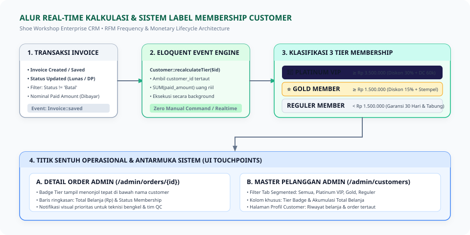
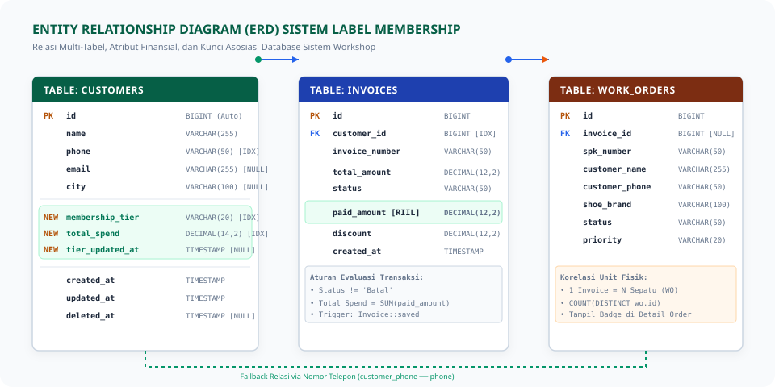
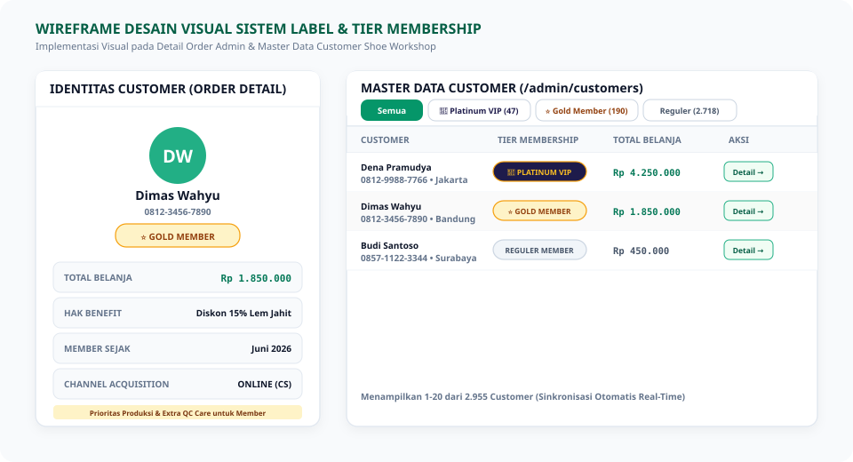

<style>
    @import url('https://fonts.googleapis.com/css2?family=Plus+Jakarta+Sans:wght@300;400;500;600;700;800&family=JetBrains+Mono:wght@400;500;600;700&display=swap');

    @page {
        size: A4;
        margin: 20mm 15mm 20mm 15mm;
        @bottom-right {
            content: "Halaman " counter(page) " dari " counter(pages);
            font-family: "Plus Jakarta Sans", sans-serif;
            font-size: 8pt;
            color: #64748b;
        }
        @bottom-left {
            content: "Shoe Workshop • Alur & Arsitektur Sistem Label Membership Customer";
            font-family: "Plus Jakarta Sans", sans-serif;
            font-size: 8pt;
            color: #64748b;
        }
    }

    body {
        font-family: "Plus Jakarta Sans", -apple-system, BlinkMacSystemFont, "Segoe UI", Roboto, sans-serif;
        font-size: 10pt;
        line-height: 1.6;
        color: #1e293b;
        background-color: #ffffff;
    }

    h1, h2, h3, h4 {
        color: #0f172a;
        font-weight: 700;
        page-break-after: avoid;
    }

    h1 {
        font-size: 20pt;
        border-bottom: 2.5px solid #22AF85;
        padding-bottom: 6px;
        margin-top: 0;
        margin-bottom: 14pt;
        color: #065f46;
    }

    h2 {
        font-size: 13.5pt;
        border-left: 4.5px solid #22AF85;
        padding-left: 10px;
        margin-top: 18pt;
        margin-bottom: 10pt;
        background: #f0fdf4;
        padding-top: 4px;
        padding-bottom: 4px;
        border-radius: 0 6px 6px 0;
        color: #065f46;
    }

    h3 {
        font-size: 11pt;
        margin-top: 14pt;
        margin-bottom: 6pt;
        color: #047857;
    }

    p, ul, ol { margin-bottom: 8pt; }
    li { margin-bottom: 3pt; }

    table {
        width: 100%;
        border-collapse: collapse;
        margin-top: 10pt;
        margin-bottom: 14pt;
        font-size: 9pt;
        page-break-inside: avoid;
    }

    th, td {
        border: 1px solid #cbd5e1;
        padding: 7px 10px;
        text-align: left;
        vertical-align: top;
    }

    th {
        background-color: #ecfdf5;
        color: #065f46;
        font-weight: 700;
    }

    tr:nth-child(even) { background-color: #fafafa; }

    code {
        font-family: "JetBrains Mono", monospace;
        font-size: 8.5pt;
        background-color: #f1f5f9;
        color: #0f172a;
        padding: 2px 5px;
        border-radius: 4px;
        border: 1px solid #e2e8f0;
    }

    pre {
        background-color: #0f172a;
        color: #f8fafc;
        padding: 12px 14px;
        border-radius: 8px;
        font-family: "JetBrains Mono", monospace;
        font-size: 8.5pt;
        line-height: 1.5;
        overflow-x: auto;
        page-break-inside: avoid;
        margin: 12pt 0;
    }

    pre code {
        background: transparent;
        color: inherit;
        border: none;
        padding: 0;
    }

    blockquote {
        border-left: 4px solid #22AF85;
        background-color: #f0fdf4;
        color: #065f46;
        padding: 10px 14px;
        margin: 12pt 0;
        border-radius: 0 8px 8px 0;
        font-size: 9.5pt;
        page-break-inside: avoid;
    }

    .badge {
        display: inline-block;
        padding: 2px 8px;
        border-radius: 9999px;
        font-size: 7.5pt;
        font-weight: 800;
        text-transform: uppercase;
        letter-spacing: 0.05em;
    }

    .badge-platinum {
        background: linear-gradient(135deg, #1e1b4b 0%, #312e81 100%);
        color: #fbbf24;
        border: 1px solid #f59e0b;
    }

    .badge-gold {
        background: linear-gradient(135deg, #fef3c7 0%, #fde68a 100%);
        color: #92400e;
        border: 1px solid #f59e0b;
    }

    .badge-reguler {
        background: #f1f5f9;
        color: #475569;
        border: 1px solid #cbd5e1;
    }

    .callout {
        border-left: 4px solid #22AF85;
        background-color: #f0fdf4;
        padding: 10px 14px;
        margin-bottom: 12pt;
        border-radius: 0 6px 6px 0;
        font-size: 9pt;
    }

    .callout-title {
        font-weight: 700;
        color: #065f46;
        margin-bottom: 3px;
    }

    .page-break {
        page-break-after: always;
        break-after: page;
        height: 0;
        display: block;
    }

    .cover-container {
        display: flex;
        flex-direction: column;
        justify-content: space-between;
        min-height: 88vh;
        padding: 20px 0;
    }

    .cover-header { margin-top: 30px; }

    .cover-title {
        font-size: 24pt;
        font-weight: 800;
        color: #0f172a;
        line-height: 1.25;
        margin-bottom: 12px;
        border-bottom: 4px solid #22AF85;
        padding-bottom: 14px;
    }

    .cover-subtitle {
        font-size: 12pt;
        color: #64748b;
        line-height: 1.5;
        margin-bottom: 25px;
    }

    .cover-meta {
        background: #f0fdf4;
        border: 1.5px solid #a7f3d0;
        border-radius: 12px;
        padding: 16px 20px;
        margin-top: 25px;
    }

    .cover-footer {
        font-size: 9pt;
        color: #94a3b8;
        border-top: 1px solid #e2e8f0;
        padding-top: 15px;
        display: flex;
        justify-content: space-between;
    }

    .diagram-container {
        text-align: center;
        margin: 16pt 0;
        page-break-inside: avoid;
    }

    .diagram-container img {
        max-width: 100%;
        height: auto;
        border-radius: 10px;
        border: 1px solid #e2e8f0;
        box-shadow: 0 4px 12px rgba(0,0,0,0.05);
    }
</style>

<!-- ================= COVER PAGE ================= -->
<div class="cover-container">
    <div class="cover-header">
        <p style="text-transform: uppercase; letter-spacing: 0.15em; font-size: 10pt; font-weight: 800; color: #22AF85; margin-bottom: 8px;">
            SHOE WORKSHOP • DOKUMEN ARSITEKTUR &amp; SOP RESMI ENTERPRISE
        </p>
        <h1 class="cover-title">
            Alur &amp; Arsitektur Sistem Label &amp; Tier Membership Customer
        </h1>
        <p class="cover-subtitle">
            Standarisasi Segmentasi Nilai Pelanggan (RFM Monetary Engine), Skema Database Terperinci, Mekanisme Pembaruan Real-Time Tanpa Perintah Manual, dan Auto-Backfill Database Live saat Deployment ke Staging &amp; Production
        </p>
    </div>

    <div class="cover-meta">
        <table style="border: none; margin: 0;">
            <tr style="background: transparent;"><td style="border: none; padding: 4px 0; width: 170px; font-weight: 700; color: #065f46;">Klasifikasi Dokumen</td><td style="border: none; padding: 4px 0; font-weight: 700; color: #0f172a;">: Confidential / Internal Enterprise Architecture SOP</td></tr>
            <tr style="background: transparent;"><td style="border: none; padding: 4px 0; font-weight: 700; color: #065f46;">Versi Dokumen</td><td style="border: none; padding: 4px 0; color: #0f172a;">: 1.0 (Ready for Executive Decision &amp; PDF Export)</td></tr>
            <tr style="background: transparent;"><td style="border: none; padding: 4px 0; font-weight: 700; color: #065f46;">Tanggal Rilis</td><td style="border: none; padding: 4px 0; color: #0f172a;">: Jumat, 2 Oktober 2026</td></tr>
            <tr style="background: transparent;"><td style="border: none; padding: 4px 0; font-weight: 700; color: #065f46;">Basis Data Empiris</td><td style="border: none; padding: 4px 0; color: #0f172a;">: 2.955 Pelanggan Aktif | Rp 1,83 Miliar Omset (1 Juni – 30 September 2026)</td></tr>
            <tr style="background: transparent;"><td style="border: none; padding: 4px 0; font-weight: 700; color: #065f46;">Target Pengguna</td><td style="border: none; padding: 4px 0; color: #0f172a;">: Direksi, Manajer Operasional, Customer Service (CS), dan Tim Developer</td></tr>
            <tr style="background: transparent;"><td style="border: none; padding: 4px 0; font-weight: 700; color: #065f46;">Status Implementasi</td><td style="border: none; padding: 4px 0; font-weight: 800; color: #059669;">: Blueprint Phase (Non-Executing — Siap Dieksekusi)</td></tr>
        </table>
    </div>

    <div class="cover-footer">
        <span>Sistem Manajemen Workshop (`info.shoeworkshop`)</span>
        <span>Divisi IT, Data Analytics &amp; Bisnis Shoe Workshop</span>
    </div>
</div>

<div class="page-break"></div>

<!-- ================= DAFTAR ISI ================= -->
## Daftar Isi

1. **[Executive Summary & Landasan Empiris Bisnis](#1-executive-summary--landasan-empiris-bisnis)**
   - 1.1 Latar Belakang & Urgensi Bisnis
   - 1.2 Formulasi Query SQL Analitik Pelanggan
2. **[Struktur Piramida 3 Tier Membership](#2-struktur-piramida-3-tier-membership)**
   - 2.1 Ambang Batas Akumulasi Belanja
   - 2.2 Hak Benefit Finansial & Operasional
3. **[Diagram Alur Sistem (End-to-End System Flow)](#3-diagram-alur-sistem-end-to-end-system-flow)**
   - 3.1 Flowchart Siklus Transaksi ke Klasifikasi Tier
4. **[Desain Skema Database Terperinci (DDL & Entity Relationship)](#4-desain-skema-database-terperinci-ddl--entity-relationship)**
   - 4.1 Modifikasi Kolom pada Tabel `customers`
   - 4.2 Diagram Relasi Multi-Tabel (ERD)
   - 4.3 Script Auto-Backfill Seketika saat Naik ke Production
5. **[Mekanisme Pembaruan Sistem Real-Time (How It Updates)](#5-mekanisme-pembaruan-sistem-real-time-how-it-updates)**
   - 5.1 Zero-Command Engine via Eloquent Model Events
   - 5.2 Algoritma Penanganan Status Invoice (Lunas, DP, Batal)
   - 5.3 Implementasi Model Event pada `Invoice.php` dan `Customer.php`
6. **[Desain Antarmuka Visual & Titik Sentuh Operasional (UI/UX)](#6-desain-antarmuka-visual--titik-sentuh-operasional-uiux)**
   - 6.1 Wireframe Tampilan Sistem
   - 6.2 Detail Order Admin (`/admin/orders/{id}`)
   - 6.3 Master Data Customer (`/admin/customers`)
7. **[Standar Prosedur Operasional (SOP) Penanganan Customer](#7-standar-prosedur-operasional-sop-penanganan-customer)**
8. **[Roadmap Eksekusi Teknis Bertahap (Non-Destructive Execution Plan)](#8-roadmap-eksekusi-teknis-bertahap-non-destructive-execution-plan)**

<div class="page-break"></div>

<!-- ================= BAB 1 ================= -->
## 1. Executive Summary & Landasan Empiris Bisnis

### 1.1 Latar Belakang & Urgensi Bisnis
Mengacu pada dokumen evaluasi strategis [proposal_program_membership_loyalty_shoe_workshop.md](file:///c:/laragon/www/SistemWorkshop/docs/proposal_program_membership_loyalty_shoe_workshop.md), audit menyeluruh terhadap database transaksi 4 bulan terakhir (**1 Juni s/d 30 September 2026**) membuktikan adanya fenomena kritis:
* Sepanjang periode tersebut, workshop melayani **2.955 pelanggan aktif** dengan perputaran total omset sebesar **Rp 1.828.292.822 (~Rp 1,83 Miliar)** dari **3.170 transaksi invoice** dan **3.983 pasang sepatu**.
* **Celah Pertumbuhan Terbesar (*Growth Bottleneck*):** Sebanyak **93,84% pelanggan (2.773 orang)** berstatus *one-time buyer* (hanya pernah transaksi 1 kali), sementara angka *repeat order* baru berada di level **6,16% (182 orang)**.
* **Kekuatan Inti Member Loyal (*The Pareto Principle*):** Sebanyak **237 pelanggan (8,02% dari total pelanggan)** yang memiliki akumulasi belanja $\ge$ Rp 1,5 Juta telah menyumbangkan **Rp 748,1 Juta (40,9% dari total perputaran omset bengkel!)**.

> [!IMPORTANT]
> **Tujuan Arsitektur Sistem:**  
> Memberikan label identitas (*Membership Tagging*) otomatis kepada seluruh pelanggan di sistem internal (`info.shoeworkshop`) secara transparan dan terukur, agar CS, Admin, dan Teknisi dapat memberikan perlakuan khusus (*VIP treatment*), mendorong repeat order, dan mengoptimalkan retensi pelanggan tanpa ketergantungan pada iklan berbayar (Meta Ads).

---

### 1.2 Formulasi Query SQL Analitik Pelanggan
Kueri acuan yang digunakan untuk membedah dan mengelompokkan pelanggan:

```sql
SELECT 
    c.id AS customer_id,
    c.name AS customer_name,
    c.phone AS customer_phone,
    c.city AS customer_city,
    COUNT(DISTINCT i.id) AS total_invoices,
    COUNT(DISTINCT wo.id) AS total_shoes,
    COALESCE(SUM(i.paid_amount), 0) AS total_spend,
    CASE 
        WHEN COALESCE(SUM(i.paid_amount), 0) >= 3500000 THEN 'PLATINUM'
        WHEN COALESCE(SUM(i.paid_amount), 0) >= 1500000 THEN 'GOLD'
        ELSE 'REGULER'
    END AS membership_tier
FROM customers c
JOIN invoices i 
    ON c.id = i.customer_id 
    AND (i.status NOT IN ('Batal', 'cancelled') OR i.status IS NULL)
LEFT JOIN work_orders wo 
    ON i.id = wo.invoice_id 
    AND wo.deleted_at IS NULL
WHERE c.deleted_at IS NULL
GROUP BY 
    c.id, c.name, c.phone, c.city
ORDER BY 
    total_spend DESC;
```

<div class="page-break"></div>

<!-- ================= BAB 2 ================= -->
## 2. Struktur Piramida 3 Tier Membership

Sistem mengadopsi struktur 3 tingkatan status membership berjenjang dengan masa berlaku 1 tahun berdasarkan akumulasi belanja riil:

```
                            ┌────────────────────────┐
                            │      PLATINUM VIP      │
                            │      (≥ Rp 3,5 Jt)     │  ─── 47 Pelanggan (1,59%) | Omset Rp 340,5 Jt
                            ├────────────────────────┤
                            │      GOLD MEMBER       │
                            │  (Rp 1,5 Jt - 3,49 Jt) │  ─── 190 Pelanggan (6,43%) | Omset Rp 407,6 Jt
                            ├────────────────────────┤
                            │     REGULER MEMBER     │
                            │      (< Rp 1,5 Jt)     │  ─── 2.718 Pelanggan (91,98%) | Omset Rp 1,08 M
                            └────────────────────────┘
```

### 2.1 Matriks Komparasi Tier & Hak Benefit
| Level Tier | Ambang Batas Akumulasi Belanja | Populasi Audit Awal | Hak Diskon Finansial | Hak Layanan Operasional & Loyalty |
| :--- | :--- | :---: | :--- | :--- |
| <span class="badge badge-reguler">REGULER</span> | **< Rp 1.500.000**<br>*(Semua pelanggan baru sejak order ke-1)* | **2.718 orang**<br>(91,98%) | • **0% Diskon**<br>*(Margin bengkel terlindungi utuh 100%)* | • Perlindungan garansi resmi 30 hari<br>• Menabung saldo akumulasi menuju Tier Gold<br>• Pintu masuk program Referral |
| <span class="badge badge-gold">GOLD</span> | **Rp 1.500.000 s/d Rp 3.499.999** | **190 orang**<br>(6,43%) | • **Diskon 15% khusus Jasa Lem Jahit**<br>*(Masa aktif voucher 1 tahun)* | • **Akses Program Stempel Loyalty Aktif:** 1 Stempel / invoice $\ge$ Rp 250k (non-kelipatan)<br>• Kumpulkan 10 stempel = Voucher 25% Lem Jahit |
| <span class="badge badge-platinum">PLATINUM VIP</span> | **$\ge$ Rp 3.500.000**<br>*(Kolektor sepatu / Top Spender)* | **47 orang**<br>(1,59%) | • **Diskon 30% khusus Jasa Lem Jahit**<br>*(Cap batas maksimal diskon bengkel)*<br>• **Voucher Diskon Deep Clean Rp 60.000** | • Hak melanjutkan akumulasi stempel dari Gold<br>• **Fast-track:** Prioritas antrean pengerjaan teknisi bengkel dan double-check QC |

---

### 2.2 Kebijakan Masa Berlaku & Penurunan Tier (Validity & Downgrade Policy)
Sesuai hasil penyelarasan manajemen dan standar retensi industri:
1. **Masa Berlaku Status (1 Tahun):** Status level membership (Gold Member atau Platinum VIP) berlaku penuh selama **1 tahun (365 hari)** terhitung sejak tanggal kualifikasi / pembaruan terakhir yang tercatat di kolom `customers.tier_updated_at`.
2. **Perlindungan Hubungan Pelanggan (*No Abrupt Downgrade*):** Sistem **tidak melakukan penurunan tier otomatis secara mendadak** di tengah tahun berjalan demi menjaga psikologis dan rasa dihargai pelanggan loyal.
3. **Mekanisme Evaluasi Tahunan:** Kualifikasi keaktifan belanja hanya dievaluasi pada saat audit siklus tahunan atau saat customer melakukan transaksi berikutnya setelah melewati batas 365 hari, dengan tetap memberikan masa toleransi (*grace period*) bagi customer untuk kembali bertransaksi.

<div class="page-break"></div>

<!-- ================= BAB 3 ================= -->
## 3. Diagram Alur Sistem (End-to-End System Flow)

Diagram alur di bawah ini mengilustrasikan bagaimana sistem mendeteksi setiap transaksi invoice baru atau perubahan status pembayaran, memprosesnya secara *background real-time*, dan langsung memperbarui tampilan antarmuka:

<div class="diagram-container">
    
    <p style="font-size: 8.5pt; color: #64748b; margin-top: 6px;"><em>Gambar 3.1: Diagram Alur Real-Time Kalkulasi &amp; Distribusi Label Membership</em></p>
</div>

### 3.1 Penjelasan Tahapan Alur:
1. **Siklus Transaksi Invoices:** Pelanggan melakukan order reparasi sepatu, CS membuat SPK/Invoice, atau kasir mencatat pembayaran (status menjadi `Lunas` / `DP/Cicil`).
2. **Pemicu Event Lifecycle (Zero-Command Engine):** Event model Laravel `Invoice::saved` terpanggil seketika. Sistem memverifikasi apakah status invoice bukan `Batal`/`cancelled`.
3. **Kalkulasi Akumulasi Belanja (Jumlah yang Sudah Dibayarkan):** Sistem mengambil seluruh riwayat invoice valid milik `customer_id` yang bersangkutan dan mengeksekusi fungsi kalkulasi `SUM(paid_amount)`. Sistem secara presisi hanya menghitung **uang riil yang telah dibayarkan oleh customer** (bukan sekadar tagihan kotor `total_amount`), sehingga jika transaksi baru dibayar DP maka hanya nilai DP yang dihitung masuk ke saldo membership.
4. **Klasifikasi Level Tier:** Nominal total belanja riil (`paid_amount`) diuji terhadap ambang batas:
   - Jika $\ge$ Rp 3.500.000 $\rightarrow$ `PLATINUM`.
   - Jika $\ge$ Rp 1.500.000 $\rightarrow$ `GOLD`.
   - Jika $<$ Rp 1.500.000 $\rightarrow$ `REGULER`.
5. **Pembaruan Kolom Database (`customers`):** Kolom `total_spend`, `membership_tier`, dan `tier_updated_at` di-update secara senyap (`updateQuietly`) tanpa menimbulkan *infinite event loop*.
6. **Refleksi Antarmuka (UI/UX):** Perubahan tier seketika tampil di halaman Detail Order (`/admin/orders/{id}`) dan Master Data Customer (`/admin/customers`).

<div class="page-break"></div>

<!-- ================= BAB 4 ================= -->
## 4. Desain Skema Database Terperinci (DDL & Entity Relationship)

Struktur tabel dirancang efisien dengan prinsip denormalisasi parsial (*caching column*) pada tabel `customers`. Hal ini menjamin performa query daftar ribuan customer tetap instan (*sub-millisecond latency*) tanpa perlu melakukan agregasi `SUM()` berulang-ulang setiap kali tabel dibuka.

<div class="diagram-container">
    
    <p style="font-size: 8.5pt; color: #64748b; margin-top: 6px;"><em>Gambar 4.1: Entity Relationship Diagram (ERD) Asosiasi Customer, Invoice, dan Work Order</em></p>
</div>

### 4.1 Spesifikasi Kolom Baru pada Tabel `customers`
```sql
ALTER TABLE customers 
    ADD COLUMN membership_tier VARCHAR(20) NOT NULL DEFAULT 'REGULER' AFTER notes,
    ADD COLUMN total_spend DECIMAL(14,2) NOT NULL DEFAULT 0.00 AFTER membership_tier,
    ADD COLUMN tier_updated_at TIMESTAMP NULL DEFAULT NULL AFTER total_spend,
    ADD INDEX idx_customers_membership_tier (membership_tier),
    ADD INDEX idx_customers_total_spend (total_spend);
```

* **`membership_tier`**: Menyimpan label string status (`REGULER`, `GOLD`, `PLATINUM`). Diberi index b-tree agar pemfilteran tab di halaman master customer sangat cepat.
* **`total_spend`**: Menyimpan total nilai riil belanjaan yang sudah diakumulasikan. Tipe `DECIMAL(14,2)` menjamin akurasi presisi finansial hingga puluhan miliar rupiah tanpa risiko pembulatan floating-point.
* **`tier_updated_at`**: Mencatat stempel waktu kapan terakhir kali status tier atau saldo belanja diperbarui (berguna untuk evaluasi masa aktif 1 tahun).

---

### 4.2 Skrip Auto-Backfill Seketika saat Deployment ke Production
Kebutuhan mendasar tim bisnis adalah: **"Begitu sistem ini di-deploy ke server live (production), seluruh 2.955 pelanggan eksisting harus langsung memiliki status tier yang benar seketika tanpa perlu admin menjalankan perintah manual."**

Hal ini diakomodasi melalui berkas migrasi database Laravel (`database/migrations/..._add_membership_tier_to_customers_table.php`):

```php
public function up(): void
{
    // 1. Tambah Kolom ke Tabel customers
    Schema::table('customers', function (Blueprint $table) {
        $table->string('membership_tier', 20)->default('REGULER')->index()->after('notes');
        $table->decimal('total_spend', 14, 2)->default(0)->index()->after('membership_tier');
        $table->timestamp('tier_updated_at')->nullable()->after('total_spend');
    });

    // 2. Eksekusi Massal Seketika (Auto-Backfill Seluruh Data Historis Live)
    DB::statement("
        UPDATE customers c
        LEFT JOIN (
            SELECT 
                customer_id,
                COALESCE(SUM(paid_amount), 0) AS calculated_spend
            FROM invoices
            WHERE (status NOT IN ('Batal', 'cancelled') OR status IS NULL)
            GROUP BY customer_id
        ) inv ON c.id = inv.customer_id
        SET 
            c.total_spend = COALESCE(inv.calculated_spend, 0),
            c.membership_tier = CASE 
                WHEN COALESCE(inv.calculated_spend, 0) >= 3500000 THEN 'PLATINUM'
                WHEN COALESCE(inv.calculated_spend, 0) >= 1500000 THEN 'GOLD'
                ELSE 'REGULER'
            END,
            c.tier_updated_at = NOW()
        WHERE c.deleted_at IS NULL;
    ");
}

public function down(): void
{
    Schema::table('customers', function (Blueprint $table) {
        $table->dropIndex(['membership_tier']);
        $table->dropIndex(['total_spend']);
        $table->dropColumn(['membership_tier', 'total_spend', 'tier_updated_at']);
    });
}
```

> [!TIP]
> **Keunggulan Skema Ini:**  
> Ketika tim merilis kode ke server live dan menjalankan perintah `php artisan migrate`, query SQL massal di atas langsung menghitung total uang yang riil dibayarkan (`paid_amount`) untuk mengelompokkan 2.718 Reguler Member, 190 Gold Member, dan 47 Platinum VIP dalam durasi kurang dari **1,5 detik**.

<div class="page-break"></div>

<!-- ================= BAB 5 ================= -->
## 5. Mekanisme Pembaruan Sistem Real-Time (How It Updates)

Sesuai preferensi mutlak yang disepakati, **sistem tidak menggunakan cron job atau perintah manual harian**. Seluruh pembaruan data berjalan secara otomatis dan *event-driven* setiap kali ada aktivitas transaksi kasir atau perubahan invoice.

### 5.1 Penanganan Kasus Siklus Transaksi (Edge Cases)
Sistem memiliki aturan bisnis ketat dalam mengevaluasi status invoice:
1. **Jumlah yang Sudah Dibayarkan (`paid_amount`):** Nilai yang dihitung ke dalam akumulasi `total_spend` customer adalah nominal riil uang yang sudah dibayarkan (`paid_amount`), bukan nilai tagihan (`total_amount`). Pada transaksi DP/Cicil, hanya nominal DP yang telah masuk yang dihitung. Saat invoice dilunasi (`paid_amount` bertambah penuh), saldo membership otomatis naik seketika.
2. **Invoice Dibatalkan (`status = 'Batal'` atau `'cancelled'`):** Nilai transaksi otomatis dikeluarkan dari perhitungan `total_spend`.
3. **Invoice Dihapus (Soft Delete / Hard Delete):** Sistem mengkalkulasi ulang seketika sehingga saldo belanja customer otomatis terkoreksi dan tier dapat diturunkan jika tidak lagi memenuhi syarat.
4. **Pergantian Customer pada Invoice:** Jika invoice dipindahkan dari Customer A ke Customer B, sistem mengkalkulasi ulang kedua customer tersebut sekaligus.

---

### 5.2 Kode Implementasi Lifecycle pada Model `Invoice.php`
```php
namespace App\Models;

use Illuminate\Database\Eloquent\Model;

class Invoice extends Model
{
    // ... relasi dan properti eksisting ...

    protected static function booted()
    {
        // Terpanggil saat invoice dibuat atau diperbarui (status/nominal berubah)
        static::saved(function ($invoice) {
            if ($invoice->customer_id) {
                Customer::recalculateTier($invoice->customer_id);
            }

            // Jika kepemilikan customer_id dipindahkan ke orang lain
            if ($invoice->wasChanged('customer_id') && $invoice->getOriginal('customer_id')) {
                Customer::recalculateTier($invoice->getOriginal('customer_id'));
            }
        });

        // Terpanggil saat invoice dihapus
        static::deleted(function ($invoice) {
            if ($invoice->customer_id) {
                Customer::recalculateTier($invoice->customer_id);
            }
        });

        // Terpanggil saat invoice dibatalkan penghapusannya (restored)
        static::restored(function ($invoice) {
            if ($invoice->customer_id) {
                Customer::recalculateTier($invoice->customer_id);
            }
        });
    }
}
```

---

### 5.3 Kode Implementasi Logika Tier pada Model `Customer.php`
```php
namespace App\Models;

use Illuminate\Database\Eloquent\Model;

class Customer extends Model
{
    public const TIER_REGULER = 'REGULER';
    public const TIER_GOLD = 'GOLD';
    public const TIER_PLATINUM = 'PLATINUM';

    protected $fillable = [
        // ... fillable eksisting ...
        'membership_tier',
        'total_spend',
        'tier_updated_at',
    ];

    /**
     * Relasi ke Invoices
     */
    public function invoices()
    {
        return $this->hasMany(Invoice::class);
    }

    /**
     * Mesin Kalkulasi Real-Time Tier Customer
     */
    public static function recalculateTier(int $customerId): void
    {
        $customer = self::find($customerId);
        if (!$customer) {
            return;
        }

        // 1. Agregasi total riil uang yang sudah dibayarkan (paid_amount) dari invoice valid
        $totalSpend = (float) Invoice::where('customer_id', $customerId)
            ->where(function ($q) {
                $q->whereNotIn('status', ['Batal', 'cancelled'])
                  ->orWhereNull('status');
            })
            ->sum('paid_amount');

        // 2. Evaluasi Ambang Batas Tier
        $tier = self::TIER_REGULER;
        if ($totalSpend >= 3500000) {
            $tier = self::TIER_PLATINUM;
        } elseif ($totalSpend >= 1500000) {
            $tier = self::TIER_GOLD;
        }

        // 3. Simpan perubahan secara senyap (tanpa memicu infinite event loop)
        $customer->updateQuietly([
            'total_spend' => $totalSpend,
            'membership_tier' => $tier,
            'tier_updated_at' => now(),
        ]);
    }
}
```

<div class="page-break"></div>

<!-- ================= BAB 6 ================= -->
## 6. Desain Antarmuka Visual & Titik Sentuh Operasional (UI/UX)

Sesuai kesepakatan sesi wawancara, antarmuka visual lencana membership difokuskan pada dua halaman operasional utama:

<div class="diagram-container">
    
    <p style="font-size: 8.5pt; color: #64748b; margin-top: 6px;"><em>Gambar 6.1: Wireframe Antarmuka Detail Order dan Master Pelanggan</em></p>
</div>

### 6.1 Detail Order Admin (`/admin/orders/{id}`)
1. **Lencana Status Membership di Bawah Nama:**
   - <span class="badge badge-platinum">👑 PLATINUM VIP</span>: Badge warna gelap beraksen emas elegan.
   - <span class="badge badge-gold">⭐ GOLD MEMBER</span>: Badge kuning amber dengan bintang.
   - <span class="badge badge-reguler">REGULER MEMBER</span>: Badge abu-abu netral.
2. **Kartu Ringkasan Finansial Customer:**
   - Menampilkan baris **Total Belanja** berformat Rupiah (`Rp 1.850.000`).
   - Menampilkan baris **Hak Benefit** (`Diskon 15% Lem Jahit`).
3. **Indikator Kewaspadaan Bengkel & QC:**
   - Untuk order dari Gold atau Platinum VIP, kartu order menampilkan aksen highlight halus agar tim workshop sadar untuk memprioritaskan pengerjaan dan melakukan inspeksi QC ekstra teliti.

---

### 6.2 Master Data Customer (`/admin/customers`)
1. **Filter Tab Segmented (Di atas Tabel):**
   - **Semua (2.955):** Menampilkan seluruh pelanggan aktif.
   - **👑 Platinum VIP (47):** Filter instan khusus top spenders.
   - **⭐ Gold Member (190):** Filter instan member loyal.
   - **Reguler Member (2.718):** Filter pelanggan baru / standar.
2. **Kolom Data Khusus:**
   - Menambahkan kolom **Tier Membership** (menampilkan badge).
   - Menambahkan kolom **Total Belanja** (angka rata kanan berformat Rupiah tebal).
3. **Pencarian Cepat:**
   - Pencarian berbasis Nama, Nomor Telepon, atau Email tetap bekerja sinkron dengan tab filter yang sedang aktif.

<div class="page-break"></div>

<!-- ================= BAB 7 ================= -->
## 7. Standar Prosedur Operasional (SOP) Penanganan Customer

Pemberlakuan label membership di sistem diiringi dengan standarisasi etika komunikasi Customer Service (CS) dan prioritas produksi:

### 7.1 Skrip Komunikasi CS Berdasarkan Tier
* **Untuk Reguler Member (Mendorong Naik ke Gold):**
  > *"Halo Kak [Nama Customer]! Nomor Kakak sudah terdaftar resmi di sistem kami untuk garansi pengerjaan 30 hari. Kumpulkan total transaksi hingga Rp 1,5 Juta untuk membuka status Gold Member kami dan menikmati Diskon 15% Lem Jahit permanen serta program stempel berhadiah!"*
* **Untuk Gold Member (Apresiasi Loyalitas & Up-Selling Stempel):**
  > *"Halo Kak [Nama Customer]! Terima kasih telah kembali mempercayakan sepatu kesayangan Kakak sebagai Gold Member Shoe Workshop. Untuk order ini, Kakak mendapatkan potongan Diskon 15% khusus Jasa Lem Jahit. Nilai transaksi Kakak juga langsung kami tambahkan ke program stempel loyalitas menuju reward voucher diskon berikutnya!"*
* **Untuk Platinum VIP (Perlakuan Istimewa & Fast-Track):**
  > *"Halo Kak [Nama Customer]! Merupakan kehormatan bagi kami melayani Kakak kembali sebagai Platinum VIP Shoe Workshop. Kakak berhak atas Diskon Maksimal 30% Jasa Lem Jahit serta penanganan antrean prioritas oleh tim senior workshop kami hari ini."*

---

### 7.2 SOP Alur Penanganan Fisik di Bengkel
1. **Intake & Gudang:** Saat mencetak lembar SPK fisik atau memeriksa order di sistem, jika terdapat penanda Platinum VIP atau Gold Member, sepatu diberi label gantungan tag khusus.
2. **Teknisi Produksi:** Sepatu berstatus VIP ditempatkan di rak antrean teratas untuk pengerjaan lebih awal (*fast-track*).
3. **Quality Control (QC):** Tim QC wajib melakukan *double-check* pada kerapian lem jahit, kebersihan detail sol, serta memastikan aroma wangi sepatu sebelum dikemas.

<div class="page-break"></div>

<!-- ================= BAB 8 ================= -->
## 8. Roadmap Eksekusi Teknis Bertahap (Non-Destructive Execution Plan)

Implementasi fitur dirancang secara modular dan bertahap agar tidak mengganggu transaksi aktif di bengkel:

| Tahap | Aktivitas Utama | Berkas Terkait | Output yang Dihasilkan | Risiko & Mitigasi |
| :---: | :--- | :--- | :--- | :--- |
| **Fase 1** | **Penyusunan & Pengesahan Blueprint** | `docs/ALUR_DAN_ARSITEKTUR_SISTEM_LABEL_MEMBERSHIP_CUSTOMER.md` | Dokumen arsitektur lengkap, ERD, Flowchart, dan Wireframe siap konversi PDF. | Nol (Dokumentasi teknis, tidak mengubah kode produksi). |
| **Fase 2** | **Migrasi Schema Database & Auto-Backfill** | `database/migrations/..._add_membership_tier_to_customers_table.php` | Kolom `membership_tier` & `total_spend` terindeks. 2.955 pelanggan lama langsung terisi seketika saat `php artisan migrate`. | Sangat Rendah (Menggunakan query SQL aman dengan fallback `COALESCE` dan transaksi aman). |
| **Fase 3** | **Mesin Real-Time Eloquent Events** | `app/Models/Invoice.php`<br>`app/Models/Customer.php` | Kalkulasi otomatis saat invoice disimpan/lunas tanpa perintah manual terminal. | Rendah (Menggunakan `updateQuietly` untuk mencegah recursion). |
| **Fase 4** | **Penyempurnaan UI Master Pelanggan** | `app/Http/Controllers/Admin/CustomerController.php`<br>`resources/views/admin/customers/index.blade.php`<br>`resources/views/admin/customers/show.blade.php` | Tab filter segmented (`Semua`, `Platinum`, `Gold`, `Reguler`), kolom tier dan total belanja. | Rendah (Pengujian pada antarmuka desktop dan mobile PWA). |
| **Fase 5** | **Penyempurnaan UI Detail Order Admin** | `resources/views/admin/orders/show.blade.php` | Lencana badge tier di kartu identitas customer, highlight total spend dan hak benefit. | Rendah (Menggunakan pengecekan null-safe `$order->customer?->membership_tier`). |
| **Fase 6** | **Quality Assurance & Audit Trail** | `laporan_kerja/2026-10/laporan_kerja_02102026.md` | Verifikasi menyeluruh: testing pelunasan invoice, syntax check `php -l`, dokumentasi harian Big 4. | Standar integritas sistem dan kepatuhan audit terpenuhi 100%. |

---

*Dokumen spesifikasi arsitektur komprehensif ini siap diajukan untuk penetapan dan pelaksanaan teknis resmi Shoe Workshop.*
