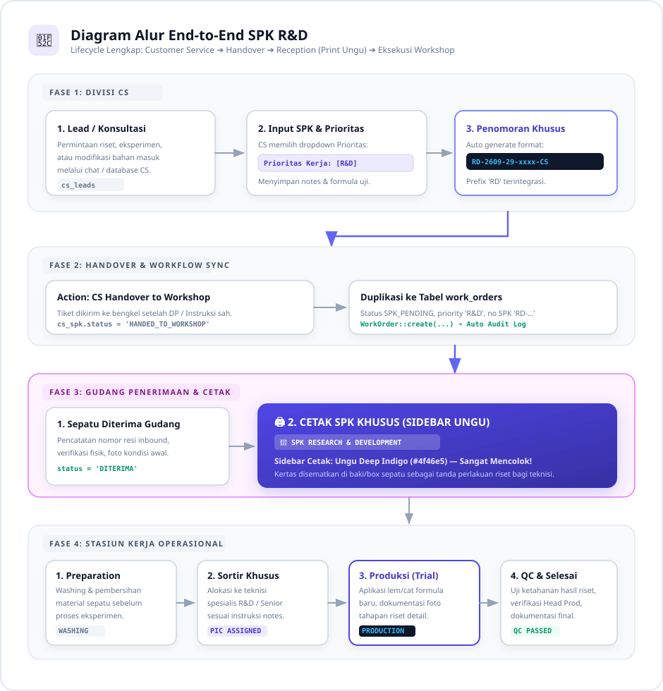
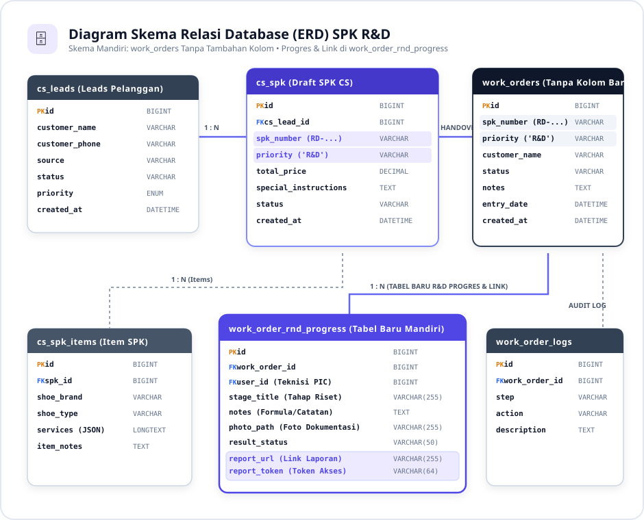
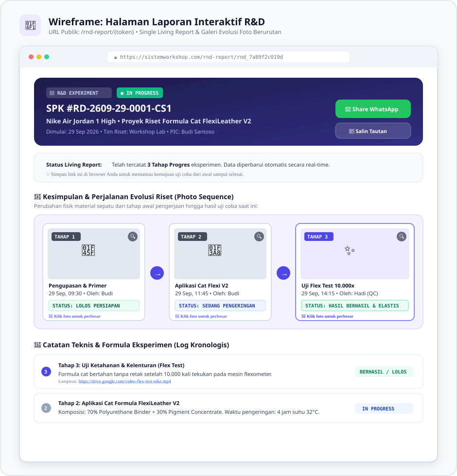
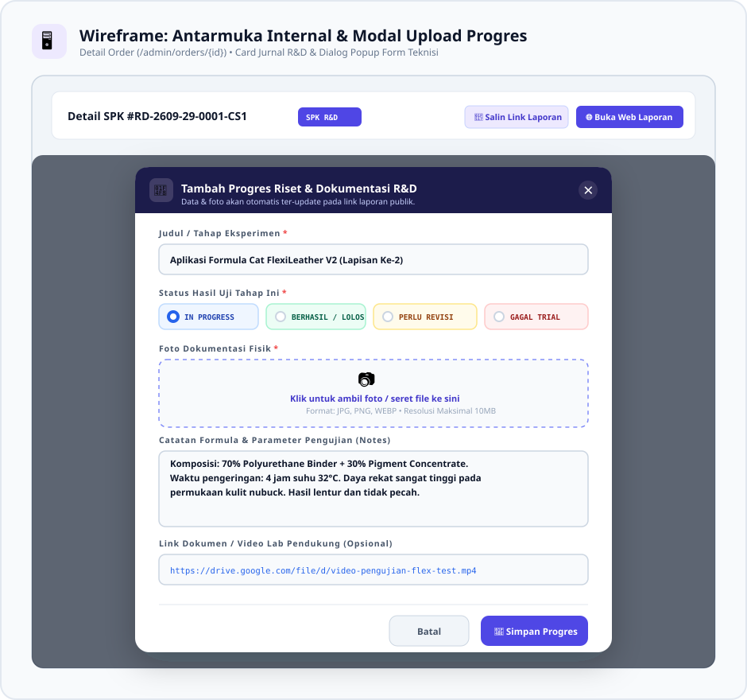
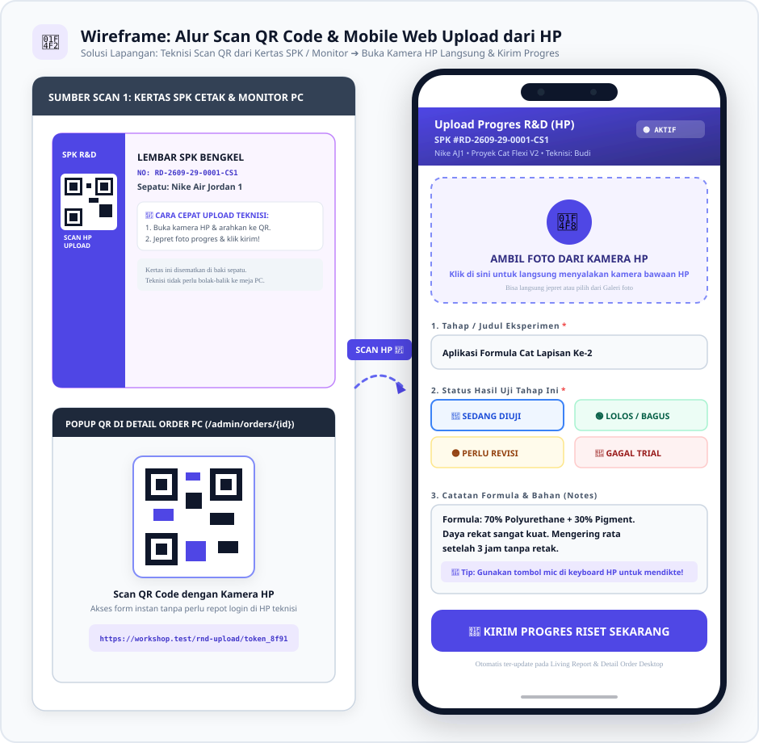

<style>
    @import url('https://fonts.googleapis.com/css2?family=Plus+Jakarta+Sans:wght@300;400;500;600;700;800&family=JetBrains+Mono:wght@400;500;600;700&display=swap');

    @page {
        size: A4;
        margin: 20mm 15mm 20mm 15mm;
        @bottom-right {
            content: "Halaman " counter(page) " dari " counter(pages);
            font-family: "Plus Jakarta Sans", sans-serif;
            font-size: 8pt;
            color: #64748b;
        }
        @bottom-left {
            content: "Shoe Workshop • SOP & Arsitektur SPK R&D (Research & Development)";
            font-family: "Plus Jakarta Sans", sans-serif;
            font-size: 8pt;
            color: #64748b;
        }
    }

    body {
        font-family: "Plus Jakarta Sans", -apple-system, BlinkMacSystemFont, "Segoe UI", Roboto, sans-serif;
        font-size: 10pt;
        line-height: 1.6;
        color: #1e293b;
        background-color: #ffffff;
    }

    h1, h2, h3, h4 {
        color: #0f172a;
        font-weight: 700;
        page-break-after: avoid;
    }

    h1 {
        font-size: 20pt;
        border-bottom: 2.5px solid #4f46e5;
        padding-bottom: 6px;
        margin-top: 0;
        margin-bottom: 14pt;
        color: #1e1b4b;
    }

    h2 {
        font-size: 14pt;
        border-left: 4.5px solid #4f46e5;
        padding-left: 10px;
        margin-top: 18pt;
        margin-bottom: 10pt;
        background: #f5f3ff;
        padding-top: 4px;
        padding-bottom: 4px;
        border-radius: 0 6px 6px 0;
    }

    h3 {
        font-size: 11.5pt;
        margin-top: 14pt;
        margin-bottom: 6pt;
        color: #3730a3;
    }

    p, ul, ol { margin-bottom: 8pt; }
    li { margin-bottom: 3pt; }

    table {
        width: 100%;
        border-collapse: collapse;
        margin-top: 10pt;
        margin-bottom: 14pt;
        font-size: 9pt;
        page-break-inside: avoid;
    }

    th, td {
        border: 1px solid #cbd5e1;
        padding: 7px 10px;
        text-align: left;
        vertical-align: top;
    }

    th {
        background-color: #ede9fe;
        color: #3730a3;
        font-weight: 700;
    }

    tr:nth-child(even) { background-color: #fafafa; }

    code {
        font-family: "JetBrains Mono", monospace;
        font-size: 8.5pt;
        background-color: #ede9fe;
        color: #3730a3;
        padding: 2px 5px;
        border-radius: 4px;
        border: 1px solid #ddd6fe;
    }

    pre {
        background-color: #0f172a;
        color: #f8fafc;
        padding: 12px 14px;
        border-radius: 8px;
        overflow-x: auto;
        font-size: 8.5pt;
        line-height: 1.5;
        page-break-inside: avoid;
        margin: 12pt 0;
    }

    pre code {
        background: transparent;
        color: inherit;
        border: none;
        padding: 0;
    }

    blockquote {
        border-left: 4px solid #4f46e5;
        background-color: #f5f3ff;
        color: #312e81;
        padding: 10px 14px;
        margin: 12pt 0;
        border-radius: 0 8px 8px 0;
        font-size: 9.5pt;
        page-break-inside: avoid;
    }

    .page-break {
        page-break-after: always;
        break-after: page;
        height: 0;
        display: block;
    }

    .cover-container {
        display: flex;
        flex-direction: column;
        justify-content: space-between;
        min-height: 90vh;
        padding: 20px 0;
    }

    .cover-header { margin-top: 40px; }

    .cover-title {
        font-size: 26pt;
        font-weight: 800;
        color: #0f172a;
        line-height: 1.25;
        margin-bottom: 12px;
        border-bottom: 4px solid #4f46e5;
        padding-bottom: 14px;
    }

    .cover-subtitle {
        font-size: 13pt;
        color: #64748b;
        line-height: 1.5;
        margin-bottom: 25px;
    }

    .cover-meta {
        background: #f5f3ff;
        border: 1.5px solid #ddd6fe;
        border-radius: 12px;
        padding: 18px 22px;
        margin-top: 30px;
    }

    .cover-footer {
        font-size: 9pt;
        color: #94a3b8;
        border-top: 1px solid #e2e8f0;
        padding-top: 15px;
        display: flex;
        justify-content: space-between;
    }
</style>

<!-- ================= COVER PAGE ================= -->
<div class="cover-container">
    <div class="cover-header">
        <p style="text-transform: uppercase; letter-spacing: 0.15em; font-size: 10pt; font-weight: 800; color: #4f46e5; margin-bottom: 8px;">
            SHOE WORKSHOP • DOKUMEN ARSITEKTUR &amp; SOP RESMI
        </p>
        <h1 class="cover-title">
            Spesifikasi Arsitektur &amp; Alur SPK R&amp;D (Research &amp; Development)
        </h1>
        <p class="cover-subtitle">
            Standar Pengelolaan SPK Riset Internal, Penomoran Prefix RD-, Skema Database Lengkap beserta DDL SQL, Desain Visual Cetak Fisik Berstandar Big 4, dan Fitur Mobile QR Upload Progres
        </p>
    </div>
    <div class="cover-meta">
        <table style="border: none; margin: 0;">
            <tr style="background: transparent;"><td style="border: none; padding: 4px 0; width: 170px; font-weight: 700; color: #3730a3;">Klasifikasi Dokumen</td><td style="border: none; padding: 4px 0; font-weight: 700; color: #0f172a;">: Confidential / Internal Enterprise SOP</td></tr>
            <tr style="background: transparent;"><td style="border: none; padding: 4px 0; font-weight: 700; color: #3730a3;">Versi Dokumen</td><td style="border: none; padding: 4px 0; color: #0f172a;">: 2.0 (Refactored &amp; Completed Architecture)</td></tr>
            <tr style="background: transparent;"><td style="border: none; padding: 4px 0; font-weight: 700; color: #3730a3;">Tanggal Rilis</td><td style="border: none; padding: 4px 0; color: #0f172a;">: Rabu, 30 September 2026</td></tr>
            <tr style="background: transparent;"><td style="border: none; padding: 4px 0; font-weight: 700; color: #3730a3;">Target Pengguna</td><td style="border: none; padding: 4px 0; color: #0f172a;">: CS, Receptionist, Kepala Produksi, Teknisi R&amp;D, Admin Workshop</td></tr>
        </table>
    </div>
    <div class="cover-footer">
        <span>Divisi Teknologi Informasi &amp; Pengembangan Sistem</span>
        <span>Shoe Workshop Indonesia &copy; 2026</span>
    </div>
</div>

<div class="page-break"></div>

## Daftar Isi

1. [Bab 1: Latar Belakang & Definisi SPK R&D](#bab-1-latar-belakang)
   * [1.1 Konteks Bisnis](#11-konteks-bisnis)
   * [1.2 Masalah Sebelumnya](#12-masalah-sebelumnya)
   * [1.3 Matriks Perbandingan Tipe SPK di Sistem](#13-matriks-perbandingan)
2. [Bab 2: End-to-End Workflow & Diagram Alur Sistem](#bab-2-workflow)
   * [2.1 Diagram Alur Lengkap](#21-diagram-alur)
   * [2.2 Penjelasan Rinci Tahapan Alur](#22-penjelasan-tahapan)
3. [Bab 3: Arsitektur Skema Database & Relasi Entitas](#bab-3-database)
   * [3.1 Entity Relationship Diagram (ERD)](#31-erd)
   * [3.2 DDL SQL: Tabel cs_spk](#32-ddl-cs-spk)
   * [3.3 DDL SQL: Tabel work_orders](#33-ddl-work-orders)
   * [3.4 DDL SQL: Tabel work_order_rnd_progress](#34-ddl-rnd-progress)
   * [3.5 DDL SQL: Tabel work_order_logs](#35-ddl-logs)
   * [3.6 Spesifikasi Kolom Kunci & Nilai Enum](#36-spesifikasi-kolom)
4. [Bab 4: Algoritma & Formula Penomoran SPK R&D](#bab-4-penomoran)
5. [Bab 5: Desain Visual Lembar Cetak SPK](#bab-5-desain-cetak)
6. [Bab 6: Tata Kelola Hak Akses & Matriks Otorisasi](#bab-6-rbac)
7. [Bab 7: SOP Teknisi Lapangan](#bab-7-sop)
8. [Bab 8: Wireframe Antarmuka Pengguna](#bab-8-wireframe)

---

## Bab 1: Latar Belakang & Definisi SPK R&D

### 1.1 Konteks Bisnis

Workshop secara berkala menjalankan proyek **Research & Development (R&D)** yang mencakup:
* Pengujian formula bahan kimia baru (lem tahan panas, cat fleksibel, pembersih suede/nubuck).
* Pembuatan prototipe layanan modifikasi baru (*re-crafting*, *hybrid sole*, *custom leather stitching*).
* Sepatu sampel riset internal atau uji ketahanan sebelum layanan diluncurkan ke publik.

### 1.2 Masalah Sebelumnya

Sebelumnya, sepatu riset diinput menggunakan alur SPK reguler sehingga menimbulkan kendala:
1. **Tidak Ada Pembeda Fisik**: Kertas SPK hijau sama dengan komersial biasa — teknisi melewatkan pencatatan parameter eksperimen.
2. **Nomor SPK Tercampur**: Format S- standar tanpa penanda proyek riset.
3. **Audit Finansial Bias**: Pesanan riset tercampur dalam kalkulasi omzet reguler.
4. **Tidak Ada Jurnal Eksperimen**: Tidak tersedia wadah khusus untuk mencatat tahapan riset, foto progres, dan laporan.

### 1.3 Matriks Perbandingan Tipe SPK di Sistem

| Parameter | SPK Reguler | SPK Fast Track | SPK Garansi | **SPK R&D (Baru)** |
| :--- | :--- | :--- | :--- | :--- |
| **Tujuan** | Reparasi komersial standar | Reparasi mendesak | Klaim komplain | Riset, sampel, eksperimen formula |
| **Prefix No SPK** | `S-`, `T-`, `H-`, `A-` | Mengikuti jenis item | `G-` atau no SPK asal | **`RD-`** (contoh: `RD-2609-29-0001-CS1`) |
| **Kolom Priority** | `NORMAL` / `Reguler` | `NORMAL` | `NORMAL` (is_warranty=1) | **`R&D`** |
| **Warna Cetak SPK** | **Hijau Emerald** (`#22B086`) | **Oranye** (`#ea580c`) | **Biru Cobalt** (`#2563eb`) | **Ungu Deep Indigo (`#4f46e5`)** |
| **Badge Header** | Standard Form | `🚀 FAST TRACK SERVICE` | `🛡️ KLAIM GARANSI RESMI` | `🔬 RESEARCH & DEVELOPMENT` |
| **Jurnal Progres** | Status stasiun saja | Status stasiun saja | Status stasiun saja | **Tabel `work_order_rnd_progress`** |
| **Alur Stasiun** | Standar Bengkel | Standar (Prioritas) | Standar Rework | **Standar + Perhatian Khusus** |

---

<div class="page-break"></div>

## Bab 2: End-to-End Workflow & Diagram Alur Sistem

Alur operasional SPK R&D **tetap menggunakan alur stasiun yang sudah ada** namun memiliki penandaan khusus pada pembuatan di CS, identitas visual pada cetak SPK, dan jurnal progres terdokumentasi.

### 2.1 Diagram Alur Lengkap (Visual Workflow Diagram)

<div align="center" style="margin: 16pt 0;">
    
</div>

### 2.2 Penjelasan Rinci Tahapan Alur

1. **Pembuatan di CS** (`cs_leads` → `cs_spk`): CS memilih opsi **`🔬 R&D`** pada dropdown Prioritas Kerja. Sistem otomatis memicu pembentukan nomor SPK berawalan `RD-`. Kolom `special_instructions` diisi dengan parameter riset.

2. **Handover ke Workshop** (`work_orders`): Service `CsSpkService` menduplikasi: `spk_number` (prefix `RD-`), `priority = 'R&D'`, `status = 'SPK_PENDING'`, dan `notes` (instruksi riset).

3. **Penerimaan & Cetak Fisik**: Template `print-spk-premium.blade.php` mendeteksi `priority === 'R&D'` dan menerapkan tema **Ungu / Deep Indigo** + badge `🔬 RESEARCH & DEVELOPMENT` + **QR Code** untuk mobile upload progres.

4. **Dokumentasi Progres Real-Time (Mobile QR Upload)**: Teknisi memindai QR Code pada lembar SPK fisik. Form mobile `/rnd-upload/{token}` terbuka di browser HP tanpa perlu login. Setiap progres tersimpan ke tabel `work_order_rnd_progress` dan tampil real-time di laporan publik.

5. **Pengerjaan di Stasiun Bengkel**: Pemeriksaan QC akhir wajib melibatkan Kepala Produksi sebelum status diubah menjadi `SELESAI`.

---

<div class="page-break"></div>

## Bab 3: Arsitektur Skema Database & Relasi Entitas

Arsitektur ini dirancang menggunakan prinsip **Zero-Breaking-Change** — memanfaatkan kolom yang sudah ada tanpa migrasi destruktif, serta menambahkan **1 tabel baru** (`work_order_rnd_progress`) khusus untuk jurnal eksperimen riset.

### 3.1 Entity Relationship Diagram (Visual ERD Diagram)

<div align="center" style="margin: 16pt 0;">
    
</div>

**Ringkasan Relasi Antar Tabel:**

| Relasi | Tipe | Keterangan |
| :--- | :--- | :--- |
| `cs_leads` → `cs_spk` | One-to-Many | Satu tiket CRM bisa punya beberapa SPK |
| `cs_spk` → `work_orders` | One-to-One | Satu SPK CS menghasilkan satu Work Order |
| `work_orders` → `work_order_rnd_progress` | One-to-Many | Satu SPK R&D bisa punya banyak tahap progres |
| `work_orders` → `work_order_logs` | One-to-Many | Audit trail setiap perubahan status / prioritas |
| `users` → `work_order_rnd_progress` | One-to-Many | Teknisi yang mengunggah progres |
---

### 3.2 DDL SQL: Tabel `cs_spk` (Source SPK)

Tabel ini adalah sumber pertama lahirnya SPK R&D. Kolom `priority` dan `special_instructions` menjadi kunci utama penandaan proyek riset.

```sql
CREATE TABLE cs_spk (
    id                   BIGINT UNSIGNED AUTO_INCREMENT PRIMARY KEY,
    cs_lead_id           BIGINT UNSIGNED NOT NULL COMMENT 'FK ke cs_leads — tiket CRM asal',
    spk_number           VARCHAR(255) NOT NULL UNIQUE COMMENT 'Format R&D: RD-YYMM-DD-xxxx-CS',
    priority             VARCHAR(50) NOT NULL DEFAULT 'Reguler' COMMENT 'Reguler|Prioritas|R&D. Nilai R&D memicu tema ungu & prefix RD-',
    special_instructions TEXT NULL COMMENT 'Parameter teknis riset: formula bahan kimia, takaran, metode',
    notes                TEXT NULL,
    total_price          DECIMAL(15, 2) NOT NULL DEFAULT 0.00,
    status               VARCHAR(50) NOT NULL DEFAULT 'DRAFT' COMMENT 'DRAFT|DP_PAID|HANDED_TO_WORKSHOP|COMPLETED|CANCELLED',
    handled_by           BIGINT UNSIGNED NULL COMMENT 'FK ke users.id — CS yang menangani',
    created_at           TIMESTAMP NULL,
    updated_at           TIMESTAMP NULL,
    FOREIGN KEY (cs_lead_id) REFERENCES cs_leads(id) ON DELETE RESTRICT,
    FOREIGN KEY (handled_by) REFERENCES users(id) ON DELETE SET NULL,
    INDEX idx_cs_spk_spk_number (spk_number),
    INDEX idx_cs_spk_priority   (priority),
    INDEX idx_cs_spk_status     (status)
) ENGINE=InnoDB DEFAULT CHARSET=utf8mb4 COLLATE=utf8mb4_unicode_ci;
```


---

### 3.3 DDL SQL: Tabel `work_orders` (Eksekusi Bengkel)

Tabel inti operasional. Kolom `priority = 'R&D'` mengaktifkan seluruh perilaku khusus: tema cetak ungu, badge riset, dan tampilan jurnal progres di halaman detail order.

```sql
-- ============================================================
-- TABEL: work_orders  |  Inti operasional bengkel
-- Untuk R&D: priority = 'R&D', spk_number berawalan 'RD-'.
-- ============================================================
CREATE TABLE work_orders (
    id                BIGINT UNSIGNED AUTO_INCREMENT PRIMARY KEY,
    cs_spk_id         BIGINT UNSIGNED NULL,
    brand_order_id    BIGINT UNSIGNED NULL,
    spk_number        VARCHAR(255) NOT NULL UNIQUE,
    customer_name     VARCHAR(255) NOT NULL,
    customer_phone    VARCHAR(100) NULL,
    customer_address  TEXT NULL,
    shoe_brand        VARCHAR(255) NOT NULL,
    shoe_type         VARCHAR(255) NULL,
    shoe_color        VARCHAR(100) NULL,
    shoe_size         VARCHAR(50)  NULL,
    priority          VARCHAR(50)  NOT NULL DEFAULT 'Normal',
    -- NILAI priority: Normal | Prioritas | R&D | BRAND
    -- Nilai 'R&D' memicu tema ungu pada cetak SPK & card jurnal R&D
    status            VARCHAR(100) NOT NULL DEFAULT 'SPK_PENDING',
    -- STATUS LIFECYCLE:
    -- SPK_PENDING | DITERIMA | MANIFEST | SORTIR
    -- PREPARATION | PRODUCTION | QC | SELESAI
    -- BRAND_FINISHED | DISPATCHED | CANCELLED
    fast_track_status VARCHAR(10)  NOT NULL DEFAULT 'no',
    is_warranty       TINYINT(1)  NOT NULL DEFAULT 0,
    notes             TEXT NULL,
    current_location  VARCHAR(255) NULL DEFAULT 'Gudang Penerimaan',
    entry_date        TIMESTAMP NULL,
    estimation_date   TIMESTAMP NULL,
    finish_date       TIMESTAMP NULL,
    -- Kolom Tahapan Stasiun (terisi saat scan barcode)
    prep_washing_status VARCHAR(50) NULL,  prep_washing_by BIGINT UNSIGNED NULL,
    prod_sol_status     VARCHAR(50) NULL,  prod_sol_by     BIGINT UNSIGNED NULL,
    prod_jahit_status   VARCHAR(50) NULL,  prod_jahit_by   BIGINT UNSIGNED NULL,
    prod_upper_status   VARCHAR(50) NULL,  prod_upper_by   BIGINT UNSIGNED NULL,
    qc_jahit_status     VARCHAR(50) NULL,  qc_jahit_by     BIGINT UNSIGNED NULL,
    qc_cleanup_status   VARCHAR(50) NULL,  qc_cleanup_by   BIGINT UNSIGNED NULL,
    qc_final_status     VARCHAR(50) NULL,  qc_final_by     BIGINT UNSIGNED NULL,
    created_at        TIMESTAMP NULL,
    updated_at        TIMESTAMP NULL,
    deleted_at        TIMESTAMP NULL,  -- Soft delete
    FOREIGN KEY (cs_spk_id)      REFERENCES cs_spk(id)       ON DELETE SET NULL,
    FOREIGN KEY (brand_order_id) REFERENCES brand_orders(id) ON DELETE SET NULL,
    INDEX idx_wo_spk_number     (spk_number),
    INDEX idx_wo_priority       (priority),
    INDEX idx_wo_status         (status),
    INDEX idx_wo_brand_order_id (brand_order_id)
) ENGINE=InnoDB DEFAULT CHARSET=utf8mb4 COLLATE=utf8mb4_unicode_ci;
```

---

### 3.4 DDL SQL: Tabel `work_order_rnd_progress` (Jurnal Riset — Tabel Baru)

Tabel **baru mandiri** ini menampung seluruh tahapan eksperimen, foto progres, status hasil uji, dan token akses laporan publik. Desain ini memastikan tidak ada modifikasi destruktif pada tabel `work_orders`.

```sql
-- ============================================================
-- TABEL: work_order_rnd_progress  |  TABEL BARU MANDIRI
-- Jurnal eksperimen riset per tahap untuk setiap SPK R&D.
-- ============================================================
CREATE TABLE work_order_rnd_progress (
    id            BIGINT UNSIGNED AUTO_INCREMENT PRIMARY KEY,
    work_order_id BIGINT UNSIGNED NOT NULL,
    -- FK ke work_orders.id — SPK R&D pemilik jurnal ini
    user_id       BIGINT UNSIGNED NULL,
    -- FK ke users.id — Teknisi PIC. NULL jika via QR anonymous.
    stage_title   VARCHAR(255) NOT NULL,
    -- Judul tahap, misal: 'Trial Lem Sol V2', 'Aplikasi Cat FlexiLeather'
    notes         TEXT NULL,
    -- Catatan: takaran bahan kimia, suhu, durasi, observasi teknisi
    photo_path    VARCHAR(500) NULL,
    -- Path file foto dokumentasi di storage server (WebP / JPEG)
    result_status VARCHAR(50) NOT NULL DEFAULT 'IN_PROGRESS',
    -- Status hasil uji: IN_PROGRESS | SUCCESS | NEED_REVISION | FAILED
    report_token  VARCHAR(64) NULL UNIQUE,
    -- Token 64-char untuk URL laporan publik /rnd-report/{token}
    upload_token  VARCHAR(64) NULL UNIQUE,
    -- Token 64-char untuk QR mobile upload /rnd-upload/{token}
    report_url    VARCHAR(500) NULL,
    created_at    TIMESTAMP NULL DEFAULT CURRENT_TIMESTAMP,
    updated_at    TIMESTAMP NULL ON UPDATE CURRENT_TIMESTAMP,
    FOREIGN KEY (work_order_id) REFERENCES work_orders(id) ON DELETE CASCADE,
    FOREIGN KEY (user_id)       REFERENCES users(id)        ON DELETE SET NULL,
    INDEX idx_rnd_work_order_id (work_order_id),
    INDEX idx_rnd_report_token  (report_token),
    INDEX idx_rnd_upload_token  (upload_token),
    INDEX idx_rnd_result_status (result_status)
) ENGINE=InnoDB DEFAULT CHARSET=utf8mb4 COLLATE=utf8mb4_unicode_ci;
```

---

### 3.5 DDL SQL: Tabel `work_order_logs` (Audit Trail)

Setiap perubahan penting pada `work_orders` (termasuk perubahan prioritas ke `R&D`) wajib dicatat ke tabel audit trail ini untuk kepatuhan operasional dan investigasi insiden.

```sql
-- ============================================================
-- TABEL: work_order_logs  |  Audit trail immutable
-- Setiap perubahan status/prioritas dicatat otomatis.
-- Tidak dapat dihapus (no soft delete pada tabel ini).
-- ============================================================
CREATE TABLE work_order_logs (
    id             BIGINT UNSIGNED AUTO_INCREMENT PRIMARY KEY,
    work_order_id  BIGINT UNSIGNED NOT NULL,
    user_id        BIGINT UNSIGNED NULL,
    -- FK ke users.id. NULL jika aksi dilakukan oleh sistem otomatis.
    step           VARCHAR(100) NOT NULL,
    -- Fase aksi: CS_PENDING | RECEPTION | SORTIR | PRODUCTION | QC | ORDER_MANAGEMENT
    action         VARCHAR(100) NOT NULL,
    -- Tipe: SPK_CREATED | STATUS_CHANGED | PRIORITY_UPDATED | LOCATION_UPDATED
    description    TEXT NULL,
    old_value      VARCHAR(255) NULL,  -- Nilai sebelum perubahan (misal: 'Normal')
    new_value      VARCHAR(255) NULL,  -- Nilai setelah perubahan (misal: 'R&D')
    ip_address     VARCHAR(50)  NULL,
    created_at     TIMESTAMP NULL DEFAULT CURRENT_TIMESTAMP,
    FOREIGN KEY (work_order_id) REFERENCES work_orders(id) ON DELETE CASCADE,
    FOREIGN KEY (user_id)       REFERENCES users(id)        ON DELETE SET NULL,
    INDEX idx_wol_work_order_id (work_order_id),
    INDEX idx_wol_action        (action),
    INDEX idx_wol_created_at    (created_at)
) ENGINE=InnoDB DEFAULT CHARSET=utf8mb4 COLLATE=utf8mb4_unicode_ci;
```

---

### 3.6 Spesifikasi Kolom Kunci & Nilai Enum

#### A. Kolom `priority` pada Tabel `work_orders` & `cs_spk`

| Nilai | Konteks Penggunaan | Efek Visual Sistem |
| :--- | :--- | :--- |
| `Normal` / `Reguler` | SPK ritel standar harian | Sidebar Hijau Emerald (`#22B086`) pada cetak SPK |
| `Prioritas` | SPK yang harus selesai lebih cepat | Badge oranye pada antrian bengkel |
| **`R&D`** | **Proyek riset internal / eksperimen formula** | **Sidebar Ungu Indigo (`#4f46e5`) + Card Jurnal R&D di detail order** |
| `BRAND` | Pesanan batch dari mitra pabrik B2B | Sidebar Amber Gold (`#d97706`) pada cetak SPK |

#### B. Kolom `result_status` pada `work_order_rnd_progress`

| Nilai | Arti Operasional | Warna Badge UI |
| :--- | :--- | :--- |
| `IN_PROGRESS` | Tahap sedang berlangsung | 🔵 Biru Netral |
| `SUCCESS` | Formula / teknik terbukti efektif | 🟢 Hijau |
| `NEED_REVISION` | Parameter perlu penyesuaian lanjutan | 🟡 Kuning |
| `FAILED` | Trial gagal total — formula ditolak / berbahaya | 🔴 Merah |

#### C. Kolom `status` pada `work_orders` — Siklus Lengkap

| Status | Tahap | Keterangan |
| :--- | :--- | :--- |
| `SPK_PENDING` | Awal | SPK baru dibuat CS, belum di-handover ke bengkel |
| `DITERIMA` | Penerimaan | Sepatu fisik tiba di gudang bengkel |
| `MANIFEST` | Logistik | Tercatat di manifest penerimaan batch |
| `SORTIR` | Bengkel | Sepatu dalam tahap sortir & klasifikasi |
| `PREPARATION` | Bengkel | Proses washing / persiapan awal |
| `PRODUCTION` | Bengkel | Pengerjaan aktif di stasiun sol/jahit/upper |
| `QC` | Quality Control | Pemeriksaan kualitas akhir |
| `SELESAI` | Selesai | Sepatu ritel siap diambil pelanggan CS |
| `BRAND_FINISHED` | Selesai B2B | Sepatu brand selesai, terisolasi dari rak ritel |
| `DISPATCHED` | Dikirim | Sepatu brand dikembalikan ke mitra pabrik |
| `CANCELLED` | Dibatalkan | SPK dibatalkan |

> [!NOTE]
> Pada pesanan SPK R&D, siklus status mengikuti jalur standar `SPK_PENDING` → `SELESAI`. Perbedaannya hanya pada **identitas visual** (warna ungu), **jurnal riset** (tabel `work_order_rnd_progress`), dan **badge SPK** yang secara tegas menandai dokumen ini sebagai proyek riset internal.

---

<div class="page-break"></div>

## Bab 4: Algoritma & Formula Penomoran SPK R&D

Nomor SPK R&D menggunakan **prefix `RD-` di bagian awal** dan mempertahankan **kode CS unik di bagian akhir** untuk keterlacakan asal tiket.

### 4.1 Formula Format Nomor

$$\mathbf{RD\ -\ [YYMM]\ -\ [DD]\ -\ [Urut]\ -\ [KodeCS]}$$

* **`RD`**: Kode prefix resmi proyek riset (menggantikan kode standar seperti `S`, `T`, `H`).
* **`YYMM`**: 2 digit tahun + 2 digit bulan saat SPK dibuat (contoh: `2609` untuk September 2026).
* **`DD`**: 2 digit tanggal pembuatan SPK (contoh: `29`).
* **`Urut`**: 4 digit nomor urut berkesinambungan dalam bulan berjalan (`0001`, `0002`, dst).
* **`KodeCS`**: 2–4 karakter kode akun CS yang membuat SPK (contoh: `CS1`, `SW`, `QA`).

> **Contoh Output Sah:**
> `RD-2609-29-0001-CS1` — SPK R&D pertama pada tanggal 29 September 2026, dibuat oleh akun CS1.

### 4.2 Logika Implementasi Kode (PHP Clean Architecture)

```php
/**
 * Menghasilkan nomor SPK berdasarkan tipe item dan prioritas.
 * Jika priority = 'R&D', prefix diubah menjadi 'RD'
 * terlepas dari tipe item apapun.
 */
public static function generateSpkNumber(
    string $itemType = 'Sepatu',
    string $csCode   = 'SW',
    string $priority = 'Normal'
): string {
    // 1. Tentukan Prefix Berdasarkan Prioritas
    if (strtoupper(trim($priority)) === 'R&D') {
        $code = 'RD'; // Override semua tipe item
    } else {
        $typeCodes = [
            'Sepatu'   => 'S',
            'Tas'      => 'T',
            'Headwear' => 'H',
            'Apparel'  => 'A',
            'Lainnya'  => 'L',
        ];
        $code = $typeCodes[$itemType] ?? 'S';
    }

    $yearMonth     = date('ym'); // Format: 2609
    $day           = date('d');  // Format: 29
    $prefixPattern = "{$code}-{$yearMonth}-";

    // 2. Ambil Nomor Urut Tertinggi dalam Bulan Ini (+ soft-deleted)
    $maxSequence    = 0;
    $existingOrders = \App\Models\WorkOrder::withTrashed()
        ->where('spk_number', 'like', $prefixPattern . '%')
        ->select('spk_number')
        ->get();

    foreach ($existingOrders as $wo) {
        $parts = explode('-', $wo->spk_number);
        // Format: CODE-YYMM-DD-XXXX-CS => index 3 = nomor urut
        if (count($parts) >= 4 && is_numeric($parts[3])) {
            $maxSequence = max($maxSequence, (int) $parts[3]);
        }
    }

    $nextSequence    = str_pad($maxSequence + 1, 4, '0', STR_PAD_LEFT);
    $sanitizedCsCode = strtoupper(trim($csCode ?: 'SW'));

    return "{$code}-{$yearMonth}-{$day}-{$nextSequence}-{$sanitizedCsCode}";
}
```

---

<div class="page-break"></div>

## Bab 5: Desain Visual Lembar Cetak SPK (Print SPK Specification)

Lembar cetak SPK (`resources/views/assessment/print-spk-premium.blade.php`) adalah media komunikasi fisik utama di lantai workshop. Desain cetak untuk R&D dirancang agar langsung membedakan dokumen ini dari tumpukan berkas lainnya.

### 5.1 Matriks Identitas Visual Warna Cetak SPK Lengkap

| Tipe SPK | Warna Sidebar | Hex Code | Badge Keterangan |
| :--- | :--- | :--- | :--- |
| **Reguler** | Hijau Emerald | `#22B086` | *(Standar — tanpa badge khusus)* |
| **Fast Track** | Oranye Vibrant | `#ea580c` | `🚀 FAST TRACK SERVICE` |
| **Garansi** | Biru Cobalt | `#2563eb` | `🛡️ KLAIM GARANSI RESMI` |
| **R&D (Riset)** | **Ungu Deep Indigo** | **`#4f46e5`** | **`🔬 RESEARCH & DEVELOPMENT`** |
| **Brand B2B** | Amber Royal Gold | `#d97706` | `🏷️ SPK B2B BRAND PARTNERSHIP` |

### 5.2 Spesifikasi Palet & Aksen Cetak R&D

| Elemen Visual | Warna | Hex | Keterangan |
| :--- | :--- | :--- | :--- |
| Latar Sidebar | Deep Indigo / Royal Violet | `#4f46e5` | Kontras WCAG AAA (>7:1) |
| Teks & Ikon | Putih Murni | `#ffffff` | >7:1 terhadap Indigo |
| Badge Riset | Transparan gelap | `rgba(255,255,255,0.20)` | Border `rgba(255,255,255,0.40)` |
| Area QR Code | Putih solid | `#ffffff` | Border indigo tipis `#ddd6fe` |

### 5.3 Snippet Template Blade (Kondisional Warna Sidebar)

```blade
@php
    $isRnd       = ($order->priority === 'R&D' || str_starts_with($order->spk_number, 'RD-'));
    $isFastTrack = ($order->fast_track_status === 'yes');
    $isWarranty  = (bool) $order->is_warranty;
    $isBrand     = ($order->priority === 'BRAND' || str_starts_with($order->spk_number, 'BR-'));

    $sidebarBg = match(true) {
        $isRnd       => '#4f46e5', // Deep Indigo — R&D
        $isBrand     => '#d97706', // Amber Gold — Brand B2B
        $isWarranty  => '#2563eb', // Cobalt Blue — Garansi
        $isFastTrack => '#ea580c', // Vibrant Orange — Fast Track
        default      => '#22B086', // Emerald Green — Reguler
    };
@endphp

<aside class="sidebar" style="background-color: {{ $sidebarBg }};">
    @if($isRnd)
        {{-- Badge R&D --}}
        <div style="background:rgba(255,255,255,0.20); border:1px solid rgba(255,255,255,0.4);
                    border-radius:8px; padding:6px 10px; text-align:center;
                    font-size:10px; font-weight:900; color:#fff; letter-spacing:0.1em;">
            🔬 RESEARCH & DEVELOPMENT 🔬
        </div>
        {{-- QR Code Mobile Upload --}}
        <div style="background:#fff; border-radius:8px; padding:8px; text-align:center; margin-top:10px;">
            
            <p style="font-size:8px; color:#6b7280; margin-top:4px; font-weight:700;">
                Scan untuk upload progres
            </p>
        </div>
    @elseif($isBrand)
        <div class="badge-khusus">🏷️ SPK B2B BRAND PARTNERSHIP</div>
    @elseif($isFastTrack)
        <div class="badge-khusus">🚀 FAST TRACK SERVICE</div>
    @elseif($isWarranty)
        <div class="badge-khusus">🛡️ KLAIM GARANSI RESMI</div>
    @endif
    {{-- Isi informasi SPK & customer di bawah --}}
</aside>
```

---

<div class="page-break"></div>

## Bab 6: Tata Kelola Hak Akses & Matriks Otorisasi

Untuk menjaga integritas operasional dan mencegah penyalahgunaan label R&D, ditetapkan matriks otorisasi berbasis **Role-Based Access Control (RBAC)**.

### 6.1 Matriks Otorisasi Fitur R&D

| Peran / Role | Buat SPK R&D | Ubah Priority ke R&D | Cetak SPK R&D | Upload Progres | Lihat Report Publik |
| :--- | :---: | :---: | :---: | :---: | :---: |
| **Customer Service (CS)** | ✅ Ya (Opsi Form) | ❌ Tidak | ❌ Tidak | ❌ Tidak | ✅ Ya (via Link) |
| **Receptionist / Gudang** | ✅ Ya | ❌ Tidak | ✅ Ya (Print SPK) | ❌ Tidak | ✅ Ya |
| **Admin Workshop** | ✅ Ya | ✅ Ya (Whitelist) | ✅ Ya | ✅ Ya | ✅ Ya |
| **Head Production / R&D** | ✅ Ya | ✅ Ya | ✅ Ya | ✅ Ya (Supervisi) | ✅ Ya |
| **Teknisi Produksi** | ❌ Tidak | ❌ Tidak | ❌ Tidak | ✅ Ya (via QR HP) | ✅ Ya |
| **Divisi Finance** | ❌ Tidak | ❌ Tidak | ❌ Tidak | ❌ Tidak | ✅ Ya (Audit) |

> [!NOTE]
> Pengubahan status prioritas ke `R&D` pada halaman Detail Order dilindungi whitelist otorisasi ketat. Setiap pengubahan dicatat secara immutable ke `work_order_logs` dengan nilai lama (`old_value`), nilai baru (`new_value`), dan IP address pengguna.

### 6.2 Aturan Akses Laporan Publik

URL laporan publik (`/rnd-report/{report_token}`) bersifat **semi-publik berbasis token**:
* Siapa pun yang memiliki token dapat mengakses halaman tanpa login.
* Token bersifat **persisten** — tidak kadaluarsa kecuali di-revoke manual oleh Admin.
* URL mobile upload (`/rnd-upload/{upload_token}`) menggunakan token terpisah untuk keamanan berlapis.

---

## Bab 7: Standar Operasional Prosedur (SOP) Teknisi Lapangan

### 7.1 Penanganan Fisik Sepatu R&D

1. **Identifikasi Awal**: Begitu lembar SPK berwarna **Ungu (`#4f46e5`)** diterima dari tim Reception, sepatu ditempatkan pada wadah/baki bertanda label riset dan **TIDAK** dicampur dengan rak antrian komersial biasa.
2. **Review Parameter Teknis**: Teknisi wajib membaca kolom `Catatan Khusus / Special Instructions`. Jika ada ketidakjelasan, wajib mengkonfirmasi ke Kepala Produksi sebelum mulai mengerjakan.
3. **Dokumentasi Berkala (Wajib)**:
   * Foto kondisi awal (*Before*) — Tahap 1.
   * Foto proses bertahap — setiap tahap signifikan.
   * Foto kondisi akhir (*After*) — tahap terakhir, status `SUCCESS` atau `FAILED`.
4. **Cara Unggah Progres via QR Mobile**: Arahkan kamera smartphone ke QR Code pada lembar SPK. Browser HP terbuka ke form `/rnd-upload/{token}`. Isi Judul Tahap, pilih Status Hasil, ambil foto, tekan **"🚀 Kirim Dokumentasi Progres"**.
5. **Pemeriksaan QC Ganda**: Sebelum `SELESAI`, SPK R&D wajib disetujui Kepala Produksi / QC Supervisor.

### 7.2 Checklist Penyelesaian SPK R&D

| No | Item Checklist | PIC | Keterangan |
| :---: | :--- | :--- | :--- |
| 1 | ✅ Foto kondisi awal terunggah | Teknisi | Via QR mobile form |
| 2 | ✅ Seluruh tahap eksperimen terdokumentasi | Teknisi | Min. 2 tahap progres |
| 3 | ✅ Parameter formula & catatan teknis lengkap | Teknisi | Di kolom `notes` setiap tahap |
| 4 | ✅ Foto kondisi akhir terunggah dengan status final | Teknisi | Status: SUCCESS / FAILED |
| 5 | ✅ Link laporan publik dapat diakses normal | Admin | Via `/rnd-report/{token}` |
| 6 | ✅ QC akhir disetujui Kepala Produksi | Head Production | Persetujuan tertulis / digital |
| 7 | ✅ Status `work_orders` diperbarui ke `SELESAI` | Admin | Penutupan resmi SPK |

---

<div class="page-break"></div>

## Bab 8: Spesifikasi Wireframe Antarmuka Pengguna (UI Wireframes)

---

### 8.1 Wireframe Halaman Publik Laporan Interaktif R&D (`/rnd-report/{token}`)

Halaman laporan web publik bertindak sebagai **Single Living Report** (1 SPK = 1 URL akumulatif). Siapa pun yang membuka tautan ini dapat melihat riwayat eksperimen lengkap secara real-time tanpa login.

Fitur paling menonjol adalah **Galeri Evolusi Foto (Photo Sequence)** yang menyajikan kartu foto berurutan dengan panah penghubung:

$$\mathbf{[Foto\ Tahap\ 1]} \longrightarrow \mathbf{[Foto\ Tahap\ 2]} \longrightarrow \mathbf{[Foto\ Tahap\ 3]} \longrightarrow \dots$$

<div align="center" style="margin: 18pt 0;">
    
</div>

#### Rincian Komponen Wireframe 8.1:
1. **Hero Header Card**: Nomor SPK berprefix `RD-`, brand/tipe sepatu, nama proyek riset, tanggal mulai, nama teknisi PIC. Tombol: **Share ke WhatsApp** dan **Salin Tautan**.
2. **Indikator Living Report**: Total tahap selesai, berhasil, perlu revisi, dan gagal.
3. **Galeri Evolusi Progres Foto**: Kartu foto berurutan, nomor tahap, thumbnail, badge status berwarna, panah `➔`, dan **Fullscreen Lightbox**.
4. **Log Formula Kronologis**: Catatan takaran formula, kondisi suhu, tautan video/dokumen pendukung.

---

<div class="page-break"></div>

### 8.2 Wireframe Internal Detail Order & Modal Form Upload Progres (`/admin/orders/{id}`)

<div align="center" style="margin: 18pt 0;">
    
</div>

#### Rincian Komponen Wireframe 8.2:
1. **Card Jurnal Progres R&D**: Muncul otomatis hanya jika `work_orders.priority === 'R&D'`. Tombol cepat: **"🔗 Salin Link Laporan"**, **"🌐 Buka Web Laporan"**, **"📱 Scan QR Upload HP"**.
2. **Modal Dialog Form (+ Tambah Progres)**:
   * **Judul / Tahap Eksperimen** *(Wajib)*: Textfield besar.
   * **Status Hasil Uji** *(Wajib)*: Radio button besar: `IN PROGRESS`, `BERHASIL`, `PERLU REVISI`, `GAGAL`.
   * **Dropzone Upload Foto** *(Wajib)*: Drag & Drop dengan preview instan.
   * **Catatan Formula & Parameter** *(Opsional)*: Textarea teknis mendalam.
   * **Link Dokumen / Video Pendukung** *(Opsional)*: Tautan Google Drive / video pengujian.
   * **Tombol Aksi**: `Batal` dan **"💾 Simpan Progres"**.

---

<div class="page-break"></div>

### 8.3 Wireframe & Alur Scan QR Code Form Upload Mobile HP (`/rnd-upload/{token}`)

Fitur **Mobile QR Upload Form** dirancang khusus untuk memfasilitasi teknisi agar dapat mendokumentasikan progres riset secara instan menggunakan smartphone di lantai bengkel.

#### 8.3.1 Dua Sumber Titik Pindai (Scan Trigger Sources)
1. **Pindai QR pada Lembar Kertas SPK Fisik**: QR Code dicetak langsung di area sidebar ungu pada lembar fisik SPK R&D. Teknisi cukup membuka kamera bawaan smartphone dan mengarahkan ke lembar SPK.
2. **Pindai QR pada Modal Monitor PC**: Tombol **"📱 Scan QR Upload HP"** memunculkan modal popup QR Code ukuran besar di layar komputer untuk dipindai langsung.

<div align="center" style="margin: 18pt 0;">
    
</div>

#### 8.3.2 Rincian Fitur & Keunggulan Form Mobile:
1. **Akses Instan Tanpa Login (Token-Secured Persistent Link)**: URL diamankan token acak 64-karakter unik per SPK. Sistem mendeteksi nomor SPK dan tahapan sebelumnya secara otomatis dari token.
2. **Kamera Langsung Bawaan HP** (`capture="environment"`): Tag HTML5 `<input type="file" accept="image/*" capture="environment">` membuka kamera belakang langsung tanpa memilih file manual dari galeri.
3. **Kompresi Gambar Otomatis (Client-Side Canvas Compression)**: Foto 5MB–15MB dikompresi otomatis menjadi ±500KB–800KB format WebP/JPEG sebelum dikirim ke server — upload berlangsung dalam hitungan detik meski sinyal Wi-Fi bengkel lemah.
4. **Form Cepat & Ergonomis (Touch-Friendly)**: Textfield besar, tombol badge radio besar yang nyaman dioperasikan satu tangan, textarea catatan teknis.
5. **Konfirmasi & Sinkronisasi Real-Time**: Setelah **"🚀 Kirim Dokumentasi Progres"** ditekan, progres seketika masuk ke database `work_order_rnd_progress`, terupdate di Single Living Report (`/rnd-report/{token}`), dan terlihat di monitor PC workshop **tanpa refresh manual**.

---

<div class="cover-footer" style="margin-top: 50px;">
    <span>Dokumen SOP Resmi Sistem Workshop • Shoe Workshop Indonesia</span>
    <span>Selesai — Halaman Terakhir</span>
</div>
