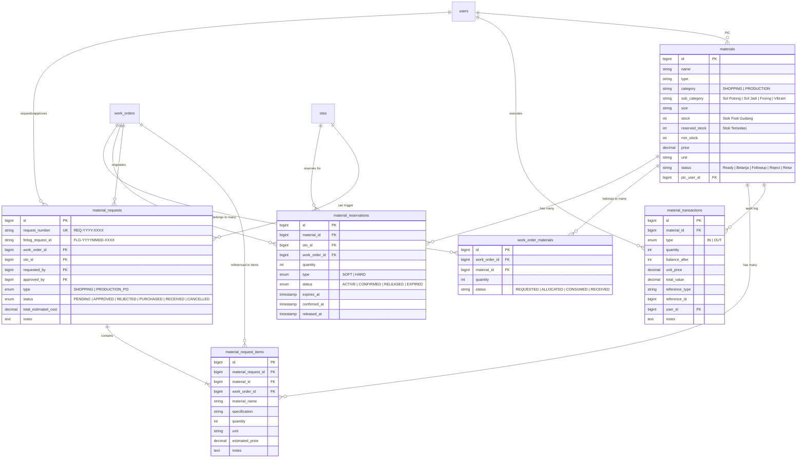

# 📦 Dokumentasi Lengkap Sistem Material, Stok, Material Request & Isolasi SPK

> **Sistem Workshop — Divisi Workshop & Gudang**  
> **Tanggal Dokumen:** Senin, 14 September 2026  
> **Kategori:** Arsitektur Sistem, Database Schema, & Workflow Operasional

---

## 📑 Daftar Isi
1. [Ringkasan Eksekutif & Konsep Dasar](#1-ringkasan-eksekutif--konsep-dasar)
2. [Arsitektur Konsep Stok: Fisik, Terisolasi (Reserved), & Tersedia (Available)](#2-arsitektur-konsep-stok-fisik-terisolasi-reserved--tersedia-available)
3. [Fitur Material Terisolasi pada SPK & Penawaran OTO (One-Time Offer)](#3-fitur-material-terisolasi-pada-spk--penawaran-oto-one-time-offer)
4. [Fitur Material Request & Integrasi Pengadaan Finlog](#4-fitur-material-request--integrasi-pengadaan-finlog)
5. [Smart Auto-Allocation Engine (Mesin Alokasi Otomatis Berbasis Prioritas)](#5-smart-auto-allocation-engine-mesin-alokasi-otomatis-berbasis-prioritas)
6. [Kartu Stok & Audit Mutasi Material (Material Transactions)](#6-kartu-stok--audit-mutasi-material-material-transactions)
7. [Detail Skema Tabel Database (ERD & Data Dictionary)](#7-detail-skema-tabel-database-erd--data-dictionary)
8. [Workflow End-to-End (Alur Kerja Operasional Menyeluruh)](#8-workflow-end-to-end-alur-kerja-operasional-menyeluruh)
9. [Aturan Bisnis & Mekanisme Pengamanan Integritas Data](#9-aturan-bisnis--mekanisme-pengamanan-integritas-data)

---

## 1. Ringkasan Eksekutif & Konsep Dasar

Dalam ekosistem **Sistem Workshop**, material merupakan aset kritikal yang menghubungkan operasional **Customer Service (CS)**, **Gudang Logistik**, **Workshop Sortir & Produksi**, serta **Finlog (Finance & Logistic)**.

Sistem mengkategorisasikan material ke dalam dua kelompok besar:
1. **`PRODUCTION` (Material Stok Produksi):** Material standar workshop yang memiliki stok fisik di rak gudang (contoh: Sol Potong, Sol Jadi, Foxing, Vibram, lem, benang, cat standar). Penggunaannya dilacak ketat melalui mutasi kartu stok, batas minimum stok (*minimum stock alert*), dan sistem reservasi/alokasi.
2. **`SHOPPING` (Material Belanja / Custom):** Material spesifik atau suku cadang khusus yang tidak distok secara reguler (contoh: outsole tipe langka, upper kulit custom permintaan pelanggan). Material ini langsung dialirkan ke alur pengajuan budget belanja (*budget request*) ke sistem Finlog.

---

## 2. Arsitektur Konsep Stok: Fisik, Terisolasi (Reserved), & Tersedia (Available)

Untuk mencegah *double-booking* (dua SPK menggunakan material fisik yang sama) dan kehabisan stok mendadak saat pengerjaan teknisi, sistem menerapkan **formula 3-lapis stok**:

```
┌────────────────────────────────────────────────────────┐
│                   TOTAL STOK FISIK                     │
│               (`materials.stock`)                      │
├────────────────────────────┬───────────────────────────┤
│    STOK TERISOLASI / KUNCI  │       STOK TERSEDIA       │
│ (`materials.reserved_stock`)│  (`getAvailableStock()`)  │
│   (Di-lock OTO / SPK Aktif) │    (Bebas Dialokasikan)   │
└────────────────────────────┴───────────────────────────┘
```

### Formula Perhitungan di Kode (`App\Models\Material.php`):
$$\text{Available Stock} = \max(0, \text{stock} - \text{reserved\_stock})$$

* **Stok Fisik (`stock`):** Total unit barang yang secara nyata berada di rak gudang workshop.
* **Stok Terisolasi (`reserved_stock`):** Jumlah fisik yang telah dikunci atau direservasi untuk penawaran OTO (One-Time Offer) atau SPK tertentu sehingga **tidak boleh** digunakan oleh SPK lain.
* **Stok Tersedia (`Available Stock`):** Sisa stok yang benar-benar bebas dan dapat dijanjikan kepada order baru.

### Status Indikator Stok:
* **`Out of Stock`:** Tersedia $\le 0$.
* **`Low Stock`:** Tersedia $\le \text{min\_stock}$ (Memicu *badge warning* di dashboard gudang dan widget alert workshop).
* **`Available`:** Stok di atas batas minimum.
* **`N/A`:** Khusus material bertipe `SHOPPING` (tidak mengontrol kuantitas gudang).

---

## 3. Fitur Material Terisolasi pada SPK & Penawaran OTO (One-Time Offer)

Fitur **Material Terisolasi** diimplementasikan melalui entitas `MaterialReservation` (`material_reservations`), dikelola oleh `MaterialReservationService` dan `MaterialManagementService`.

### A. Tujuan Isolasi Material
Ketika departemen **Finish / Quality Control** atau **CX (Customer Experience)** menemukan peluang layanan tambahan (Upsell / OTO) pada sepatu pelanggan, sistem perlu mengamankan ketersediaan material di gudang tanpa langsung memotong saldo fisik buku besar sampai pelanggan memberikan persetujuan resmi.

### B. Tingkatan Isolasi (Reservation Type)
Sistem membagi isolasi material menjadi 2 tingkat:

| Tingkat Isolasi | Nilai ENUM | Karakteristik & Aturan |
| :--- | :---: | :--- |
| **Soft Reservation** | `SOFT` | **Kunci Sementara (Temporary Lock).** Dibuat saat OTO diajukan ke customer. `reserved_stock` material dinaikkan sejumlah kebutuhan. Memiliki masa kedaluwarsa (`expires_at`, default 24 jam / batas validitas OTO). Jika customer belum merespons hingga kedaluwarsa, stok otomatis dilepas. |
| **Hard Reservation** | `HARD` | **Kunci Terkonfirmasi (Confirmed Lock).** Dikonversi otomatis ketika customer menyetujui (*Accept*) tawaran OTO. `expires_at` dihapus (`null`), status menjadi `CONFIRMED`, dan material terkunci permanen hingga SPK dikerjakan oleh teknisi. |

### C. Siklus Hidup & Penanganan Event Isolasi
1. **Penawaran OTO Dibuat (`FinishController::storeOTO` / `MaterialReservationService::softReserveForOTO`):**
   - Sistem membaca material yang dibutuhkan oleh layanan yang ditawarkan.
   - Jika `Available Stock` mencukupi, dibuat baris `material_reservations` bertipe `SOFT` dan status `ACTIVE`.
   - Kolom `materials.reserved_stock` di-*increment*.
2. **Customer Setuju (`CXOTOController::customerAccept`):**
   - Method `confirmReservation()` dipanggil.
   - Tipe berubah dari `SOFT` menjadi `HARD`, status menjadi `CONFIRMED`, `confirmed_at = now()`.
   - SPK dinaikkan statusnya menjadi Prioritas (`oto_priority_boost = 30`).
3. **Customer Menolak (`CXOTOController::customerContactLog` dengan respon `NOT_INTERESTED`):**
   - Method `release()` dipanggil.
   - Status menjadi `RELEASED`, `released_at = now()`.
   - Kolom `materials.reserved_stock` di-*decrement* kembali. Stok bebas seketika pulih.
4. **Otomatisasi Kedaluwarsa (`releaseExpiredReservations`):**
   - Cron job / scheduler mengeksekusi scope `scopeExpired()`:
     $$\text{status} = \text{'ACTIVE'} \quad\text{AND}\quad \text{expires\_at} \le \text{now()}$$
   - Seluruh reservasi yang kedaluwarsa otomatis di-*release* ke pool gudang.

---

## 4. Fitur Material Request & Integrasi Pengadaan Finlog

Jika stok material di gudang tidak mencukupi atau diperlukan material khusus, alur beralih ke modul **Material Request** (`material_requests` & `material_request_items`).

### A. Klasifikasi Jenis Pengajuan (`type`)
1. **`SHOPPING` (Pengajuan Anggaran Belanja):**
   - Digunakan untuk material kustom atau pesanan khusus non-stok.
   - Menghitung estimasi biaya total (`total_estimated_cost`).
2. **`PRODUCTION_PO` (Purchase Order Produksi):**
   - Diterbitkan ketika stok gudang mengalami kekurangan (*shortage*).
   - Menghitung kuantitas defisit:
     $$\text{Shortage} = \text{Requested Quantity} - \text{Available Stock}$$

### B. Integrasi Finlog (Finance & Logistic System)
Workshop terintegrasi penuh dengan sistem eksternal Finlog via `FinlogApiService` dan `FinlogWebhookController`:
* **Idempotency Key:** Menggunakan `request_number` (contoh: `REQ-2026-0012`) untuk memastikan tidak terjadi duplikasi pesanan belanja di sistem Finlog meskipun terjadi gangguan jaringan (*anti-duplication*).
* **Tracking ID:** Kolom `finlog_request_id` (contoh: `FLG-20260914-ABCD`) menyimpan referensi unik dari sistem Finlog.
* **Webhook Dua Arah (`FinlogWebhookController`):**
  - Menerima event perubahan status dari Finlog: `submitted`, `approved`, `purchased`, `in_transit`, `material_received`, `rejected`.
  - Mengonversi status Finlog ke enum internal: `PENDING`, `APPROVED`, `PURCHASED`, `RECEIVED`, `REJECTED`.
* **Notifikasi Kedatangan Fisik:**
  - Ketika Finlog mengirimkan status `material_received`, sistem mencatat timestamp `material_arrival_date` pada Work Order terkait dan menambahkan log audit.
  - Sepatu tidak langsung dilepas ke produksi liar; sistem mewajibkan verifikasi fisik oleh staf workshop untuk memastikan kesesuaian barang.

---

## 5. Smart Auto-Allocation Engine (Mesin Alokasi Otomatis Berbasis Prioritas)

Terdapat di `App\Services\MaterialManagementService::autoAllocateStock()`.

### A. Masalah yang Diselesaikan
Ketika material yang ditunggu-tunggu tiba di gudang (restock barang datang), ada puluhan SPK yang berstatus antre (`REQUESTED`). Siapa yang berhak mendapatkan barang terlebih dahulu? Sistem menyelesaikannya dengan **algoritma alokasi deterministik otomatis**.

### B. Aturan Prioritas Alokasi (Sorting Priority)
Sistem mengurutkan SPK antrean berdasarkan formula kueri:

```sql
ORDER BY 
    CASE 
        WHEN priority IN ('Prioritas', 'Urgent', 'Express', 'OTO') THEN 1 
        ELSE 2 
    END ASC, 
    work_orders.created_at ASC
```

1. **Prioritas Tingkat 1 (Layanan Kilat):** SPK dengan label `Express`, `Urgent`, `Prioritas`, atau memiliki tag `OTO`.
2. **Prioritas Tingkat 2 (Standar):** SPK reguler.
3. **Tie-Breaker (FIFO):** SPK yang masuk lebih awal (`created_at` paling lama) dilayani terlebih dahulu.

### C. Eksekusi Atomic Transaction
Saat alokasi terjadi:
1. Stok material dikunci menggunakan row-level lock (`lockForUpdate()`).
2. Transaksi mutasi dicatat: Saldo fisik dipotong (`decrement('stock', $qty)`).
3. Status pivot `work_order_materials.status` diubah dari `REQUESTED` menjadi `ALLOCATED`.
4. Log audit ditambahkan ke riwayat SPK (`WorkOrderLog` dengan action `MATERIAL_ALLOCATED`).
5. Kartu stok (`MaterialTransaction`) dicatat dengan tipe `OUT`.

---

## 6. Kartu Stok & Audit Mutasi Material (Material Transactions)

Setiap pergerakan material wajib memiliki jejak audit (*audit trail*) yang tidak dapat dihapus, disimpan di tabel `material_transactions`.

### Atribut Kartu Stok:
* **`type`:** 
  - `IN`: Penerimaan barang dari PO/pembelian, retur pengerjaan, atau restock gudang.
  - `OUT`: Pengeluaran material untuk pengerjaan SPK (konsumsi produksi).
  - `ADJUSTMENT`: Koreksi hasil Stock Opname fisik di gudang.
* **`quantity`:** Jumlah barang yang bergerak.
* **`balance_after`:** Saldo akhir stok fisik tepat setelah transaksi terjadi (*snapshot balance*).
* **`unit_price` & `total_value`:** Nilai rupiah per unit dan total valuasi transaksi saat mutasi terjadi (untuk akuntansi HPP).
* **`reference_type` & `reference_id`:** Polimorfik ke sumber pemicu mutasi:
  - `WorkOrder` $\to$ Nomor SPK.
  - `MaterialRequest` $\to$ Nomor Pengajuan (`REQ-YYYY-XXXX`).
  - `WarehousePurchase` $\to$ Nomor Pembelian Gudang.
  - `WarehouseDisbursement` $\to$ Nomor Pengeluaran Gudang.
* **`user_id` & `notes`:** Identitas staf pelaksana beserta keterangan alasan mutasi.

---

## 7. Detail Skema Tabel Database (ERD & Data Dictionary)

### A. Diagram Relasi Entitas (ERD)



---

### B. Kamus Data Rinci (Data Dictionary)

#### 1. Tabel `materials`
Menyimpan master katalog bahan baku workshop dan status persediaan gudang.

| Nama Kolom | Tipe Data | Nullable | Default | Keterangan & Aturan Bisnis |
| :--- | :--- | :---: | :---: | :--- |
| `id` | BIGINT UNSIGNED | Tidak | Auto | Primary Key. |
| `name` | VARCHAR(255) | Tidak | - | Nama material (misal: "Outsole Rubber Casual"). |
| `type` | VARCHAR(255) | Tidak | 'Material Upper' | Tipe penempatan material (Sol, Upper, Kimia, dll). |
| `category` | VARCHAR(255) | Ya | NULL | ENUM aplikasi: `PRODUCTION` (stok terpantau) atau `SHOPPING` (belanja khusus). |
| `sub_category` | VARCHAR(255) | Ya | NULL | Spesifikasi jenis (Sol Potong, Sol Jadi, Foxing, Vibram). |
| `size` | VARCHAR(50) | Ya | NULL | Ukuran material (misal: 39, 40, 41, 42, All Size). |
| `stock` | INT | Tidak | 0 | Saldo kuantitas fisik riil di rak gudang. |
| `reserved_stock` | INT | Tidak | 0 | Kuantitas yang terkunci untuk OTO/SPK terisolasi. |
| `min_stock` | INT | Tidak | 5 | Batas ambang peringatan stok menipis (*low stock threshold*). |
| `unit` | VARCHAR(50) | Tidak | 'pcs' | Satuan ukur (pcs, pasang, meter, ml, tube). |
| `price` | DECIMAL(15,2) | Tidak | 0.00 | Harga satuan standar (HPP/estimasi). |
| `status` | VARCHAR(255) | Tidak | 'Ready' | Status ketersediaan: `Ready`, `Belanja`, `Followup`, `Reject`, `Retur`. |
| `pic_user_id` | BIGINT UNSIGNED | Ya | NULL | Foreign Key ke `users.id` (Penanggung jawab rak/gudang). |
| `created_at` / `updated_at` | TIMESTAMP | Ya | NULL | Audit waktu record. |
| `deleted_at` | TIMESTAMP | Ya | NULL | Soft delete support. |

*Unique Index:* Kombinasi unik pada (`name`, `type`, `size`, `unit`) untuk mencegah duplikasi master data barang yang sama.

---

#### 2. Tabel `material_reservations`
Menyimpan data penguncian/isolasi stok material untuk SPK atau penawaran OTO tertentu.

| Nama Kolom | Tipe Data | Nullable | Default | Keterangan & Aturan Bisnis |
| :--- | :--- | :---: | :---: | :--- |
| `id` | BIGINT UNSIGNED | Tidak | Auto | Primary Key. |
| `material_id` | BIGINT UNSIGNED | Tidak | - | Foreign Key ke `materials.id` (`cascadeOnDelete`). |
| `oto_id` | BIGINT UNSIGNED | Ya | NULL | Foreign Key ke `otos.id` (Relasi penawaran OTO). |
| `work_order_id` | BIGINT UNSIGNED | Ya | NULL | Foreign Key ke `work_orders.id` (Relasi SPK pemesan). |
| `quantity` | INT | Tidak | - | Jumlah unit material yang diisolasi. |
| `type` | ENUM | Tidak | 'SOFT' | `SOFT` (sementara dengan timer) atau `HARD` (terkonfirmasi permanen). |
| `status` | ENUM | Tidak | 'ACTIVE' | `ACTIVE`, `CONFIRMED`, `RELEASED`, `EXPIRED`. |
| `expires_at` | TIMESTAMP | Ya | NULL | Batas waktu kedaluwarsa reservasi lunak (soft reserve). |
| `confirmed_at` | TIMESTAMP | Ya | NULL | Timestamp saat reservasi diubah menjadi HARD/terkonfirmasi. |
| `released_at` | TIMESTAMP | Ya | NULL | Timestamp saat isolasi dilepas kembali ke stok bebas. |

---

#### 3. Tabel `work_order_materials` (Pivot SPK $\leftrightarrow$ Material)
Menghubungkan SPK dengan daftar material fisik yang dialokasikan atau dibutuhkan.

| Nama Kolom | Tipe Data | Nullable | Default | Keterangan & Aturan Bisnis |
| :--- | :--- | :---: | :---: | :--- |
| `id` | BIGINT UNSIGNED | Tidak | Auto | Primary Key. |
| `work_order_id` | BIGINT UNSIGNED | Tidak | - | Foreign Key ke `work_orders.id` (`cascadeOnDelete`). |
| `material_id` | BIGINT UNSIGNED | Tidak | - | Foreign Key ke `materials.id` (`cascadeOnDelete`). |
| `quantity` | INT | Tidak | 1 | Jumlah material yang dibutuhkan oleh SPK ini. |
| `status` | VARCHAR(255) | Tidak | 'PENDING' | Status alokasi: `REQUESTED`, `ALLOCATED`, `CONSUMED`, `RECEIVED`. |
| `created_at` / `updated_at` | TIMESTAMP | Ya | NULL | Audit waktu record. |

---

#### 4. Tabel `material_requests`
Menyimpan dokumen pengajuan belanja anggaran atau surat purchase order material.

| Nama Kolom | Tipe Data | Nullable | Default | Keterangan & Aturan Bisnis |
| :--- | :--- | :---: | :---: | :--- |
| `id` | BIGINT UNSIGNED | Tidak | Auto | Primary Key. |
| `request_number` | VARCHAR(255) | Tidak | - | Nomor dokumen unik (Format: `REQ-YYYY-XXXX`). |
| `finlog_request_id` | VARCHAR(255) | Ya | NULL | Nomor transaksi sistem eksternal Finlog (`FLG-XXXX`). |
| `work_order_id` | BIGINT UNSIGNED | Ya | NULL | Foreign Key ke SPK utama (jika pengajuan single SPK). |
| `oto_id` | BIGINT UNSIGNED | Ya | NULL | Foreign Key ke OTO (jika dipicu oleh OTO). |
| `requested_by` | BIGINT UNSIGNED | Tidak | - | Foreign Key ke `users.id` (Staf Sortir / Workshop pemohon). |
| `approved_by` | BIGINT UNSIGNED | Ya | NULL | Foreign Key ke `users.id` (Manajer / Spv yang menyetujui). |
| `type` | ENUM | Tidak | - | `SHOPPING` (anggaran belanja) atau `PRODUCTION_PO` (beli defisit stok). |
| `status` | ENUM | Tidak | 'PENDING' | `PENDING`, `APPROVED`, `REJECTED`, `PURCHASED`, `RECEIVED`, `CANCELLED`. |
| `total_estimated_cost` | DECIMAL(15,2)| Tidak | 0.00 | Akumulasi estimasi nilai finansial pengajuan. |
| `notes` | TEXT | Ya | NULL | Catatan alasan belanja atau detail pengajuan. |
| `approved_at` | TIMESTAMP | Ya | NULL | Tanggal dan jam dokumen disetujui. |

---

#### 5. Tabel `material_request_items`
Menyimpan rincian material multi-item di dalam satu dokumen `material_requests` (bisa multi-SPK dalam satu batch belanja).

| Nama Kolom | Tipe Data | Nullable | Default | Keterangan & Aturan Bisnis |
| :--- | :--- | :---: | :---: | :--- |
| `id` | BIGINT UNSIGNED | Tidak | Auto | Primary Key. |
| `material_request_id` | BIGINT UNSIGNED | Tidak | - | Foreign Key ke `material_requests.id` (`cascadeOnDelete`). |
| `work_order_id` | BIGINT UNSIGNED | Ya | NULL | Foreign Key ke `work_orders.id` spesifik untuk item ini. |
| `material_id` | BIGINT UNSIGNED | Ya | NULL | Foreign Key ke `materials.id` (NULL jika custom material). |
| `material_name` | VARCHAR(255) | Tidak | - | Snapshot nama material saat pengajuan dibuat. |
| `specification` | VARCHAR(255) | Ya | NULL | Rincian spesifikasi ukuran, sub-kategori, atau warna. |
| `quantity` | INT | Tidak | - | Kuantitas unit yang diminta untuk dibeli. |
| `unit` | VARCHAR(50) | Tidak | 'pcs' | Satuan barang. |
| `estimated_price` | DECIMAL(15,2) | Tidak | 0.00 | Estimasi harga satuan. |
| `notes` | TEXT | Ya | NULL | Catatan per item barang. |

---

#### 6. Tabel `material_transactions`
Menyimpan buku besar mutasi keluar-masuk barang (*inventory ledger / stock card*).

| Nama Kolom | Tipe Data | Nullable | Default | Keterangan & Aturan Bisnis |
| :--- | :--- | :---: | :---: | :--- |
| `id` | BIGINT UNSIGNED | Tidak | Auto | Primary Key. |
| `material_id` | BIGINT UNSIGNED | Tidak | - | Foreign Key ke `materials.id` (`cascadeOnDelete`). |
| `type` | ENUM | Tidak | - | `IN` (penambahan stok) atau `OUT` (pengurangan stok). |
| `quantity` | INT | Tidak | - | Jumlah unit barang yang bermutasi. |
| `balance_after` | INT | Ya | NULL | Saldo akhir stok fisik di rak tepat setelah mutasi. |
| `unit_price` | DECIMAL(15,2) | Ya | NULL | Snapshot harga satuan material pada saat mutasi. |
| `total_value` | DECIMAL(15,2) | Ya | NULL | Hasil perkalian `quantity * unit_price`. |
| `reference_type` | VARCHAR(255) | Ya | NULL | Nama Model sumber mutasi (`WorkOrder`, `MaterialRequest`, dll). |
| `reference_id` | BIGINT UNSIGNED | Ya | NULL | ID record dari model referensi. |
| `user_id` | BIGINT UNSIGNED | Tidak | - | Foreign Key ke `users.id` (Staf pelaksana mutasi). |
| `notes` | TEXT | Ya | NULL | Uraian transaksi (misal: "Otomatis alokasi SPK #SPK-001"). |

---

## 8. Workflow End-to-End (Alur Kerja Operasional Menyeluruh)

Berikut adalah diagram alur perjalanan siklus hidup material dari sejak diterbitkan oleh CS, diverifikasi di Sortir, diajukan ke Finlog, hingga dikonsumsi di Produksi atau diisolasi di Finish:

```mermaid
flowchart TD
    subgraph CS_STAGE [1. CS & Intake]
        A[CS Lead / Penawaran] -->|Input Material Kebutuhan| B(Draft CS SPK)
        B --> C[SPK Terbit dengan requested_materials]
    end

    subgraph RECEPTION_STAGE [2. Gudang & Penerimaan]
        C --> D[Penerimaan Sepatu Fisik di Gudang]
        D --> E[Simpan di Rak Sebelum Sortir]
    end

    subgraph SORTIR_STAGE [3. Stasiun Sortir Workshop]
        E --> F[Staf Sortir Buka SPK di Livewire Sortir Detail]
        F --> G{Cek Ketersediaan Stok Material}
        
        G -->|Stok Cukup & Perlu Belanja = Tidak| H[Set Status Material: ALLOCATED]
        H --> I[Proses Bongkar Sol / Upper jika perlu]
        I --> J[Sortir Selesai: Siap Handover]
        
        G -->|Stok Kurang ATAU Perlu Belanja = Ya| K[Set Status Material: REQUESTED]
        K --> L[SPK Ditahan di Rak Tunggu Belanja]
    end

    subgraph PROCUREMENT_STAGE [4. Pengadaan & Finlog Belanja]
        L --> M[Staf Sortir Pilih SPK Waiting Belanja]
        M --> N[Buat Pengajuan Belanja / PO Batch]
        N --> O[Kirim Payload ke Finlog API dengan Idempotency Key]
        O --> P[Sistem Finlog Proses Pembelian Supplier]
        P -->|Webhook: material_received| Q[Barang Tiba di Workshop: Flag material_arrival_date]
        Q --> R[Staf Verifikasi Fisik & Klik 'Terima Material']
        R --> S[Restock Gudang & Trigger Smart Auto-Allocation]
        S -->|Stok Terpenuhi| H
    end

    subgraph PRODUCTION_STAGE [5. Stasiun Kerja Produksi Workshop]
        J --> T[Penerbitan Surat Jalan ke Produksi]
        T --> U[Teknisi Mengambil Material Fisik yang Ter-ALLOCATED]
        U --> V[Teknisi Selesaikan Servis di PWA Workshop]
        V --> W[Material Dipotong dari Buku Besar: Status CONSUMED]
        W --> X[Sepatu Masuk Tahap QC & Finish]
    end

    subgraph FINISH_OTO_STAGE [6. Finish, QC & Isolasi OTO]
        X --> Y{Apakah Teknisi Finish Mengajukan OTO?}
        Y -->|Tidak| Z[Selesai & Siap Packing Gudang Finish]
        Y -->|Ya: Rekomendasi Jasa Tambahan| AA[Sistem Jalankan softReserveForOTO]
        AA --> AB[Buat Record MaterialReservation: SOFT]
        AB --> AC[materials.reserved_stock Naik: Material Terisolasi!]
        
        AC --> AD{Respon Customer via CX}
        AD -->|Setuju / Accept| AE[Convert ke HARD Reservation]
        AE --> AF[SPK Balik ke Produksi Prioritas Tinggi]
        AD -->|Menolak / Expired| AG[release: reserved_stock Turun]
        AG --> Z
    end
```



### Penjelasan Rinci Per Tahap:

#### Tahap 1: Pendaftaran Kebutuhan Material di CS
1. Pada saat pelanggan berkonsultasi via WhatsApp / Walk-in, CS menyusun estimasi pekerjaan pada menu CS Leads / Quotation.
2. CS dapat memilih material dari katalog (`materials`) atau mencatat material kustom di kolom JSON `requested_materials`.
3. Ketika quotation disetujui dan invoice muka dibayar, data dikonversi menjadi `work_orders`, dan array `requested_materials` otomatis tersimpan pada SPK.

#### Tahap 2: Penerimaan & Rak Sebelum Sortir
1. Sepatu fisik tiba di workshop dan diterima oleh staf Gudang Penerimaan (`ReceptionController`).
2. Sepatu ditempatkan pada `StorageRack` dengan zona "Sebelum Sortir".
3. Seluruh metadata material dari CS tetap menempel pada SPK dan siap diverifikasi secara fisik.

#### Tahap 3: Klasifikasi & Verifikasi di Stasiun Sortir
1. Staf Sortir membuka detail SPK melalui antarmuka `App\Livewire\Sortir\Detail`.
2. Sistem secara otomatis membandingkan kuantitas yang diminta dengan saldo fisik di gudang:
   - Jika `materials.stock >= quantity` dan staf memilih `Perlu Belanja = Tidak`, material ditandai sebagai **`ALLOCATED`** (siap diambil untuk produksi).
   - Jika stok tidak mencukupi atau staf mencentang `Perlu Belanja = Ya`, material ditandai sebagai **`REQUESTED`**.
3. Jika SPK membutuhkan pembongkaran awal (Bongkar Sol / Bongkar Upper), teknisi membongkar sepatu terlebih dahulu. Sistem memiliki **hard-block validation**: tombol *Selesai Sortir* terkunci jika pembongkaran belum selesai (`prep_sol_completed_at` / `prep_upper_completed_at`).
4. SPK yang kekurangan material otomatis diklasifikasikan ke lokasi **"Rak Tunggu Belanja"** dan dicegah masuk ke produksi.

#### Tahap 4: Pengajuan Belanja Gabungan (Batch) & Finlog
1. Staf Sortir membuka tab *Waiting Belanja* pada `Sortir\Index`.
2. Staf dapat mencentang beberapa SPK sekaligus (*multi-select batch*) dan menekan tombol **"Ajukan Belanja Gabungan"**.
3. Sistem membuat dokumen `material_requests` (tipe `SHOPPING` atau `PRODUCTION_PO`) dan menyusun child `material_request_items` yang dikelompokkan per nomor SPK.
4. `FinlogApiService` menembak API Finlog menggunakan token otentikasi dan *Idempotency-Key* yang unik.
5. Ketika supplier Finlog mengirimkan barang dan tiba di workshop, webhook `FinlogWebhookController` mencatat status kedatangan.
6. Staf workshop melakukan pengecekan fisik barang, kemudian menekan tombol **"Tandai Sudah Dibeli / Terima Material"**.
7. Method `MaterialRequestController::markAsPurchased()` mengeksekusi `MaterialManagementService::restock()`:
   - Saldo stok gudang dinaikkan.
   - Smart Auto-Allocation otomatis memicu pengalokasian material ke SPK yang sedang menunggu berdasarkan antrean prioritas.
   - Status material di SPK berubah dari `REQUESTED` menjadi `ALLOCATED`.

#### Tahap 5: Eksekusi Produksi & Pemotongan Konsumsi Fisik
1. SPK yang seluruh materialnya telah berstatus `ALLOCATED` diterbitkan **Surat Jalan** ke stasiun produksi teknisi (Clean, Upper, Sol).
2. Teknisi mengambil fisik material dari rak gudang.
3. Saat teknisi menyelesaikan pengerjaan jasa terkait pada PWA Workshop (`workshop.dashboard-v2`), method `deductWorkOrderMaterials()` dipanggil:
   - Saldo fisik `materials.stock` dipotong secara permanen.
   - Status pivot berubah menjadi **`CONSUMED`**.
   - Tercatat mutasi keluar (`type = OUT`) pada buku besar `material_transactions` lengkap dengan saldo sisa saat itu.

#### Tahap 6: Finish, QC & Isolasi Material OTO
1. Sepatu yang selesai diproduksi masuk ke stasiun **Gudang Finish / QC** (`FinishController`).
2. Jika staf QC menemukan bahwa sepatu memerlukan perawatan ekstra (misalnya: *Insole Leather Replacement* atau *Protective Coating*), staf membuat tawaran **OTO (One-Time Offer)**.
3. Sistem secara otomatis menjalankan `MaterialReservationService::softReserveForOTO()`:
   - Sistem memeriksa stok bahan OTO.
   - Stok terisolasi (`reserved_stock`) dinaikkan.
   - Terbentuk data `material_reservations` bertipe `SOFT` dengan durasi 24 jam.
4. Tim CX menghubungi pelanggan:
   - **Jika Pelanggan Menerima (Accept):** Reservasi ditingkatkan menjadi `HARD`, OTO berubah status menjadi `ACCEPTED`, dan sepatu dikirim kembali ke produksi prioritas kilat.
   - **Jika Pelanggan Menolak / Waktu Habis:** Reservasi dibatalkan (`release()`), `reserved_stock` dikurangi kembali ke nilai semula, dan sepatu langsung diproses untuk *packing* & serah terima pengiriman.

---

## 9. Aturan Bisnis & Mekanisme Pengamanan Integritas Data

1. **Anti Double-Booking (Concurrency Protection):**
   - Seluruh mutasi stok, pembuatan reservasi, dan alokasi otomatis dibungkus di dalam `DB::transaction()` dengan klausa `lockForUpdate()` pada record `materials`. Ini mencegah *race condition* jika dua staf melakukan alokasi barang langka di detik yang sama.
2. **Kombinasi Unik Master Material:**
   - Database memberlakukan validasi kombinasi `name`, `type`, `size`, dan `unit` agar tidak tercipta kartu stok ganda untuk barang yang secara fisik identik.
3. **Pemisahan Role & Wewenang (RBAC Integrity):**
   - Fitur approval dan penandaan penerimaan material (`markAsPurchased`) dilindungi oleh otorisasi Gate/Policy `manageInventory` yang hanya dimiliki oleh peran wewenang (Gudang, Spv, Admin).
4. **Audit Trail Mutlak:**
   - Nilai saldo stok tidak pernah diubah secara sembarangan melalui update mentah. Setiap perubahan saldo wajib melalui method service yang memicu pembuatan baris pada `material_transactions` dan log histori SPK (`WorkOrderLog`).
5. **Perlindungan Pesanan Khusus (Finlog Exemption):**
   - SPK yang secara manual ditandai `perlu_belanja = true` oleh staf sortir tidak akan secara liar diserap oleh auto-allocation stok reguler sebelum pengajuan belanja resmi terbit, menjaga alokasi anggaran belanja tetap akurat.

---

> [!NOTE]
> **Dokumen Terkait:**
> - [PRD & SRS Modul Sortir & Produksi](file:///c:/laragon/www/SistemWorkshop/docs/Sistem-Manajemen-Workshop-Sortir-Produksi-PRD-SRS.md)
> - Model Eloquent: [Material.php](file:///c:/laragon/www/SistemWorkshop/app/Models/Material.php) | [MaterialReservation.php](file:///c:/laragon/www/SistemWorkshop/app/Models/MaterialReservation.php) | [MaterialRequest.php](file:///c:/laragon/www/SistemWorkshop/app/Models/MaterialRequest.php) | [MaterialTransaction.php](file:///c:/laragon/www/SistemWorkshop/app/Models/MaterialTransaction.php)
> - Service Bisnis: [MaterialManagementService.php](file:///c:/laragon/www/SistemWorkshop/app/Services/MaterialManagementService.php) | [MaterialReservationService.php](file:///c:/laragon/www/SistemWorkshop/app/Services/MaterialReservationService.php) | [FinlogApiService.php](file:///c:/laragon/www/SistemWorkshop/app/Services/FinlogApiService.php)
