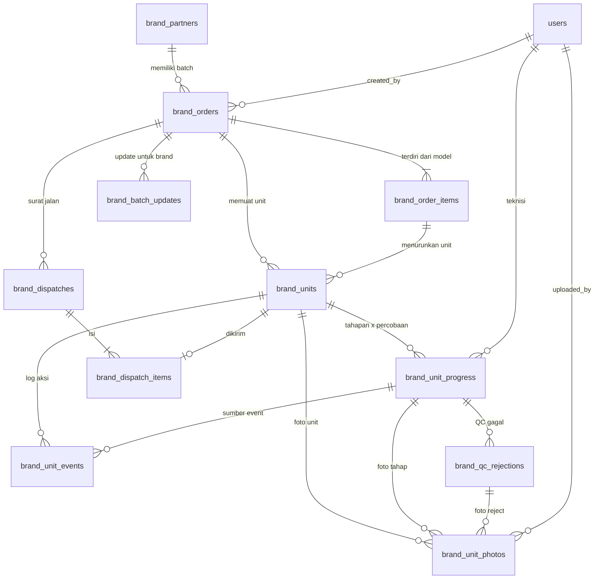
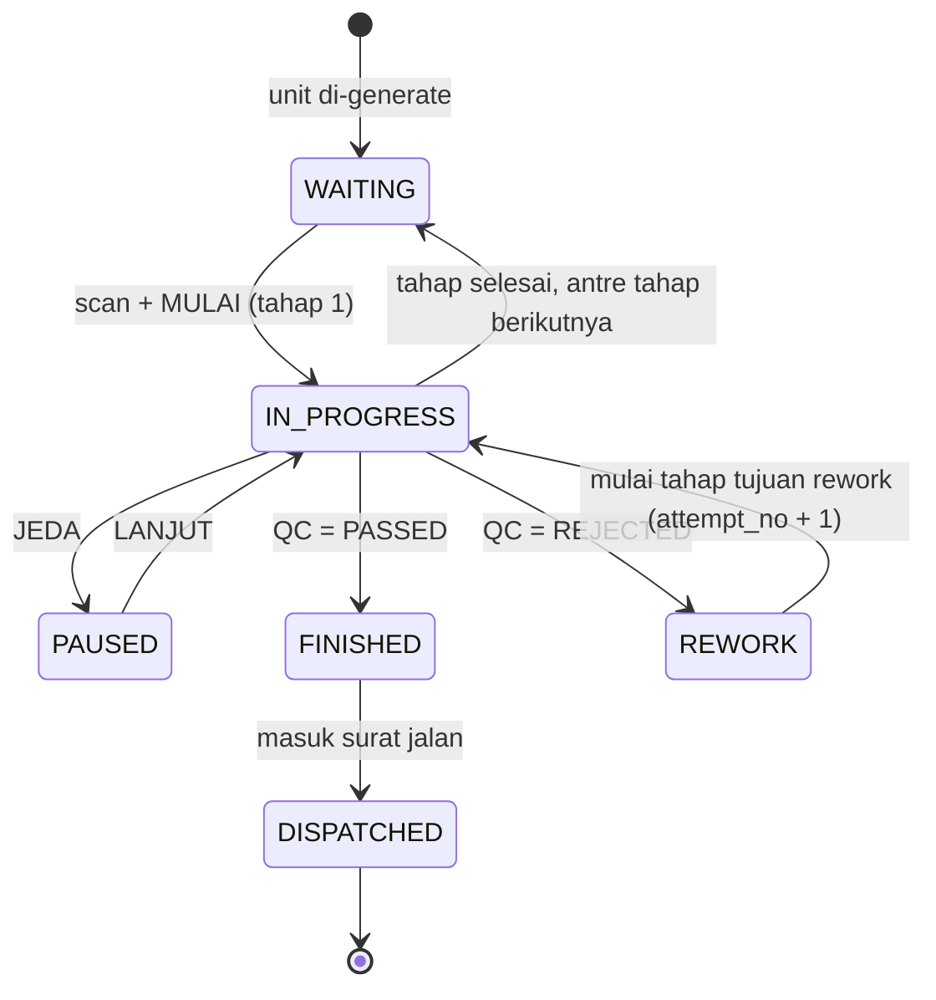
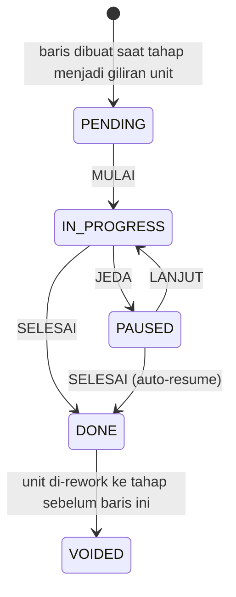

# Konsep Database Baru — Manajemen Brand (B2B) & Sistem Tracking Progress

**Versi:** 1.1 (Draft Hasil Sesi Grill-Me + Keputusan Foto Unit)  
**Tanggal:** Kamis, 8 Oktober 2026  
**Dokumen Acuan:** [`ALUR_DAN_ARSITEKTUR_MANAJEMEN_BRAND.md`](ALUR_DAN_ARSITEKTUR_MANAJEMEN_BRAND.md) (v1.0, 30 Sep 2026)  
**Status:** Usulan arsitektur — belum ada migration yang dibuat.

---

## 1. Ringkasan Keputusan (Hasil Sesi Grill-Me)

| # | Topik | Keputusan |
| :-: | :--- | :--- |
| 1 | **Keterikatan dengan `work_orders`** | **Full standalone.** Seluruh data brand (unit sepatu, tahapan, progress, status) berada di tabel baru. Tabel `work_orders` **tidak disentuh sama sekali** (tidak ada kolom `brand_order_id`). Stasiun/scanner brand dibuat terpisah. |
| 2 | **Model tahapan** | **Tetap & sama untuk semua unit:** `PREPARATION → SORTIR → PRODUCTION → QC` (hardcode sebagai PHP Enum, bukan tabel master). |
| 3 | **Kedalaman tracking** | **Riwayat penuh (event log append-only):** `brand_unit_progress` (1 baris per unit per tahap per percobaan) + `brand_unit_events` (log tiap aksi). |
| 4 | **QC gagal** | **Rework loop:** QC reject → unit kembali ke tahap tertentu, `attempt_no` bertambah, riwayat percobaan lama tetap tersimpan, alasan reject tercatat (kode + catatan + foto opsional). |
| 5 | **Progress agregat batch** | **Counter denormalisasi** di `brand_orders` + `status`/`current_stage` di `brand_units`, diperbarui service tiap event; dapat direkonsiliasi ulang dari log. |
| 6 | **Visibilitas ke brand** | **Public tracking link bertoken** (read-only, tanpa login) + tabel `brand_batch_updates` untuk catatan/foto update. |
| 7 | **Dispatch** | **Parsial didukung:** `brand_dispatches` + `brand_dispatch_items`; unit berstatus `DISPATCHED` sendiri-sendiri; batch `PARTIALLY_DISPATCHED` → `DISPATCHED`. |
| 8 | **Foto unit** | **Foto per unit per tahap:** tabel `brand_unit_photos` bertipe `BEFORE / PROCESS / AFTER / REJECT`. `BEFORE` wajib saat tahap Preparation selesai, `AFTER` wajib saat QC lolos, `REJECT` wajib saat QC menolak. Visibilitas publik diatur per foto. |
| 9 | **Invoice & harga** | **Ditunda.** Belum ada konsep; skema ini sengaja tidak memuat harga/invoice dan akan ditambah lewat migration terpisah nanti. |
| 10 | **Data lama** | **Tidak ada** data brand di `work_orders`, sehingga tidak diperlukan migrasi/konversi data historis. |

### Konsekuensi Utama dari Keputusan "Full Standalone"

> [!IMPORTANT]
> - Isolasi dari rak pickup/kasir CS menjadi **otomatis dan permanen** — unit brand tidak berada di `work_orders`, sehingga status khusus `BRAND_FINISHED` tidak lagi perlu "disaring" dari query CS.
> - Scanner, halaman mobile teknisi, dan cetak SPK **harus dibuat paralel** untuk brand (rute `/m/brand/...`), tidak dapat memakai ulang `ProductionControlling` / `SpkTracker` begitu saja (hanya pola dan trait-nya yang bisa dicontoh).
> - Laporan/dashboard/keuangan eksisting yang membaca `work_orders` **tidak akan melihat data brand**. Perlu keputusan terpisah untuk laporan & penagihan brand (lihat Bab 10).

---

## 2. Entity Relationship Diagram



**Total 12 tabel baru, 0 perubahan pada tabel eksisting.**

| No. | Tabel | Fungsi | Sifat Data |
| :-: | :--- | :--- | :--- |
| 1 | `brand_partners` | Master mitra brand | Master |
| 2 | `brand_orders` | Batch induk + counter progress + token publik | Transaksi + Agregat |
| 3 | `brand_order_items` | Kartu model sepatu per batch (size matrix) | Transaksi |
| 4 | `brand_units` | 1 baris per pasang sepatu (barcode satuan) | Transaksi + Snapshot status |
| 5 | `brand_unit_progress` | 1 baris per unit × tahap × percobaan | Transaksi |
| 6 | `brand_unit_events` | Log aksi append-only (mulai/jeda/lanjut/selesai/reject) | Log (immutable) |
| 7 | `brand_qc_rejections` | Detail alasan QC reject & tujuan rework | Transaksi |
| 8 | `brand_batch_updates` | Catatan/foto update yang tampil ke brand | Transaksi |
| 9 | `brand_dispatches` | Surat jalan pengembalian (header) | Transaksi |
| 10 | `brand_dispatch_items` | Unit yang dikirim pada tiap surat jalan | Transaksi |
| 11 | `brand_number_sequences` | Penomoran batch harian anti-duplikasi | Utilitas |
| 12 | `brand_unit_photos` | Foto BEFORE/PROCESS/AFTER/REJECT per unit & tahap | Transaksi |

---

## 3. Spesifikasi Tabel (DDL)

### 3.1 `brand_partners`

```sql
CREATE TABLE `brand_partners` (
    `id` BIGINT UNSIGNED AUTO_INCREMENT PRIMARY KEY,
    `code` VARCHAR(50) NOT NULL UNIQUE COMMENT 'BRD-VNTL, BRD-BRDO',
    `name` VARCHAR(255) NOT NULL,
    `pic_name` VARCHAR(255) NOT NULL,
    `pic_phone` VARCHAR(50) NOT NULL,
    `pic_email` VARCHAR(255) NULL,
    `address` TEXT NULL,
    `logo_path` VARCHAR(255) NULL,
    `tier_level` VARCHAR(50) NOT NULL DEFAULT 'STANDARD' COMMENT 'STANDARD | EXCLUSIVE | VIP',
    `status` VARCHAR(20) NOT NULL DEFAULT 'ACTIVE' COMMENT 'ACTIVE | INACTIVE',
    `notes` TEXT NULL,
    `created_at` TIMESTAMP NULL,
    `updated_at` TIMESTAMP NULL,
    `deleted_at` TIMESTAMP NULL,
    INDEX `idx_brand_partners_status` (`status`)
) ENGINE=InnoDB DEFAULT CHARSET=utf8mb4 COLLATE=utf8mb4_unicode_ci;
```

### 3.2 `brand_orders` (Batch Induk + Counter Agregat)

```sql
CREATE TABLE `brand_orders` (
    `id` BIGINT UNSIGNED AUTO_INCREMENT PRIMARY KEY,
    `batch_number` VARCHAR(64) NOT NULL UNIQUE COMMENT 'BR-YYMM-DD-XXXX',
    `brand_partner_id` BIGINT UNSIGNED NOT NULL,
    `created_by` BIGINT UNSIGNED NOT NULL,
    `project_name` VARCHAR(255) NOT NULL,
    `po_reference_no` VARCHAR(100) NULL,
    `received_date` DATE NOT NULL,
    `deadline_date` DATE NULL,
    `special_notes` TEXT NULL,

    -- STATUS BATCH
    `status` VARCHAR(30) NOT NULL DEFAULT 'DRAFT'
        COMMENT 'DRAFT | INBOUND | IN_PRODUCTION | FINISHED | PARTIALLY_DISPATCHED | DISPATCHED | CANCELLED',

    -- COUNTER DENORMALISASI (diupdate BrandTrackingService, bisa direkonsiliasi)
    `total_units` INT UNSIGNED NOT NULL DEFAULT 0,
    `units_waiting` INT UNSIGNED NOT NULL DEFAULT 0,
    `units_in_progress` INT UNSIGNED NOT NULL DEFAULT 0,
    `units_rework` INT UNSIGNED NOT NULL DEFAULT 0,
    `units_finished` INT UNSIGNED NOT NULL DEFAULT 0 COMMENT 'lolos QC, belum dispatch',
    `units_dispatched` INT UNSIGNED NOT NULL DEFAULT 0,
    `progress_pct` DECIMAL(5,2) NOT NULL DEFAULT 0 COMMENT '(finished + dispatched) / total x 100',
    `stage_counts` JSON NULL COMMENT '{"PREPARATION":{"waiting":0,"active":0,"done":0}, ...} untuk deteksi bottleneck',
    `counters_synced_at` TIMESTAMP NULL COMMENT 'terakhir direkonsiliasi penuh dari log',

    -- TRACKING PUBLIK UNTUK BRAND
    `public_token` VARCHAR(64) NULL UNIQUE COMMENT 'token link /brand-report/{token}',
    `public_enabled` TINYINT(1) NOT NULL DEFAULT 1,

    -- MILESTONE WAKTU
    `production_started_at` TIMESTAMP NULL,
    `finished_at` TIMESTAMP NULL COMMENT 'seluruh unit lolos QC',
    `dispatched_at` TIMESTAMP NULL COMMENT 'seluruh unit terkirim',
    `created_at` TIMESTAMP NULL,
    `updated_at` TIMESTAMP NULL,
    `deleted_at` TIMESTAMP NULL,

    INDEX `idx_brand_orders_status` (`status`),
    INDEX `idx_brand_orders_partner` (`brand_partner_id`, `status`),
    INDEX `idx_brand_orders_deadline` (`deadline_date`),
    FOREIGN KEY (`brand_partner_id`) REFERENCES `brand_partners`(`id`) ON DELETE RESTRICT,
    FOREIGN KEY (`created_by`) REFERENCES `users`(`id`) ON DELETE RESTRICT
) ENGINE=InnoDB DEFAULT CHARSET=utf8mb4 COLLATE=utf8mb4_unicode_ci;
```

### 3.3 `brand_order_items` (Kartu Model / Smart Size Matrix)

```sql
CREATE TABLE `brand_order_items` (
    `id` BIGINT UNSIGNED AUTO_INCREMENT PRIMARY KEY,
    `brand_order_id` BIGINT UNSIGNED NOT NULL,
    `line_no` SMALLINT UNSIGNED NOT NULL COMMENT 'urutan kartu model dalam batch',
    `model_name` VARCHAR(255) NOT NULL,
    `color` VARCHAR(100) NULL,
    `service_name` VARCHAR(255) NOT NULL COMMENT 'mis. Sol Reglue + Jahit',
    `service_detail` TEXT NULL,
    `size_breakdown` JSON NOT NULL COMMENT '{"39":10,"40":10,"41":10}',
    `quantity` INT UNSIGNED NOT NULL,
    `unit_seq_start` INT UNSIGNED NOT NULL COMMENT 'nomor urut flat awal',
    `unit_seq_end` INT UNSIGNED NOT NULL COMMENT 'nomor urut flat akhir',
    `created_at` TIMESTAMP NULL,
    `updated_at` TIMESTAMP NULL,
    UNIQUE KEY `uq_brand_items_line` (`brand_order_id`, `line_no`),
    FOREIGN KEY (`brand_order_id`) REFERENCES `brand_orders`(`id`) ON DELETE CASCADE
) ENGINE=InnoDB DEFAULT CHARSET=utf8mb4 COLLATE=utf8mb4_unicode_ci;
```

### 3.4 `brand_units` (1 Baris = 1 Pasang Sepatu)

```sql
CREATE TABLE `brand_units` (
    `id` BIGINT UNSIGNED AUTO_INCREMENT PRIMARY KEY,
    `brand_order_id` BIGINT UNSIGNED NOT NULL,
    `brand_order_item_id` BIGINT UNSIGNED NOT NULL,
    `unit_seq` INT UNSIGNED NOT NULL COMMENT 'nomor urut flat 1..N melintasi seluruh model',
    `unit_code` VARCHAR(80) NOT NULL UNIQUE COMMENT 'BR-2609-30-0001-01 (isi barcode)',
    `shoe_size` VARCHAR(20) NOT NULL,

    -- SNAPSHOT STATUS (untuk query cepat; kebenaran historis ada di progress/events)
    `status` VARCHAR(20) NOT NULL DEFAULT 'WAITING'
        COMMENT 'WAITING | IN_PROGRESS | PAUSED | REWORK | FINISHED | DISPATCHED',
    `current_stage` VARCHAR(20) NOT NULL DEFAULT 'PREPARATION'
        COMMENT 'PREPARATION | SORTIR | PRODUCTION | QC | DONE',
    `current_attempt_no` TINYINT UNSIGNED NOT NULL DEFAULT 1,
    `rework_count` TINYINT UNSIGNED NOT NULL DEFAULT 0,
    `current_location` VARCHAR(255) NOT NULL DEFAULT 'Gudang Inbound',
    `notes` TEXT NULL,

    `started_at` TIMESTAMP NULL COMMENT 'tahap pertama dimulai',
    `qc_passed_at` TIMESTAMP NULL,
    `dispatched_at` TIMESTAMP NULL,
    `created_at` TIMESTAMP NULL,
    `updated_at` TIMESTAMP NULL,

    UNIQUE KEY `uq_brand_units_seq` (`brand_order_id`, `unit_seq`),
    INDEX `idx_brand_units_status` (`brand_order_id`, `status`),
    INDEX `idx_brand_units_stage` (`brand_order_id`, `current_stage`, `status`),
    FOREIGN KEY (`brand_order_id`) REFERENCES `brand_orders`(`id`) ON DELETE CASCADE,
    FOREIGN KEY (`brand_order_item_id`) REFERENCES `brand_order_items`(`id`) ON DELETE CASCADE
) ENGINE=InnoDB DEFAULT CHARSET=utf8mb4 COLLATE=utf8mb4_unicode_ci;
```

### 3.5 `brand_unit_progress` (Unit × Tahap × Percobaan)

```sql
CREATE TABLE `brand_unit_progress` (
    `id` BIGINT UNSIGNED AUTO_INCREMENT PRIMARY KEY,
    `brand_unit_id` BIGINT UNSIGNED NOT NULL,
    `brand_order_id` BIGINT UNSIGNED NOT NULL COMMENT 'denormalisasi untuk agregasi cepat per batch',
    `stage` VARCHAR(20) NOT NULL COMMENT 'PREPARATION | SORTIR | PRODUCTION | QC',
    `attempt_no` TINYINT UNSIGNED NOT NULL DEFAULT 1,
    `status` VARCHAR(20) NOT NULL DEFAULT 'PENDING'
        COMMENT 'PENDING | IN_PROGRESS | PAUSED | DONE | VOIDED',
    `technician_id` BIGINT UNSIGNED NULL,

    `started_at` TIMESTAMP NULL,
    `finished_at` TIMESTAMP NULL,
    `last_paused_at` TIMESTAMP NULL COMMENT 'jeda yang sedang berjalan',
    `pause_reason` VARCHAR(100) NULL,
    `paused_seconds` INT UNSIGNED NOT NULL DEFAULT 0 COMMENT 'akumulasi jeda selesai',
    `net_seconds` INT UNSIGNED NULL COMMENT '(finished - started) - paused; diisi saat DONE',
    `result` VARCHAR(20) NULL COMMENT 'khusus QC: PASSED | REJECTED',
    `notes` TEXT NULL,
    `created_at` TIMESTAMP NULL,
    `updated_at` TIMESTAMP NULL,

    UNIQUE KEY `uq_brand_progress_unit_stage_attempt` (`brand_unit_id`, `stage`, `attempt_no`),
    INDEX `idx_brand_progress_batch_stage` (`brand_order_id`, `stage`, `status`),
    INDEX `idx_brand_progress_tech` (`technician_id`, `status`),
    FOREIGN KEY (`brand_unit_id`) REFERENCES `brand_units`(`id`) ON DELETE CASCADE,
    FOREIGN KEY (`brand_order_id`) REFERENCES `brand_orders`(`id`) ON DELETE CASCADE,
    FOREIGN KEY (`technician_id`) REFERENCES `users`(`id`) ON DELETE SET NULL
) ENGINE=InnoDB DEFAULT CHARSET=utf8mb4 COLLATE=utf8mb4_unicode_ci;
```

### 3.6 `brand_unit_events` (Log Append-Only)

```sql
CREATE TABLE `brand_unit_events` (
    `id` BIGINT UNSIGNED AUTO_INCREMENT PRIMARY KEY,
    `brand_unit_id` BIGINT UNSIGNED NOT NULL,
    `brand_order_id` BIGINT UNSIGNED NOT NULL,
    `progress_id` BIGINT UNSIGNED NULL,
    `event_type` VARCHAR(30) NOT NULL
        COMMENT 'STARTED | PAUSED | RESUMED | COMPLETED | QC_PASSED | QC_REJECTED | REWORK_STARTED | DISPATCHED | PHOTO_ADDED | NOTE | CORRECTION',
    `stage` VARCHAR(20) NULL,
    `attempt_no` TINYINT UNSIGNED NULL,
    `from_status` VARCHAR(20) NULL,
    `to_status` VARCHAR(20) NULL,
    `actor_id` BIGINT UNSIGNED NULL,
    `reason_code` VARCHAR(50) NULL,
    `notes` TEXT NULL,
    `meta` JSON NULL,
    `created_at` TIMESTAMP NOT NULL DEFAULT CURRENT_TIMESTAMP,

    INDEX `idx_brand_events_unit` (`brand_unit_id`, `created_at`),
    INDEX `idx_brand_events_batch` (`brand_order_id`, `created_at`),
    INDEX `idx_brand_events_type` (`event_type`, `created_at`),
    FOREIGN KEY (`brand_unit_id`) REFERENCES `brand_units`(`id`) ON DELETE CASCADE
) ENGINE=InnoDB DEFAULT CHARSET=utf8mb4 COLLATE=utf8mb4_unicode_ci;
```

> [!NOTE]
> Tabel ini **tidak memiliki `updated_at`** dan **tidak pernah di-UPDATE/DELETE** oleh aplikasi. Koreksi dilakukan dengan menambah event `CORRECTION`, bukan mengubah event lama.

### 3.7 `brand_qc_rejections`

```sql
CREATE TABLE `brand_qc_rejections` (
    `id` BIGINT UNSIGNED AUTO_INCREMENT PRIMARY KEY,
    `brand_unit_id` BIGINT UNSIGNED NOT NULL,
    `qc_progress_id` BIGINT UNSIGNED NOT NULL COMMENT 'baris brand_unit_progress tahap QC yang gagal',
    `attempt_no` TINYINT UNSIGNED NOT NULL COMMENT 'percobaan yang ditolak',
    `reason_code` VARCHAR(50) NOT NULL
        COMMENT 'GLUE_WEAK | STITCH_LOOSE | COLOR_MISMATCH | DIRTY | DEFORMED | OTHER',
    `notes` TEXT NULL,
    -- foto reject disimpan di brand_unit_photos (type = REJECT, rejection_id)
    `return_to_stage` VARCHAR(20) NOT NULL COMMENT 'SORTIR | PRODUCTION (atau PREPARATION)',
    `rejected_by` BIGINT UNSIGNED NOT NULL,
    `resolved_at` TIMESTAMP NULL COMMENT 'saat attempt berikutnya lolos QC',
    `created_at` TIMESTAMP NULL,
    `updated_at` TIMESTAMP NULL,
    INDEX `idx_brand_rejections_unit` (`brand_unit_id`),
    INDEX `idx_brand_rejections_reason` (`reason_code`),
    FOREIGN KEY (`brand_unit_id`) REFERENCES `brand_units`(`id`) ON DELETE CASCADE,
    FOREIGN KEY (`qc_progress_id`) REFERENCES `brand_unit_progress`(`id`) ON DELETE CASCADE,
    FOREIGN KEY (`rejected_by`) REFERENCES `users`(`id`) ON DELETE RESTRICT
) ENGINE=InnoDB DEFAULT CHARSET=utf8mb4 COLLATE=utf8mb4_unicode_ci;
```

### 3.8 `brand_batch_updates`

```sql
CREATE TABLE `brand_batch_updates` (
    `id` BIGINT UNSIGNED AUTO_INCREMENT PRIMARY KEY,
    `brand_order_id` BIGINT UNSIGNED NOT NULL,
    `user_id` BIGINT UNSIGNED NULL,
    `title` VARCHAR(255) NOT NULL,
    `notes` TEXT NULL,
    `photo_path` VARCHAR(500) NULL,
    `is_public` TINYINT(1) NOT NULL DEFAULT 1 COMMENT 'tampil di halaman publik brand',
    `created_at` TIMESTAMP NULL,
    `updated_at` TIMESTAMP NULL,
    INDEX `idx_brand_updates_batch` (`brand_order_id`, `created_at`),
    FOREIGN KEY (`brand_order_id`) REFERENCES `brand_orders`(`id`) ON DELETE CASCADE,
    FOREIGN KEY (`user_id`) REFERENCES `users`(`id`) ON DELETE SET NULL
) ENGINE=InnoDB DEFAULT CHARSET=utf8mb4 COLLATE=utf8mb4_unicode_ci;
```

### 3.9 `brand_dispatches` & `brand_dispatch_items`

```sql
CREATE TABLE `brand_dispatches` (
    `id` BIGINT UNSIGNED AUTO_INCREMENT PRIMARY KEY,
    `dispatch_number` VARCHAR(64) NOT NULL UNIQUE COMMENT 'SJ-BR-YYMM-DD-XXXX',
    `brand_order_id` BIGINT UNSIGNED NOT NULL,
    `dispatched_by` BIGINT UNSIGNED NOT NULL,
    `dispatched_at` TIMESTAMP NOT NULL,
    `total_units` INT UNSIGNED NOT NULL,
    `receiver_name` VARCHAR(255) NULL,
    `courier_name` VARCHAR(255) NULL,
    `vehicle_plate` VARCHAR(30) NULL,
    `signature_path` VARCHAR(500) NULL,
    `notes` TEXT NULL,
    `created_at` TIMESTAMP NULL,
    `updated_at` TIMESTAMP NULL,
    INDEX `idx_brand_dispatch_batch` (`brand_order_id`),
    FOREIGN KEY (`brand_order_id`) REFERENCES `brand_orders`(`id`) ON DELETE RESTRICT,
    FOREIGN KEY (`dispatched_by`) REFERENCES `users`(`id`) ON DELETE RESTRICT
) ENGINE=InnoDB DEFAULT CHARSET=utf8mb4 COLLATE=utf8mb4_unicode_ci;

CREATE TABLE `brand_dispatch_items` (
    `id` BIGINT UNSIGNED AUTO_INCREMENT PRIMARY KEY,
    `brand_dispatch_id` BIGINT UNSIGNED NOT NULL,
    `brand_unit_id` BIGINT UNSIGNED NOT NULL UNIQUE COMMENT 'satu unit hanya boleh dikirim sekali',
    `created_at` TIMESTAMP NULL,
    FOREIGN KEY (`brand_dispatch_id`) REFERENCES `brand_dispatches`(`id`) ON DELETE CASCADE,
    FOREIGN KEY (`brand_unit_id`) REFERENCES `brand_units`(`id`) ON DELETE RESTRICT
) ENGINE=InnoDB DEFAULT CHARSET=utf8mb4 COLLATE=utf8mb4_unicode_ci;
```

### 3.10 `brand_number_sequences`

```sql
CREATE TABLE `brand_number_sequences` (
    `seq_key` VARCHAR(40) NOT NULL PRIMARY KEY COMMENT 'BATCH-260930 | DISPATCH-260930',
    `last_value` INT UNSIGNED NOT NULL DEFAULT 0,
    `updated_at` TIMESTAMP NULL
) ENGINE=InnoDB DEFAULT CHARSET=utf8mb4 COLLATE=utf8mb4_unicode_ci;
```

Penomoran memakai `SELECT ... FOR UPDATE` di dalam transaksi sehingga aman dari duplikasi saat dua admin menyimpan batch bersamaan.

### 3.11 `brand_unit_photos` (Foto per Unit per Tahap)

```sql
CREATE TABLE `brand_unit_photos` (
    `id` BIGINT UNSIGNED AUTO_INCREMENT PRIMARY KEY,
    `brand_unit_id` BIGINT UNSIGNED NOT NULL,
    `brand_order_id` BIGINT UNSIGNED NOT NULL COMMENT 'denormalisasi untuk galeri per batch',
    `progress_id` BIGINT UNSIGNED NULL COMMENT 'tahap terkait (null = foto umum unit)',
    `rejection_id` BIGINT UNSIGNED NULL COMMENT 'terisi jika type = REJECT',
    `type` VARCHAR(20) NOT NULL COMMENT 'BEFORE | PROCESS | AFTER | REJECT',
    `stage` VARCHAR(20) NULL COMMENT 'salinan tahap saat foto diambil',
    `attempt_no` TINYINT UNSIGNED NOT NULL DEFAULT 1,
    `photo_path` VARCHAR(500) NOT NULL,
    `thumb_path` VARCHAR(500) NULL,
    `caption` VARCHAR(255) NULL,
    `is_public` TINYINT(1) NOT NULL DEFAULT 0 COMMENT 'tampil di /brand-report/{token}; default BEFORE/AFTER = 1 oleh service',
    `uploaded_by` BIGINT UNSIGNED NULL,
    `taken_at` TIMESTAMP NULL,
    `created_at` TIMESTAMP NULL,
    `updated_at` TIMESTAMP NULL,
    `deleted_at` TIMESTAMP NULL,

    INDEX `idx_brand_photos_unit` (`brand_unit_id`, `type`, `attempt_no`),
    INDEX `idx_brand_photos_batch` (`brand_order_id`, `type`, `is_public`),
    FOREIGN KEY (`brand_unit_id`) REFERENCES `brand_units`(`id`) ON DELETE CASCADE,
    FOREIGN KEY (`brand_order_id`) REFERENCES `brand_orders`(`id`) ON DELETE CASCADE,
    FOREIGN KEY (`progress_id`) REFERENCES `brand_unit_progress`(`id`) ON DELETE SET NULL,
    FOREIGN KEY (`rejection_id`) REFERENCES `brand_qc_rejections`(`id`) ON DELETE SET NULL,
    FOREIGN KEY (`uploaded_by`) REFERENCES `users`(`id`) ON DELETE SET NULL
) ENGINE=InnoDB DEFAULT CHARSET=utf8mb4 COLLATE=utf8mb4_unicode_ci;
```

**Aturan foto wajib (divalidasi `BrandTrackingService`):**

| Momen | Tipe Foto | Syarat |
| :--- | :--- | :--- |
| Menyelesaikan tahap `PREPARATION` (attempt 1) | `BEFORE` | Minimal 1 foto, jika belum ada tombol SELESAI ditolak |
| Aksi tengah tahap (opsional) | `PROCESS` | Tidak wajib |
| QC `PASSED` | `AFTER` | Minimal 1 foto pada attempt yang sama |
| QC `REJECTED` | `REJECT` | Minimal 1 foto, ditautkan ke `brand_qc_rejections.id` |

**Pengelolaan file:**
- Lokasi: `storage/app/public/brand/{batch_number}/{unit_code}/{type}_{timestamp}.jpg`.
- Diubah ukuran otomatis (sisi terpanjang maks. 1600 px, kualitas JPEG ~80%) beserta thumbnail untuk galeri.
- Soft delete saja; foto `AFTER`/`REJECT` yang sudah menjadi bukti QC tidak boleh dihapus, hanya diganti dengan event `CORRECTION`.
- Setiap unggahan menulis event `PHOTO_ADDED` di `brand_unit_events`.

---

## 4. Sistem Tracking Progress

### 4.1 Tahapan Tetap (PHP Enum)

```php
enum BrandStage: string {
    case PREPARATION = 'PREPARATION'; // urutan 1
    case SORTIR      = 'SORTIR';      // urutan 2
    case PRODUCTION  = 'PRODUCTION';  // urutan 3
    case QC          = 'QC';          // urutan 4
}
```

### 4.2 Diagram Status Unit (`brand_units.status`)



`WAITING` di antara tahap berarti unit sudah menyelesaikan tahap sebelumnya dan menunggu teknisi tahap berikutnya (nilai `current_stage` sudah menunjuk tahap berikutnya).

### 4.3 Siklus Satu Tahap (`brand_unit_progress.status`)



### 4.4 Aturan Bisnis Inti

| # | Aturan |
| :-: | :--- |
| 1 | Tahap hanya boleh dimulai jika tahap sebelumnya pada `attempt_no` yang sama berstatus `DONE` (kecuali tahap 1). |
| 2 | Satu unit hanya boleh punya **satu** baris progress aktif (`IN_PROGRESS`/`PAUSED`) pada satu waktu. |
| 3 | `net_seconds = (finished_at − started_at) − paused_seconds` (selisih UNIX timestamp, bukan objek `diff()` bertanda). |
| 4 | **Auto-resume:** menekan SELESAI saat `PAUSED` otomatis menutup jeda, menambah `paused_seconds`, lalu menyelesaikan tahap. |
| 5 | **Smart auto-assign:** `technician_id` = `Auth::id()` saat MULAI; admin/supervisor boleh memilih teknisi lain. |
| 6 | QC `PASSED` → unit `FINISHED`, `current_stage = DONE`, `current_location = 'Area Staging B2B / Kardus Master'`. |
| 7 | QC `REJECTED` wajib mengisi `reason_code` dan `return_to_stage`; sistem membuat baris `brand_qc_rejections`. |
| 8 | Unit `FINISHED` baru boleh masuk `brand_dispatch_items`; unit `DISPATCHED` bersifat final (immutable). |
| 9 | Tahap `PREPARATION` tidak dapat diselesaikan tanpa minimal 1 foto `BEFORE` pada attempt 1. |
| 10 | QC `PASSED` mensyaratkan minimal 1 foto `AFTER`; QC `REJECTED` mensyaratkan minimal 1 foto `REJECT`. |

### 4.5 Rework Loop

Contoh unit `BR-2609-30-0001-12` ditolak QC karena lem lemah, dikembalikan ke `PRODUCTION`:

| progress.id | stage | attempt_no | status | result |
| :-: | :--- | :-: | :--- | :--- |
| 101 | PREPARATION | 1 | DONE | — |
| 102 | SORTIR | 1 | DONE | — |
| 103 | PRODUCTION | 1 | `VOIDED` | — |
| 104 | QC | 1 | DONE | `REJECTED` |
| 105 | PRODUCTION | **2** | DONE | — |
| 106 | QC | **2** | DONE | `PASSED` |

Penjelasan:
- Saat reject, baris tahap `return_to_stage` s/d QC pada attempt lama ditandai **VOIDED** (kecuali baris QC yang tetap `DONE` dengan `result = REJECTED` sebagai bukti).
- `brand_units.current_attempt_no` naik menjadi 2, `rework_count` naik 1, `status = REWORK`.
- Baris `brand_qc_rejections.resolved_at` diisi saat attempt 2 lolos QC.
- Seluruh jejak (termasuk durasi percobaan gagal) tetap tersimpan untuk analisis kualitas.

### 4.6 Event Log — Contoh Urutan

| event_type | stage | attempt | from → to | actor |
| :--- | :--- | :-: | :--- | :--- |
| STARTED | PREPARATION | 1 | WAITING → IN_PROGRESS | Budi |
| COMPLETED | PREPARATION | 1 | IN_PROGRESS → WAITING | Budi |
| STARTED | PRODUCTION | 1 | WAITING → IN_PROGRESS | Andi |
| PAUSED | PRODUCTION | 1 | IN_PROGRESS → PAUSED | Andi (`WAIT_GLUE_DRY`) |
| RESUMED | PRODUCTION | 1 | PAUSED → IN_PROGRESS | Andi |
| QC_REJECTED | QC | 1 | IN_PROGRESS → REWORK | Sari (`GLUE_WEAK`) |
| REWORK_STARTED | PRODUCTION | 2 | REWORK → IN_PROGRESS | Andi |
| QC_PASSED | QC | 2 | IN_PROGRESS → FINISHED | Sari |
| DISPATCHED | — | — | FINISHED → DISPATCHED | Admin |

---

## 5. Counter Agregat Batch (Denormalisasi)

### 5.1 Kolom yang Dipelihara

`brand_orders.units_waiting`, `units_in_progress`, `units_rework`, `units_finished`, `units_dispatched`, `progress_pct`, `stage_counts`.

Invariant yang harus selalu benar:

```
total_units = units_waiting + units_in_progress + units_rework + units_finished + units_dispatched
```

(`PAUSED` dihitung sebagai `units_in_progress`.)

### 5.2 Mekanisme Update (di dalam satu transaksi)

```php
DB::transaction(function () use ($unit, $event) {
    $order = BrandOrder::lockForUpdate()->find($unit->brand_order_id);
    $unit  = BrandUnit::lockForUpdate()->find($unit->id);

    $from = $unit->status;
    // 1. ubah brand_unit_progress & brand_units
    // 2. tulis brand_unit_events
    // 3. geser counter: decrement $from, increment $to
    // 4. hitung ulang progress_pct & stage_counts
    // 5. evaluasi status batch (lihat 5.3)
});
```

### 5.3 Otomatisasi Status Batch

| Kondisi | Status Batch |
| :--- | :--- |
| Batch dibuat & unit ter-generate | `INBOUND` |
| Unit pertama dimulai | `IN_PRODUCTION` (isi `production_started_at`) |
| `units_finished + units_dispatched = total_units` dan `units_dispatched = 0` | `FINISHED` (isi `finished_at`) |
| `0 < units_dispatched < total_units` | `PARTIALLY_DISPATCHED` |
| `units_dispatched = total_units` | `DISPATCHED` (isi `dispatched_at`) |

### 5.4 Rekonsiliasi

Command `php artisan brand:reconcile {batch?}`:
- Menghitung ulang seluruh counter dari `brand_units` (`GROUP BY status`) dan `brand_unit_progress`.
- Jika selisih, perbaiki counter dan catat ke log + isi `counters_synced_at`.
- Dijadwalkan harian (scheduler) sebagai jaring pengaman.

---

## 6. Tracking Publik untuk Brand

- URL: `/brand-report/{public_token}` — read-only, tanpa login, token 64 karakter acak (`Str::random(64)`), dapat dinonaktifkan via `public_enabled`.
- Data yang ditampilkan:
  1. Header: logo & nama brand, nomor batch, PO, deadline.
  2. Progress bar `progress_pct` + `units_finished/total_units`.
  3. Rincian per model/ukuran (`brand_order_items` + status unit).
  4. Distribusi per tahap (`stage_counts`) tanpa nama teknisi.
  5. Timeline `brand_batch_updates` (hanya `is_public = 1`).
  6. Riwayat surat jalan (nomor & tanggal, jumlah unit).
  7. Galeri foto per unit (`brand_unit_photos` dengan `is_public = 1`; default hanya `BEFORE` dan `AFTER` attempt terakhir).
- **Tidak ditampilkan:** nama teknisi, durasi kerja internal, alasan reject mendetail, foto `REJECT`/`PROCESS` (kecuali ditandai publik), catatan internal.

---

## 7. Dispatch Parsial

1. Admin memilih unit berstatus `FINISHED` (centang manual atau "Pilih semua siap kirim").
2. Sistem membuat `brand_dispatches` (nomor `SJ-BR-YYMM-DD-XXXX`) dan `brand_dispatch_items`.
3. Unit → `DISPATCHED`, `dispatched_at` diisi, event `DISPATCHED` dicatat.
4. Counter: `units_finished −n`, `units_dispatched +n`; status batch dievaluasi (aturan 5.3).
5. Constraint `UNIQUE (brand_unit_id)` pada `brand_dispatch_items` mencegah unit terkirim dua kali.
6. Cetak Surat Jalan memuat daftar unit (kode, model, ukuran), total, penerima, kurir, plat kendaraan, dan tanda tangan.

---

## 8. Penomoran

| Objek | Format | Contoh |
| :--- | :--- | :--- |
| Batch | `BR-YYMM-DD-XXXX` | `BR-2610-08-0001` |
| Unit | `{batch}-{NN}` flat | `BR-2610-08-0001-12` |
| Surat Jalan | `SJ-BR-YYMM-DD-XXXX` | `SJ-BR-2610-12-0001` |

Untuk batch > 99 unit, suffix otomatis melebar menjadi 3 digit (`-001`..`-250`) agar urut leksikografis tetap benar.

---

## 9. Perbandingan Konsep Lama vs Baru

| Aspek | Dokumen Lama (v1.0) | Konsep Baru |
| :--- | :--- | :--- |
| Relasi ke `work_orders` | 1 unit = 1 `work_orders` + kolom `brand_order_id` | **Tidak ada** relasi sama sekali |
| Perubahan tabel eksisting | +1 kolom di `work_orders` | **0** |
| Jumlah tabel baru | 2 | 12 |
| Penyimpanan tracking | Kolom stasiun di `work_orders` (`prep_*`, `prod_*`, `qc_*`) | `brand_unit_progress` + `brand_unit_events` |
| Riwayat rework | Tidak tersedia (kolom ditimpa) | Penuh (`attempt_no`, `VOIDED`, `brand_qc_rejections`) |
| Jeda & net time | Mengikuti trait `HasStationTracking` | Dihitung di `brand_unit_progress` |
| Isolasi dari CS | Disaring via status `BRAND_FINISHED` | Otomatis (tabel terpisah) |
| Progress batch | Hitung dari status `work_orders` | Counter denormalisasi + rekonsiliasi |
| Akses brand | Tidak ada | Public link bertoken |
| Dispatch | Satu kali, wajib 100% | Parsial per unit |
| Scanner & UI mobile | Memakai stasiun eksisting | Dibuat baru (`/m/brand/...`) |
| Foto unit | Tidak ada | `brand_unit_photos` (BEFORE/PROCESS/AFTER/REJECT, wajib di titik kritis) |

---

## 10. Dampak & Pekerjaan Lanjutan

> [!WARNING]
> Karena brand tidak lagi berada di `work_orders`, hal-hal berikut **tidak otomatis tersedia** dan perlu dibangun/diputuskan:

| Area | Dampak | Keputusan Dibutuhkan |
| :--- | :--- | :--- |
| Scanner & halaman teknisi | Perlu halaman mobile khusus brand | Reuse pola `ProductionControlling` & `SpkTracker` |
| Cetak SPK Induk & stiker barcode | Template baru (tema Amber `#d97706`) | Ukuran stiker & jumlah per lembar |
| Laporan/dashboard operasional | Tidak membaca data brand | Perlu dashboard brand sendiri |
| Penagihan & harga | Skema belum memuat harga/invoice | **Ditunda** — konsep invoice B2B belum ada; dirancang terpisah kemudian |
| Sinkronisasi Google Sheets | Perlu endpoint baru `sync_brand_*.php` | Format satu baris per unit (dengan `unit_id`) |
| Hak akses | Permission baru modul brand | Matriks role (Admin, Kepala Produksi, Teknisi, QC) |
| Migrasi data lama | — | **Selesai:** tidak ada data brand di `work_orders`, tidak perlu migrasi |
| Foto before/after per unit | Ditangani `brand_unit_photos` | **Selesai:** foto per unit per tahap, wajib di titik kritis (Bab 3.11) |
| Kamera & unggah di mobile | Halaman teknisi perlu input kamera + kompresi | Batas ukuran file & kompres di sisi klien atau server |

---

## 11. Rencana Implementasi Migration (Urutan)

1. `create_brand_partners_table`
2. `create_brand_orders_table`
3. `create_brand_order_items_table`
4. `create_brand_units_table`
5. `create_brand_unit_progress_table`
6. `create_brand_unit_events_table`
7. `create_brand_qc_rejections_table`
8. `create_brand_batch_updates_table`
9. `create_brand_dispatches_and_items_tables`
10. `create_brand_number_sequences_table`
11. `create_brand_unit_photos_table` (setelah `brand_qc_rejections` agar FK `rejection_id` valid)

Lapisan aplikasi: Model + Enum (`BrandStage`, `BrandUnitStatus`, `BrandOrderStatus`, `BrandPhotoType`) → `BrandNumberService` → `BrandBatchService` (generate unit atomik) → `BrandPhotoService` (unggah, resize, thumbnail) → `BrandTrackingService` (mulai/jeda/lanjut/selesai/QC/rework + validasi foto wajib + counter) → `BrandDispatchService` → Livewire (admin, mobile, publik) → command `brand:reconcile` → feature test (alur normal, jeda, rework, foto wajib, dispatch parsial, konsistensi counter).
