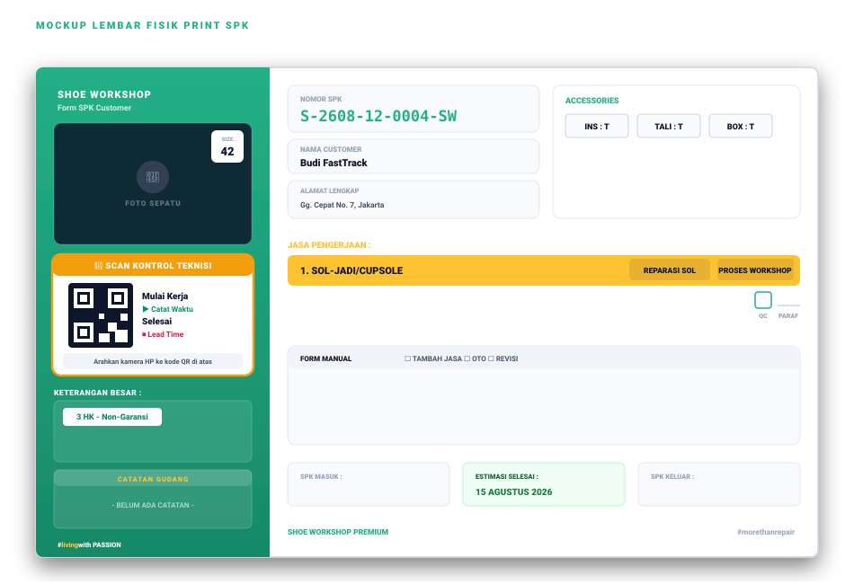
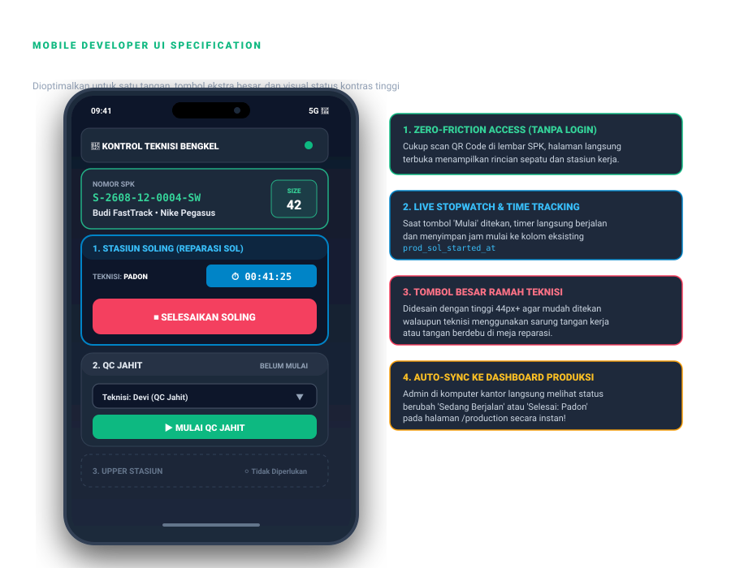
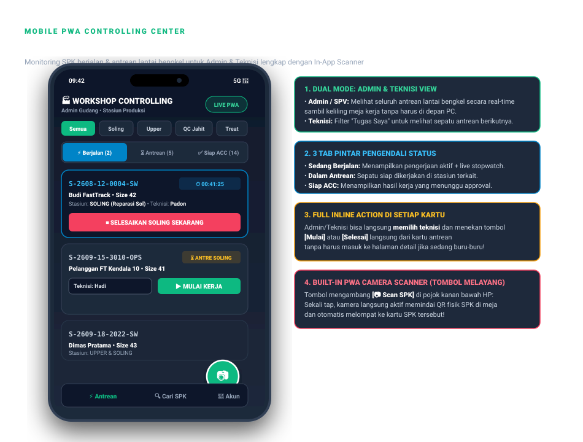

<style>
  @import url('https://fonts.googleapis.com/css2?family=Plus+Jakarta+Sans:wght@300;400;500;600;700;800;900&family=JetBrains+Mono:wght@400;500;600;700&display=swap');

  @media print {
    @page {
      size: A4;
      margin: 14mm 15mm 18mm 15mm;
    }
    body {
      -webkit-print-color-adjust: exact !important;
      print-color-adjust: exact !important;
    }
    .page-break {
      page-break-before: always;
    }
    .avoid-break {
      page-break-inside: avoid;
    }
  }

  body {
    font-family: 'Plus Jakarta Sans', -apple-system, BlinkMacSystemFont, 'Segoe UI', Roboto, Helvetica, Arial, sans-serif;
    color: #0f172a;
    background: #ffffff;
    font-size: 10pt;
    line-height: 1.6;
    margin: 0;
    padding: 0;
  }

  h1 {
    font-size: 18pt;
    font-weight: 900;
    color: #0f172a;
    border-bottom: 3px solid #10b981;
    padding-bottom: 8px;
    margin-top: 0;
    margin-bottom: 12px;
    letter-spacing: -0.02em;
    page-break-after: avoid;
  }

  h2 {
    font-size: 13pt;
    font-weight: 800;
    color: #0f172a;
    background: #f8fafc;
    border-left: 4px solid #10b981;
    padding: 8px 14px;
    margin-top: 24px;
    margin-bottom: 14px;
    border-radius: 0 8px 8px 0;
    letter-spacing: -0.01em;
    page-break-after: avoid;
  }

  h3 {
    font-size: 11pt;
    font-weight: 700;
    color: #047857;
    margin-top: 16px;
    margin-bottom: 8px;
    page-break-after: avoid;
  }

  table {
    width: 100%;
    border-collapse: collapse;
    margin-top: 10px;
    margin-bottom: 16px;
    font-size: 9pt;
    page-break-inside: avoid;
  }

  th {
    background-color: #0f172a;
    color: #ffffff;
    font-weight: 700;
    text-align: left;
    padding: 8px 10px;
    border: 1px solid #1e293b;
    text-transform: uppercase;
    font-size: 8pt;
    letter-spacing: 0.05em;
  }

  td {
    padding: 8px 10px;
    border: 1px solid #e2e8f0;
    vertical-align: top;
  }

  tr:nth-child(even) {
    background-color: #f8fafc;
  }

  code {
    font-family: 'JetBrains Mono', monospace;
    font-size: 8.5pt;
    background-color: #f1f5f9;
    color: #0f172a;
    padding: 2px 5px;
    border-radius: 4px;
    border: 1px solid #e2e8f0;
  }

  pre {
    background-color: #0f172a;
    color: #f8fafc;
    padding: 12px;
    border-radius: 8px;
    font-family: 'JetBrains Mono', monospace;
    font-size: 8.5pt;
    line-height: 1.5;
    overflow-x: auto;
    page-break-inside: avoid;
    border: 1px solid #1e293b;
  }

  pre code {
    background: transparent;
    color: inherit;
    padding: 0;
    border: none;
  }

  .callout {
    border-left: 4px solid;
    border-radius: 0 8px 8px 0;
    padding: 12px 16px;
    margin: 14px 0;
    page-break-inside: avoid;
    font-size: 9.5pt;
  }

  .callout-emerald {
    background-color: #ecfdf5;
    border-color: #10b981;
    color: #065f46;
  }

  .callout-amber {
    background-color: #fffbeb;
    border-color: #f59e0b;
    color: #92400e;
  }

  .callout-indigo {
    background-color: #eef2ff;
    border-color: #6366f1;
    color: #3730a3;
  }

  .kpi-grid {
    display: grid;
    grid-template-columns: repeat(4, 1fr);
    gap: 12px;
    margin-bottom: 18px;
    page-break-inside: avoid;
  }

  .kpi-card {
    border: 1px solid #cbd5e1;
    border-radius: 8px;
    padding: 12px;
    background: #f8fafc !important;
    text-align: center;
    -webkit-print-color-adjust: exact;
  }

  .kpi-num {
    font-size: 15pt;
    font-weight: 900;
    color: #10b981;
    margin-top: 4px;
  }

  .kpi-label {
    font-size: 7.5pt;
    font-weight: 700;
    color: #64748b;
    text-transform: uppercase;
  }

  .img-container {
    width: 100%;
    text-align: center;
    margin: 16px 0;
    page-break-inside: avoid;
  }

  .img-container img {
    max-width: 100%;
    height: auto;
    border-radius: 8px;
    border: 1px solid #cbd5e1;
    box-shadow: 0 4px 6px -1px rgba(0, 0, 0, 0.1);
  }

  .img-caption {
    font-size: 8.5pt;
    font-weight: 700;
    color: #64748b;
    margin-top: 6px;
    text-align: center;
  }

  .badge {
    display: inline-block;
    padding: 2px 8px;
    border-radius: 4px;
    font-size: 8pt;
    font-weight: 800;
    letter-spacing: 0.05em;
    text-transform: uppercase;
  }

  .badge-success { background: #dcfce7; color: #15803d; border: 1px solid #86efac; }
  .badge-primary { background: #e0e7ff; color: #4338ca; border: 1px solid #a5b4fc; }
  .badge-warning { background: #fef3c7; color: #b45309; border: 1px solid #fde68a; }
</style>

# 📋 BLUEPRINT PERENCANAAN SISTEM
# QR Scan Mobile Kontrol Teknisi & Real-Time Time Tracking SPK

**Dokumen Referensi:** Standar Operasional Lantai Bengkel & Modul Produksi Workshop  
**Periode Rilis:** Sprint 1 — Oktober 2026  
**Status Dokumen:** ✅ *Final Plan Approved — Siap Dieksekusi (0 Database Migration)*  
**Lead Architect & Developer:** AI Senior Full Stack Developer & Workshop Tech Lead (Big 4 Standard)  
**Target Modul:** Modul Produksi (Reparasi), Stasiun Kerja Teknisi, & Cetak SPK Fisik  

---

<div class="kpi-grid">
  <div class="kpi-card">
    <div class="kpi-label">Migrasi Database</div>
    <div class="kpi-num">0 Tabel / Kolom</div>
  </div>
  <div class="kpi-card">
    <div class="kpi-label">Akses Teknisi</div>
    <div class="kpi-num">One-Time Login</div>
  </div>
  <div class="kpi-card">
    <div class="kpi-label">Metode Time Tracking</div>
    <div class="kpi-num">Live Stopwatch</div>
  </div>
  <div class="kpi-card">
    <div class="kpi-label">Identifikasi Aktor</div>
    <div class="kpi-num">Auto Auth::id()</div>
  </div>
</div>

---

## 📌 1. RINGKASAN EKSEKUTIF & LATAR BELAKANG BISNIS

Dalam operasional harian lantai produksi bengkel (*Shoe Workshop*), lembar fisik SPK dicetak dan diletakkan di atas baki (*tray*) bersama sepatu yang akan direparasi. Meskipun sistem desktop pada rute `/production` telah memiliki fitur alokasi teknisi dan tombol mulai pengerjaan, teknisi di lapangan seringkali **kesulitan bolak-balik ke meja komputer kasir/admin** untuk mengubah status pekerjaan mereka.

Kondisi tersebut menyebabkan beberapa kendala operasional:
1. **Pencatatan Waktu Tertunda (Time Lag)**: Teknisi baru memperbarui status pengerjaan secara kolektif di akhir shift, sehingga waktu mulai dan selesai aktual tidak terukur secara akurat.
2. **Ketiadaan Visibilitas Real-Time**: Staf admin dan customer care (CS) tidak dapat memastikan apakah sepatu pelanggan sedang aktif dikerjakan di meja sol, jahit, atau treatment pada detik ini.
3. **Akuntabilitas Teknisi (Siapa Mengerjakan Apa)**: Diperlukan sistem yang dapat mendeteksi secara pasti identitas teknisi (`user_id`) yang mengeksekusi pengerjaan tanpa harus mengulang login setiap saat.

### 🎯 Solusi Strategis:
Menciptakan **jembatan fisik-ke-digital (*Physical-to-Digital Bridge*)** melalui penyematan **QR Code Khusus** di lembar cetak SPK fisik. Didukung oleh **sesi persisten mobile (*One-Time Login*)**, sistem langsung mengenali identitas teknisi yang sedang memegang ponsel, mencatat timestamp `Mulai` dan `Selesai`, menghitung `Stopwatch` durasi kerja aktif, dan menyelaraskan dashboard desktop `/production` tanpa membuat tabel atau kolom database baru.

---

## 🏗️ 2. PRINSIP ARSITEKTUR: ZERO DATABASE MIGRATION & AUTO-DETECT USER

Salah satu keunggulan utama dari rancangan ini adalah **efisiensi arsitektur maksimal**. Kita **TIDAK PERLU** membuat tabel baru dan **TIDAK PERLU** menambah kolom baru ke skema database `sistem_workshop`. 

Seluruh siklus pengerjaan dan waktu teknisi didukung 100% oleh kolom-kolom yang telah tertanam di tabel `work_orders` dan tabel riwayat `work_order_logs`.

### 2.1. Pemetaan Kolom Database Eksisting:

| Komponen Fitur Mobile | Kolom Database yang Digunakan | Tipe Data & Sumber |
| :--- | :--- | :--- |
| **Identifikasi SPK di QR Code** | `work_orders.spk_number` | `VARCHAR(64) UNIQUE` (Nomor SPK unik, misal: `S-2608-12-0004-SW`) |
| **Stasiun Soling — Mulai** | `work_orders.prod_sol_started_at` | `DATETIME` (Mencatat timestamp detik mulai kerja) |
| **Stasiun Soling — Selesai** | `work_orders.prod_sol_completed_at` | `DATETIME` (Mencatat timestamp detik selesai kerja) |
| **Stasiun Soling — Teknisi** | `work_orders.prod_sol_by` | `BIGINT UNSIGNED FK` (ID user teknisi dari `Auth::id()`) |
| **Stasiun Upper — Mulai** | `work_orders.prod_upper_started_at` | `DATETIME` |
| **Stasiun Upper — Selesai** | `work_orders.prod_upper_completed_at` | `DATETIME` |
| **Stasiun Upper — Teknisi** | `work_orders.prod_upper_by` | `BIGINT UNSIGNED FK` |
| **Stasiun QC Jahit — Mulai** | `work_orders.qc_jahit_started_at` | `DATETIME` |
| **Stasiun QC Jahit — Selesai** | `work_orders.qc_jahit_completed_at` | `DATETIME` |
| **Stasiun QC Jahit — Teknisi** | `work_orders.qc_jahit_by` | `BIGINT UNSIGNED FK` |
| **Stasiun Treatment — Mulai** | `work_orders.prod_cleaning_started_at` | `DATETIME` |
| **Stasiun Treatment — Selesai** | `work_orders.prod_cleaning_completed_at`| `DATETIME` |
| **Stasiun Treatment — Teknisi** | `work_orders.prod_cleaning_by` | `BIGINT UNSIGNED FK` |
| **Riwayat & Jejak Audit** | `work_order_logs` | `work_order_id, user_id, action, description, step` |

### 2.2. Manajemen Sesi Autentikasi & Auto-Detect `user_id`:
Untuk menjamin akuntabilitas data sekaligus kenyamanan operasional teknisi di lantai bengkel:
1. **Login Sekali Saja (Persistent Remember Session)**:
   - Teknisi / Admin hanya perlu melakukan **login 1 kali** di ponsel pintar masing-masing saat pertama kali membuka aplikasi.
   - Sesi diatur menggunakan fitur bawaan Laravel `remember: true` sehingga cookie sesi tersimpan permanen dan tidak akan pernah ter-logout otomatis di tengah jam kerja.
   - Sesi hanya akan berakhir jika pengguna secara sengaja menekan tombol `[Keluar / Logout]`.
2. **Otomatisasi Deteksi Teknisi (`Auth::id()`)**:
   - Begitu teknisi memindai QR Code SPK atau menekan tombol `[Mulai Kerja]` di HP, sistem secara otomatis mengambil `Auth::id()` teknisi yang sedang login.
   - Kolom penanggung jawab stasiun (seperti `prod_sol_by`) langsung terisi ID teknisi tersebut tanpa teknisi harus memilih namanya berulang kali.
   - Untuk role **Admin / Supervisor**: Diberikan fleksibilitas tambahan untuk memilih atau mengalihkan nama teknisi lain jika admin bertindak mewakili teknisi.
3. **Smart Redirect (Intended URL)**:
   - Jika teknisi baru memindai QR fisik dalam kondisi belum login (*guest session*), sistem secara otomatis mengarahkan ke halaman Login dengan parameter `intended`.
   - Begitu login berhasil, teknisi **langsung otomatis dikembalikan ke lembar SPK** yang tadi dipindai tanpa perlu scan ulang.

<div class="callout callout-emerald">
  <strong>Keuntungan Pendekatan Ini:</strong><br>
  100% akuntabel karena setiap penekanan tombol tercatat atas nama akun teknisi yang login di HP (<code>user_id</code> otomatis masuk ke <code>work_orders</code> dan <code>work_order_logs</code>). Bebas repot karena teknisi tidak perlu login berulang-ulang setiap hari.
</div>

---

<div class="page-break"></div>

## 🔄 3. DIAGRAM ALUR SISTEM END-TO-END

Berikut adalah alur lengkap interaksi antara lembar cetak SPK fisik, ponsel pintar teknisi, lapisan database, dan dashboard desktop workshop:

<div class="img-container">
  
  <div class="img-caption">Gambar 1: Alur Kerja End-to-End Pengerjaan SPK Berbasis Scan QR dan Sinkronisasi Real-Time</div>
</div>

### Penjelasan Langkah Kerja:
1. **Cetak SPK Fisik**: Admin atau Kasir mencetak lembar SPK (`/assessment/{id}/print-spk`). QR Code secara dinamis dibuat menggunakan nomor SPK tersebut.
2. **Scan Kamera HP**: Teknisi mengambil sepatu di meja pengerjaan, mengarahkan kamera HP ke QR Code, dan membuka tautan URL:
   `https://sistemworkshop.test/m/spk/S-2608-12-0004-SW`
3. **Tampilan Mobile Developer**: Halaman mobile langsung terbuka tanpa login, menampilkan identitas sepatu, ukuran, catatan khusus, dan stasiun yang wajib dikerjakan.
4. **Teknisi Memilih Diri & Tap Mulai**: Teknisi memilih namanya pada dropdown cepat dan menekan tombol hijau `[MULAI KERJA]`.
5. **Pencatatan Waktu & Live Stopwatch**: Sistem mengisi `prod_sol_started_at` dengan timestamp saat ini dan stopwatch digital pada HP langsung berdetik menghitung durasi pengerjaan.
6. **Sinkronisasi Desktop**: Dashboard desktop `/production` seketika mendeteksi status stasiun menjadi lencana biru `Sedang Berjalan`.
7. **Penyelesaian Kerja**: Begitu sol selesai dilem/dipasang, teknisi menekan tombol merah `[SELESAIKAN SOLING]`. Sistem mengisi `prod_sol_completed_at`, menghitung durasi kerja, dan membuka antrean stasiun berikutnya (misal QC Jahit).

---

<div class="page-break"></div>

## 🖨️ 4. DESAIN PENEMPATAN QR CODE PADA LEMBAR CETAK SPK

Penempatan QR Code dirancang sangat strategis pada template cetak resmi [print-spk-premium.blade.php](file:///c:/laragon/www/SistemWorkshop/resources/views/assessment/print-spk-premium.blade.php) tanpa merusak komposisi visual maupun meluberkan tinggi kertas A4.

<div class="img-container">
  
  <div class="img-caption">Gambar 2: Mockup Lembar Fisik SPK Menampilkan Penempatan QR Code Kontrol Teknisi di Sidebar Kiri</div>
</div>

### Spesifikasi Teknis Cetak:
- **Lokasi Fisik**: Sidebar Kiri (Lebar 75mm), ditempatkan tepat di bawah kotak foto sepatu dan di atas kotak *Keterangan Besar* / *Catatan Gudang*.
- **Dimensi Wadah**: $65\text{mm} \times 38\text{mm}$, latar belakang putih solid (`bg-white`), sudut lengkung 8px (`rounded-lg`), batas luar kuning oranye (`border-2 border-[#FFC232]`).
- **Dimensi QR Code**: $24\text{mm} \times 24\text{mm}$ rendered vector SVG resolusi tinggi (`\SimpleSoftwareIO\QrCode\Facades\QrCode::size(90)->generate(route('mobile.spk.track', $order->spk_number))`).
- **Label Pendukung**:
  - Header: `📱 SCAN KONTROL TEKNISI` (Warna oranye kontras tinggi, font Outfit 8.5pt Black).
  - Teks Petunjuk: `Mulai • Waktu • Selesai` (Font Inter 7.5pt Bold).

---

<div class="page-break"></div>

## 📱 5. DESAIN SPESIFIKASI ANTARMUKA MOBILE DEVELOPER (`/m/spk/{spk}`)

Antarmuka mobile dirancang dengan standar **UI/UX Pro Max** yang mengutamakan kecepatan interaksi, kemudahan operasional satu tangan (*single-hand thumb zone*), dan tingkat keterbacaan tinggi di bengkel kerja.

<div class="img-container">
  
  <div class="img-caption">Gambar 3: Spesifikasi Tampilan Mobile Web PWA untuk Ponsel Pintar Teknisi</div>
</div>

### 5.1. Komponen Antarmuka Mobile Kunci:
1. **Header Identitas SPK & Sepatu**:
   - Nomor SPK dengan font monospace tebal berlatar gelap elegan.
   - Badge ukuran sepatu (*Shoe Size*) berukuran ekstra besar di pojok kanan atas agar teknisi mudah mencocokkan fisik sepatu.
   - Nama customer dan jenis sepatu (contoh: *Budi FastTrack — Nike Pegasus*).
2. **Daftar Jasa SPK**:
   - Menampilkan daftar rincian jasa yang dipesan pelanggan (misal: `1. SOL-JADI/CUPSOLE`) agar teknisi tidak salah mengeksekusi item reparasi.
3. **Kartu Stasiun Kerja Interaktif (Soling, Upper, QC Jahit, Treatment)**:
   - **Kondisi 1: Belum Mulai (Pending)**: Tampil dropdown pemilihan teknisi berukuran besar dan tombol hijau terang `[▶ MULAI KERJA]`.
   - **Kondisi 2: Sedang Dikerjakan (In Progress)**: Kartu berubah warna menjadi aksen biru elektrik, menampilkan nama teknisi yang sedang bertugas, **live digital stopwatch** yang berdetik per detik (`⏱ 00:41:25`), dan tombol merah kontras `[⏹ SELESAIKAN PENGERJAAN]`.
   - **Kondisi 3: Selesai (Completed)**: Kartu berubah warna hijau mint dengan tanda centang, mengunci durasi pengerjaan (misal: `✅ Selesai dalam 42 Menit oleh Padon`).
   - **Kondisi 4: Tidak Diperlukan (Unneeded)**: Tampil dalam kondisi buram/abu-abu (`opacity-50`) dengan tulisan *Tidak Diperlukan*, mencegah teknisi menekan tombol yang salah.
4. **Ergonomi Sentuh Tombol**:
   - Seluruh tombol pemicu aksi memiliki tinggi minimal **44px hingga 48px** dengan efek penekanan (*active:scale-95*) sehingga sangat responsif bagi teknisi yang bertangan basah atau menggunakan sarung tangan.

---

<div class="page-break"></div>

## 📲 6. ARSITEKTUR MOBILE CONTROLLING CENTER (PWA) UNTUK ADMIN & TEKNISI (`/m/production`)

Sebagai penyempurnaan menyeluruh dari ekosistem mobile, sistem tidak hanya menyediakan halaman detail individual saat scan QR (`/m/spk/{spk}`), melainkan menghadirkan **Pusat Pengendali Bergerak (*Mobile Controlling Center*)** yang dapat diakses langsung oleh Admin, Supervisor, maupun Teknisi melalui rute `/m/production`.

<div class="img-container">
  
  <div class="img-caption">Gambar 4: Desain Antarmuka Mobile Controlling Center (PWA) untuk Monitoring SPK Berjalan & Antrean</div>
</div>

### 6.1. Karakteristik & Fitur Utama Mobile Controlling Center:

1. **Dual-Mode Access (Mode Pengawas & Mode Teknisi)**:
   - **Mode Admin / Supervisor**: Menampilkan seluruh antrean lantai bengkel secara real-time. Supervisor dapat berkeliling lantai produksi memantau kecepatan pengerjaan meja sol, jahit, dan treatment tanpa harus terpaku di depan komputer kantor.
   - **Mode Teknisi ("Tugas Saya")**: Teknisi dapat menyaring daftar antrean menjadi hanya tugas yang dialokasikan ke dirinya, mempermudah pengambilan baki sepatu berikutnya.

2. **3 Tab Segmented Pintar (Smart Status Segments)**:
   - **⚡ Tab 1: Sedang Berjalan (Active Running)**: Menampilkan seluruh SPK yang sedang aktif dikerjakan teknisi detik ini, lengkap dengan indikator teknisi pelaksana dan live digital stopwatch berdetik realtime.
   - **⏳ Tab 2: Dalam Antrean (Queued / Waiting)**: Menampilkan antrean SPK yang sudah siap dikerjakan di stasiun terkait namun belum di-start oleh teknisi.
   - **✅ Tab 3: Siap ACC / Selesai (Ready for QC / Approval)**: Menampilkan pekerjaan yang telah rampung dan siap diperiksa atau dilanjutkan ke stasiun berikutnya.

3. **Full Inline Quick Action pada Kartu Antrean**:
   - Pengawas atau teknisi tidak perlu selalu membuka halaman detail untuk sekadar mengeksekusi pengerjaan.
   - Dari kartu antrean, pengguna dapat **langsung memilih teknisi** pada dropdown ringkas dan menekan tombol hijau **`[▶ MULAI KERJA]`** atau tombol merah **`[⏹ SELESAIKAN]`** secara langsung di tempat (*inline action*).

4. **Built-in In-App Camera Scanner (Floating Action Button 📷)**:
   - Di pojok kanan bawah layar ponsel pintar, disematkan tombol mengambang (*Floating Action Button*) **`[📷 Scan SPK]`**.
   - Sekali tap, kamera smartphone langsung aktif di dalam aplikasi PWA untuk memindai QR Code pada lembar fisik SPK di meja kerja, dan sistem otomatis melompat (*auto-scroll / auto-open*) ke kartu SPK yang bersangkutan.

5. **Pencarian & Filter Cepat (Quick Filter Pills)**:
   - Baris tombol filter cepat stasiun di bagian atas: `[Semua]`, `[Soling]`, `[Upper]`, `[QC Jahit]`, `[Treatment]`.
   - Kolom pencarian instan berdasarkan Nomor SPK atau Nama Pelanggan.

---

<div class="page-break"></div>

## ⏱️ 7. FORMULA & ANALITIK PENGHITUNGAN LEAD TIME

Dengan pencatatan timestamp presisi detik pada `started_at` dan `completed_at`, sistem dapat menghitung metrik durasi pengerjaan teknisi secara instan tanpa membebani server:

### 7.1. Formula Perhitungan Durasi:

$$\text{Lead Time (Menit)} = \frac{\text{UNIX\_TIMESTAMP}(completed\_at) - \text{UNIX\_TIMESTAMP}(started\_at)}{60}$$

### 7.2. Logika Pemformatan Tampilan (Human Readable):
```php
// Contoh helper pada Model WorkOrder atau Livewire Component
public function getSolingDurationAttribute()
{
    if (!$this->prod_sol_started_at || !$this->prod_sol_completed_at) {
        return null;
    }

    $start = \Carbon\Carbon::parse($this->prod_sol_started_at);
    $end   = \Carbon\Carbon::parse($this->prod_sol_completed_at);
    
    $minutes = $start->diffInMinutes($end);
    $hours   = floor($minutes / 60);
    $remain  = $minutes % 60;

    if ($hours > 0) {
        return "{$hours} Jam {$remain} Menit";
    }
    return "{$minutes} Menit";
}
```

### 7.3. Nilai Tambah bagi Manajemen Bengkel:
- **Leaderboard Produktivitas Teknisi**: Mengetahui siapa teknisi yang memiliki kecepatan dan ketelitian tertinggi per stasiun.
- **Standarisasi Standar Waktu Reparasi (Standard Labor Time)**: Mengetahui rata-rata durasi pengerjaan sol cupsole, jahit keliling, atau repaint untuk penentuan target harian bengkel.
- **Evaluasi Kapasitas Stasiun (Bottleneck Detection)**: Mengetahui stasiun mana yang mengalami waktu tunggu paling lama di lantai produksi.

---

<div class="page-break"></div>

## 🗺️ 8. STRATEGI IMPLEMENTASI (FILE MATRIX)

Implementasi teknis mencakup **4 berkas utama**, tanpa migrasi database baru:

| No. | Nama Berkas | Aksi | Tanggung Jawab & Perubahan |
| :---: | :--- | :---: | :--- |
| 1 | `routes/web.php` | `Ubah` | Mendaftarkan 2 rute mobile baru:<br>1. `Route::get('/m/production', App\Livewire\Mobile\ProductionControlling::class)->name('mobile.production.index');`<br>2. `Route::get('/m/spk/{spk_number}', App\Livewire\Mobile\SpkTracker::class)->name('mobile.spk.track');` |
| 2 | `app/Livewire/Mobile/ProductionControlling.php` | `Baru` | Komponen Livewire controller untuk Mobile Controlling Center (3 Tab: Berjalan, Antrean, Siap ACC, filter stasiun, dan quick action inline). |
| 3 | `resources/views/livewire/mobile/production-controlling.blade.php` | `Baru` | Template blade mobile-first PWA dashboard controlling dengan built-in HTML5 camera scanner modal. |
| 4 | `app/Livewire/Mobile/SpkTracker.php` | `Baru` | Komponen Livewire controller untuk render detail individual SPK via scan QR langsung. |
| 5 | `resources/views/livewire/mobile/spk-tracker.blade.php` | `Baru` | Template blade mobile detail SPK dengan tombol sentuh ekstra besar dan live stopwatch. |
| 6 | `resources/views/assessment/print-spk-premium.blade.php` | `Ubah` | Menyisipkan blok QR Code scanner kontrol teknisi pada sidebar kiri di bawah foto sepatu. |

---

## 🧪 9. RENCANA PENGUJIAN & VERIFIKASI (TEST PLAN)

| Skenario Pengujian | Aksi Uji Coba | Hasil yang Diharapkan |
| :--- | :--- | :--- |
| **1. Cetak Lembar SPK** | Buka URL `/assessment/20/print-spk` di browser desktop. | Muncul QR Code tajam di sidebar kiri dengan label `📱 SCAN KONTROL TEKNISI`. |
| **2. Pemindaian QR Fisik** | Scan QR Code menggunakan kamera HP atau tombol floating scanner di `/m/production`. | Halaman mobile terbuka instan menampilkan detail SPK yang cocok. |
| **3. Mobile Controlling Center** | Buka URL `/m/production` pada browser ponsel pintar. | Tampil 3 Tab Pintar (`Sedang Berjalan`, `Dalam Antrean`, `Siap ACC`) beserta filter stasiun pengerjaan. |
| **4. Quick Action Mulai** | Pada Tab `Dalam Antrean`, pilih teknisi `Padon` lalu tap tombol hijau `[MULAI KERJA]`. | Kartu langsung berpindah ke Tab `Sedang Berjalan`, live stopwatch aktif, dan status di PC `/production` berubah `Sedang Berjalan`. |
| **5. Quick Action Selesai** | Pada Tab `Sedang Berjalan`, tap tombol merah `[SELESAIKAN SOLING]`. | Pengerjaan sol tercatat selesai, durasi kerja terkunci, dan kartu berpindah ke Tab `Siap ACC` atau membuka stasiun berikutnya. |
| **6. Dual-Sync Desktop** | Pantau layar monitor PC `/production` saat teknisi menekan tombol di HP. | Data di PC tersinkronisasi otomatis tanpa ada delay atau perbedaan status. |

---

## ✍️ 10. LEMBAR PENGESAHAN DOKUMEN

Dokumen perencanaan arsitektur ini telah diaudit dan disetujui untuk masuk ke fase eksekusi rekayasa perangkat lunak:

<table style="margin-top: 30px; border: none;">
  <tr style="background: transparent;">
    <td style="border: none; text-align: center; width: 50%;">
      <p style="font-size: 8.5pt; color: #64748b; margin-bottom: 50px;">Disusun Oleh,<br><strong>Lead AI Architect &amp; Software Engineer</strong></p>
      <p style="font-size: 9.5pt; font-weight: 800; color: #0f172a; margin: 0;">AI Senior Full Stack Developer</p>
      <p style="font-size: 8pt; color: #64748b; margin: 0;">Big 4 Software Engineering Standard</p>
    </td>
    <td style="border: none; text-align: center; width: 50%;">
      <p style="font-size: 8.5pt; color: #64748b; margin-bottom: 50px;">Disetujui Oleh,<br><strong>Product Owner &amp; Operational Lead</strong></p>
      <p style="font-size: 9.5pt; font-weight: 800; color: #0f172a; margin: 0;">Sidik Waluya</p>
      <p style="font-size: 8pt; color: #64748b; margin: 0;">Divisi Workshop Management</p>
    </td>
  </tr>
</table>
