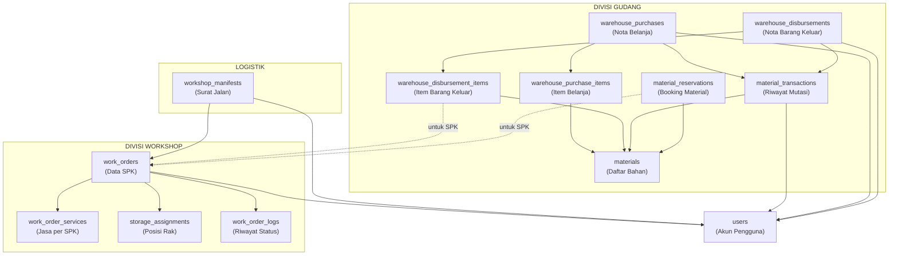

# 🗂️ Peta Sidebar Sistem Workshop: Menu, Tabel Database & Keterkaitannya

Berikut adalah rincian lengkap setiap menu sidebar yang Anda tunjukkan pada gambar, beserta penjelasan tabel database yang terlibat dan bagaimana semuanya saling berhubungan.

---

## 📦 1. DIVISI GUDANG (Warehouse Division)

### 1A. Stok Material
**Fungsi:** Menampilkan daftar seluruh bahan/material yang dimiliki gudang (lem, sol, cat, dll), termasuk jumlah stok saat ini dan statusnya (tersedia, hampir habis, atau kosong).

**Tabel Database Utama:**

| Tabel | Penjelasan Sederhana |
|---|---|
| `materials` | Daftar semua bahan baku (nama, kategori, ukuran, stok, harga, stok minimum, stok yang sedang dipesan) |
| `material_transactions` | Catatan keluar-masuk setiap bahan (seperti buku kas, mencatat siapa ambil berapa dan kapan) |
| `material_reservations` | Daftar pemesanan/booking material yang belum diambil (misal: material sudah dipesan untuk SPK tertentu tapi belum dipakai) |
| `users` | Siapa penanggung jawab (PIC) material tersebut |

**Keterkaitan:**
- 1 **Material** bisa punya banyak **Transaksi** (setiap kali bahan masuk/keluar, tercatat di sini)
- 1 **Material** bisa punya banyak **Reservasi** (booking untuk SPK tertentu)
- Setiap transaksi dan reservasi terhubung ke **User** (siapa yang melakukan)

---

### 1B. Belanja Gudang
**Fungsi:** Mencatat setiap pembelian bahan baku baru yang masuk ke gudang (menambah stok). Seperti nota belanja dari toko bahan.

**Tabel Database Utama:**

| Tabel | Penjelasan Sederhana |
|---|---|
| `warehouse_purchases` | Data induk belanja (nomor nota otomatis `WH-IN-xxx`, tanggal beli, total biaya, status, catatan) |
| `warehouse_purchase_items` | Detail item yang dibeli per nota (bahan apa, berapa banyak, harga satuan, subtotal) |
| `materials` | Stok material otomatis bertambah setelah belanja dikonfirmasi |
| `material_transactions` | Riwayat transaksi otomatis tercatat sebagai "barang masuk" |
| `users` | Siapa yang melakukan pembelian |

**Keterkaitan:**
- 1 **Nota Belanja** bisa berisi banyak **Item Belanja** (misalnya 1 nota beli lem 5 botol + sol 10 pasang)
- Setiap **Item Belanja** terhubung ke 1 **Material** (untuk otomatis menambah stoknya)
- Saat belanja dikonfirmasi, otomatis membuat catatan di **Transaksi Material** (bukti barang masuk)

---

### 1C. Barang Keluar
**Fungsi:** Mencatat setiap pengambilan bahan dari gudang untuk keperluan produksi atau operasional (mengurangi stok). Seperti nota pengeluaran barang.

**Tabel Database Utama:**

| Tabel | Penjelasan Sederhana |
|---|---|
| `warehouse_disbursements` | Data induk pengeluaran (nomor nota otomatis `WH-OUT-xxx`, tanggal keluar, total nilai, status, catatan) |
| `warehouse_disbursement_items` | Detail item yang keluar per nota (bahan apa, berapa banyak, untuk SPK nomor berapa) |
| `materials` | Stok material otomatis berkurang setelah pengeluaran dikonfirmasi |
| `material_transactions` | Riwayat transaksi otomatis tercatat sebagai "barang keluar" |
| `users` | Siapa yang mengeluarkan barang |

**Keterkaitan:**
- 1 **Nota Pengeluaran** bisa berisi banyak **Item Pengeluaran**
- Setiap item bisa dikaitkan ke nomor **SPK** tertentu (untuk melacak material dipakai untuk sepatu siapa)
- Saat pengeluaran dikonfirmasi, otomatis membuat catatan di **Transaksi Material** (bukti barang keluar)

---

### 1D. Riwayat Mutasi
**Fungsi:** Menampilkan seluruh catatan keluar-masuk bahan (gabungan dari belanja + barang keluar + aktivitas lainnya). Ibarat buku besar yang mencatat setiap pergerakan stok.

**Tabel Database Utama:**

| Tabel | Penjelasan Sederhana |
|---|---|
| `material_transactions` | Tabel utama — setiap baris adalah 1 catatan mutasi (masuk/keluar), lengkap dengan saldo akhir setelah transaksi |
| `materials` | Untuk menampilkan nama bahan yang dimutasi |
| `users` | Untuk menampilkan siapa pelaku mutasi |

**Keterkaitan:**
- Tabel `material_transactions` adalah "jantung" dari seluruh sistem gudang
- Setiap transaksi punya kolom `reference_type` dan `reference_id` yang menunjuk ke sumber asalnya: bisa dari **Belanja** (`WarehousePurchase`), **Barang Keluar** (`WarehouseDisbursement`), **Permintaan Material** (`MaterialRequest`), atau langsung dari **SPK** (`WorkOrder`)

---

## 🚚 2. LOGISTIK MANIFEST

**Fungsi:** Mengatur pengiriman batch sepatu dari Gudang ke Workshop (atau sebaliknya). Mirip seperti surat jalan ekspedisi — 1 manifest bisa berisi banyak SPK sekaligus.

**Tabel Database Utama:**

| Tabel | Penjelasan Sederhana |
|---|---|
| `workshop_manifests` | Data surat jalan (nomor manifest, status: Draft/Terkirim/Diterima, catatan, waktu kirim & terima) |
| `work_orders` | Daftar SPK yang "ditumpangkan" dalam 1 manifest (setiap SPK punya kolom `workshop_manifest_id`) |
| `users` | 2 peran: **Pengirim** (`dispatcher_id`) dan **Penerima** (`receiver_id`) |

**Keterkaitan:**
- 1 **Manifest** bisa berisi banyak **SPK/Work Order**
- Saat manifest dihapus/dibatalkan, semua SPK di dalamnya otomatis dikembalikan ke status "Siap Kirim" dan dilepas dari manifest tersebut
- Pengirim dan Penerima masing-masing terhubung ke tabel **Users**

---

## 👥 3. PENGGUNA (User Management)

**Fungsi:** Mengelola akun seluruh karyawan yang menggunakan sistem (tambah, edit, nonaktifkan akun, atur hak akses).

**Tabel Database Utama:**

| Tabel | Penjelasan Sederhana |
|---|---|
| `users` | Data akun pengguna (nama, email, telepon, role/jabatan, spesialisasi, status aktif/nonaktif, hak akses, kode CS, password) |

**Keterkaitan:**
- Tabel `users` adalah tabel paling banyak dihubungkan ke tabel lain di seluruh sistem:
  - Siapa yang **membuat SPK** → `work_orders.created_by`
  - Siapa yang **membelanjakan barang** → `warehouse_purchases.user_id`
  - Siapa yang **mengeluarkan barang** → `warehouse_disbursements.user_id`
  - Siapa yang **mengirim manifest** → `workshop_manifests.dispatcher_id`
  - Siapa yang **menerima manifest** → `workshop_manifests.receiver_id`
  - Siapa **PIC material** → `materials.pic_user_id`
  - Siapa **teknisi produksi** → berbagai kolom di `work_orders`
  - Dan masih banyak lagi...

---

## ⚙️ 4. DIVISI WORKSHOP

**Fungsi:** Kelompok menu untuk mengelola seluruh proses pengerjaan sepatu di bengkel, mulai dari persiapan sampai selesai.

**Sub-menu di dalamnya & tabel yang terlibat:**

| Sub-menu | Fungsi | Tabel Utama |
|---|---|---|
| **Dashboard Workshop** | Ringkasan statistik bengkel | `work_orders` (hitung berdasarkan status) |
| **Fast Track SPK** | Kelola pesanan prioritas/kilat | `work_orders` (filter `fast_track_status = 'yes'`) |
| **Persiapan** | Tahap cuci & persiapan awal | `work_orders` (kolom `prep_washing_*`, `prep_sol_*`, `prep_upper_*`) |
| **Sortir** | Tahap pemilahan jenis perbaikan | `work_orders` + `work_order_services` |
| **Produksi** | Tahap pengerjaan utama | `work_orders` (kolom `prod_sol_*`, `prod_upper_*`, `prod_cleaning_*`) |
| **Info Keterlambatan** | Daftar SPK yang melewati tenggat | `work_orders` (cek `estimation_date` vs hari ini) |
| **QC (Quality Control)** | Pemeriksaan kualitas hasil kerja | `work_orders` (kolom `qc_jahit_*`, `qc_cleanup_*`, `qc_final_*`) |
| **Finish** | Tahap akhir, siap diambil | `work_orders` + `storage_assignments` |
| **Revisi** | Pesanan yang harus dikerjakan ulang | `work_order_revisions` + `work_orders` |
| **Garansi** | Klaim garansi dari pelanggan | `warranty_claims` + `work_orders` |

**Tabel Pendukung Utama Workshop:**

| Tabel | Penjelasan Sederhana |
|---|---|
| `work_orders` | Tabel terbesar — data lengkap setiap pesanan/SPK (dari masuk sampai diambil) |
| `work_order_services` | Daftar jasa yang dipilih per SPK (reparasi sol, repaint, dll) |
| `work_order_photos` | Foto-foto sebelum & sesudah pengerjaan |
| `work_order_logs` | Catatan riwayat perubahan status SPK (siapa mengubah apa dan kapan) |
| `work_order_revisions` | Detail revisi yang diminta (catatan masalah & solusi) |
| `services` | Daftar master jasa yang tersedia |
| `storage_assignments` | Posisi rak penyimpanan sepatu |

---

## 🔗 Diagram Keterkaitan Antar Divisi

---

> **Kesimpulan:** Seluruh divisi pada sidebar saling terhubung melalui 2 tabel sentral:
> 1. **`work_orders`** — pusat data pesanan/SPK yang menghubungkan Gudang, Logistik, dan Workshop.
> 2. **`users`** — akun pengguna yang tercatat di setiap aktivitas di seluruh divisi.
